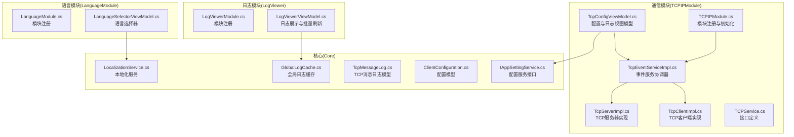
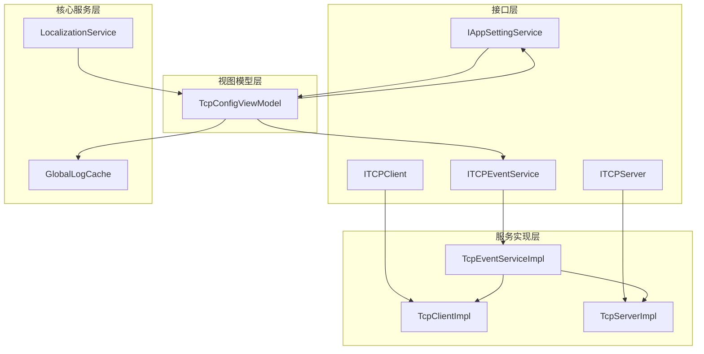
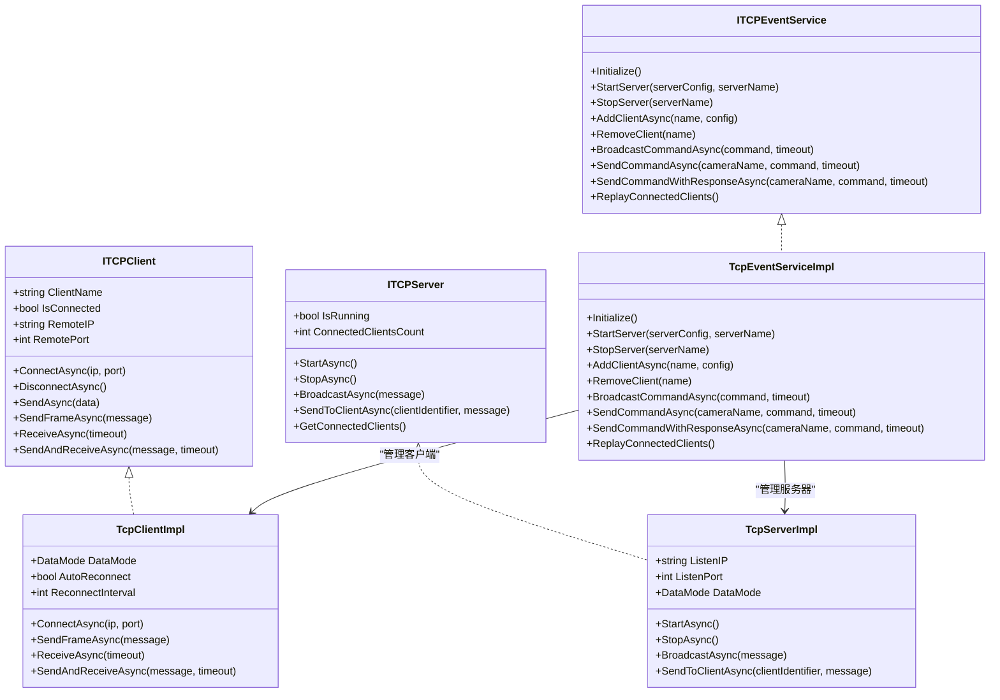
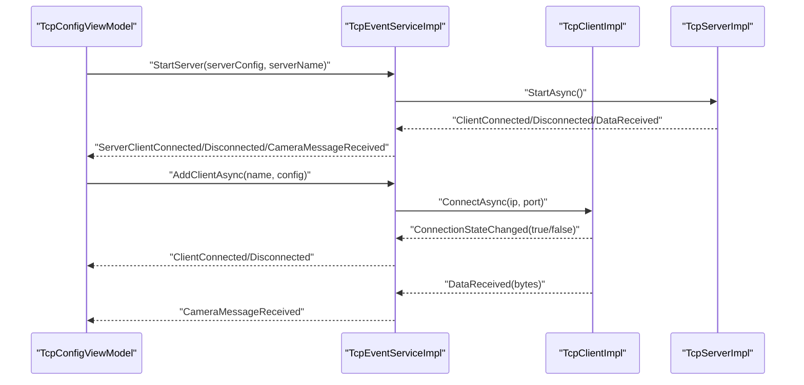
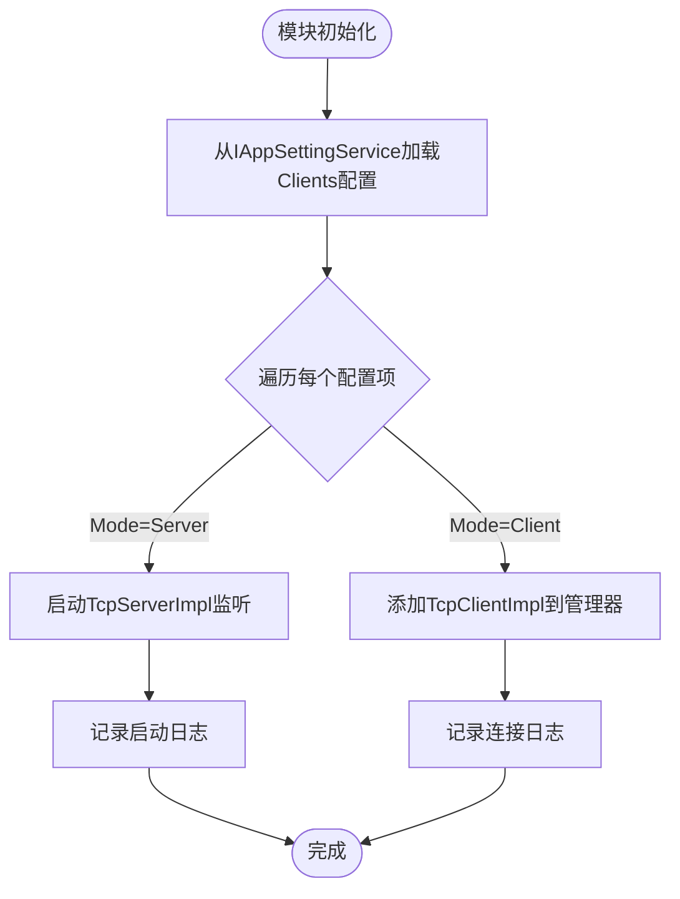
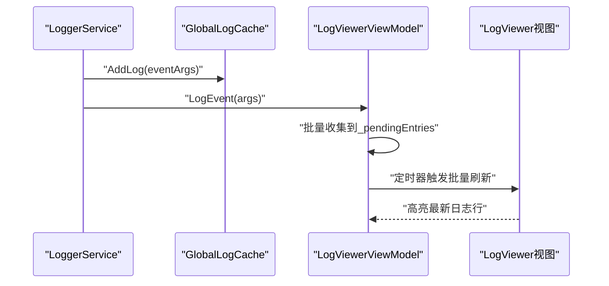
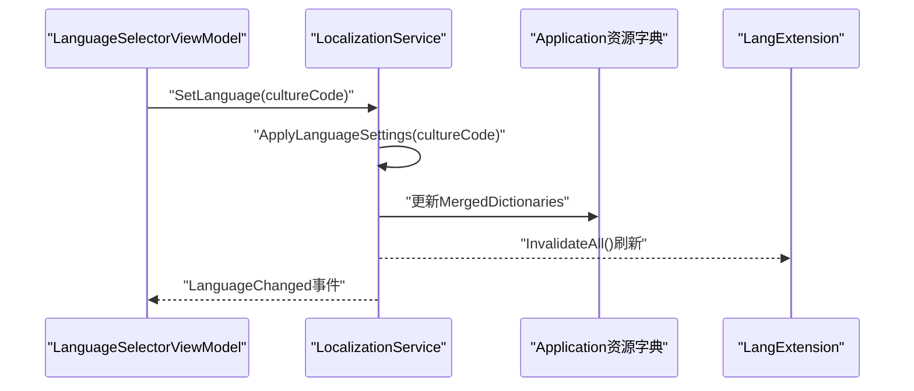
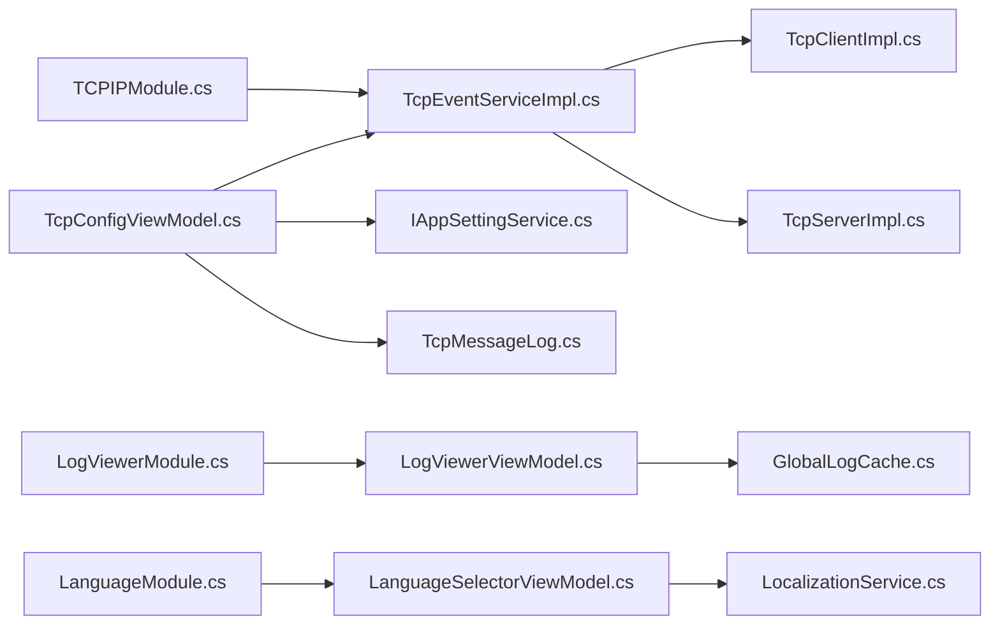

# 通信模块集成

<cite>
**本文档引用的文件**
- [TCPIPModule.cs](file://TCPIPModule/TCPIPModule.cs)
- [TcpServerImpl.cs](file://TCPIPModule/Services/TcpServerImpl.cs)
- [TcpClientImpl.cs](file://TCPIPModule/Services/TcpClientImpl.cs)
- [TcpEventServiceImpl.cs](file://TCPIPModule/Services/TcpEventServiceImpl.cs)
- [TcpConfigViewModel.cs](file://TCPIPModule/ViewModels/TcpConfigViewModel.cs)
- [ITCPService.cs](file://TCPIPModule/Interfaces/ITCPService.cs)
- [LogViewerModule.cs](file://LogViewer/LogViewerModule.cs)
- [LogViewerViewModel.cs](file://LogViewer/ViewModels/LogViewerViewModel.cs)
- [LanguageModule.cs](file://LanguageModule/LanguageModule.cs)
- [LanguageSelectorViewModel.cs](file://LanguageModule/ViewModels/LanguageSelectorViewModel.cs)
- [LocalizationService.cs](file://Core/Services/LocalizationService.cs)
- [GlobalLogCache.cs](file://Core/Utilities/GlobalLogCache.cs)
- [TcpMessageLog.cs](file://Core/Models/TcpMessageLog.cs)
- [ClientConfiguration.cs](file://Core/Models/ClientConfiguration.cs)
- [IAppSettingService.cs](file://Core/Abstraction/IAppSettingService.cs)
</cite>

## 目录
1. [简介](#简介)
2. [项目结构](#项目结构)
3. [核心组件](#核心组件)
4. [架构总览](#架构总览)
5. [详细组件分析](#详细组件分析)
6. [依赖关系分析](#依赖关系分析)
7. [性能考虑](#性能考虑)
8. [故障排除指南](#故障排除指南)
9. [结论](#结论)
10. [附录](#附录)

## 简介
本文件面向GZQL_MACHINE项目的通信模块集成，重点覆盖TCPIPModule（TCP/IP通信模块）、LogViewer（日志查看器模块）、LanguageModule（语言模块）的设计与集成方式。文档详细说明：
- TCP/IP通信模块的网络架构、服务器/客户端实现、事件桥接机制
- 日志查看器模块的日志展示、过滤排序、实时更新机制
- 语言模块的多语言支持系统、动态切换、资源管理策略
- 通信模块的配置方法、扩展接口与集成开发指南

## 项目结构
通信模块集成涉及以下关键目录与文件：
- TCPIPModule：独立模块，包含接口、服务实现、视图模型与配置界面
- LogViewer：日志查看器模块，提供全局日志展示与历史缓存
- LanguageModule：语言模块，提供多语言切换与资源字典管理
- Core：公共抽象层、模型、服务与工具类（被上述模块共享）

**图表来源**
- [TCPIPModule.cs:1-91](file://TCPIPModule/TCPIPModule.cs#L1-L91)
- [TcpServerImpl.cs:1-222](file://TCPIPModule/Services/TcpServerImpl.cs#L1-L222)
- [TcpClientImpl.cs:1-427](file://TCPIPModule/Services/TcpClientImpl.cs#L1-L427)
- [TcpEventServiceImpl.cs:1-542](file://TCPIPModule/Services/TcpEventServiceImpl.cs#L1-L542)
- [TcpConfigViewModel.cs:1-425](file://TCPIPModule/ViewModels/TcpConfigViewModel.cs#L1-L425)
- [ITCPService.cs:1-275](file://TCPIPModule/Interfaces/ITCPService.cs#L1-L275)
- [LogViewerModule.cs:1-31](file://LogViewer/LogViewerModule.cs#L1-L31)
- [LogViewerViewModel.cs:1-160](file://LogViewer/ViewModels/LogViewerViewModel.cs#L1-L160)
- [LanguageModule.cs:1-26](file://LanguageModule/LanguageModule.cs#L1-L26)
- [LanguageSelectorViewModel.cs:1-90](file://LanguageModule/ViewModels/LanguageSelectorViewModel.cs#L1-L90)
- [LocalizationService.cs:1-353](file://Core/Services/LocalizationService.cs#L1-L353)
- [GlobalLogCache.cs:1-38](file://Core/Utilities/GlobalLogCache.cs#L1-L38)
- [TcpMessageLog.cs:1-29](file://Core/Models/TcpMessageLog.cs#L1-L29)
- [ClientConfiguration.cs:1-23](file://Core/Models/ClientConfiguration.cs#L1-L23)
- [IAppSettingService.cs:1-51](file://Core/Abstraction/IAppSettingService.cs#L1-L51)

**章节来源**
- [TCPIPModule.cs:1-91](file://TCPIPModule/TCPIPModule.cs#L1-L91)
- [LogViewerModule.cs:1-31](file://LogViewer/LogViewerModule.cs#L1-L31)
- [LanguageModule.cs:1-26](file://LanguageModule/LanguageModule.cs#L1-L26)

## 核心组件
- TCPIPModule模块：负责注册TCP相关服务与视图导航，并在初始化阶段从配置加载TCP配置，按模式启动服务器或客户端
- TcpServerImpl：基于System.Net.Sockets的TCP服务器实现，支持多客户端连接、广播与定向发送
- TcpClientImpl：基于System.Net.Sockets的TCP客户端实现，支持Raw/Frame两种数据模式、自动重连、超时收发
- TcpEventServiceImpl：事件服务协调器，统一管理服务器与客户端生命周期，提供命令发送/响应等待、事件桥接与报警上报
- TcpConfigViewModel：配置管理视图模型，负责TCP配置的增删改查、连接测试、消息日志展示与实时更新
- LogViewer：日志查看器，订阅全局日志事件，采用批量刷新优化UI性能
- LanguageModule：语言模块，提供语言选择器与本地化服务集成

**章节来源**
- [TCPIPModule.cs:16-91](file://TCPIPModule/TCPIPModule.cs#L16-L91)
- [TcpServerImpl.cs:19-222](file://TCPIPModule/Services/TcpServerImpl.cs#L19-L222)
- [TcpClientImpl.cs:19-427](file://TCPIPModule/Services/TcpClientImpl.cs#L19-L427)
- [TcpEventServiceImpl.cs:22-542](file://TCPIPModule/Services/TcpEventServiceImpl.cs#L22-L542)
- [TcpConfigViewModel.cs:19-425](file://TCPIPModule/ViewModels/TcpConfigViewModel.cs#L19-L425)
- [LogViewerViewModel.cs:11-160](file://LogViewer/ViewModels/LogViewerViewModel.cs#L11-L160)
- [LanguageSelectorViewModel.cs:13-90](file://LanguageModule/ViewModels/LanguageSelectorViewModel.cs#L13-L90)

## 架构总览
通信模块采用分层设计：
- 接口层：定义ITCPClient、ITCPServer、ITCPEventService等接口，隔离具体实现
- 服务层：TcpServerImpl、TcpClientImpl、TcpEventServiceImpl实现具体通信与事件协调
- 视图模型层：TcpConfigViewModel负责配置与日志展示，订阅事件并驱动UI更新
- 核心服务层：IAppSettingService、GlobalLogCache、LocalizationService等提供配置、日志与本地化支撑

**图表来源**
- [ITCPService.cs:12-275](file://TCPIPModule/Interfaces/ITCPService.cs#L12-L275)
- [TcpClientImpl.cs:19-427](file://TCPIPModule/Services/TcpClientImpl.cs#L19-L427)
- [TcpServerImpl.cs:19-222](file://TCPIPModule/Services/TcpServerImpl.cs#L19-L222)
- [TcpEventServiceImpl.cs:22-542](file://TCPIPModule/Services/TcpEventServiceImpl.cs#L22-L542)
- [TcpConfigViewModel.cs:19-425](file://TCPIPModule/ViewModels/TcpConfigViewModel.cs#L19-L425)
- [GlobalLogCache.cs:11-38](file://Core/Utilities/GlobalLogCache.cs#L11-L38)
- [LocalizationService.cs:18-353](file://Core/Services/LocalizationService.cs#L18-L353)
- [IAppSettingService.cs:10-51](file://Core/Abstraction/IAppSettingService.cs#L10-L51)

## 详细组件分析

### TCP/IP通信模块

#### 网络架构与服务器/客户端实现
- 服务器架构：TcpServerImpl基于TcpListener监听端口，AcceptTcpClientAsync异步接受连接，使用InitializeFromAcceptedClient初始化已连接客户端，启动读取循环
- 客户端架构：TcpClientImpl封装TcpClient，支持Raw/Frame两种数据模式，内置帧解析与缓冲区管理，支持自动重连与超时控制
- 事件桥接：TcpEventServiceImpl作为协调器，订阅客户端/服务器事件，统一发布CameraMessageReceived、ClientConnected/Disconnected等事件

**图表来源**
- [ITCPService.cs:12-275](file://TCPIPModule/Interfaces/ITCPService.cs#L12-L275)
- [TcpClientImpl.cs:19-427](file://TCPIPModule/Services/TcpClientImpl.cs#L19-L427)
- [TcpServerImpl.cs:19-222](file://TCPIPModule/Services/TcpServerImpl.cs#L19-L222)
- [TcpEventServiceImpl.cs:22-542](file://TCPIPModule/Services/TcpEventServiceImpl.cs#L22-L542)

**章节来源**
- [TcpServerImpl.cs:57-198](file://TCPIPModule/Services/TcpServerImpl.cs#L57-L198)
- [TcpClientImpl.cs:79-393](file://TCPIPModule/Services/TcpClientImpl.cs#L79-L393)
- [TcpEventServiceImpl.cs:91-430](file://TCPIPModule/Services/TcpEventServiceImpl.cs#L91-L430)

#### 事件桥接机制
- 服务器事件：ClientConnected/Disconnected/DataReceived映射为ServerClientConnected/Disconnected/CameraMessageReceived
- 客户端事件：ConnectionStateChanged/ErrorOccurred/DataReceived映射为ClientConnected/Disconnected/ClientError/CameraMessageReceived
- 报警上报：断线与错误通过AlarmModule触发告警
- 迟到订阅者回放：维护连接状态快照，ReplayConnectedClients()用于首次订阅时回放历史连接状态

**图表来源**
- [TcpEventServiceImpl.cs:91-430](file://TCPIPModule/Services/TcpEventServiceImpl.cs#L91-L430)
- [TcpServerImpl.cs:148-198](file://TCPIPModule/Services/TcpServerImpl.cs#L148-L198)
- [TcpClientImpl.cs:108-129](file://TCPIPModule/Services/TcpClientImpl.cs#L108-L129)

**章节来源**
- [TcpEventServiceImpl.cs:111-153](file://TCPIPModule/Services/TcpEventServiceImpl.cs#L111-L153)
- [TcpEventServiceImpl.cs:449-486](file://TCPIPModule/Services/TcpEventServiceImpl.cs#L449-L486)
- [TcpEventServiceImpl.cs:493-507](file://TCPIPModule/Services/TcpEventServiceImpl.cs#L493-L507)

#### 配置与集成
- 模块注册：TCPIPModule在RegisterTypes中注册ITCPClientManagerService、ITCPEventService与TcpConfigView导航
- 初始化流程：OnInitialized从IAppSettingService读取Clients配置，按Mode启动服务器或客户端
- 配置持久化：TcpConfigViewModel通过IAppSettingService保存/加载配置，支持Client/Server模式切换

**图表来源**
- [TCPIPModule.cs:37-88](file://TCPIPModule/TCPIPModule.cs#L37-L88)
- [TcpConfigViewModel.cs:239-317](file://TCPIPModule/ViewModels/TcpConfigViewModel.cs#L239-L317)

**章节来源**
- [TCPIPModule.cs:21-88](file://TCPIPModule/TCPIPModule.cs#L21-L88)
- [TcpConfigViewModel.cs:239-317](file://TCPIPModule/ViewModels/TcpConfigViewModel.cs#L239-L317)

### 日志查看器模块

#### 日志展示、过滤排序与实时更新
- 全局日志缓存：GlobalLogCache采用ConcurrentQueue实现线程安全滑动窗口缓存，限制最大容量
- 视图模型：LogViewerViewModel订阅ILoggerService.LogEvent，采用批量刷新策略（DispatcherTimer定时器）减少UI抖动
- 历史加载：启动时从GlobalLogCache.GetLogs()加载历史日志
- 实时高亮：LastLogIndex用于高亮最新日志行

**图表来源**
- [LogViewerViewModel.cs:34-130](file://LogViewer/ViewModels/LogViewerViewModel.cs#L34-L130)
- [GlobalLogCache.cs:16-30](file://Core/Utilities/GlobalLogCache.cs#L16-L30)

**章节来源**
- [LogViewerViewModel.cs:11-160](file://LogViewer/ViewModels/LogViewerViewModel.cs#L11-L160)
- [GlobalLogCache.cs:11-38](file://Core/Utilities/GlobalLogCache.cs#L11-L38)

### 语言模块

#### 多语言支持系统、动态切换与资源管理
- 语言选择器：LanguageSelectorViewModel提供Languages集合与SelectedLanguage属性，切换时调用ILocalizationService.SetLanguage
- 本地化服务：LocalizationService负责初始化支持语言、加载配置语言、应用区域性与替换资源字典、发布语言变更事件
- 动态刷新：LangExtension.InvalidateAll()通知所有LangExtension刷新，IEventAggregator发布LanguageChangedEvent

**图表来源**
- [LanguageSelectorViewModel.cs:33-87](file://LanguageModule/ViewModels/LanguageSelectorViewModel.cs#L33-L87)
- [LocalizationService.cs:129-161](file://Core/Services/LocalizationService.cs#L129-L161)
- [LocalizationService.cs:166-198](file://Core/Services/LocalizationService.cs#L166-L198)
- [LocalizationService.cs:338-341](file://Core/Services/LocalizationService.cs#L338-L341)

**章节来源**
- [LanguageModule.cs:12-25](file://LanguageModule/LanguageModule.cs#L12-L25)
- [LanguageSelectorViewModel.cs:13-90](file://LanguageModule/ViewModels/LanguageSelectorViewModel.cs#L13-L90)
- [LocalizationService.cs:18-353](file://Core/Services/LocalizationService.cs#L18-L353)

## 依赖关系分析

**图表来源**
- [TCPIPModule.cs:1-91](file://TCPIPModule/TCPIPModule.cs#L1-L91)
- [TcpEventServiceImpl.cs:1-542](file://TCPIPModule/Services/TcpEventServiceImpl.cs#L1-L542)
- [TcpClientImpl.cs:1-427](file://TCPIPModule/Services/TcpClientImpl.cs#L1-L427)
- [TcpServerImpl.cs:1-222](file://TCPIPModule/Services/TcpServerImpl.cs#L1-L222)
- [TcpConfigViewModel.cs:1-425](file://TCPIPModule/ViewModels/TcpConfigViewModel.cs#L1-L425)
- [IAppSettingService.cs:1-51](file://Core/Abstraction/IAppSettingService.cs#L1-L51)
- [TcpMessageLog.cs:1-29](file://Core/Models/TcpMessageLog.cs#L1-L29)
- [LogViewerModule.cs:1-31](file://LogViewer/LogViewerModule.cs#L1-L31)
- [LogViewerViewModel.cs:1-160](file://LogViewer/ViewModels/LogViewerViewModel.cs#L1-L160)
- [GlobalLogCache.cs:1-38](file://Core/Utilities/GlobalLogCache.cs#L1-L38)
- [LanguageModule.cs:1-26](file://LanguageModule/LanguageModule.cs#L1-L26)
- [LanguageSelectorViewModel.cs:1-90](file://LanguageModule/ViewModels/LanguageSelectorViewModel.cs#L1-L90)
- [LocalizationService.cs:1-353](file://Core/Services/LocalizationService.cs#L1-L353)

**章节来源**
- [ITCPService.cs:1-275](file://TCPIPModule/Interfaces/ITCPService.cs#L1-L275)
- [ClientConfiguration.cs:1-23](file://Core/Models/ClientConfiguration.cs#L1-L23)

## 性能考虑
- TCP客户端/服务器：使用异步I/O与取消令牌，避免阻塞；客户端支持自动重连与超时控制
- 日志展示：批量刷新策略（定时器）降低UI更新频率，限制最大日志条数防止内存膨胀
- 本地化：资源字典替换与LangExtension失效刷新，避免频繁重建UI树
- 配置持久化：IAppSettingService提供异步保存/加载能力，避免阻塞主线程

## 故障排除指南
- TCP连接失败：检查IAppSettingService中的ClientConfiguration配置，确认IP/端口/模式；查看TcpEventServiceImpl日志输出
- 服务器启动异常：关注ServerError事件与异常堆栈，确认ListenIP/ListenPort合法性
- 客户端断线：启用AutoReconnect并调整ReconnectInterval；通过ClientDisconnected事件定位断线原因
- 日志不显示：确认LogViewerViewModel订阅了ILoggerService.LogEvent；检查批量刷新定时器是否正常工作
- 语言切换无效：验证LocalizationService.ApplyLanguageSettings是否执行成功；确认资源字典路径与文化代码正确

**章节来源**
- [TcpEventServiceImpl.cs:148-153](file://TCPIPModule/Services/TcpEventServiceImpl.cs#L148-L153)
- [TcpClientImpl.cs:359-393](file://TCPIPModule/Services/TcpClientImpl.cs#L359-L393)
- [LogViewerViewModel.cs:103-130](file://LogViewer/ViewModels/LogViewerViewModel.cs#L103-L130)
- [LocalizationService.cs:166-198](file://Core/Services/LocalizationService.cs#L166-L198)

## 结论
通信模块集成通过清晰的接口分层与事件桥接，实现了TCP服务器/客户端的灵活部署与统一管理；日志查看器采用批量刷新策略保障UI性能；语言模块提供完善的多语言支持与动态切换能力。模块间松耦合、职责明确，便于扩展与维护。

## 附录

### 集成开发指南
- 新增TCP配置项：在TcpConfigViewModel中添加/删除配置项，保存后通过IAppSettingService持久化
- 扩展事件处理：在TcpEventServiceImpl中订阅/发布事件，实现业务逻辑桥接
- 自定义日志展示：在LogViewerViewModel中扩展过滤/排序逻辑，利用批量刷新提升性能
- 动态语言切换：通过ILocalizationService.SetLanguage切换语言，确保资源字典与区域性一致

**章节来源**
- [TcpConfigViewModel.cs:205-317](file://TCPIPModule/ViewModels/TcpConfigViewModel.cs#L205-L317)
- [TcpEventServiceImpl.cs:78-84](file://TCPIPModule/Services/TcpEventServiceImpl.cs#L78-L84)
- [LogViewerViewModel.cs:103-130](file://LogViewer/ViewModels/LogViewerViewModel.cs#L103-L130)
- [LocalizationService.cs:129-161](file://Core/Services/LocalizationService.cs#L129-L161)