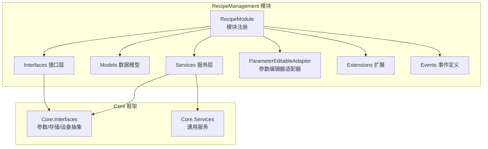
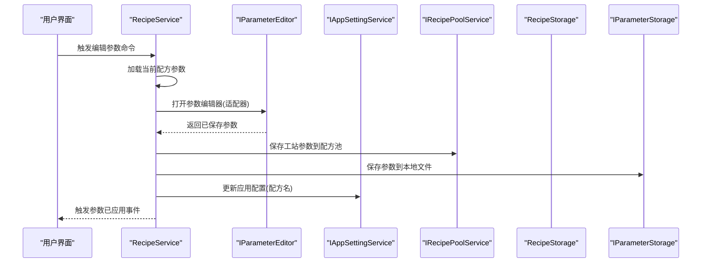
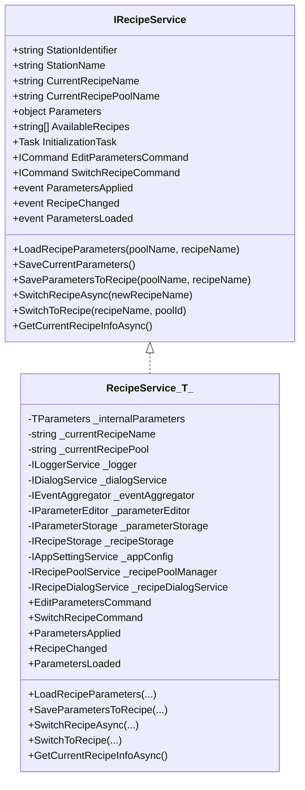
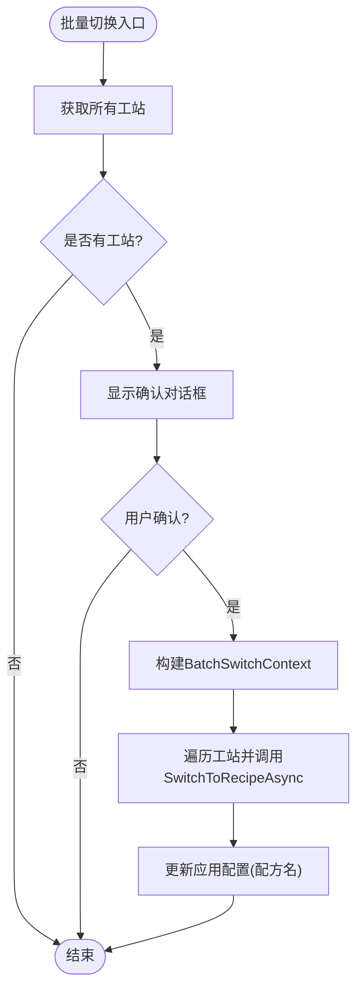
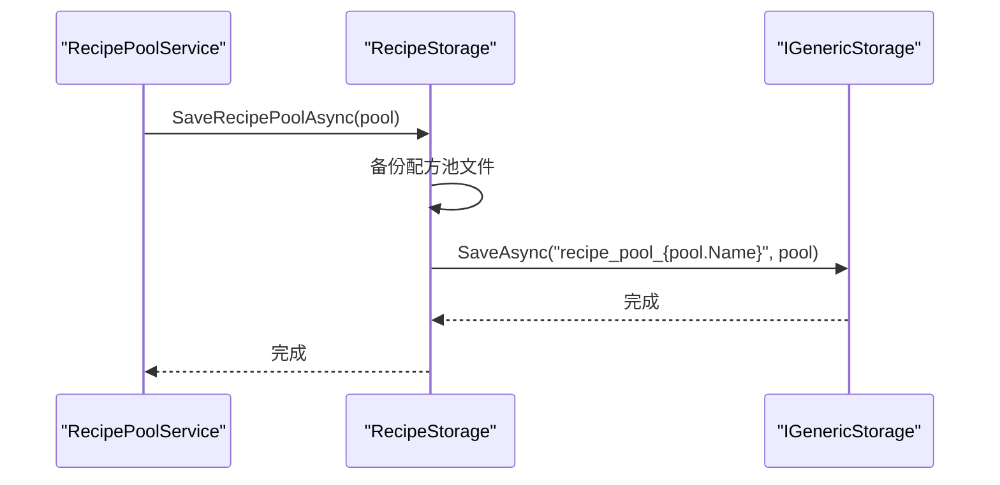
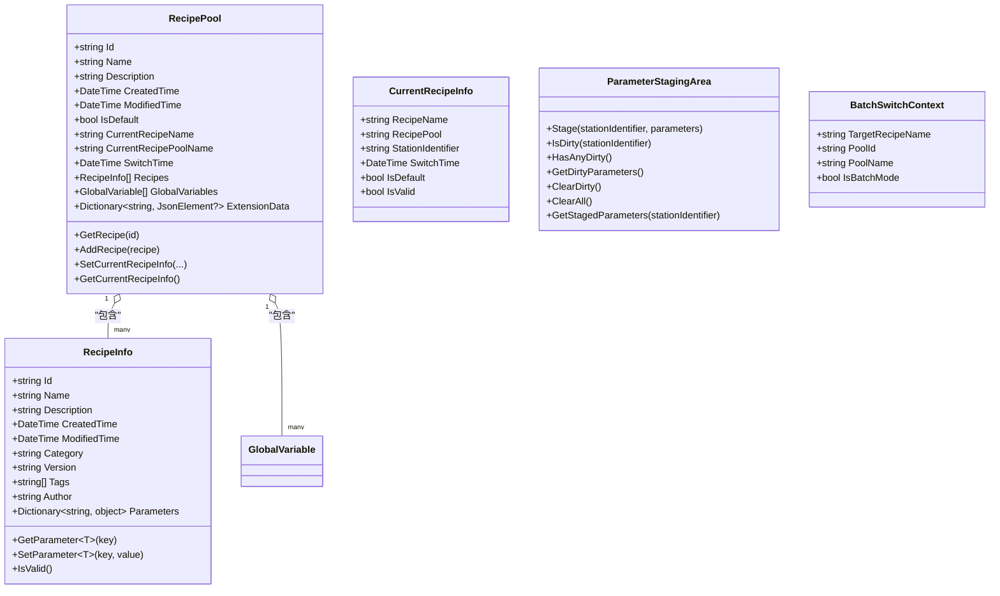
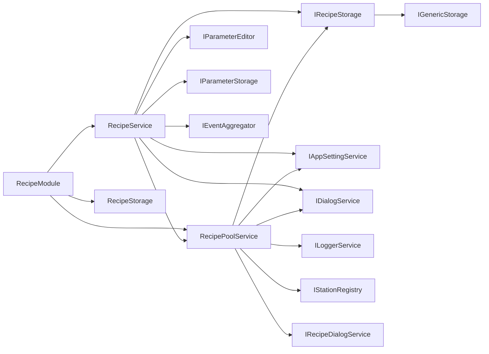

# 配方管理模块

<cite>
**本文引用的文件**
- [Recipe.csproj](file://RecipeManagement/Recipe.csproj)
- [RecipeModule.cs](file://RecipeManagement/RecipeModule.cs)
- [IRecipeService.cs](file://RecipeManagement/Interfaces/IRecipeService.cs)
- [IRecipePoolService.cs](file://RecipeManagement/Interfaces/IRecipePoolService.cs)
- [IBatchSwitchable.cs](file://RecipeManagement/Interfaces/IBatchSwitchable.cs)
- [RecipeService.cs](file://RecipeManagement/Services/RecipeService.cs)
- [RecipePoolService.cs](file://RecipeManagement/Services/RecipePoolService.cs)
- [RecipeStorage.cs](file://RecipeManagement/Services/RecipeStorage.cs)
- [RecipePool.cs](file://RecipeManagement/Models/RecipePool.cs)
- [RecipeInfo.cs](file://RecipeManagement/Models/RecipeInfo.cs)
- [CurrentRecipeInfo.cs](file://RecipeManagement/Models/CurrentRecipeInfo.cs)
- [BatchSwitchContext.cs](file://RecipeManagement/Models/BatchSwitchContext.cs)
- [ParameterStagingArea.cs](file://RecipeManagement/Models/ParameterStagingArea.cs)
- [ParameterEditableAdapter.cs](file://RecipeManagement/ParameterEditableAdapter.cs)
- [RecipeServiceExtensions.cs](file://RecipeManagement/Extensions/RecipeServiceExtensions.cs)
- [RecipeEventDefinitions.cs](file://RecipeManagement/Events/RecipeEventDefinitions.cs)
</cite>

## 目录
1. [简介](#简介)
2. [项目结构](#项目结构)
3. [核心组件](#核心组件)
4. [架构总览](#架构总览)
5. [详细组件分析](#详细组件分析)
6. [依赖关系分析](#依赖关系分析)
7. [性能与并发特性](#性能与并发特性)
8. [故障排查指南](#故障排查指南)
9. [结论](#结论)
10. [附录](#附录)

## 简介
本文件面向GZQL_MACHINE的配方管理模块，系统化梳理RecipeManagement模块的设计与实现，重点覆盖以下方面：
- 配方数据模型与版本控制
- 参数版本控制与批量参数编辑
- 配方存储机制与导入导出
- 核心服务：RecipeService配方服务、RecipePoolService配方池服务、参数编辑器适配器
- 批量切换功能与事件驱动机制
- 配方应用流程与参数验证策略
- API接口与自定义配方格式支持及扩展开发指南

## 项目结构
RecipeManagement模块采用分层与职责分离的设计，围绕“配方池-配方-参数”三层结构组织代码，并通过事件总线与对话框服务实现UI交互与跨工站协调。

图表来源
- [RecipeModule.cs:24-43](file://RecipeManagement/RecipeModule.cs#L24-L43)
- [Recipe.csproj:11-29](file://RecipeManagement/Recipe.csproj#L11-L29)

章节来源
- [RecipeModule.cs:17-49](file://RecipeManagement/RecipeModule.cs#L17-L49)
- [Recipe.csproj:1-32](file://RecipeManagement/Recipe.csproj#L1-L32)

## 核心组件
- 配方服务 IRecipeService：面向单一工站的配方参数加载、保存、切换与事件发布；提供强类型参数访问与扩展方法。
- 配方池服务 IRecipePoolService：面向多工站的配方池管理、全局变量、批量参数暂存与批量切换。
- 配方存储 IRecipeStorage：基于通用存储接口的配方池与配方持久化，支持搜索、分类与备份。
- 参数编辑器适配器 ParameterEditableAdapter：将RecipeService适配为参数编辑器可识别的IParameterEditable。
- 批量切换接口 IBatchSwitchable：工站实现以支持统一批量切换。
- 数据模型：RecipePool、RecipeInfo、CurrentRecipeInfo、BatchSwitchContext、ParameterStagingArea。

章节来源
- [IRecipeService.cs:13-68](file://RecipeManagement/Interfaces/IRecipeService.cs#L13-L68)
- [IRecipePoolService.cs:6-44](file://RecipeManagement/Interfaces/IRecipePoolService.cs#L6-L44)
- [RecipeService.cs:22-109](file://RecipeManagement/Services/RecipeService.cs#L22-L109)
- [RecipePoolService.cs:19-92](file://RecipeManagement/Services/RecipePoolService.cs#L19-L92)
- [RecipeStorage.cs:11-22](file://RecipeManagement/Services/RecipeStorage.cs#L11-L22)
- [ParameterEditableAdapter.cs:9-22](file://RecipeManagement/ParameterEditableAdapter.cs#L9-L22)
- [IBatchSwitchable.cs:6-9](file://RecipeManagement/Interfaces/IBatchSwitchable.cs#L6-L9)
- [RecipePool.cs:12-179](file://RecipeManagement/Models/RecipePool.cs#L12-L179)
- [RecipeInfo.cs:8-72](file://RecipeManagement/Models/RecipeInfo.cs#L8-L72)
- [CurrentRecipeInfo.cs:9-22](file://RecipeManagement/Models/CurrentRecipeInfo.cs#L9-L22)
- [BatchSwitchContext.cs:3-16](file://RecipeManagement/Models/BatchSwitchContext.cs#L3-L16)
- [ParameterStagingArea.cs:5-77](file://RecipeManagement/Models/ParameterStagingArea.cs#L5-L77)

## 架构总览
配方管理采用“服务-存储-事件-适配器”的解耦架构，核心交互如下：

图表来源
- [RecipeService.cs:161-216](file://RecipeManagement/Services/RecipeService.cs#L161-L216)
- [ParameterEditableAdapter.cs:9-22](file://RecipeManagement/ParameterEditableAdapter.cs#L9-L22)
- [RecipeService.cs:321-337](file://RecipeManagement/Services/RecipeService.cs#L321-L337)
- [RecipeService.cs:375-394](file://RecipeManagement/Services/RecipeService.cs#L375-L394)

## 详细组件分析

### 配方服务 RecipeService
- 职责
  - 单工站参数加载/保存/切换
  - 与配方池服务协作保存参数到配方池
  - 本地文件持久化与备份
  - 事件发布与应用配置更新
- 关键点
  - 泛型参数类型约束 TParameters : TaskParametersBase
  - 命令绑定：EditParametersCommand、SwitchRecipeCommand
  - 初始化从默认配方池恢复上次选择的配方
  - 参数加载优先从配方池，回退到本地文件
  - 应用参数到硬件预留钩子（可由具体工站实现）
- 并发与线程安全
  - 使用信号量限制并发保存
  - UI线程调度MessageBox提示
- 事件
  - ParametersApplied、ParametersLoaded、RecipeChanged（显式接口实现）

图表来源
- [IRecipeService.cs:13-68](file://RecipeManagement/Interfaces/IRecipeService.cs#L13-L68)
- [RecipeService.cs:22-109](file://RecipeManagement/Services/RecipeService.cs#L22-L109)

章节来源
- [RecipeService.cs:22-109](file://RecipeManagement/Services/RecipeService.cs#L22-L109)
- [RecipeService.cs:161-216](file://RecipeManagement/Services/RecipeService.cs#L161-L216)
- [RecipeService.cs:223-256](file://RecipeManagement/Services/RecipeService.cs#L223-L256)
- [RecipeService.cs:396-445](file://RecipeManagement/Services/RecipeService.cs#L396-L445)
- [RecipeService.cs:543-634](file://RecipeManagement/Services/RecipeService.cs#L543-L634)
- [RecipeService.cs:677-721](file://RecipeManagement/Services/RecipeService.cs#L677-L721)

### 配方池服务 RecipePoolService
- 职责
  - 配方池生命周期管理：创建/删除/复制/重命名/设默认
  - 全局变量管理与持久化
  - 批量参数暂存与提交
  - 统一切换所有工站配方
  - 扩展数据读写（键值对JSON）
  - 导入/导出配方池
- 关键点
  - ParameterStagingArea暂存各工站参数，支持脏标记与批量提交
  - BatchSwitchContext传递批量切换上下文
  - 通过IStationRegistry枚举所有工站并触发批量切换
  - 保存时使用信号量保证并发安全
- 事件
  - SaveParametersCompletedEvent、RecipePoolChangedEvent、SaveGlobalVariablesEvent等

图表来源
- [RecipePoolService.cs:198-237](file://RecipeManagement/Services/RecipePoolService.cs#L198-L237)
- [BatchSwitchContext.cs:3-16](file://RecipeManagement/Models/BatchSwitchContext.cs#L3-L16)

章节来源
- [RecipePoolService.cs:19-92](file://RecipeManagement/Services/RecipePoolService.cs#L19-L92)
- [RecipePoolService.cs:132-177](file://RecipeManagement/Services/RecipePoolService.cs#L132-L177)
- [RecipePoolService.cs:178-197](file://RecipeManagement/Services/RecipePoolService.cs#L178-L197)
- [RecipePoolService.cs:198-237](file://RecipeManagement/Services/RecipePoolService.cs#L198-L237)
- [RecipePoolService.cs:384-423](file://RecipeManagement/Services/RecipePoolService.cs#L384-L423)
- [ParameterStagingArea.cs:5-77](file://RecipeManagement/Models/ParameterStagingArea.cs#L5-L77)
- [BatchSwitchContext.cs:3-16](file://RecipeManagement/Models/BatchSwitchContext.cs#L3-L16)

### 配方存储 RecipeStorage
- 职责
  - 配方池与配方的加载/保存/删除/查询
  - 配方池列表枚举（优先使用文件系统枚举，回退默认池）
  - 配方搜索与分类统计
  - 配方池文件备份
- 关键点
  - 键命名规范：recipe_pool_{poolId}、recipe_{recipeId}
  - 备份策略：保存前对配方池文件进行时间戳备份

图表来源
- [RecipeStorage.cs:30-36](file://RecipeManagement/Services/RecipeStorage.cs#L30-L36)
- [RecipeStorage.cs:163-188](file://RecipeManagement/Services/RecipeStorage.cs#L163-L188)

章节来源
- [RecipeStorage.cs:24-71](file://RecipeManagement/Services/RecipeStorage.cs#L24-L71)
- [RecipeStorage.cs:73-115](file://RecipeManagement/Services/RecipeStorage.cs#L73-L115)
- [RecipeStorage.cs:117-146](file://RecipeManagement/Services/RecipeStorage.cs#L117-L146)
- [RecipeStorage.cs:163-188](file://RecipeManagement/Services/RecipeStorage.cs#L163-L188)

### 数据模型与版本控制
- RecipePool
  - 属性：Id/Name/Description/CreatedTime/ModifiedTime/IsDefault/CurrentRecipeName/CurrentRecipePoolName/SwitchTime/Recipes/GlobalVariables/ExtensionData
  - 方法：GetRecipe/GetRecipeByName/AddRecipe/SetCurrentRecipeInfo/GetCurrentRecipeInfo
- RecipeInfo
  - 属性：Id/Name/Description/CreatedTime/ModifiedTime/Category/Version/Tags/Author/Parameters
  - 方法：GetParameter/SetParameter/IsValid/构造函数(深拷贝)
- CurrentRecipeInfo
  - 表示当前工站的配方信息快照
- ParameterStagingArea
  - 暂存各工站参数，支持脏标记与批量清理
- BatchSwitchContext
  - 批量切换上下文，携带目标配方与池信息

图表来源
- [RecipePool.cs:12-179](file://RecipeManagement/Models/RecipePool.cs#L12-L179)
- [RecipeInfo.cs:8-72](file://RecipeManagement/Models/RecipeInfo.cs#L8-L72)
- [CurrentRecipeInfo.cs:9-22](file://RecipeManagement/Models/CurrentRecipeInfo.cs#L9-L22)
- [ParameterStagingArea.cs:5-77](file://RecipeManagement/Models/ParameterStagingArea.cs#L5-L77)
- [BatchSwitchContext.cs:3-16](file://RecipeManagement/Models/BatchSwitchContext.cs#L3-L16)

章节来源
- [RecipePool.cs:12-179](file://RecipeManagement/Models/RecipePool.cs#L12-L179)
- [RecipeInfo.cs:8-72](file://RecipeManagement/Models/RecipeInfo.cs#L8-L72)
- [CurrentRecipeInfo.cs:9-22](file://RecipeManagement/Models/CurrentRecipeInfo.cs#L9-L22)
- [ParameterStagingArea.cs:5-77](file://RecipeManagement/Models/ParameterStagingArea.cs#L5-L77)
- [BatchSwitchContext.cs:3-16](file://RecipeManagement/Models/BatchSwitchContext.cs#L3-L16)

### 参数编辑器适配器 ParameterEditableAdapter
- 将RecipeService适配为IParameterEditable，向参数编辑器暴露标题、标识符与参数对象
- 便于统一接入不同参数编辑器

章节来源
- [ParameterEditableAdapter.cs:9-22](file://RecipeManagement/ParameterEditableAdapter.cs#L9-L22)

### 批量切换与事件
- IBatchSwitchable：工站需实现SwitchToRecipeAsync以支持批量切换
- RecipePoolService通过IStationRegistry获取工站集合，逐个调用SwitchToRecipeAsync
- 事件：RecipeChangedEvent、SaveParametersEvent、SaveParametersCompletedEvent、RecipePoolChangedEvent、SaveGlobalVariablesEvent

章节来源
- [IBatchSwitchable.cs:6-9](file://RecipeManagement/Interfaces/IBatchSwitchable.cs#L6-L9)
- [RecipePoolService.cs:198-237](file://RecipeManagement/Services/RecipePoolService.cs#L198-L237)
- [RecipeEventDefinitions.cs:5-24](file://RecipeManagement/Events/RecipeEventDefinitions.cs#L5-L24)

## 依赖关系分析
- 模块注册
  - RecipeModule在容器中注册插件、存储、配方池服务、配方对话框与导航视图
- 服务依赖
  - RecipeService依赖IParameterEditor、IParameterStorage、IRecipeStorage、IRecipePoolService、IAppSettingService、IDialogService、IEventAggregator
  - RecipePoolService依赖IRecipeStorage、IDialogService、ILoggerService、IEventAggregator、IStationRegistry、IAppSettingService、IRecipeDialogService
  - RecipeStorage依赖IGenericStorage与ILoggerService
- 外部依赖
  - Prism事件总线、对话框服务、MaterialDesign主题

图表来源
- [RecipeModule.cs:24-43](file://RecipeManagement/RecipeModule.cs#L24-L43)
- [RecipeService.cs:81-105](file://RecipeManagement/Services/RecipeService.cs#L81-L105)
- [RecipePoolService.cs:76-92](file://RecipeManagement/Services/RecipePoolService.cs#L76-L92)
- [RecipeStorage.cs:18-22](file://RecipeManagement/Services/RecipeStorage.cs#L18-L22)

章节来源
- [RecipeModule.cs:24-43](file://RecipeManagement/RecipeModule.cs#L24-L43)
- [RecipeService.cs:81-105](file://RecipeManagement/Services/RecipeService.cs#L81-L105)
- [RecipePoolService.cs:76-92](file://RecipeManagement/Services/RecipePoolService.cs#L76-L92)
- [RecipeStorage.cs:18-22](file://RecipeManagement/Services/RecipeStorage.cs#L18-L22)

## 性能与并发特性
- 并发控制
  - RecipeService与RecipePoolService均使用SemaphoreSlim限制并发保存
  - RecipePoolService在批量切换与保存时加锁，避免竞态
- I/O优化
  - 本地参数文件按配方名建立子目录，避免文件过多
  - 配方池保存前进行文件备份，降低风险
- 事件驱动
  - 使用事件总线减少耦合，提升响应性
- UI线程
  - 关键提示与对话框在UI线程调度，确保稳定性

章节来源
- [RecipeService.cs:41](file://RecipeManagement/Services/RecipeService.cs#L41)
- [RecipePoolService.cs:31](file://RecipeManagement/Services/RecipePoolService.cs#L31)
- [RecipePoolService.cs:150-176](file://RecipeManagement/Services/RecipePoolService.cs#L150-L176)
- [RecipeService.cs:363-373](file://RecipeManagement/Services/RecipeService.cs#L363-L373)
- [RecipeStorage.cs:163-188](file://RecipeManagement/Services/RecipeStorage.cs#L163-L188)

## 故障排查指南
- 配方切换失败
  - 检查可用配方列表是否为空
  - 确认配方存在性与池归属
  - 查看RecipeChangedEvent是否正确发布
- 参数保存失败
  - 检查参数对象是否为空
  - 确认本地文件保存目录权限
  - 查看备份是否成功
- 批量切换异常
  - 确认所有工站实现IBatchSwitchable
  - 检查对话框确认逻辑与批处理上下文
- 日志定位
  - 使用RecipeService与RecipePoolService的日志输出定位问题节点

章节来源
- [RecipeService.cs:543-595](file://RecipeManagement/Services/RecipeService.cs#L543-L595)
- [RecipeService.cs:677-685](file://RecipeManagement/Services/RecipeService.cs#L677-L685)
- [RecipePoolService.cs:198-237](file://RecipeManagement/Services/RecipePoolService.cs#L198-L237)
- [RecipePoolService.cs:384-423](file://RecipeManagement/Services/RecipePoolService.cs#L384-L423)

## 结论
RecipeManagement模块通过清晰的分层与事件驱动机制，实现了配方池、配方与参数的全生命周期管理。其核心优势在于：
- 强类型参数与事件扩展，便于工站集成
- 批量参数暂存与批量切换，满足多工站一致性需求
- 本地文件与配方池双通道持久化，兼顾灵活性与可靠性
- 可扩展的扩展数据与导入导出能力，支持定制化场景

## 附录

### API接口与使用要点
- IRecipeService
  - 编辑参数命令：EditParametersCommand
  - 切换配方命令：SwitchRecipeCommand
  - 加载/保存/切换方法：LoadRecipeParameters、SaveCurrentParameters、SaveParametersToRecipe、SwitchRecipeAsync、SwitchToRecipe
  - 事件：ParametersApplied、RecipeChanged、ParametersLoaded
- IRecipePoolService
  - 配方池管理：Create/Delete/Rename/Copy/Import/Export
  - 参数管理：SaveStationParametersAsync、SaveAllStationParametersAsync、CommitStagedParametersAsync
  - 批量切换：SwitchAllStationsAsync
  - 全局变量：LoadGlobalVariablesAsync、SaveGlobalVariablesAsync
  - 扩展数据：GetExtensionDataAsync、SetExtensionDataAsync
- IBatchSwitchable
  - 工站实现SwitchToRecipeAsync以参与批量切换

章节来源
- [IRecipeService.cs:13-68](file://RecipeManagement/Interfaces/IRecipeService.cs#L13-L68)
- [IRecipePoolService.cs:6-44](file://RecipeManagement/Interfaces/IRecipePoolService.cs#L6-L44)
- [IBatchSwitchable.cs:6-9](file://RecipeManagement/Interfaces/IBatchSwitchable.cs#L6-L9)

### 自定义配方格式与扩展开发指南
- 自定义配方格式
  - RecipeInfo的Parameters采用字典+JsonExtensionData，可承载任意键值参数
  - 扩展数据通过ExtensionData键值对存储，支持SetExtensionDataAsync/GetExtensionDataAsync
- 扩展开发建议
  - 在工站实现IBatchSwitchable，确保批量切换一致性
  - 使用RecipeServiceExtensions提供的强类型参数访问与事件订阅
  - 通过IRecipePoolService的暂存区实现批量参数编辑与提交
  - 使用RecipeEventDefinitions中定义的事件进行跨模块通信

章节来源
- [RecipeInfo.cs:53-71](file://RecipeManagement/Models/RecipeInfo.cs#L53-L71)
- [RecipePool.cs:119-133](file://RecipeManagement/Models/RecipePool.cs#L119-L133)
- [RecipeServiceExtensions.cs:8-48](file://RecipeManagement/Extensions/RecipeServiceExtensions.cs#L8-L48)
- [RecipeEventDefinitions.cs:5-24](file://RecipeManagement/Events/RecipeEventDefinitions.cs#L5-L24)