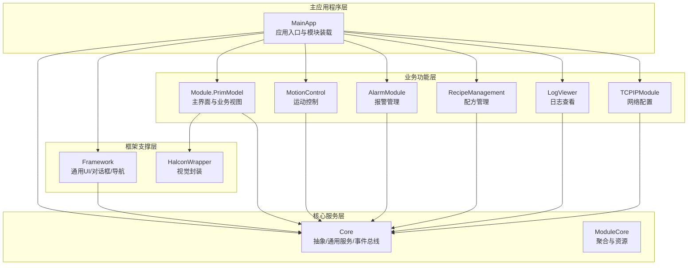
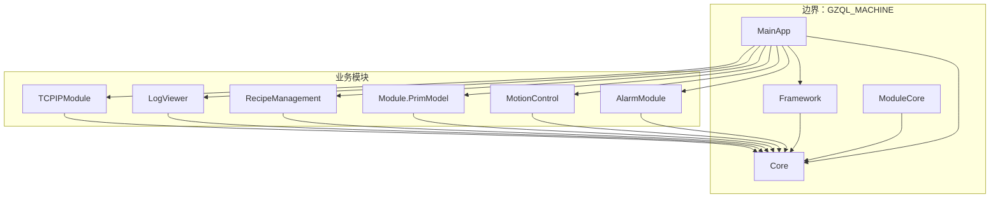
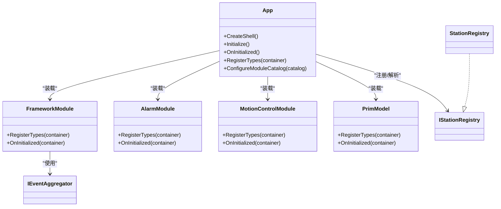
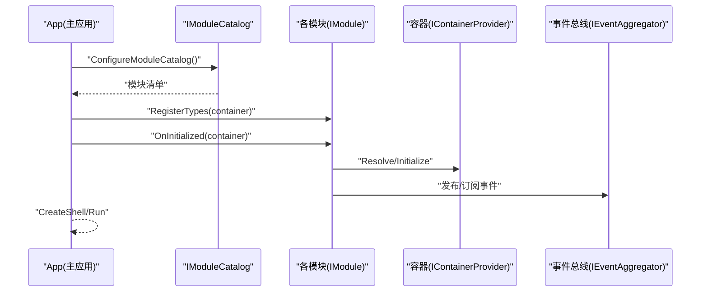
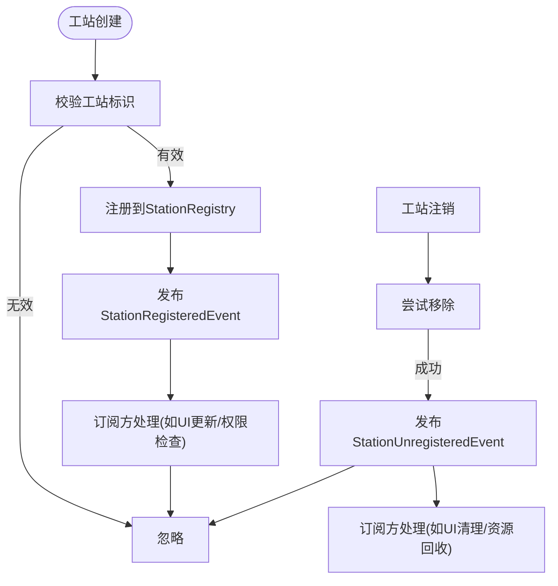
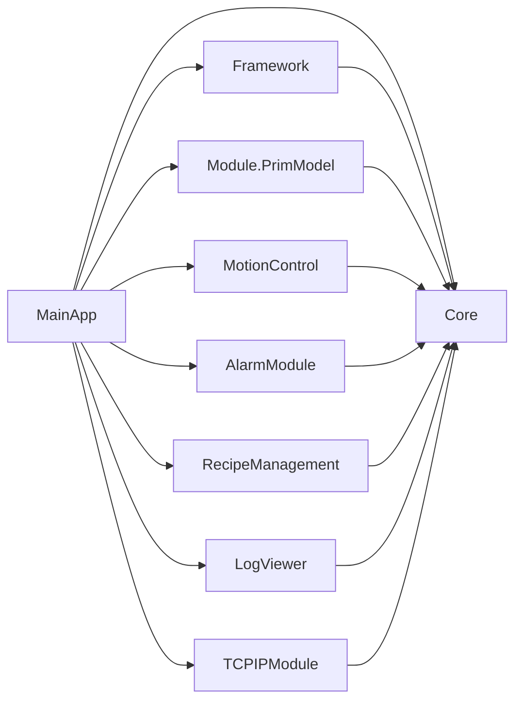

# 系统架构设计

<cite>
**本文引用的文件**
- [MainApp/App.xaml.cs](file://MainApp/App.xaml.cs)
- [Framework/FrameworkModule.cs](file://Framework/FrameworkModule.cs)
- [AlarmModule/AlarmModule.cs](file://AlarmModule/AlarmModule.cs)
- [MotionControl/MotionControlModule.cs](file://MotionControl/MotionControlModule.cs)
- [Module/PrimModel.cs](file://Module/PrimModel.cs)
- [Core/Core.csproj](file://Core/Core.csproj)
- [Framework/Framework.csproj](file://Framework/Framework.csproj)
- [ModuleCore/ModuleCore.csproj](file://ModuleCore/ModuleCore.csproj)
- [Core/Abstraction/IStationRegistry.cs](file://Core/Abstraction/IStationRegistry.cs)
- [Core/Services/StationRegistry.cs](file://Core/Services/StationRegistry.cs)
- [Core/Events/SystemInitializedEvent.cs](file://Core/Events/SystemInitializedEvent.cs)
- [Core/Events/StationRegisteredEvent.cs](file://Core/Events/StationRegisteredEvent.cs)
- [Core/Events/StationUnregisteredEvent.cs](file://Core/Events/StationUnregisteredEvent.cs)
</cite>

## 目录
1. [引言](#引言)
2. [项目结构](#项目结构)
3. [核心组件](#核心组件)
4. [架构总览](#架构总览)
5. [详细组件分析](#详细组件分析)
6. [依赖分析](#依赖分析)
7. [性能考虑](#性能考虑)
8. [故障排查指南](#故障排查指南)
9. [结论](#结论)
10. [附录](#附录)

## 引言
本架构文档面向GZQL_MACHINE项目的开发者与维护者，系统性阐述基于Prism模块化框架的WPF应用整体架构设计。文档聚焦以下目标：
- 明确主应用程序层、核心服务层、框架支撑层、业务功能层的职责划分与协作方式
- 深入解释Prism模块化框架的使用、依赖注入容器的配置与事件驱动架构的实现
- 描述数据流向、组件交互模式与服务依赖关系
- 总结架构决策的技术考量、性能优化策略与可扩展性设计
- 提供系统边界图与组件关系图，帮助快速理解系统设计思路

## 项目结构
GZQL_MACHINE采用多项目解决方案，围绕“主应用 + 框架层 + 业务模块”的分层组织方式：
- 主应用程序层：MainApp，负责应用生命周期、配置构建、模块装载与全局异常处理
- 框架支撑层：Framework，提供通用UI控件、对话框、导航与参数编辑等基础设施
- 核心服务层：Core，提供抽象接口、通用服务、事件总线与跨模块共享能力
- 业务功能层：AlarmModule、MotionControl、Module（PrimModel）、RecipeManagement、LogViewer、TCPIPModule 等，按领域拆分模块，各自注册服务与视图导航

图表来源
- [MainApp/App.xaml.cs:179-191](file://MainApp/App.xaml.cs#L179-L191)
- [Framework/FrameworkModule.cs:31-55](file://Framework/FrameworkModule.cs#L31-L55)
- [AlarmModule/AlarmModule.cs:21-46](file://AlarmModule/AlarmModule.cs#L21-L46)
- [MotionControl/MotionControlModule.cs:48-75](file://MotionControl/MotionControlModule.cs#L48-L75)
- [Module/PrimModel.cs:51-114](file://Module/PrimModel.cs#L51-L114)

章节来源
- [MainApp/App.xaml.cs:179-191](file://MainApp/App.xaml.cs#L179-L191)
- [Framework/Framework.csproj:12-21](file://Framework/Framework.csproj#L12-L21)
- [Core/Core.csproj:11-18](file://Core/Core.csproj#L11-L18)
- [ModuleCore/ModuleCore.csproj:40-47](file://ModuleCore/ModuleCore.csproj#L40-L47)

## 核心组件
本节对关键组件进行深入剖析，涵盖职责、依赖与交互。

- 应用入口与模块装载（MainApp/App.xaml.cs）
  - 负责构建配置、注册核心服务与各模块、创建Shell窗口、初始化服务依赖与系统子系统
  - 通过ConfigureModuleCatalog集中声明模块清单，确保模块化装配顺序可控
  - 通过RegisterTypes集中注册服务与对话框，统一依赖注入配置

- 框架模块（Framework/FrameworkModule.cs）
  - 注册参数编辑、对话框服务、树形配置、可取消操作等通用能力
  - 通过RegisterForNavigation建立视图与视图模型的映射，支撑主界面导航

- 报警模块（AlarmModule/AlarmModule.cs）
  - 基于SQLite本地数据库持久化报警数据，注册DbContextOptions、仓储与服务
  - 在OnInitialized阶段确保数据库表结构创建，保障模块可用性

- 运动控制模块（MotionControl/MotionControlModule.cs）
  - 初始化运动服务、夹爪服务与系统状态监控，启动轮询
  - 注册轴参数、速度控制、IO显示、任务管理等服务与导航项

- 主界面模块（Module/PrimModel.cs）
  - 构建导航列表，注册主内容区与树形菜单区域的视图/视图模型
  - 注册跨模块共享的核心服务（公式求值、DXF解析、ROI工具、坐标对齐）

章节来源
- [MainApp/App.xaml.cs:110-119](file://MainApp/App.xaml.cs#L110-L119)
- [MainApp/App.xaml.cs:179-191](file://MainApp/App.xaml.cs#L179-L191)
- [Framework/FrameworkModule.cs:31-55](file://Framework/FrameworkModule.cs#L31-L55)
- [AlarmModule/AlarmModule.cs:21-56](file://AlarmModule/AlarmModule.cs#L21-L56)
- [MotionControl/MotionControlModule.cs:23-75](file://MotionControl/MotionControlModule.cs#L23-L75)
- [Module/PrimModel.cs:23-114](file://Module/PrimModel.cs#L23-L114)

## 架构总览
下图展示系统边界与主要模块间的依赖关系，体现“主应用”作为装配中心、“框架层”提供通用能力、“核心层”提供抽象与事件、“业务模块”按领域自治的分层思想。

图表来源
- [MainApp/App.xaml.cs:179-191](file://MainApp/App.xaml.cs#L179-L191)
- [Framework/FrameworkModule.cs:31-55](file://Framework/FrameworkModule.cs#L31-L55)
- [AlarmModule/AlarmModule.cs:21-46](file://AlarmModule/AlarmModule.cs#L21-L46)
- [MotionControl/MotionControlModule.cs:48-75](file://MotionControl/MotionControlModule.cs#L48-L75)
- [Module/PrimModel.cs:51-114](file://Module/PrimModel.cs#L51-L114)

## 详细组件分析

### Prism模块化与依赖注入容器
- 模块装载
  - 主应用通过ConfigureModuleCatalog集中声明模块，确保模块装配顺序与依赖可见
  - 各模块实现IModule接口，在RegisterTypes中注册服务与导航；在OnInitialized中执行初始化逻辑

- 依赖注入
  - 容器使用Prism.Unity集成，主应用在RegisterTypes中注册核心服务（配置、日志、本地化、应用设置、站点注册表等）
  - 模块在自身RegisterTypes中注册领域服务与视图导航，形成“主应用装配 + 模块自治”的组合

- 事件驱动
  - 使用Prism.Events的IEventAggregator实现松耦合通信
  - 核心事件如SystemInitializedEvent、StationRegisteredEvent、StationUnregisteredEvent用于跨模块广播

图表来源
- [MainApp/App.xaml.cs:179-191](file://MainApp/App.xaml.cs#L179-L191)
- [Framework/FrameworkModule.cs:15-29](file://Framework/FrameworkModule.cs#L15-L29)
- [AlarmModule/AlarmModule.cs:16-56](file://AlarmModule/AlarmModule.cs#L16-L56)
- [MotionControl/MotionControlModule.cs:15-75](file://MotionControl/MotionControlModule.cs#L15-L75)
- [Module/PrimModel.cs:21-114](file://Module/PrimModel.cs#L21-L114)
- [Core/Abstraction/IStationRegistry.cs:7-20](file://Core/Abstraction/IStationRegistry.cs#L7-L20)
- [Core/Services/StationRegistry.cs:14-46](file://Core/Services/StationRegistry.cs#L14-L46)

章节来源
- [MainApp/App.xaml.cs:110-119](file://MainApp/App.xaml.cs#L110-L119)
- [Framework/FrameworkModule.cs:31-55](file://Framework/FrameworkModule.cs#L31-L55)
- [AlarmModule/AlarmModule.cs:21-56](file://AlarmModule/AlarmModule.cs#L21-L56)
- [MotionControl/MotionControlModule.cs:23-75](file://MotionControl/MotionControlModule.cs#L23-L75)
- [Module/PrimModel.cs:23-114](file://Module/PrimModel.cs#L23-L114)
- [Core/Abstraction/IStationRegistry.cs:7-20](file://Core/Abstraction/IStationRegistry.cs#L7-L20)
- [Core/Services/StationRegistry.cs:14-46](file://Core/Services/StationRegistry.cs#L14-L46)

### 数据流与组件交互
- 配置与启动流程
  - 主应用构建配置、注册核心服务、装载模块、创建Shell窗口
  - 各模块在OnInitialized中执行初始化（如运动控制模块启动轮询、报警模块确保数据库存在）
  - 事件总线用于模块间解耦通信（如工站注册/注销事件）

- 视图导航与对话框
  - 通过RegisterForNavigation建立视图与视图模型映射，支持主内容区与侧边树形菜单导航
  - 对话框通过RegisterDialog注册，配合IParameterDialogService等服务实现弹窗式交互

图表来源
- [MainApp/App.xaml.cs:179-191](file://MainApp/App.xaml.cs#L179-L191)
- [Framework/FrameworkModule.cs:23-55](file://Framework/FrameworkModule.cs#L23-L55)
- [AlarmModule/AlarmModule.cs:51-56](file://AlarmModule/AlarmModule.cs#L51-L56)
- [MotionControl/MotionControlModule.cs:23-46](file://MotionControl/MotionControlModule.cs#L23-L46)

章节来源
- [MainApp/App.xaml.cs:54-72](file://MainApp/App.xaml.cs#L54-L72)
- [Framework/FrameworkModule.cs:45-55](file://Framework/FrameworkModule.cs#L45-L55)
- [AlarmModule/AlarmModule.cs:51-56](file://AlarmModule/AlarmModule.cs#L51-L56)
- [MotionControl/MotionControlModule.cs:23-46](file://MotionControl/MotionControlModule.cs#L23-L46)

### 事件驱动架构
- 工站注册表（IStationRegistry/StationRegistry）
  - 提供线程安全的工站注册/注销与查询能力，避免模块加载时序导致的空集合问题
  - 通过事件总线发布注册/注销事件，供其他模块订阅

- 系统事件
  - SystemInitializedEvent：系统初始化完成事件
  - StationRegisteredEvent/StationUnregisteredEvent：工站注册/注销事件

图表来源
- [Core/Services/StationRegistry.cs:24-44](file://Core/Services/StationRegistry.cs#L24-L44)
- [Core/Events/StationRegisteredEvent.cs:9](file://Core/Events/StationRegisteredEvent.cs#L9)
- [Core/Events/StationUnregisteredEvent.cs:9](file://Core/Events/StationUnregisteredEvent.cs#L9)

章节来源
- [Core/Abstraction/IStationRegistry.cs:7-20](file://Core/Abstraction/IStationRegistry.cs#L7-L20)
- [Core/Services/StationRegistry.cs:14-46](file://Core/Services/StationRegistry.cs#L14-L46)
- [Core/Events/StationRegisteredEvent.cs:6-10](file://Core/Events/StationRegisteredEvent.cs#L6-L10)
- [Core/Events/StationUnregisteredEvent.cs:6-10](file://Core/Events/StationUnregisteredEvent.cs#L6-L10)

## 依赖分析
- 项目依赖关系
  - Framework依赖Core，提供UI与对话框能力
  - ModuleCore聚合多个模块并依赖Core、Framework、AlarmModule、MotionControl、RecipeManagement、LogViewer
  - 各业务模块依赖Core以获得抽象与通用服务
  - 主应用依赖各模块并通过Prism进行装配

- 包依赖要点
  - Prism.Wpf、Prism.Unity用于模块化与依赖注入
  - NLog用于日志记录
  - MaterialDesignThemes用于主题与控件
  - MathNet.Numerics、Newtonsoft.Json等第三方库

图表来源
- [Framework/Framework.csproj:28](file://Framework/Framework.csproj#L28)
- [ModuleCore/ModuleCore.csproj:40-47](file://ModuleCore/ModuleCore.csproj#L40-L47)
- [Core/Core.csproj:11-18](file://Core/Core.csproj#L11-L18)

章节来源
- [Framework/Framework.csproj:12-21](file://Framework/Framework.csproj#L12-L21)
- [ModuleCore/ModuleCore.csproj:40-47](file://ModuleCore/ModuleCore.csproj#L40-L47)
- [Core/Core.csproj:11-18](file://Core/Core.csproj#L11-L18)

## 性能考虑
- 模块初始化顺序与异步化
  - 运动控制模块在OnInitialized中异步初始化并启动轮询，避免阻塞主线程
  - 建议其他模块也采用异步初始化策略，并在失败时降级运行

- 事件总线与订阅管理
  - 使用IEventAggregator进行松耦合通信，注意订阅的生命周期管理，避免内存泄漏
  - 对高频事件（如轮询状态）建议限流或合并更新

- 依赖注入与作用域
  - 将长生命周期服务注册为Singleton，短生命周期对象按需创建
  - 注意DbContext等有作用域限制的对象不要注册为Singleton

- UI线程与后台线程
  - 通过Dispatcher或异步API确保UI线程安全
  - 对耗时操作使用后台线程，避免阻塞用户交互

## 故障排查指南
- 全局异常处理
  - 主应用实现了DispatcherUnhandledException、CurrentDomain.UnhandledException、TaskScheduler.UnobservedTaskException的统一捕获
  - 异常发生时生成崩溃转储与错误报告，便于定位问题

- 日志与诊断
  - 使用NLog记录启动、关闭、异常与内存使用情况
  - 建议在关键路径增加日志输出，结合错误报告文件进行分析

- 模块初始化失败
  - 若某模块初始化失败，应记录错误并允许其他模块继续运行
  - 检查模块注册的服务是否正确、配置文件是否存在、外部依赖是否可用

章节来源
- [MainApp/App.xaml.cs:234-455](file://MainApp/App.xaml.cs#L234-L455)

## 结论
GZQL_MACHINE采用Prism模块化框架与依赖注入容器，形成了清晰的分层架构：主应用负责装配与生命周期管理，框架层提供通用能力，核心层提供抽象与事件总线，业务模块按领域自治。该架构具备良好的可扩展性与可维护性，通过事件驱动与导航机制实现模块间解耦。建议在后续开发中持续完善模块初始化的异步化与错误恢复策略，强化日志与监控体系，以进一步提升系统稳定性与可观测性。

## 附录
- 关键文件索引
  - 应用入口与模块装载：[MainApp/App.xaml.cs](file://MainApp/App.xaml.cs)
  - 框架模块注册：[Framework/FrameworkModule.cs](file://Framework/FrameworkModule.cs)
  - 报警模块注册与初始化：[AlarmModule/AlarmModule.cs](file://AlarmModule/AlarmModule.cs)
  - 运动控制模块注册与初始化：[MotionControl/MotionControlModule.cs](file://MotionControl/MotionControlModule.cs)
  - 主界面模块注册与导航：[Module/PrimModel.cs](file://Module/PrimModel.cs)
  - 核心项目依赖：[Core/Core.csproj](file://Core/Core.csproj)、[Framework/Framework.csproj](file://Framework/Framework.csproj)、[ModuleCore/ModuleCore.csproj](file://ModuleCore/ModuleCore.csproj)
  - 工站注册表与事件：[Core/Abstraction/IStationRegistry.cs](file://Core/Abstraction/IStationRegistry.cs)、[Core/Services/StationRegistry.cs](file://Core/Services/StationRegistry.cs)、[Core/Events/StationRegisteredEvent.cs](file://Core/Events/StationRegisteredEvent.cs)、[Core/Events/StationUnregisteredEvent.cs](file://Core/Events/StationUnregisteredEvent.cs)、[Core/Events/SystemInitializedEvent.cs](file://Core/Events/SystemInitializedEvent.cs)