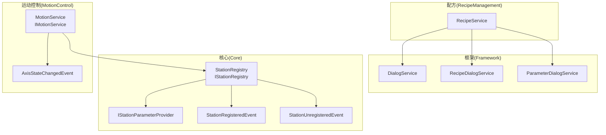
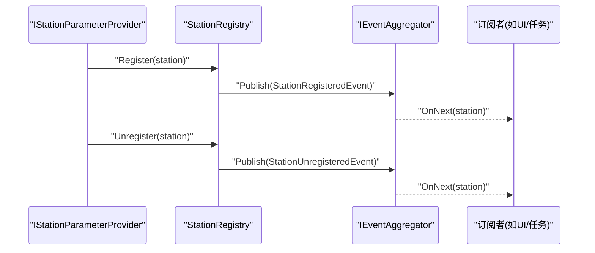
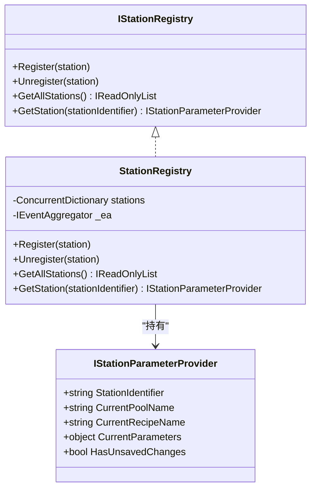
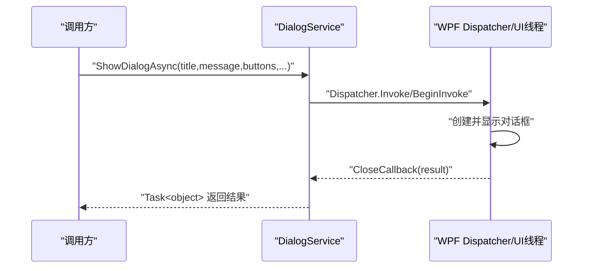
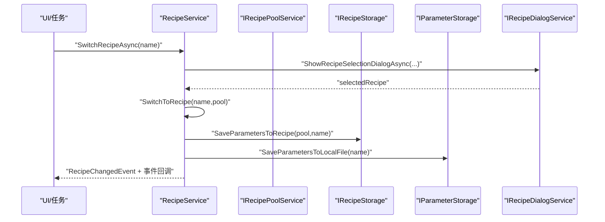
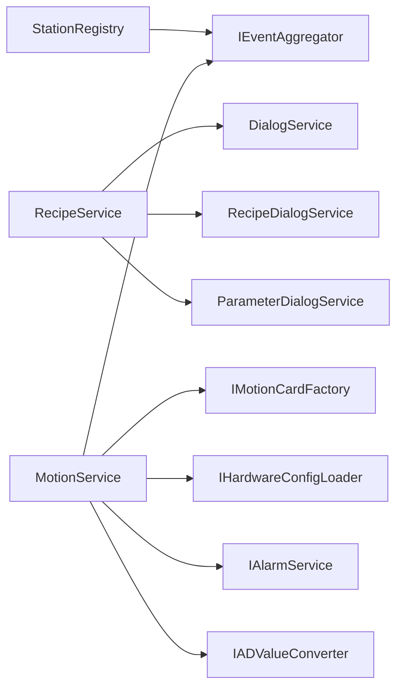

# 组件交互机制

<cite>
**本文档引用的文件**
- [Core\Services\StationRegistry.cs](file://Core/Services/StationRegistry.cs)
- [Core\Abstraction\IStationRegistry.cs](file://Core/Abstraction/IStationRegistry.cs)
- [Core\Abstraction\IStationParameterProvider.cs](file://Core/Abstraction/IStationParameterProvider.cs)
- [Core\Events\StationRegisteredEvent.cs](file://Core/Events/StationRegisteredEvent.cs)
- [Core\Events\StationUnregisteredEvent.cs](file://Core/Events/StationUnregisteredEvent.cs)
- [Framework\Services\DialogService.cs](file://Framework/Services/DialogService.cs)
- [Framework\Services\RecipeDialogService.cs](file://Framework/Services/RecipeDialogService.cs)
- [Framework\Services\ParameterDialogService.cs](file://Framework/Services/ParameterDialogService.cs)
- [MotionControl\Services\MotionService.cs](file://MotionControl/Services/MotionService.cs)
- [MotionControl\Interfaces\IMotionService.cs](file://MotionControl/Interfaces/IMotionService.cs)
- [MotionControl\Events\AxisStateChangedEvent.cs](file://MotionControl/Events/AxisStateChangedEvent.cs)
- [RecipeManagement\Services\RecipeService.cs](file://RecipeManagement/Services/RecipeService.cs)
</cite>

## 目录
1. [简介](#简介)
2. [项目结构](#项目结构)
3. [核心组件](#核心组件)
4. [架构总览](#架构总览)
5. [详细组件分析](#详细组件分析)
6. [依赖关系分析](#依赖关系分析)
7. [性能考量](#性能考量)
8. [故障排查指南](#故障排查指南)
9. [结论](#结论)
10. [附录](#附录)

## 简介
本文件聚焦于GZQL_MACHINE系统的组件交互机制，围绕以下核心组件展开：工站注册表(StationRegistry)的组件发现与事件通知、对话框服务(DialogService)的界面交互、运动服务(MotionService)的硬件控制与事件驱动、配方服务(RecipeService)的数据管理与持久化。文档将系统阐述组件间通信方式（直接调用、事件通知、服务接口、消息传递）、接口设计原则与契约式编程、错误处理策略、解耦方法、测试策略与集成方案，并给出最佳实践与性能优化建议。

## 项目结构
系统采用分层与模块化组织，核心抽象位于Core，具体实现分布在Framework、MotionControl、RecipeManagement等模块。组件通过接口与事件聚合器进行松耦合交互，辅以对话框服务统一UI交互体验。

**图表来源**
- [Core\Services\StationRegistry.cs:14-45](file://Core/Services/StationRegistry.cs#L14-L45)
- [Core\Abstraction\IStationRegistry.cs:7-20](file://Core/Abstraction/IStationRegistry.cs#L7-L20)
- [Core\Abstraction\IStationParameterProvider.cs:6-22](file://Core/Abstraction/IStationParameterProvider.cs#L6-L22)
- [Core\Events\StationRegisteredEvent.cs](file://Core/Events/StationRegisteredEvent.cs#L9)
- [Core\Events\StationUnregisteredEvent.cs](file://Core/Events/StationUnregisteredEvent.cs#L9)
- [Framework\Services\DialogService.cs:14-431](file://Framework/Services/DialogService.cs#L14-L431)
- [Framework\Services\RecipeDialogService.cs:11-105](file://Framework/Services/RecipeDialogService.cs#L11-L105)
- [Framework\Services\ParameterDialogService.cs:10-48](file://Framework/Services/ParameterDialogService.cs#L10-L48)
- [MotionControl\Services\MotionService.cs:26-726](file://MotionControl/Services/MotionService.cs#L26-L726)
- [MotionControl\Interfaces\IMotionService.cs:12-90](file://MotionControl/Interfaces/IMotionService.cs#L12-L90)
- [MotionControl\Events\AxisStateChangedEvent.cs:9-49](file://MotionControl/Events/AxisStateChangedEvent.cs#L9-L49)
- [RecipeManagement\Services\RecipeService.cs:22-722](file://RecipeManagement/Services/RecipeService.cs#L22-L722)

**章节来源**
- [Core\Services\StationRegistry.cs:14-45](file://Core/Services/StationRegistry.cs#L14-L45)
- [Framework\Services\DialogService.cs:14-431](file://Framework/Services/DialogService.cs#L14-L431)
- [MotionControl\Services\MotionService.cs:26-726](file://MotionControl/Services/MotionService.cs#L26-L726)
- [RecipeManagement\Services\RecipeService.cs:22-722](file://RecipeManagement/Services/RecipeService.cs#L22-L722)

## 核心组件
- 工站注册表(StationRegistry)：提供线程安全的工站注册/注销与查询能力，通过事件聚合器发布注册/注销事件，供其他组件订阅。
- 对话框服务(DialogService)：提供阻塞/非阻塞对话框、异步对话框、提示框等，统一UI交互入口。
- 运动服务(MotionService)：封装运动控制卡访问、轴与IO操作、轮询与事件发布、连续插补、模拟量读取等，实现IObservable以事件驱动状态更新。
- 配方服务(RecipeService)：负责配方加载/保存、参数编辑、配方切换、事件订阅与发布、参数持久化与默认值处理。

**章节来源**
- [Core\Services\StationRegistry.cs:14-45](file://Core/Services/StationRegistry.cs#L14-L45)
- [Framework\Services\DialogService.cs:14-431](file://Framework/Services/DialogService.cs#L14-L431)
- [MotionControl\Services\MotionService.cs:26-726](file://MotionControl/Services/MotionService.cs#L26-L726)
- [RecipeManagement\Services\RecipeService.cs:22-722](file://RecipeManagement/Services/RecipeService.cs#L22-L722)

## 架构总览
系统通过接口隔离与事件聚合器实现组件解耦。工站通过注册表自注册，其他组件通过接口与事件进行交互；对话框服务统一承载UI交互；运动服务以事件驱动状态变化；配方服务负责参数与配方的生命周期管理。

**图表来源**
- [Core\Services\StationRegistry.cs:24-38](file://Core/Services/StationRegistry.cs#L24-L38)
- [Core\Events\StationRegisteredEvent.cs](file://Core/Events/StationRegisteredEvent.cs#L9)
- [Core\Events\StationUnregisteredEvent.cs](file://Core\Events/StationUnregisteredEvent.cs#L9)

**章节来源**
- [Core\Services\StationRegistry.cs:24-38](file://Core/Services/StationRegistry.cs#L24-L38)
- [Core\Abstraction\IStationParameterProvider.cs:6-22](file://Core/Abstraction/IStationParameterProvider.cs#L6-L22)

## 详细组件分析

### 工站注册表(StationRegistry)：组件发现与事件通知
- 设计要点
  - 使用并发字典维护工站集合，线程安全。
  - 通过事件聚合器发布注册/注销事件，订阅者可即时获知工站动态。
  - 提供按标识符查询与全量查询接口，便于跨模块发现。
- 交互模式
  - 直接调用：工站创建后直接调用注册/注销。
  - 事件通知：通过Pub/Sub事件向订阅者广播。
- 错误处理
  - 对空参数与无效标识符进行防御性检查。
- 接口契约
  - IStationRegistry定义注册/注销/查询契约，IStationParameterProvider定义工站能力边界。

**图表来源**
- [Core\Abstraction\IStationRegistry.cs:7-20](file://Core/Abstraction/IStationRegistry.cs#L7-L20)
- [Core\Services\StationRegistry.cs:14-45](file://Core/Services/StationRegistry.cs#L14-L45)
- [Core\Abstraction\IStationParameterProvider.cs:6-22](file://Core/Abstraction/IStationParameterProvider.cs#L6-L22)

**章节来源**
- [Core\Services\StationRegistry.cs:24-45](file://Core/Services/StationRegistry.cs#L24-L45)
- [Core\Abstraction\IStationRegistry.cs:7-20](file://Core/Abstraction/IStationRegistry.cs#L7-L20)
- [Core\Abstraction\IStationParameterProvider.cs:6-22](file://Core/Abstraction/IStationParameterProvider.cs#L6-L22)

### 对话框服务(DialogService)：界面交互与消息传递
- 设计要点
  - 支持阻塞/非阻塞对话框、异步对话框、提示框，统一入口。
  - 内部使用TaskCompletionSource与Dispatcher协调UI线程，保证线程安全。
  - 提供多种按钮配置与自动关闭能力，满足不同业务场景。
- 交互模式
  - 直接调用：服务方法直接展示对话框。
  - 事件/回调：通过回调或Task结果返回用户选择。
- 错误处理
  - 对Application.Current与Dispatcher不可用进行显式异常处理。
  - 对线程切换与异常进行捕获与降级处理。

**图表来源**
- [Framework\Services\DialogService.cs:244-408](file://Framework/Services/DialogService.cs#L244-L408)

**章节来源**
- [Framework\Services\DialogService.cs:14-431](file://Framework/Services/DialogService.cs#L14-L431)

### 运动服务(MotionService)：硬件控制与事件驱动
- 设计要点
  - 通过工厂与配置加载器初始化运动卡，支持真实卡与虚拟卡。
  - 实现IObservable以事件驱动方式发布轴状态变化，替代轮询。
  - 提供轴/IO操作、回零、连续插补、模拟量读取等能力。
  - 轮询线程中进行报警快速检查与全量状态轮询，保证实时性与稳定性。
- 交互模式
  - 直接调用：对外暴露IMotionService接口，供上层调用运动命令。
  - 事件通知：通过AxisStateChangedEvent发布状态变更。
  - 服务接口：订阅IMotionService以接收状态事件。
- 错误处理
  - 对急停/取消令牌进行微秒级响应，异常时抛出可恢复异常。
  - 对位置校验失败与坐标系运动异常进行明确提示。

```mermaid
classDiagram
class IMotionService {
+InitializeAsync()
+Shutdown()
+EnableAxis(axisId)
+DisableAxis(axisId)
+MoveAbsAsync(...)
+MoveRelAsync(...)
+MoveLineAbsAsync(...)
+HomeAsync(...)
+JogStart(axisId,positive)
+JogStop(axisId)
+StopAxis(axisId)
+EmergencyStop(axisId)
+GetAxisState(axisId) IAxis
+ClearAlarm(axisId)
+CheckHomeDoneAsync(axisId) Task<int>
+ClearPosition(axisId)
+GetAxisPosition(axisId) double
+ReadDi(port) bool
+ReadDo(port) bool
+WriteDo(port,bool)
+StartPolling(intervalMs)
+StopPolling()
+GetAxisConfigurations() IReadOnlyList
+GetTaskConfigurations() IReadOnlyList
+GetInputConfigurations() IReadOnlyList
+GetOutputConfigurations() IReadOnlyList
+InitializeContinuousInterpolation(...)
+AddLineSegment(...)
+ExecuteContinuousInterpolation(...)
+PauseContinuousInterpolation(...)
+WaitForCoordMotionCompletionAsync(...) Task<bool>
+ReadAnalogChannelAsync(cardNo,channel) Task<double>
+ReadAnalogChannelsAsync(map) Task<Dictionary>
}
class MotionService {
-IMotionCardFactory _cardFactory
-IHardwareConfigLoader _configLoader
-IEventAggregator _ea
-ILoggerService _logger
-IAlarmService _alarmService
-IADValueConverter _adConverter
-IMotionCard[] _cards
-Dictionary~int,AxisState~ _axisStates
-Dictionary~int,IoState~ _inputs
-Dictionary~int,IoState~ _outputs
-Dictionary~int,IMotionCard~ _axisCardMap
-Dictionary~int,IMotionCard~ _ioCardMap
+Subscribe(observer) IDisposable
+InitializeAsync()
+Shutdown()
+EnableAxis(axisId)
+DisableAxis(axisId)
+MoveAbsAsync(...)
+MoveRelAsync(...)
+MoveLineAbsAsync(...)
+HomeAsync(...)
+JogStart(axisId,positive)
+JogStop(axisId)
+StopAxis(axisId)
+EmergencyStop(axisId)
+GetAxisState(axisId) IAxis
+ClearAlarm(axisId)
+CheckHomeDoneAsync(axisId) Task<int>
+ClearPosition(axisId)
+GetAxisPosition(axisId) double
+ReadDi(port) bool
+ReadDo(port) bool
+WriteDo(port,bool)
+StartPolling(intervalMs)
+StopPolling()
+GetAxisConfigurations() IReadOnlyList
+GetTaskConfigurations() IReadOnlyList
+GetInputConfigurations() IReadOnlyList
+GetOutputConfigurations() IReadOnlyList
+InitializeContinuousInterpolation(...)
+AddLineSegment(...)
+ExecuteContinuousInterpolation(...)
+PauseContinuousInterpolation(...)
+WaitForCoordMotionCompletionAsync(...) Task<bool>
+ReadAnalogChannelAsync(cardNo,channel) Task<double>
+ReadAnalogChannelsAsync(map) Task<Dictionary>
}
IMotionService <|.. MotionService
```

**图表来源**
- [MotionControl\Interfaces\IMotionService.cs:12-90](file://MotionControl/Interfaces/IMotionService.cs#L12-L90)
- [MotionControl\Services\MotionService.cs:26-726](file://MotionControl/Services/MotionService.cs#L26-L726)
- [MotionControl\Events\AxisStateChangedEvent.cs:9-49](file://MotionControl/Events/AxisStateChangedEvent.cs#L9-L49)

**章节来源**
- [MotionControl\Services\MotionService.cs:26-726](file://MotionControl/Services/MotionService.cs#L26-L726)
- [MotionControl\Interfaces\IMotionService.cs:12-90](file://MotionControl/Interfaces/IMotionService.cs#L12-L90)
- [MotionControl\Events\AxisStateChangedEvent.cs:9-49](file://MotionControl/Events/AxisStateChangedEvent.cs#L9-L49)

### 配方服务(RecipeService)：数据管理与持久化
- 设计要点
  - 通过泛型参数类型约束实现强类型参数管理。
  - 依赖事件聚合器、对话框服务、参数编辑器、参数存储、配方存储与配方池服务协作。
  - 提供配方加载/保存、参数编辑、配方切换、默认值与备份策略。
- 交互模式
  - 直接调用：公开命令与方法供UI/任务调用。
  - 事件通知：订阅/发布配方变更与参数保存事件。
  - 服务接口：通过对话框服务与参数编辑器进行交互。
- 错误处理
  - 对加载/保存失败进行日志记录与降级处理，必要时回退到默认参数。

**图表来源**
- [RecipeManagement\Services\RecipeService.cs:543-634](file://RecipeManagement/Services/RecipeService.cs#L543-L634)
- [Framework\Services\RecipeDialogService.cs:20-58](file://Framework/Services/RecipeDialogService.cs#L20-L58)

**章节来源**
- [RecipeManagement\Services\RecipeService.cs:22-722](file://RecipeManagement/Services/RecipeService.cs#L22-L722)
- [Framework\Services\RecipeDialogService.cs:11-105](file://Framework/Services/RecipeDialogService.cs#L11-L105)

## 依赖关系分析
- 组件耦合与内聚
  - StationRegistry与IEventAggregator耦合，实现组件发现与事件广播。
  - MotionService依赖IMotionCardFactory、IHardwareConfigLoader、IEventAggregator、IAlarmService、IADValueConverter，职责清晰。
  - RecipeService依赖多个服务接口，通过组合实现配方生命周期管理。
- 外部依赖与集成点
  - Prism.Events用于事件聚合。
  - WPF Dispatcher与MaterialDesignThemes用于UI交互。
  - 运动控制卡API与AD转换器用于硬件抽象。

**图表来源**
- [Core\Services\StationRegistry.cs:17-22](file://Core/Services/StationRegistry.cs#L17-L22)
- [MotionControl\Services\MotionService.cs:113-123](file://MotionControl/Services/MotionService.cs#L113-L123)
- [RecipeManagement\Services\RecipeService.cs:81-105](file://RecipeManagement/Services/RecipeService.cs#L81-L105)
- [Framework\Services\DialogService.cs:14-431](file://Framework/Services/DialogService.cs#L14-L431)
- [Framework\Services\RecipeDialogService.cs:11-18](file://Framework/Services/RecipeDialogService.cs#L11-L18)
- [Framework\Services\ParameterDialogService.cs:10-17](file://Framework/Services/ParameterDialogService.cs#L10-L17)

**章节来源**
- [Core\Services\StationRegistry.cs:17-22](file://Core/Services/StationRegistry.cs#L17-L22)
- [MotionControl\Services\MotionService.cs:113-123](file://MotionControl/Services/MotionService.cs#L113-L123)
- [RecipeManagement\Services\RecipeService.cs:81-105](file://RecipeManagement/Services/RecipeService.cs#L81-L105)

## 性能考量
- 事件驱动优于轮询
  - MotionService通过IObservable与事件发布替代定时轮询，降低CPU占用并提高响应性。
- 轮询策略
  - 快速报警检查与全量状态轮询分离，减少不必要的IO读取。
- 线程与并发
  - 使用并发集合与互斥保护共享状态，避免竞态条件。
- I/O与实时性
  - 连续插补与等待完成采用SpinWait与取消令牌，实现低延迟与急停响应。
- UI线程安全
  - 对话框服务通过Dispatcher.Invoke/BeginInvoke确保UI操作线程安全。

[本节为通用性能指导，无需特定文件引用]

## 故障排查指南
- 工站注册异常
  - 检查注册表对空参数与无效标识符的防御性处理，确认事件是否正确发布与订阅。
- 对话框显示失败
  - 核查Application.Current与Dispatcher可用性，关注线程切换与异常捕获。
- 运动控制异常
  - 关注急停/取消令牌响应、位置校验失败与坐标系运动异常，结合可恢复异常提示进行处理。
- 配方切换失败
  - 检查配方存在性、对话框选择结果与事件发布，查看日志定位具体环节。

**章节来源**
- [Core\Services\StationRegistry.cs:24-38](file://Core/Services/StationRegistry.cs#L24-L38)
- [Framework\Services\DialogService.cs:83-131](file://Framework/Services/DialogService.cs#L83-L131)
- [MotionControl\Services\MotionService.cs:273-289](file://MotionControl/Services/MotionService.cs#L273-L289)
- [RecipeManagement\Services\RecipeService.cs:574-594](file://RecipeManagement/Services/RecipeService.cs#L574-L594)

## 结论
本系统通过接口隔离、事件聚合与服务化设计实现了组件间的高内聚、低耦合。工站注册表提供组件发现与事件通知；对话框服务统一UI交互；运动服务以事件驱动保障实时性；配方服务贯穿参数与配方生命周期管理。遵循契约式编程与健壮的错误处理策略，配合性能优化与测试集成方案，能够有效支撑复杂工业场景的稳定运行。

[本节为总结性内容，无需特定文件引用]

## 附录
- 最佳实践
  - 严格遵守接口契约，避免直接依赖具体实现。
  - 使用事件聚合器进行跨模块通信，避免紧耦合。
  - 在UI线程中进行UI操作，确保线程安全。
  - 对关键路径使用取消令牌与异常包装，提升可恢复性。
- 测试策略
  - 单元测试：针对服务方法与事件发布进行断言。
  - 集成测试：验证组件协作流程（注册/切换/对话框/运动）。
  - 回归测试：覆盖异常分支与边界条件。
- 集成方案
  - 通过依赖注入容器注册服务与接口，确保生命周期与作用域正确。
  - 使用事件过滤与订阅令牌管理，避免重复订阅与内存泄漏。

[本节为通用指导，无需特定文件引用]