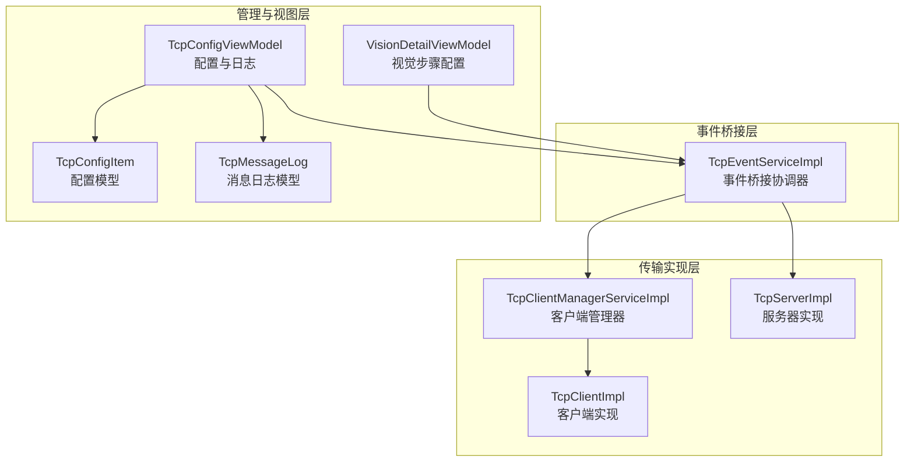
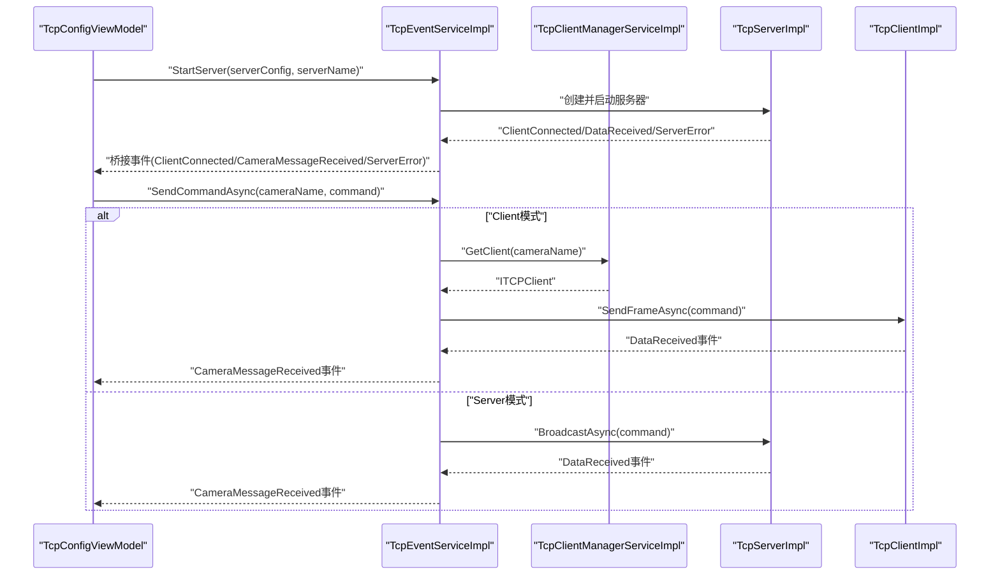
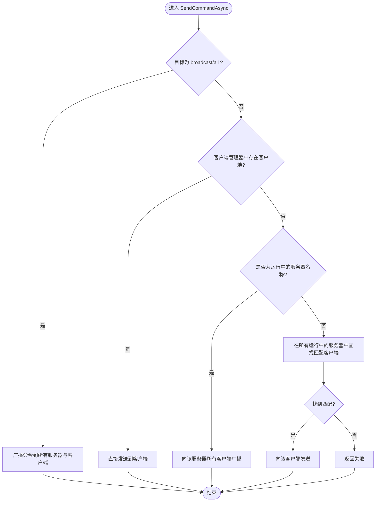
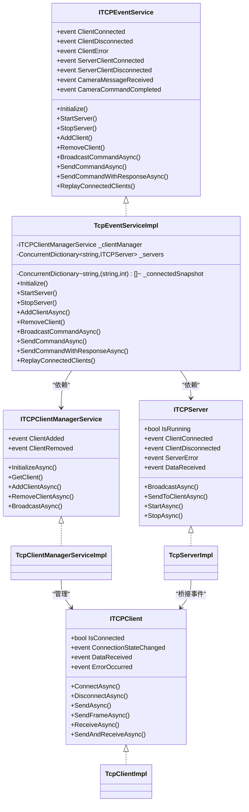

# TCP事件桥接机制

<cite>
**本文档引用的文件**
- [TcpEventServiceImpl.cs](file://TCPIPModule/Services/TcpEventServiceImpl.cs)
- [ITCPService.cs](file://TCPIPModule/Interfaces/ITCPService.cs)
- [TcpClientImpl.cs](file://TCPIPModule/Services/TcpClientImpl.cs)
- [TcpServerImpl.cs](file://TCPIPModule/Services/TcpServerImpl.cs)
- [TcpClientManagerServiceImpl.cs](file://TCPIPModule/Services/TcpClientManagerServiceImpl.cs)
- [TcpConfigItem.cs](file://Core/Models/TcpConfigItem.cs)
- [TcpMessageLog.cs](file://Core/Models/TcpMessageLog.cs)
- [TcpConfigViewModel.cs](file://TCPIPModule/ViewModels/TcpConfigViewModel.cs)
- [VisionDetailViewModel.cs](file://Module/Controls/StepDetails/VisionDetailViewModel.cs)
- [版本修改记录.txt](file://版本修改记录.txt)
</cite>

## 目录
1. [引言](#引言)
2. [项目结构](#项目结构)
3. [核心组件](#核心组件)
4. [架构总览](#架构总览)
5. [详细组件分析](#详细组件分析)
6. [依赖关系分析](#依赖关系分析)
7. [性能考虑](#性能考虑)
8. [故障排除指南](#故障排除指南)
9. [结论](#结论)
10. [附录](#附录)

## 引言
本文件系统性阐述TCPIPModule中的TCP事件桥接机制，重点解析TcpEventServiceImpl的设计原理与实现细节，涵盖事件订阅发布模式、消息路由机制、事件过滤规则、事件类型定义、事件负载格式、事件优先级管理、配置方法、调试技巧与性能优化策略，并提供事件处理流程图与实际应用示例。

## 项目结构
TCPIPModule围绕“事件桥接”目标，构建了三层协作体系：
- 事件桥接层：TcpEventServiceImpl作为高层协调器，统一管理客户端与服务器生命周期，提供命令发送/响应等待能力，并将底层事件桥接到系统内部事件。
- 传输实现层：TcpClientImpl与TcpServerImpl分别实现Client模式与Server模式的连接、收发、自动重连与帧解析。
- 管理与视图层：TcpClientManagerServiceImpl负责多客户端集中管理；TcpConfigViewModel负责配置持久化与UI日志；VisionDetailViewModel在视觉任务中使用桥接事件进行请求-响应交互。

**图表来源**
- [TcpEventServiceImpl.cs:22-84](file://TCPIPModule/Services/TcpEventServiceImpl.cs#L22-L84)
- [TcpClientManagerServiceImpl.cs:17-50](file://TCPIPModule/Services/TcpClientManagerServiceImpl.cs#L17-L50)
- [TcpClientImpl.cs:19-73](file://TCPIPModule/Services/TcpClientImpl.cs#L19-L73)
- [TcpServerImpl.cs:19-77](file://TCPIPModule/Services/TcpServerImpl.cs#L19-L77)
- [TcpConfigViewModel.cs:19-147](file://TCPIPModule/ViewModels/TcpConfigViewModel.cs#L19-L147)
- [VisionDetailViewModel.cs:23-46](file://Module/Controls/StepDetails/VisionDetailViewModel.cs#L23-L46)
- [TcpConfigItem.cs:6-24](file://Core/Models/TcpConfigItem.cs#L6-L24)
- [TcpMessageLog.cs:8-27](file://Core/Models/TcpMessageLog.cs#L8-L27)

**章节来源**
- [TcpEventServiceImpl.cs:15-84](file://TCPIPModule/Services/TcpEventServiceImpl.cs#L15-L84)
- [ITCPService.cs:127-225](file://TCPIPModule/Interfaces/ITCPService.cs#L127-L225)

## 核心组件
- TcpEventServiceImpl：事件桥接协调器，负责多服务器实例管理、客户端生命周期、命令路由、请求-响应等待、事件回放与报警集成。
- ITCPEventService接口：定义事件桥接服务的契约，包括事件声明、服务器启停、客户端管理、命令发送与响应等待。
- TcpClientImpl：客户端实现，支持Raw/Frame两种数据模式、自动重连、超时收发、帧协议解析。
- TcpServerImpl：服务器实现，支持多客户端连接、广播与定向发送、事件桥接。
- TcpClientManagerServiceImpl：多客户端集中管理，负责批量初始化、连接状态事件桥接、广播。
- 配置与日志模型：TcpConfigItem、TcpMessageLog支撑UI配置与消息日志展示。
- 视图模型：TcpConfigViewModel、VisionDetailViewModel消费桥接事件，驱动UI与业务流程。

**章节来源**
- [TcpEventServiceImpl.cs:22-84](file://TCPIPModule/Services/TcpEventServiceImpl.cs#L22-L84)
- [ITCPService.cs:130-225](file://TCPIPModule/Interfaces/ITCPService.cs#L130-L225)
- [TcpClientImpl.cs:19-73](file://TCPIPModule/Services/TcpClientImpl.cs#L19-L73)
- [TcpServerImpl.cs:19-77](file://TCPIPModule/Services/TcpServerImpl.cs#L19-L77)
- [TcpClientManagerServiceImpl.cs:17-50](file://TCPIPModule/Services/TcpClientManagerServiceImpl.cs#L17-L50)
- [TcpConfigItem.cs:6-24](file://Core/Models/TcpConfigItem.cs#L6-L24)
- [TcpMessageLog.cs:8-27](file://Core/Models/TcpMessageLog.cs#L8-L27)
- [TcpConfigViewModel.cs:19-147](file://TCPIPModule/ViewModels/TcpConfigViewModel.cs#L19-L147)
- [VisionDetailViewModel.cs:23-46](file://Module/Controls/StepDetails/VisionDetailViewModel.cs#L23-L46)

## 架构总览
事件桥接机制通过TcpEventServiceImpl将底层TCP通信事件统一转换为系统内部事件，实现模块间解耦通信。其核心特征：
- 事件订阅发布：桥接服务订阅底层客户端/服务器事件，再发布为系统内部事件（如ClientConnected、ClientDisconnected、CameraMessageReceived等）。
- 消息路由：根据目标标识（cameraName/serverName/clientIdentifier）选择路由策略：Client模式直连、Server模式广播或定向发送。
- 事件过滤：通过事件参数（如cameraName、serverName、clientId）实现精细过滤，避免无关事件干扰。
- 请求-响应：Client模式使用帧协议等待响应；Server模式通过事件桥接与超时控制实现等待。

**图表来源**
- [TcpEventServiceImpl.cs:91-163](file://TCPIPModule/Services/TcpEventServiceImpl.cs#L91-L163)
- [TcpEventServiceImpl.cs:287-332](file://TCPIPModule/Services/TcpEventServiceImpl.cs#L287-L332)
- [TcpClientManagerServiceImpl.cs:54-70](file://TCPIPModule/Services/TcpClientManagerServiceImpl.cs#L54-L70)
- [TcpServerImpl.cs:104-133](file://TCPIPModule/Services/TcpServerImpl.cs#L104-L133)
- [TcpClientImpl.cs:188-241](file://TCPIPModule/Services/TcpClientImpl.cs#L188-L241)

**章节来源**
- [TcpEventServiceImpl.cs:78-163](file://TCPIPModule/Services/TcpEventServiceImpl.cs#L78-L163)
- [ITCPService.cs:174-225](file://TCPIPModule/Interfaces/ITCPService.cs#L174-L225)

## 详细组件分析

### TcpEventServiceImpl 设计与实现
- 事件桥接与订阅发布
  - 订阅TcpClientManagerService的ClientAdded/ClientRemoved事件，桥接连接状态与数据接收事件。
  - 订阅各TcpServerImpl的ClientConnected/ClientDisconnected/DataReceived/ServerError事件，统一发布为系统内部事件。
- 多服务器实例管理
  - 使用并发字典维护多个服务器实例，支持并行运行（如TCP_1/TCP_2）。
  - 通过闭包捕获serverName，确保每个服务器的DataReceived事件携带正确的源名称。
- 连接状态快照与回放
  - 维护_connectedSnapshot，记录每个服务器的已连接客户端列表，解决“订阅前已连接”的竞态问题。
  - 提供ReplayConnectedClients()方法，供ViewModel订阅后立即回放历史连接状态。
- 命令路由与请求-响应
  - SendCommandAsync：优先Client模式直连；若非Client模式则按Server模式广播或定向发送。
  - SendCommandWithResponseAsync：Client模式使用SendAndReceiveAsync；Server模式通过事件桥接与超时控制等待响应。
- 报警集成
  - 掉线与通讯异常通过AlarmModule触发报警，采用fire-and-forget避免阻塞事件链路。

**图表来源**
- [TcpEventServiceImpl.cs:287-332](file://TCPIPModule/Services/TcpEventServiceImpl.cs#L287-L332)

**章节来源**
- [TcpEventServiceImpl.cs:22-84](file://TCPIPModule/Services/TcpEventServiceImpl.cs#L22-L84)
- [TcpEventServiceImpl.cs:91-163](file://TCPIPModule/Services/TcpEventServiceImpl.cs#L91-L163)
- [TcpEventServiceImpl.cs:287-332](file://TCPIPModule/Services/TcpEventServiceImpl.cs#L287-L332)
- [TcpEventServiceImpl.cs:339-383](file://TCPIPModule/Services/TcpEventServiceImpl.cs#L339-L383)
- [TcpEventServiceImpl.cs:389-430](file://TCPIPModule/Services/TcpEventServiceImpl.cs#L389-L430)
- [TcpEventServiceImpl.cs:493-507](file://TCPIPModule/Services/TcpEventServiceImpl.cs#L493-L507)
- [TcpEventServiceImpl.cs:513-539](file://TCPIPModule/Services/TcpEventServiceImpl.cs#L513-L539)

### ITCPEventService 接口契约
- 事件声明：ClientConnected、ClientDisconnected、ClientError、ServerClientConnected、ServerClientDisconnected、CameraMessageReceived、CameraCommandCompleted。
- 生命周期管理：Initialize、StartServer、StopServer、GetServerNames、ReplayConnectedClients。
- 命令发送：AddClient/AddClientAsync、RemoveClient、BroadcastCommandAsync、SendCommandAsync、SendCommandWithResponseAsync、RegisterClient/UnregisterClient。

**章节来源**
- [ITCPService.cs:130-225](file://TCPIPModule/Interfaces/ITCPService.cs#L130-L225)

### TcpClientImpl 与 TcpServerImpl
- TcpClientImpl
  - 数据模式：Raw（兼容标准设备）与Frame（长度前缀帧协议，防粘包/拆包）。
  - 自动重连：断线后按间隔重连，支持5秒连接超时。
  - 帧解析：Frame模式下解析长度前缀帧，提取完整消息。
- TcpServerImpl
  - 多客户端管理：使用并发字典维护已连接客户端。
  - 广播与定向：支持对所有客户端广播与对指定客户端定向发送。
  - 事件桥接：将底层数据事件桥接为系统内部事件，携带clientIdentifier与消息。

**章节来源**
- [TcpClientImpl.cs:19-73](file://TCPIPModule/Services/TcpClientImpl.cs#L19-L73)
- [TcpClientImpl.cs:248-295](file://TCPIPModule/Services/TcpClientImpl.cs#L248-L295)
- [TcpClientImpl.cs:297-340](file://TCPIPModule/Services/TcpClientImpl.cs#L297-L340)
- [TcpServerImpl.cs:19-77](file://TCPIPModule/Services/TcpServerImpl.cs#L19-L77)
- [TcpServerImpl.cs:148-198](file://TCPIPModule/Services/TcpServerImpl.cs#L148-L198)

### TcpClientManagerServiceImpl
- 多客户端集中管理：支持批量初始化、按名称获取、添加/移除客户端。
- 事件桥接：ClientAdded/ClientRemoved事件向上游传播，便于桥接服务订阅。
- 广播：对所有已连接客户端广播消息（使用帧协议）。

**章节来源**
- [TcpClientManagerServiceImpl.cs:17-50](file://TCPIPModule/Services/TcpClientManagerServiceImpl.cs#L17-L50)
- [TcpClientManagerServiceImpl.cs:75-107](file://TCPIPModule/Services/TcpClientManagerServiceImpl.cs#L75-L107)
- [TcpClientManagerServiceImpl.cs:128-135](file://TCPIPModule/Services/TcpClientManagerServiceImpl.cs#L128-L135)

### 配置与日志模型
- TcpConfigItem：持久化TCP连接配置，包含名称、模式（Client/Server）、IP、端口、超时、编码、启用状态与描述。
- TcpMessageLog：UI消息日志模型，记录时间戳、方向（Send/Receive）、客户端名称与消息内容。

**章节来源**
- [TcpConfigItem.cs:6-24](file://Core/Models/TcpConfigItem.cs#L6-L24)
- [TcpMessageLog.cs:8-27](file://Core/Models/TcpMessageLog.cs#L8-L27)

### 视图模型与事件消费
- TcpConfigViewModel
  - 订阅桥接事件，实时记录消息日志；支持测试连接、发送自定义消息、保存配置。
  - 在构造函数中调用ReplayConnectedClients()，确保首次订阅即回放历史连接状态。
- VisionDetailViewModel
  - 使用ITCPEventService进行视觉步骤的触发命令发送与响应等待，支持超时控制与脚本解析。

**章节来源**
- [TcpConfigViewModel.cs:117-147](file://TCPIPModule/ViewModels/TcpConfigViewModel.cs#L117-L147)
- [TcpConfigViewModel.cs:152-161](file://TCPIPModule/ViewModels/TcpConfigViewModel.cs#L152-L161)
- [TcpConfigViewModel.cs:319-354](file://TCPIPModule/ViewModels/TcpConfigViewModel.cs#L319-L354)
- [VisionDetailViewModel.cs:23-46](file://Module/Controls/StepDetails/VisionDetailViewModel.cs#L23-L46)

## 依赖关系分析
- 模块内依赖
  - TcpEventServiceImpl依赖TcpClientManagerServiceImpl与TcpServerImpl，向上游发布系统内部事件。
  - TcpClientImpl与TcpServerImpl依赖ITCPClient/ITCPServer接口，遵循接口隔离原则。
- 模块间依赖
  - TcpEventServiceImpl可选依赖AlarmModule（IAlarmService），用于掉线与通讯异常报警。
  - 视图模型依赖TcpEventServiceImpl进行UI交互与业务流程编排。

**图表来源**
- [ITCPService.cs:12-124](file://TCPIPModule/Interfaces/ITCPService.cs#L12-L124)
- [TcpEventServiceImpl.cs:22-84](file://TCPIPModule/Services/TcpEventServiceImpl.cs#L22-L84)
- [TcpClientManagerServiceImpl.cs:17-50](file://TCPIPModule/Services/TcpClientManagerServiceImpl.cs#L17-L50)
- [TcpServerImpl.cs:19-77](file://TCPIPModule/Services/TcpServerImpl.cs#L19-L77)
- [TcpClientImpl.cs:19-73](file://TCPIPModule/Services/TcpClientImpl.cs#L19-L73)

**章节来源**
- [ITCPService.cs:12-124](file://TCPIPModule/Interfaces/ITCPService.cs#L12-L124)
- [TcpEventServiceImpl.cs:22-84](file://TCPIPModule/Services/TcpEventServiceImpl.cs#L22-L84)

## 性能考虑
- 并发与异步
  - 使用ConcurrentDictionary管理服务器与客户端，避免锁竞争。
  - 大量发送/广播采用Task.WhenAll并行处理，提升吞吐量。
- 超时与资源释放
  - 发送/接收均支持超时控制，避免阻塞；断线后及时释放NetworkStream与TcpClient资源。
- 帧协议与粘包处理
  - Frame模式使用长度前缀帧，有效防止粘包/拆包，提升稳定性。
- 日志与报警
  - 采用fire-and-forget模式触发报警，避免阻塞事件处理链路。
- UI更新节流
  - TcpConfigViewModel对消息日志进行上限控制与自动滚动，减少UI抖动。

**章节来源**
- [TcpEventServiceImpl.cs:27-34](file://TCPIPModule/Services/TcpEventServiceImpl.cs#L27-L34)
- [TcpEventServiceImpl.cs:244-278](file://TCPIPModule/Services/TcpEventServiceImpl.cs#L244-L278)
- [TcpClientImpl.cs:170-217](file://TCPIPModule/Services/TcpClientImpl.cs#L170-L217)
- [TcpClientImpl.cs:301-340](file://TCPIPModule/Services/TcpClientImpl.cs#L301-L340)
- [TcpConfigViewModel.cs:67-84](file://TCPIPModule/ViewModels/TcpConfigViewModel.cs#L67-L84)

## 故障排除指南
- 首次上线日志丢失
  - 现象：ViewModel订阅事件前客户端已连接，导致首次上线日志缺失。
  - 处理：调用ReplayConnectedClients()回放历史连接状态。
- Server模式无UI日志
  - 现象：Server模式客户端上线/掉线/错误无UI日志提示。
  - 处理：确认桥接服务已将ClientConnected/ClientDisconnected/ClientError事件桥接到ViewModel。
- 掉线报警未触发
  - 现象：客户端掉线或服务器异常未产生报警。
  - 处理：确认注入IAlarmService且触发逻辑正常；检查AlarmModule可用性。
- 响应超时
  - 现象：Server模式SendCommandWithResponseAsync抛出超时异常。
  - 处理：检查客户端是否正确返回数据；调整超时时间；确认事件桥接与WaitForServerResponseAsync逻辑。
- 广播失败
  - 现象：BroadcastCommandAsync返回false。
  - 处理：检查是否存在运行中的服务器与已连接客户端；确认Task.WhenAll结果。

**章节来源**
- [TcpEventServiceImpl.cs:493-507](file://TCPIPModule/Services/TcpEventServiceImpl.cs#L493-L507)
- [版本修改记录.txt:235-237](file://版本修改记录.txt#L235-L237)
- [版本修改记录.txt:244-248](file://版本修改记录.txt#L244-L248)
- [版本修改记录.txt:255-258](file://版本修改记录.txt#L255-L258)
- [TcpEventServiceImpl.cs:244-278](file://TCPIPModule/Services/TcpEventServiceImpl.cs#L244-L278)

## 结论
TcpEventServiceImpl通过清晰的事件桥接设计，实现了Client/Server双模式的统一命令路由与请求-响应等待，配合连接状态快照与报警集成，显著提升了系统的可观测性与可靠性。其接口化与并发化设计为后续扩展与性能优化奠定了坚实基础。

## 附录

### 事件类型定义与负载格式
- 事件类型
  - ClientConnected(ClientName, IP, Port)
  - ClientDisconnected(ClientName, IP, Port)
  - ClientError(ClientName, IP, Port, ErrorMessage)
  - ServerClientConnected(ClientId, Port)
  - ServerClientDisconnected(ClientId, Port)
  - CameraMessageReceived(CameraName, Message)
  - CameraCommandCompleted(CameraName, Success)
- 事件负载
  - 字符串消息（UTF-8编码），Server模式下由底层解析为字符串；Client模式下可使用帧协议封装。

**章节来源**
- [ITCPService.cs:132-151](file://TCPIPModule/Interfaces/ITCPService.cs#L132-L151)
- [TcpServerImpl.cs:172-176](file://TCPIPModule/Services/TcpServerImpl.cs#L172-L176)
- [TcpClientImpl.cs:266-271](file://TCPIPModule/Services/TcpClientImpl.cs#L266-L271)

### 事件优先级管理
- 事件处理顺序
  - 连接状态事件优先：确保UI与报警及时感知。
  - 数据事件次之：按到达顺序处理，避免阻塞。
  - 错误事件最后：统一上报与记录，便于诊断。
- 超时控制
  - 请求-响应等待采用超时机制，超时后抛出异常，保证流程可控。

**章节来源**
- [TcpEventServiceImpl.cs:389-430](file://TCPIPModule/Services/TcpEventServiceImpl.cs#L389-L430)

### 配置方法
- 通过TcpConfigViewModel配置Client/Server模式、IP/端口、超时与编码。
- 保存配置时，桥接服务根据模式启动服务器或创建客户端连接。
- 支持动态停止指定服务器，不影响其他实例。

**章节来源**
- [TcpConfigViewModel.cs:239-317](file://TCPIPModule/ViewModels/TcpConfigViewModel.cs#L239-L317)
- [TcpEventServiceImpl.cs:169-210](file://TCPIPModule/Services/TcpEventServiceImpl.cs#L169-L210)

### 调试技巧
- 使用TcpConfigViewModel的日志面板观察消息流向。
- 在ViewModel订阅事件后立即调用ReplayConnectedClients()，确保历史状态可见。
- 对Server模式，通过CameraMessageReceived事件验证响应是否正确返回。

**章节来源**
- [TcpConfigViewModel.cs:152-161](file://TCPIPModule/ViewModels/TcpConfigViewModel.cs#L152-L161)
- [TcpEventServiceImpl.cs:493-507](file://TCPIPModule/Services/TcpEventServiceImpl.cs#L493-L507)

### 实际应用示例
- 视觉触发命令
  - 在VisionDetailViewModel中选择TCPIP通讯方式与连接名称，发送触发命令并等待响应，解析结果后映射变量。
- 配置与测试
  - 在TcpConfigViewModel中添加/删除配置项，保存后自动启动/停止对应连接；使用测试连接命令验证连通性。

**章节来源**
- [VisionDetailViewModel.cs:71-96](file://Module/Controls/StepDetails/VisionDetailViewModel.cs#L71-L96)
- [VisionDetailViewModel.cs:168-171](file://Module/Controls/StepDetails/VisionDetailViewModel.cs#L168-L171)
- [TcpConfigViewModel.cs:319-354](file://TCPIPModule/ViewModels/TcpConfigViewModel.cs#L319-L354)