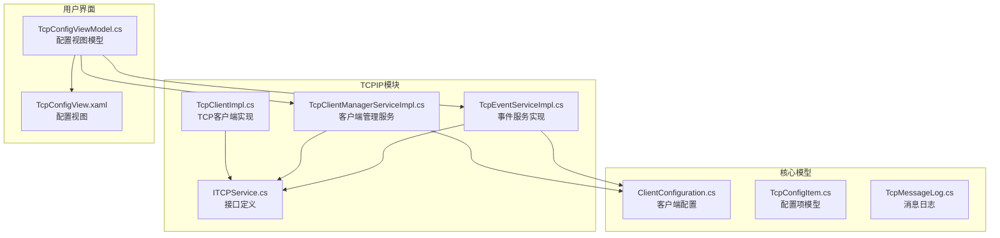
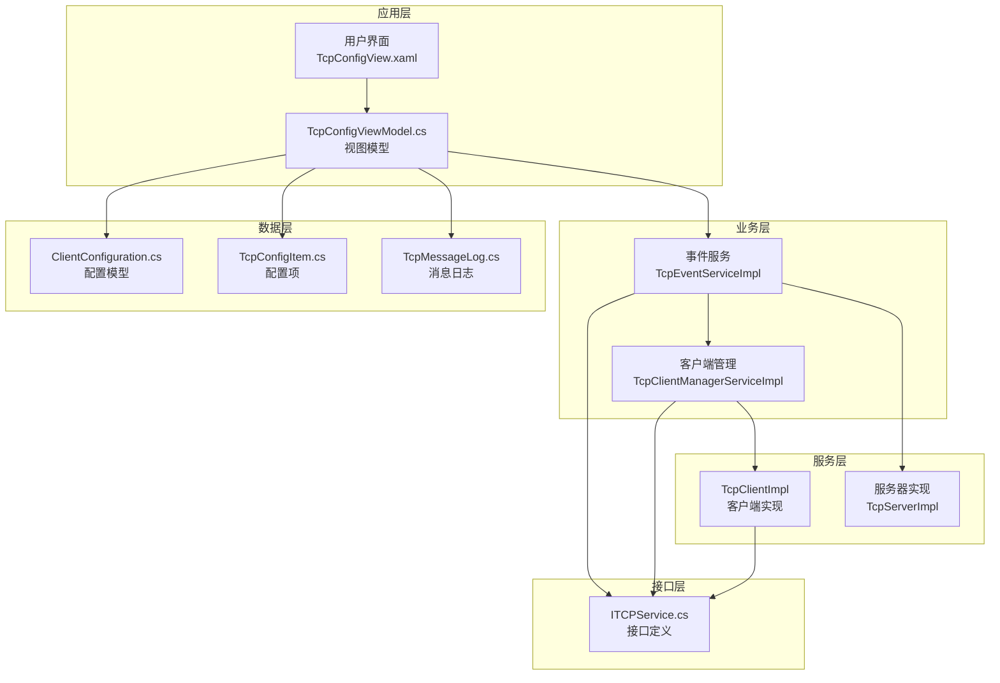
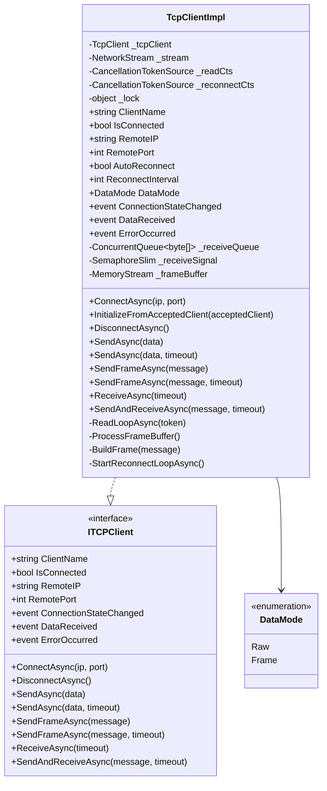
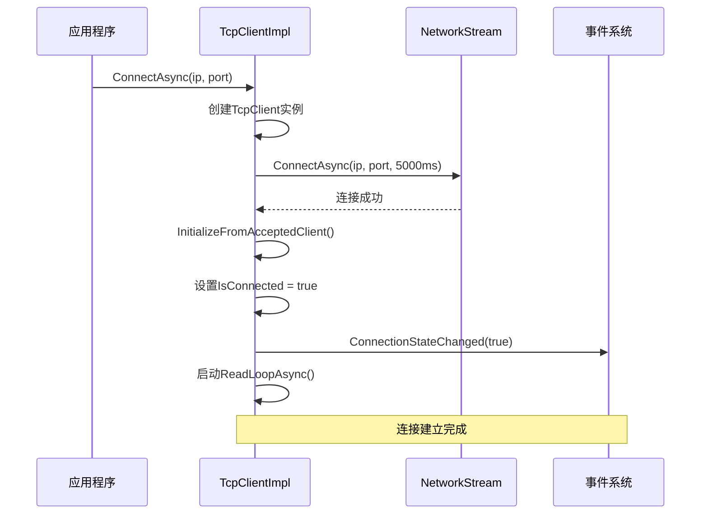
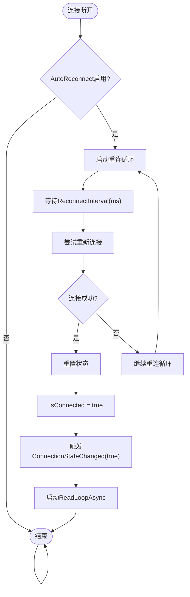
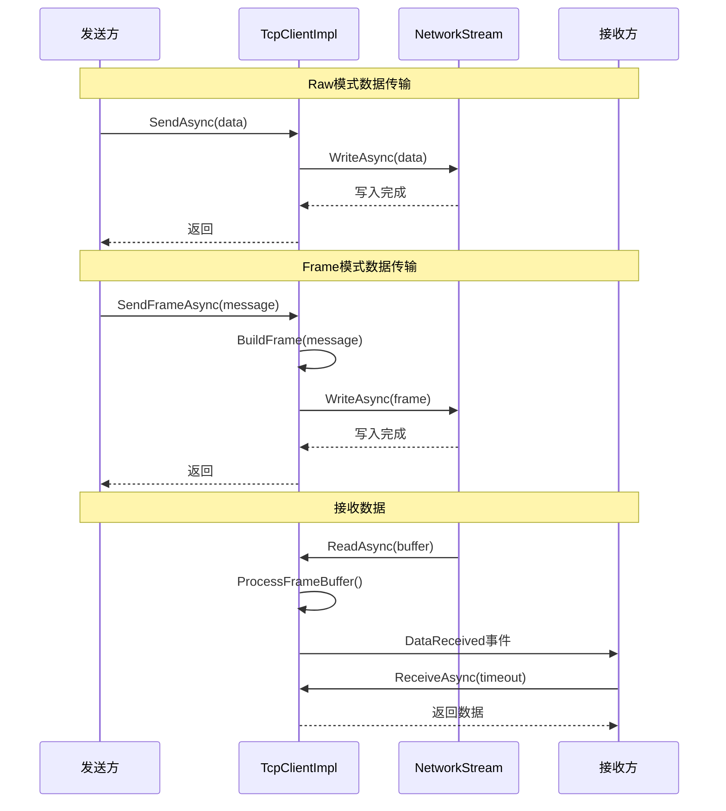
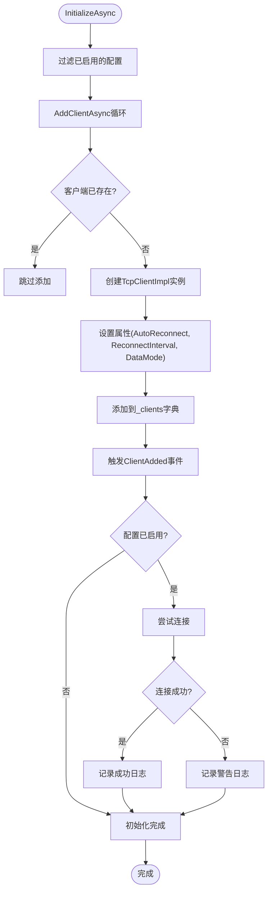
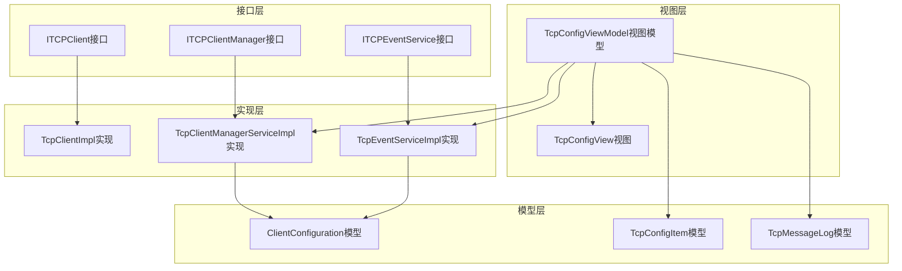
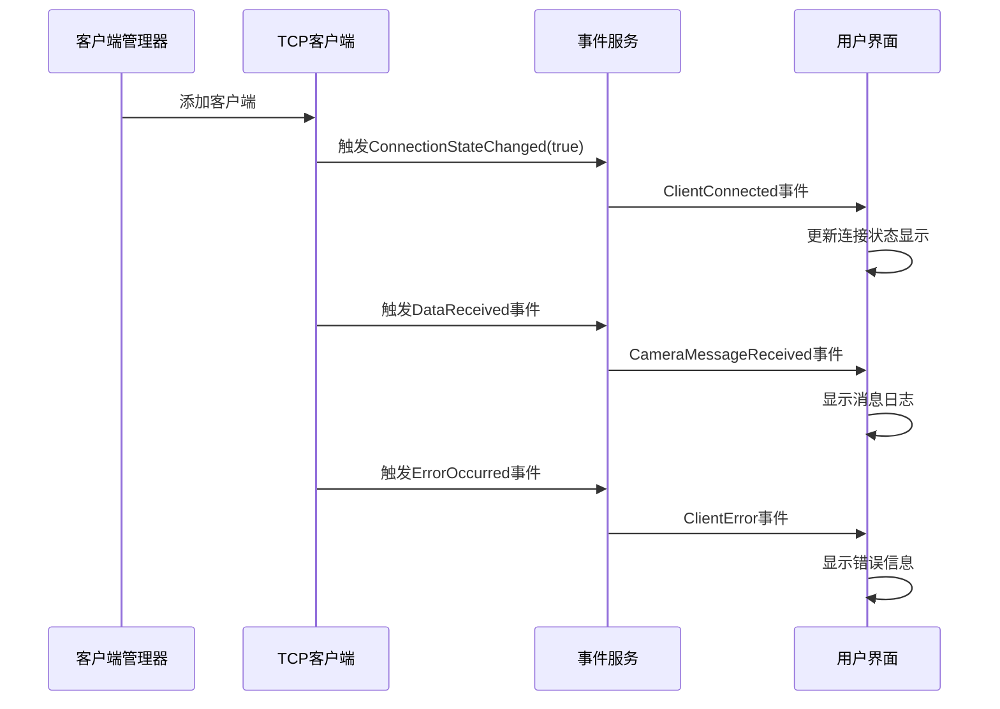

# TCP客户端实现

<cite>
**本文档引用的文件**
- [TcpClientImpl.cs](file://TCPIPModule/Services/TcpClientImpl.cs)
- [TcpClientManagerServiceImpl.cs](file://TCPIPModule/Services/TcpClientManagerServiceImpl.cs)
- [ITCPService.cs](file://TCPIPModule/Interfaces/ITCPService.cs)
- [TcpEventServiceImpl.cs](file://TCPIPModule/Services/TcpEventServiceImpl.cs)
- [TcpConfigViewModel.cs](file://TCPIPModule/ViewModels/TcpConfigViewModel.cs)
- [TcpConfigView.xaml](file://TCPIPModule/Views/TcpConfigView.xaml)
- [ClientConfiguration.cs](file://Core/Models/ClientConfiguration.cs)
- [TcpConfigItem.cs](file://Core/Models/TcpConfigItem.cs)
- [TcpMessageLog.cs](file://Core/Models/TcpMessageLog.cs)
</cite>

## 目录
1. [简介](#简介)
2. [项目结构](#项目结构)
3. [核心组件](#核心组件)
4. [架构概览](#架构概览)
5. [详细组件分析](#详细组件分析)
6. [依赖关系分析](#依赖关系分析)
7. [性能考虑](#性能考虑)
8. [故障排除指南](#故障排除指南)
9. [结论](#结论)
10. [附录](#附录)

## 简介

本文档详细介绍了基于System.Net.Sockets的TCP客户端实现，包括TcpClientImpl类的架构设计、TcpClientManagerServiceImpl的客户端管理功能，以及完整的配置参数、连接超时设置、心跳检测机制。该实现支持两种数据模式（Raw和Frame）、自动重连、并发连接控制、连接状态监控，并提供了完善的异常处理和连接状态通知机制。

## 项目结构

TCPIP模块采用分层架构设计，主要包含以下核心组件：



**图表来源**
- [TcpClientImpl.cs:1-427](file://TCPIPModule/Services/TcpClientImpl.cs#L1-L427)
- [TcpClientManagerServiceImpl.cs:1-138](file://TCPIPModule/Services/TcpClientManagerServiceImpl.cs#L1-L138)
- [ITCPService.cs:1-275](file://TCPIPModule/Interfaces/ITCPService.cs#L1-L275)

**章节来源**
- [TcpClientImpl.cs:1-427](file://TCPIPModule/Services/TcpClientImpl.cs#L1-L427)
- [TcpClientManagerServiceImpl.cs:1-138](file://TCPIPModule/Services/TcpClientManagerServiceImpl.cs#L1-L138)
- [ITCPService.cs:1-275](file://TCPIPModule/Interfaces/ITCPService.cs#L1-L275)

## 核心组件

### TcpClientImpl - TCP客户端核心实现

TcpClientImpl是基于System.Net.Sockets的TCP客户端实现，提供异步连接、自动重连、超时收发等功能。该类实现了ITCPClient接口，支持两种数据模式：

**关键特性：**
- 异步连接和断开连接
- 自动重连机制（可配置间隔）
- 两种数据模式：Raw（原始字节）和Frame（长度前缀帧协议）
- 并发安全的网络流访问
- 事件驱动的状态通知

**数据模式对比：**

| 模式 | 特点 | 适用场景 |
|------|------|----------|
| Raw | 直接收发原始字节，兼容标准TCP设备 | NetAssist、视觉系统等 |
| Frame | 长度前缀帧协议[4字节长度][消息体] | 防止粘包/拆包，标准协议通信 |

**章节来源**
- [TcpClientImpl.cs:12-50](file://TCPIPModule/Services/TcpClientImpl.cs#L12-L50)
- [ITCPService.cs:12-75](file://TCPIPModule/Interfaces/ITCPService.cs#L12-L75)

### TcpClientManagerServiceImpl - 客户端管理服务

TcpClientManagerServiceImpl负责管理多个命名的TCP客户端连接，提供批量初始化、客户端查询、添加移除等管理功能：

**核心功能：**
- 批量初始化客户端（仅连接已启用的客户端）
- 客户端字典管理（ConcurrentDictionary）
- 并发连接控制
- 连接状态监控
- 广播消息发送

**章节来源**
- [TcpClientManagerServiceImpl.cs:13-50](file://TCPIPModule/Services/TcpClientManagerServiceImpl.cs#L13-L50)
- [ITCPService.cs:228-273](file://TCPIPModule/Interfaces/ITCPService.cs#L228-L273)

### TcpEventServiceImpl - 事件服务协调器

TcpEventServiceImpl作为高层协调器，管理多个TCP服务器实例和客户端的生命周期，提供统一的命令发送和响应等待功能：

**高级特性：**
- 多服务器实例并行运行支持
- 连接状态快照和回放机制
- 客户端和服务器模式统一管理
- 报警服务集成

**章节来源**
- [TcpEventServiceImpl.cs:15-84](file://TCPIPModule/Services/TcpEventServiceImpl.cs#L15-L84)
- [ITCPService.cs:126-225](file://TCPIPModule/Interfaces/ITCPService.cs#L126-L225)

## 架构概览

系统采用分层架构，各组件职责明确：



**图表来源**
- [TcpConfigViewModel.cs:14-147](file://TCPIPModule/ViewModels/TcpConfigViewModel.cs#L14-L147)
- [TcpEventServiceImpl.cs:22-84](file://TCPIPModule/Services/TcpEventServiceImpl.cs#L22-L84)
- [TcpClientManagerServiceImpl.cs:17-50](file://TCPIPModule/Services/TcpClientManagerServiceImpl.cs#L17-L50)

## 详细组件分析

### TcpClientImpl 类详细分析

#### 类结构图



**图表来源**
- [TcpClientImpl.cs:19-427](file://TCPIPModule/Services/TcpClientImpl.cs#L19-L427)
- [ITCPService.cs:12-75](file://TCPIPModule/Interfaces/ITCPService.cs#L12-L75)

#### 连接建立流程



**图表来源**
- [TcpClientImpl.cs:79-129](file://TCPIPModule/Services/TcpClientImpl.cs#L79-L129)

#### 断线重连机制



**图表来源**
- [TcpClientImpl.cs:355-393](file://TCPIPModule/Services/TcpClientImpl.cs#L355-L393)

#### 数据收发处理



**图表来源**
- [TcpClientImpl.cs:158-241](file://TCPIPModule/Services/TcpClientImpl.cs#L158-L241)
- [TcpClientImpl.cs:297-340](file://TCPIPModule/Services/TcpClientImpl.cs#L297-L340)

**章节来源**
- [TcpClientImpl.cs:19-427](file://TCPIPModule/Services/TcpClientImpl.cs#L19-L427)

### TcpClientManagerServiceImpl 组件分析

#### 客户端管理流程



**图表来源**
- [TcpClientManagerServiceImpl.cs:42-107](file://TCPIPModule/Services/TcpClientManagerServiceImpl.cs#L42-L107)

**章节来源**
- [TcpClientManagerServiceImpl.cs:17-138](file://TCPIPModule/Services/TcpClientManagerServiceImpl.cs#L17-L138)

### 配置参数详解

#### 客户端配置模型

| 参数名称 | 类型 | 默认值 | 描述 | 用途 |
|----------|------|--------|------|------|
| ClientName | string | "" | 客户端名称 | 唯一标识符 |
| Mode | string | "Client" | 连接模式 | Client/Server |
| IP | string | "127.0.0.1" | 远端IP地址 | 目标服务器地址 |
| Port | int | 8080 | 端口号 | 目标端口 |
| Description | string | "" | 描述信息 | 业务说明 |
| IsEnabled | bool | true | 是否启用 | 运行控制 |
| Timeout | int | 5000 | 超时时间(ms) | 连接/发送超时 |
| Encoding | string | "UTF-8" | 编码方式 | 字符编码 |

**章节来源**
- [ClientConfiguration.cs:12-21](file://Core/Models/ClientConfiguration.cs#L12-L21)
- [TcpConfigItem.cs:6-24](file://Core/Models/TcpConfigItem.cs#L6-L24)

## 依赖关系分析

### 组件依赖图



**图表来源**
- [ITCPService.cs:12-275](file://TCPIPModule/Interfaces/ITCPService.cs#L12-L275)
- [TcpClientImpl.cs:19-427](file://TCPIPModule/Services/TcpClientImpl.cs#L19-L427)
- [TcpClientManagerServiceImpl.cs:17-138](file://TCPIPModule/Services/TcpClientManagerServiceImpl.cs#L17-L138)
- [TcpEventServiceImpl.cs:22-542](file://TCPIPModule/Services/TcpEventServiceImpl.cs#L22-L542)

### 事件依赖关系



**图表来源**
- [TcpEventServiceImpl.cs:449-486](file://TCPIPModule/Services/TcpEventServiceImpl.cs#L449-L486)
- [TcpClientImpl.cs:51-58](file://TCPIPModule/Services/TcpClientImpl.cs#L51-L58)

**章节来源**
- [TcpEventServiceImpl.cs:22-542](file://TCPIPModule/Services/TcpEventServiceImpl.cs#L22-L542)

## 性能考虑

### 内存管理优化

1. **缓冲区复用**：使用8KB固定大小的缓冲区减少内存分配
2. **并发集合**：使用ConcurrentQueue和ConcurrentDictionary提高并发性能
3. **资源释放**：及时释放NetworkStream和TcpClient资源

### 网络性能优化

1. **异步I/O**：全程使用异步方法避免阻塞
2. **超时控制**：连接超时5秒，发送超时可配置
3. **信号量机制**：使用SemaphoreSlim实现高效的等待通知

### 并发控制

1. **锁保护**：关键资源使用lock保护
2. **CancellationToken**：支持取消操作避免资源泄漏
3. **任务隔离**：读写操作分离，互不阻塞

## 故障排除指南

### 常见问题及解决方案

#### 连接失败问题

**症状**：连接超时或连接异常
**可能原因**：
- 目标服务器不可达
- 端口被占用
- 防火墙阻止连接

**解决方案**：
1. 检查网络连通性
2. 验证端口和服务状态
3. 检查防火墙设置

#### 数据接收问题

**症状**：数据接收超时或乱码
**可能原因**：
- 数据模式配置错误
- 缓冲区溢出
- 编码不匹配

**解决方案**：
1. 确认DataMode配置
2. 检查消息长度限制
3. 验证字符编码设置

#### 自动重连问题

**症状**：重连循环异常终止
**可能原因**：
- 重连间隔过短
- 目标服务器持续不可达
- 资源泄漏

**解决方案**：
1. 调整ReconnectInterval
2. 检查服务器状态
3. 监控内存使用情况

**章节来源**
- [TcpClientImpl.cs:84-101](file://TCPIPModule/Services/TcpClientImpl.cs#L84-L101)
- [TcpClientImpl.cs:310-315](file://TCPIPModule/Services/TcpClientImpl.cs#L310-L315)

## 结论

该TCP客户端实现提供了完整的工业级通信解决方案，具有以下优势：

1. **架构清晰**：分层设计，职责明确
2. **功能完整**：支持多种数据模式和连接管理
3. **性能优秀**：异步I/O和并发优化
4. **易于扩展**：接口设计便于功能扩展
5. **监控完善**：全面的事件通知和日志记录

建议在生产环境中：
- 合理配置重连间隔和超时参数
- 实施适当的错误处理和告警机制
- 定期监控连接状态和性能指标
- 根据实际需求调整缓冲区大小和并发策略

## 附录

### 使用示例

#### 基本客户端使用

```csharp
// 创建客户端实例
var client = new TcpClientImpl("Camera1");

// 配置连接参数
client.AutoReconnect = true;
client.ReconnectInterval = 3000;
client.DataMode = DataMode.Frame;

// 连接到服务器
await client.ConnectAsync("192.168.1.100", 8080);

// 发送消息
await client.SendFrameAsync("START");

// 接收响应
var response = await client.ReceiveAsync(5000);
```

#### 客户端管理使用

```csharp
// 创建管理器
var manager = new TcpClientManagerServiceImpl(logger);

// 批量初始化
await manager.InitializeAsync(configurations);

// 获取客户端
var client = manager.GetClient("Camera1");

// 广播消息
await manager.BroadcastAsync(Encoding.UTF8.GetBytes("BROADCAST"));
```

#### 事件服务使用

```csharp
// 创建事件服务
var eventService = new TcpEventServiceImpl(manager, logger);

// 初始化
eventService.Initialize();

// 发送命令
var success = await eventService.SendCommandAsync("Camera1", "STATUS");
```

### 最佳实践

1. **配置管理**：使用配置文件集中管理连接参数
2. **错误处理**：实现完善的异常捕获和恢复机制
3. **资源管理**：及时释放网络资源，避免内存泄漏
4. **监控告警**：建立连接状态监控和异常告警机制
5. **性能调优**：根据实际负载调整缓冲区大小和超时参数
6. **安全考虑**：实施必要的网络安全措施和身份验证