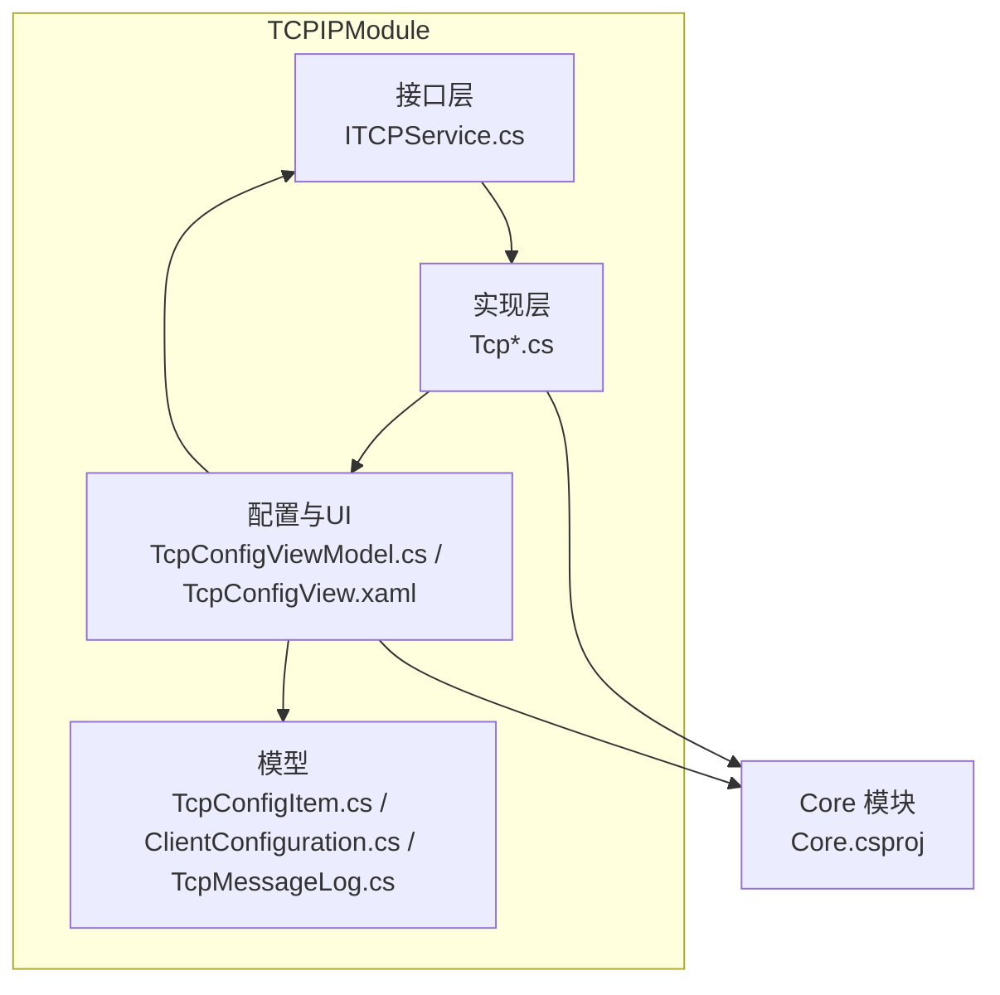
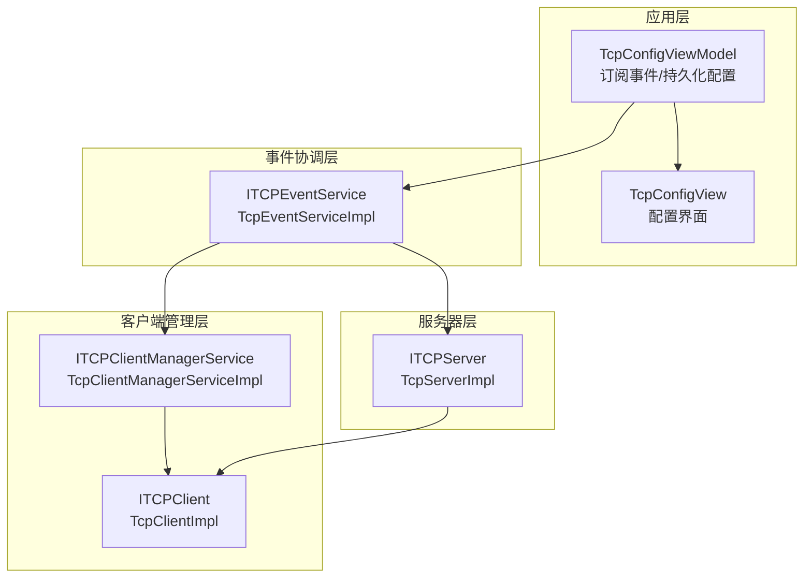
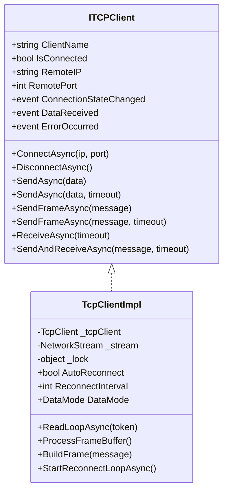
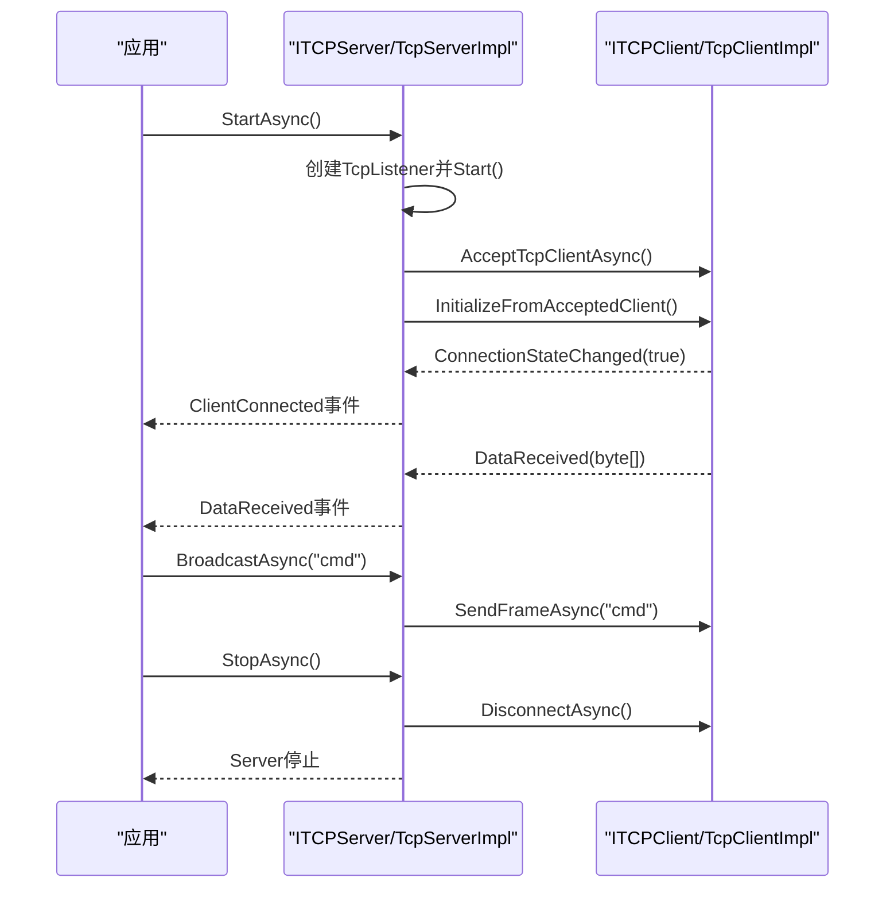
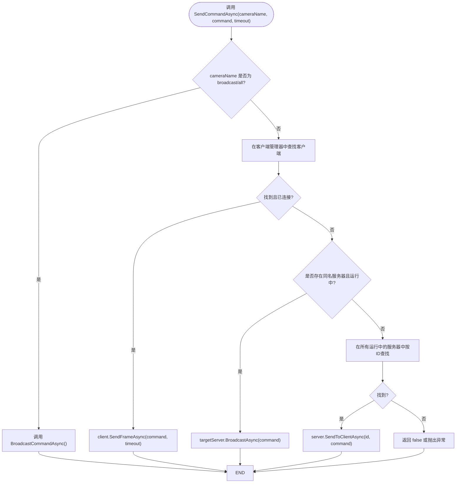
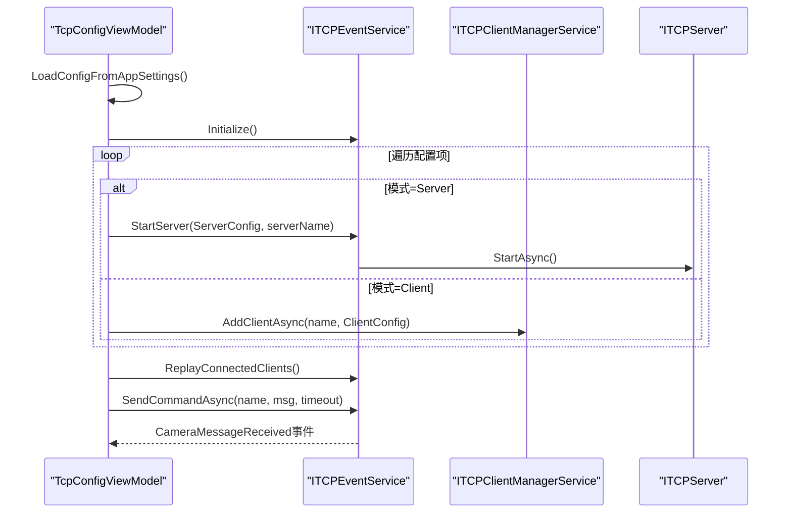
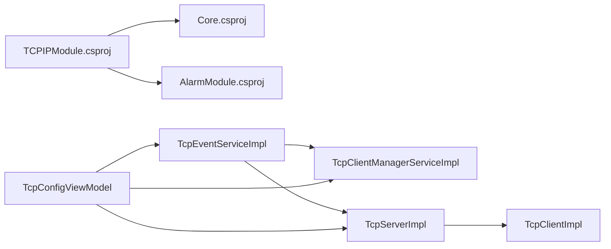

# TCP接口设计规范

<cite>
**本文引用的文件**
- [ITCPService.cs](file://TCPIPModule/Interfaces/ITCPService.cs)
- [TcpClientImpl.cs](file://TCPIPModule/Services/TcpClientImpl.cs)
- [TcpServerImpl.cs](file://TCPIPModule/Services/TcpServerImpl.cs)
- [TcpClientManagerServiceImpl.cs](file://TCPIPModule/Services/TcpClientManagerServiceImpl.cs)
- [TcpEventServiceImpl.cs](file://TCPIPModule/Services/TcpEventServiceImpl.cs)
- [TcpConfigViewModel.cs](file://TCPIPModule/ViewModels/TcpConfigViewModel.cs)
- [TcpConfigView.xaml](file://TCPIPModule/Views/TcpConfigView.xaml)
- [TcpConfigItem.cs](file://Core/Models/TcpConfigItem.cs)
- [ClientConfiguration.cs](file://Core/Models/ClientConfiguration.cs)
- [TcpMessageLog.cs](file://Core/Models/TcpMessageLog.cs)
- [TCPIPModule.csproj](file://TCPIPModule/TCPIPModule.csproj)
</cite>

## 目录
1. [引言](#引言)
2. [项目结构](#项目结构)
3. [核心组件](#核心组件)
4. [架构总览](#架构总览)
5. [详细组件分析](#详细组件分析)
6. [依赖关系分析](#依赖关系分析)
7. [性能考量](#性能考量)
8. [故障排查指南](#故障排查指南)
9. [结论](#结论)
10. [附录](#附录)

## 引言
本规范面向TCPIPModule模块的TCP接口设计，围绕ITCPService接口族（ITCPClient、ITCPServer、ITCPEventService、ITCPClientManagerService）进行系统化说明，涵盖接口方法定义、参数与返回值约定、扩展性与协议适配机制、配置集成方式、最佳实践（异常处理、性能优化、线程安全）、以及使用示例与集成指导。文档同时结合实现类与UI配置视图，帮助开发者快速理解并正确使用TCP通信能力。

## 项目结构
TCPIPModule模块采用清晰的分层与职责分离：
- 接口层：定义ITCPService.cs中的ITCPClient、ITCPServer、ITCPEventService、ITCPClientManagerService等接口契约
- 实现层：TcpClientImpl.cs、TcpServerImpl.cs、TcpClientManagerServiceImpl.cs、TcpEventServiceImpl.cs提供具体实现
- 配置与UI：TcpConfigViewModel.cs与TcpConfigView.xaml负责配置持久化、可视化管理与消息日志展示
- 模型：Core/Models中的TcpConfigItem.cs、ClientConfiguration.cs、TcpMessageLog.cs承载配置与日志数据结构

图表来源
- [ITCPService.cs:1-275](file://TCPIPModule/Interfaces/ITCPService.cs#L1-L275)
- [TcpClientImpl.cs:1-427](file://TCPIPModule/Services/TcpClientImpl.cs#L1-L427)
- [TcpServerImpl.cs:1-222](file://TCPIPModule/Services/TcpServerImpl.cs#L1-L222)
- [TcpClientManagerServiceImpl.cs:1-138](file://TCPIPModule/Services/TcpClientManagerServiceImpl.cs#L1-L138)
- [TcpEventServiceImpl.cs:1-542](file://TCPIPModule/Services/TcpEventServiceImpl.cs#L1-L542)
- [TcpConfigViewModel.cs:1-425](file://TCPIPModule/ViewModels/TcpConfigViewModel.cs#L1-L425)
- [TcpConfigView.xaml:1-371](file://TCPIPModule/Views/TcpConfigView.xaml#L1-L371)
- [TcpConfigItem.cs:1-26](file://Core/Models/TcpConfigItem.cs#L1-L26)
- [ClientConfiguration.cs:1-23](file://Core/Models/ClientConfiguration.cs#L1-L23)
- [TcpMessageLog.cs:1-29](file://Core/Models/TcpMessageLog.cs#L1-L29)
- [TCPIPModule.csproj:1-17](file://TCPIPModule/TCPIPModule.csproj#L1-L17)

章节来源
- [ITCPService.cs:1-275](file://TCPIPModule/Interfaces/ITCPService.cs#L1-L275)
- [TcpClientImpl.cs:1-427](file://TCPIPModule/Services/TcpClientImpl.cs#L1-L427)
- [TcpServerImpl.cs:1-222](file://TCPIPModule/Services/TcpServerImpl.cs#L1-L222)
- [TcpClientManagerServiceImpl.cs:1-138](file://TCPIPModule/Services/TcpClientManagerServiceImpl.cs#L1-L138)
- [TcpEventServiceImpl.cs:1-542](file://TCPIPModule/Services/TcpEventServiceImpl.cs#L1-L542)
- [TcpConfigViewModel.cs:1-425](file://TCPIPModule/ViewModels/TcpConfigViewModel.cs#L1-L425)
- [TcpConfigView.xaml:1-371](file://TCPIPModule/Views/TcpConfigView.xaml#L1-L371)
- [TcpConfigItem.cs:1-26](file://Core/Models/TcpConfigItem.cs#L1-L26)
- [ClientConfiguration.cs:1-23](file://Core/Models/ClientConfiguration.cs#L1-L23)
- [TcpMessageLog.cs:1-29](file://Core/Models/TcpMessageLog.cs#L1-L29)
- [TCPIPModule.csproj:1-17](file://TCPIPModule/TCPIPModule.csproj#L1-L17)

## 核心组件
本模块的核心接口与实现如下：
- ITCPClient：封装TCP客户端的异步连接、发送、接收与事件通知，支持Raw与Frame两种数据模式
- ITCPServer：封装TCP服务器的监听、客户端管理、广播与定向发送
- ITCPEventService：高层命令协调器，统一管理Client与Server两类连接，提供命令发送/响应等待、事件回放与报警上报
- ITCPClientManagerService：多客户端管理器，负责批量初始化、增删与广播

章节来源
- [ITCPService.cs:12-274](file://TCPIPModule/Interfaces/ITCPService.cs#L12-L274)
- [TcpClientImpl.cs:19-426](file://TCPIPModule/Services/TcpClientImpl.cs#L19-L426)
- [TcpServerImpl.cs:19-221](file://TCPIPModule/Services/TcpServerImpl.cs#L19-L221)
- [TcpClientManagerServiceImpl.cs:17-138](file://TCPIPModule/Services/TcpClientManagerServiceImpl.cs#L17-L138)
- [TcpEventServiceImpl.cs:22-542](file://TCPIPModule/Services/TcpEventServiceImpl.cs#L22-L542)

## 架构总览
整体架构以接口为中心，实现类解耦于上层业务，通过事件与异步任务协同工作。UI层通过TcpConfigViewModel订阅事件，实时展示消息与连接状态；配置通过IAppSettingService持久化至appsettings.json。

图表来源
- [TcpConfigViewModel.cs:117-147](file://TCPIPModule/ViewModels/TcpConfigViewModel.cs#L117-L147)
- [TcpEventServiceImpl.cs:68-84](file://TCPIPModule/Services/TcpEventServiceImpl.cs#L68-L84)
- [TcpClientManagerServiceImpl.cs:17-50](file://TCPIPModule/Services/TcpClientManagerServiceImpl.cs#L17-L50)
- [TcpServerImpl.cs:19-77](file://TCPIPModule/Services/TcpServerImpl.cs#L19-L77)
- [TcpClientImpl.cs:19-79](file://TCPIPModule/Services/TcpClientImpl.cs#L19-L79)

## 详细组件分析

### ITCPClient 接口与实现
- 方法与约定
  - 连接与断开：ConnectAsync、DisconnectAsync
  - 发送：SendAsync(byte[])、SendAsync(byte[], int超时)、SendFrameAsync(string)、SendFrameAsync(string, int超时)
  - 接收：ReceiveAsync(int超时)、SendAndReceiveAsync(string, int超时)
  - 事件：ConnectionStateChanged、DataReceived、ErrorOccurred
  - 属性：ClientName、IsConnected、RemoteIP、RemotePort
- 数据模式
  - Raw：直接收发字节，兼容标准TCP设备
  - Frame：长度前缀帧协议[4字节长度][消息体]，防粘包/拆包
- 扩展性
  - 通过DataMode切换协议，无需修改调用方代码
  - AutoReconnect与ReconnectInterval支持自动重连策略
- 线程安全
  - 内部使用锁对象保护共享资源，读写循环独立，避免竞态
- 性能
  - 读循环使用8KB缓冲区，帧模式使用MemoryStream累积与解析
  - 接收队列采用并发队列，配合信号量实现高效等待

图表来源
- [ITCPService.cs:12-75](file://TCPIPModule/Interfaces/ITCPService.cs#L12-L75)
- [TcpClientImpl.cs:19-426](file://TCPIPModule/Services/TcpClientImpl.cs#L19-L426)

章节来源
- [ITCPService.cs:12-75](file://TCPIPModule/Interfaces/ITCPService.cs#L12-L75)
- [TcpClientImpl.cs:19-153](file://TCPIPModule/Services/TcpClientImpl.cs#L19-L153)
- [TcpClientImpl.cs:155-241](file://TCPIPModule/Services/TcpClientImpl.cs#L155-L241)
- [TcpClientImpl.cs:248-295](file://TCPIPModule/Services/TcpClientImpl.cs#L248-L295)
- [TcpClientImpl.cs:297-353](file://TCPIPModule/Services/TcpClientImpl.cs#L297-L353)
- [TcpClientImpl.cs:355-393](file://TCPIPModule/Services/TcpClientImpl.cs#L355-L393)

### ITCPServer 接口与实现
- 方法与约定
  - 启动/停止：StartAsync、StopAsync
  - 广播/定向：BroadcastAsync(string)、SendToClientAsync(string, string)
  - 查询：GetConnectedClients()
  - 事件：ClientConnected、ClientDisconnected、ServerError、DataReceived
- 实现要点
  - 使用TcpListener监听，AcceptTcpClientAsync接入客户端
  - 通过TcpClientImpl的InitializeFromAcceptedClient启动读循环
  - 维护已连接客户端集合，支持Raw/Frame模式一致化处理
- 协议适配
  - DataMode属性统一控制服务器侧发送行为（Raw直发、Frame加帧头）

图表来源
- [ITCPService.cs:80-124](file://TCPIPModule/Interfaces/ITCPService.cs#L80-L124)
- [TcpServerImpl.cs:57-99](file://TCPIPModule/Services/TcpServerImpl.cs#L57-L99)
- [TcpServerImpl.cs:148-198](file://TCPIPModule/Services/TcpServerImpl.cs#L148-L198)
- [TcpClientImpl.cs:108-129](file://TCPIPModule/Services/TcpClientImpl.cs#L108-L129)

章节来源
- [ITCPService.cs:80-124](file://TCPIPModule/Interfaces/ITCPService.cs#L80-L124)
- [TcpServerImpl.cs:19-77](file://TCPIPModule/Services/TcpServerImpl.cs#L19-L77)
- [TcpServerImpl.cs:79-99](file://TCPIPModule/Services/TcpServerImpl.cs#L79-L99)
- [TcpServerImpl.cs:101-133](file://TCPIPModule/Services/TcpServerImpl.cs#L101-L133)
- [TcpServerImpl.cs:135-141](file://TCPIPModule/Services/TcpServerImpl.cs#L135-L141)
- [TcpServerImpl.cs:148-198](file://TCPIPModule/Services/TcpServerImpl.cs#L148-L198)

### ITCPEventService 接口与实现
- 职责
  - 统一管理多个服务器实例与客户端，提供命令路由：Client模式直连、Server模式广播或定向
  - 提供命令发送与响应等待（含超时与错误事件）
  - 事件回放：ReplayConnectedClients解决订阅早于上线导致的日志丢失
  - 报警上报：触发掉线与通讯异常报警
- 路由逻辑
  - SendCommandAsync优先匹配客户端管理器中的客户端
  - 其次匹配服务器名称，向该服务器广播
  - 否则在所有服务器中按客户端标识定向发送
- Server模式响应等待
  - 通过订阅CameraMessageReceived事件，基于TaskCompletionSource等待指定超时

图表来源
- [ITCPService.cs:130-225](file://TCPIPModule/Interfaces/ITCPService.cs#L130-L225)
- [TcpEventServiceImpl.cs:287-332](file://TCPIPModule/Services/TcpEventServiceImpl.cs#L287-L332)

章节来源
- [ITCPService.cs:130-225](file://TCPIPModule/Interfaces/ITCPService.cs#L130-L225)
- [TcpEventServiceImpl.cs:22-84](file://TCPIPModule/Services/TcpEventServiceImpl.cs#L22-L84)
- [TcpEventServiceImpl.cs:86-163](file://TCPIPModule/Services/TcpEventServiceImpl.cs#L86-L163)
- [TcpEventServiceImpl.cs:287-332](file://TCPIPModule/Services/TcpEventServiceImpl.cs#L287-L332)
- [TcpEventServiceImpl.cs:334-383](file://TCPIPModule/Services/TcpEventServiceImpl.cs#L334-L383)
- [TcpEventServiceImpl.cs:385-430](file://TCPIPModule/Services/TcpEventServiceImpl.cs#L385-L430)
- [TcpEventServiceImpl.cs:489-507](file://TCPIPModule/Services/TcpEventServiceImpl.cs#L489-L507)

### ITCPClientManagerService 接口与实现
- 职责
  - 批量初始化客户端（仅启用项）
  - 动态增删客户端，自动重连策略
  - 对所有已连接客户端广播数据（使用帧协议）
- 集成点
  - 与ITCPEventService协作，作为Client模式的底层支撑

章节来源
- [ITCPService.cs:230-274](file://TCPIPModule/Interfaces/ITCPService.cs#L230-L274)
- [TcpClientManagerServiceImpl.cs:17-50](file://TCPIPModule/Services/TcpClientManagerServiceImpl.cs#L17-L50)
- [TcpClientManagerServiceImpl.cs:75-107](file://TCPIPModule/Services/TcpClientManagerServiceImpl.cs#L75-L107)
- [TcpClientManagerServiceImpl.cs:112-123](file://TCPIPModule/Services/TcpClientManagerServiceImpl.cs#L112-L123)
- [TcpClientManagerServiceImpl.cs:128-135](file://TCPIPModule/Services/TcpClientManagerServiceImpl.cs#L128-L135)

### 配置与UI集成
- 配置模型
  - TcpConfigItem：连接名称、模式、IP、端口、超时、编码、启用、描述
  - ClientConfiguration：客户端配置（含模式、IP、端口、启用、描述）
  - TcpMessageLog：消息日志（方向、客户端名、消息、时间戳）
- UI与服务
  - TcpConfigViewModel订阅ITCPEventService事件，实时记录消息日志
  - 保存配置时根据模式启动服务器或创建客户端
  - 支持测试连接、发送自定义消息、清空日志

图表来源
- [TcpConfigViewModel.cs:239-317](file://TCPIPModule/ViewModels/TcpConfigViewModel.cs#L239-L317)
- [TcpConfigViewModel.cs:323-354](file://TCPIPModule/ViewModels/TcpConfigViewModel.cs#L323-L354)
- [TcpConfigViewModel.cs:361-381](file://TCPIPModule/ViewModels/TcpConfigViewModel.cs#L361-L381)
- [TcpEventServiceImpl.cs:78-84](file://TCPIPModule/Services/TcpEventServiceImpl.cs#L78-L84)
- [TcpEventServiceImpl.cs:493-507](file://TCPIPModule/Services/TcpEventServiceImpl.cs#L493-L507)

章节来源
- [TcpConfigItem.cs:1-26](file://Core/Models/TcpConfigItem.cs#L1-L26)
- [ClientConfiguration.cs:1-23](file://Core/Models/ClientConfiguration.cs#L1-L23)
- [TcpMessageLog.cs:1-29](file://Core/Models/TcpMessageLog.cs#L1-L29)
- [TcpConfigViewModel.cs:117-147](file://TCPIPModule/ViewModels/TcpConfigViewModel.cs#L117-L147)
- [TcpConfigViewModel.cs:239-317](file://TCPIPModule/ViewModels/TcpConfigViewModel.cs#L239-L317)
- [TcpConfigViewModel.cs:323-354](file://TCPIPModule/ViewModels/TcpConfigViewModel.cs#L323-L354)
- [TcpConfigViewModel.cs:361-381](file://TCPIPModule/ViewModels/TcpConfigViewModel.cs#L361-L381)

## 依赖关系分析
- 模块依赖
  - TCPIPModule.csproj引用Core与AlarmModule，确保日志与报警能力
- 内部依赖
  - TcpEventServiceImpl依赖ITCPClientManagerService与ITCPServer
  - TcpServerImpl依赖TcpClientImpl以复用读写循环
  - TcpConfigViewModel依赖IAppSettingService、ITCPEventService与ILoggerService

图表来源
- [TCPIPModule.csproj:12-15](file://TCPIPModule/TCPIPModule.csproj#L12-L15)
- [TcpEventServiceImpl.cs:24-27](file://TCPIPModule/Services/TcpEventServiceImpl.cs#L24-L27)
- [TcpServerImpl.cs:19-25](file://TCPIPModule/Services/TcpServerImpl.cs#L19-L25)
- [TcpClientImpl.cs:19-25](file://TCPIPModule/Services/TcpClientImpl.cs#L19-L25)
- [TcpConfigViewModel.cs:21-24](file://TCPIPModule/ViewModels/TcpConfigViewModel.cs#L21-L24)

章节来源
- [TCPIPModule.csproj:12-15](file://TCPIPModule/TCPIPModule.csproj#L12-L15)
- [TcpEventServiceImpl.cs:24-27](file://TCPIPModule/Services/TcpEventServiceImpl.cs#L24-L27)
- [TcpServerImpl.cs:19-25](file://TCPIPModule/Services/TcpServerImpl.cs#L19-L25)
- [TcpClientImpl.cs:19-25](file://TCPIPModule/Services/TcpClientImpl.cs#L19-L25)
- [TcpConfigViewModel.cs:21-24](file://TCPIPModule/ViewModels/TcpConfigViewModel.cs#L21-L24)

## 性能考量
- 连接与重连
  - 连接超时：客户端连接默认5秒超时，避免阻塞
  - 自动重连：断线后按ReconnectInterval间隔重试，降低人工干预
- 读写与缓冲
  - 读循环使用8KB缓冲区，减少系统调用次数
  - 帧模式使用MemoryStream累积，避免频繁分配
- 广播与并发
  - 广播采用Task.WhenAll并行发送，提升吞吐
  - 并发集合与信号量保证高并发下的稳定性
- UI与日志
  - 日志列表限制最大条数，避免内存膨胀
  - UI更新通过Dispatcher在主线程执行，保证线程安全

章节来源
- [TcpClientImpl.cs:79-102](file://TCPIPModule/Services/TcpClientImpl.cs#L79-L102)
- [TcpClientImpl.cs:248-295](file://TCPIPModule/Services/TcpClientImpl.cs#L248-L295)
- [TcpClientImpl.cs:297-353](file://TCPIPModule/Services/TcpClientImpl.cs#L297-L353)
- [TcpEventServiceImpl.cs:244-278](file://TCPIPModule/Services/TcpEventServiceImpl.cs#L244-L278)
- [TcpConfigViewModel.cs:174-190](file://TCPIPModule/ViewModels/TcpConfigViewModel.cs#L174-L190)

## 故障排查指南
- 常见问题与定位
  - 连接失败：检查IP/端口、防火墙、目标设备在线状态；查看ErrorOccurred事件与日志
  - 发送超时：调整timeout参数，确认对端是否正确处理帧协议
  - 掉线报警：关注Server模式下的断开事件与报警上报
  - 事件丢失：确保在SubscribeTcpEvents()后再调用ReplayConnectedClients()
- 建议流程
  - 使用TcpConfigViewModel的“测试连接”功能验证配置
  - 查看消息日志，区分发送/接收/系统三类日志
  - 在ITCPEventService层设置断点，观察命令路由与响应等待

章节来源
- [TcpEventServiceImpl.cs:148-153](file://TCPIPModule/Services/TcpEventServiceImpl.cs#L148-L153)
- [TcpEventServiceImpl.cs:493-507](file://TCPIPModule/Services/TcpEventServiceImpl.cs#L493-L507)
- [TcpConfigViewModel.cs:323-354](file://TCPIPModule/ViewModels/TcpConfigViewModel.cs#L323-L354)
- [TcpConfigViewModel.cs:152-161](file://TCPIPModule/ViewModels/TcpConfigViewModel.cs#L152-L161)

## 结论
本TCP接口设计以清晰的接口分层与实现解耦为核心，通过Raw/Frame双协议模式满足多样通信需求，并以事件驱动与异步任务实现高性能与可扩展性。配置与UI层提供完善的可视化管理与日志展示，便于快速集成与运维。遵循本文规范可在保证线程安全与性能的前提下，稳定地扩展到多服务器与多客户端场景。

## 附录

### 接口方法与参数规范速查
- ITCPClient
  - ConnectAsync(ip, port)：异步连接
  - DisconnectAsync()：断开
  - SendAsync(data) / SendAsync(data, timeout)：发送字节
  - SendFrameAsync(message) / SendFrameAsync(message, timeout)：发送帧
  - ReceiveAsync(timeout)：等待接收
  - SendAndReceiveAsync(message, timeout)：请求-响应
- ITCPServer
  - StartAsync() / StopAsync()：启动/停止
  - BroadcastAsync(message) / SendToClientAsync(id, message)：广播/定向
  - GetConnectedClients()：查询
- ITCPEventService
  - StartServer(ServerConfiguration, serverName) / StopServer(serverName)
  - AddClient/AddClientAsync / RemoveClient
  - BroadcastCommandAsync / SendCommandAsync / SendCommandWithResponseAsync
  - ReplayConnectedClients()

章节来源
- [ITCPService.cs:12-274](file://TCPIPModule/Interfaces/ITCPService.cs#L12-L274)