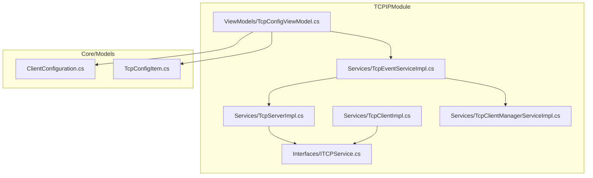
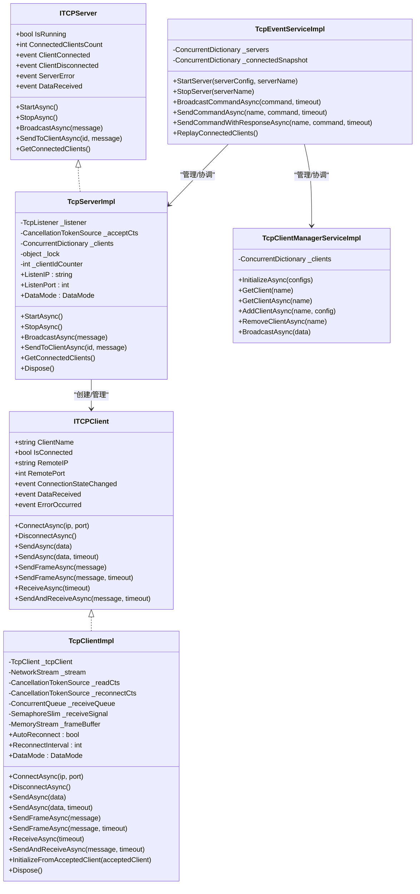
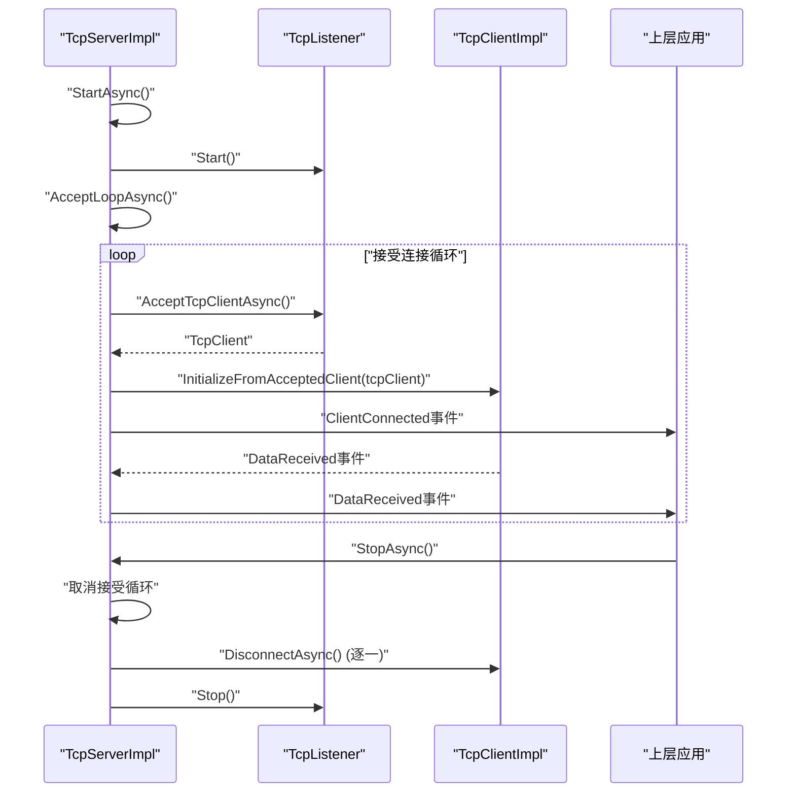
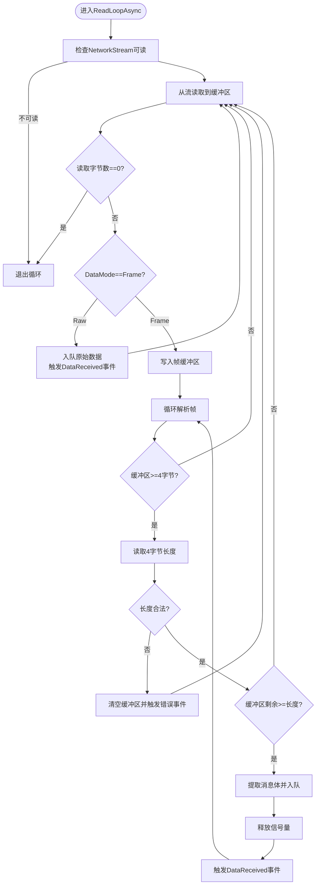
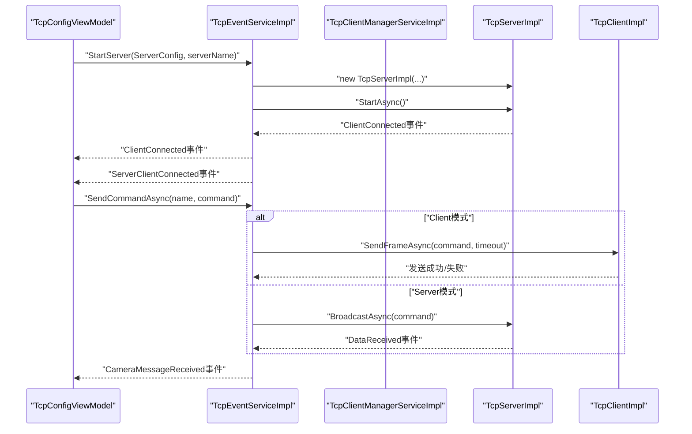
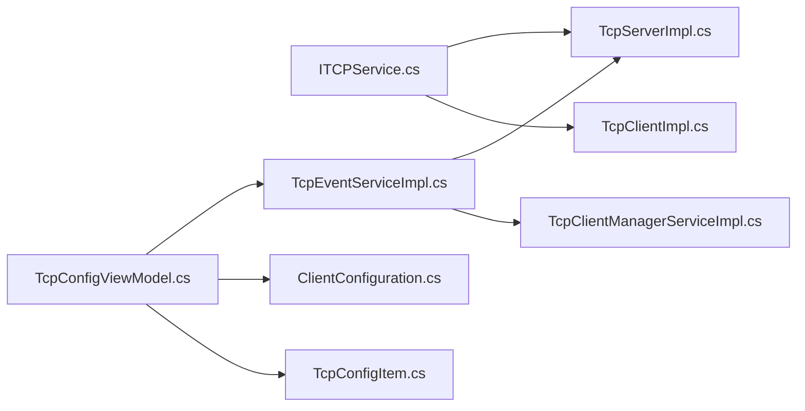

# TCP服务器实现

<cite>
**本文引用的文件**
- [TcpServerImpl.cs](file://TCPIPModule/Services/TcpServerImpl.cs)
- [ITCPService.cs](file://TCPIPModule/Interfaces/ITCPService.cs)
- [TcpClientImpl.cs](file://TCPIPModule/Services/TcpClientImpl.cs)
- [TcpEventServiceImpl.cs](file://TCPIPModule/Services/TcpEventServiceImpl.cs)
- [TcpClientManagerServiceImpl.cs](file://TCPIPModule/Services/TcpClientManagerServiceImpl.cs)
- [TcpConfigViewModel.cs](file://TCPIPModule/ViewModels/TcpConfigViewModel.cs)
- [ClientConfiguration.cs](file://Core/Models/ClientConfiguration.cs)
- [TcpConfigItem.cs](file://Core/Models/TcpConfigItem.cs)
</cite>

## 目录
1. [简介](#简介)
2. [项目结构](#项目结构)
3. [核心组件](#核心组件)
4. [架构总览](#架构总览)
5. [详细组件分析](#详细组件分析)
6. [依赖关系分析](#依赖关系分析)
7. [性能考虑](#性能考虑)
8. [故障排查指南](#故障排查指南)
9. [结论](#结论)
10. [附录](#附录)

## 简介
本文件面向TCPIPModule模块中的TCP服务器实现，围绕TcpServerImpl类展开，系统性解析其设计架构与实现细节，涵盖以下主题：
- 服务器启动流程与端口监听机制
- 客户端连接管理与事件驱动模型
- Socket编程实现与异步数据收发
- 连接池管理策略与并发控制
- 服务器配置参数、最大连接数限制与超时处理机制
- 服务器状态监控、异常处理与资源释放
- 实际代码示例路径，展示服务器初始化、连接建立、数据传输的完整流程

## 项目结构
TCPIPModule模块中与TCP服务器实现相关的关键文件如下图所示：

**图表来源**
- [TcpServerImpl.cs:1-222](file://TCPIPModule/Services/TcpServerImpl.cs#L1-L222)
- [ITCPService.cs:1-275](file://TCPIPModule/Interfaces/ITCPService.cs#L1-L275)
- [TcpClientImpl.cs:1-427](file://TCPIPModule/Services/TcpClientImpl.cs#L1-L427)
- [TcpEventServiceImpl.cs:1-542](file://TCPIPModule/Services/TcpEventServiceImpl.cs#L1-L542)
- [TcpClientManagerServiceImpl.cs:1-138](file://TCPIPModule/Services/TcpClientManagerServiceImpl.cs#L1-L138)
- [TcpConfigViewModel.cs:1-425](file://TCPIPModule/ViewModels/TcpConfigViewModel.cs#L1-L425)
- [ClientConfiguration.cs:1-23](file://Core/Models/ClientConfiguration.cs#L1-L23)
- [TcpConfigItem.cs:1-26](file://Core/Models/TcpConfigItem.cs#L1-L26)

**章节来源**
- [TcpServerImpl.cs:1-222](file://TCPIPModule/Services/TcpServerImpl.cs#L1-L222)
- [ITCPService.cs:1-275](file://TCPIPModule/Interfaces/ITCPService.cs#L1-L275)
- [TcpClientImpl.cs:1-427](file://TCPIPModule/Services/TcpClientImpl.cs#L1-L427)
- [TcpEventServiceImpl.cs:1-542](file://TCPIPModule/Services/TcpEventServiceImpl.cs#L1-L542)
- [TcpClientManagerServiceImpl.cs:1-138](file://TCPIPModule/Services/TcpClientManagerServiceImpl.cs#L1-L138)
- [TcpConfigViewModel.cs:1-425](file://TCPIPModule/ViewModels/TcpConfigViewModel.cs#L1-L425)
- [ClientConfiguration.cs:1-23](file://Core/Models/ClientConfiguration.cs#L1-L23)
- [TcpConfigItem.cs:1-26](file://Core/Models/TcpConfigItem.cs#L1-L26)

## 核心组件
- TcpServerImpl：基于System.Net.Sockets的TCP服务器实现，负责监听端口、接受连接、管理客户端集合、广播与定向发送、事件分发与异常上报。
- ITCPClient/ITCPServer接口族：定义客户端与服务器统一抽象，支持Raw/Frame两种数据模式、异步连接/断开、超时收发、事件驱动。
- TcpClientImpl：TCP客户端实现，支持自动重连、异步读写、帧协议解析、接收队列与信号量。
- TcpEventServiceImpl：高层事件服务，协调多服务器实例与客户端生命周期，提供命令发送/响应等待、回放连接状态、报警上报等能力。
- TcpClientManagerServiceImpl：客户端管理服务，集中管理命名客户端、批量初始化、广播数据。
- TcpConfigViewModel：配置视图模型，负责UI配置项的增删改查、保存与测试、消息日志记录与展示。

**章节来源**
- [TcpServerImpl.cs:19-222](file://TCPIPModule/Services/TcpServerImpl.cs#L19-L222)
- [ITCPService.cs:12-124](file://TCPIPModule/Interfaces/ITCPService.cs#L12-L124)
- [TcpClientImpl.cs:19-427](file://TCPIPModule/Services/TcpClientImpl.cs#L19-L427)
- [TcpEventServiceImpl.cs:22-542](file://TCPIPModule/Services/TcpEventServiceImpl.cs#L22-L542)
- [TcpClientManagerServiceImpl.cs:17-138](file://TCPIPModule/Services/TcpClientManagerServiceImpl.cs#L17-L138)
- [TcpConfigViewModel.cs:19-425](file://TCPIPModule/ViewModels/TcpConfigViewModel.cs#L19-L425)

## 架构总览
下图展示了TcpServerImpl在整体架构中的位置及其与接口、事件服务、客户端管理的关系：

**图表来源**
- [ITCPService.cs:12-124](file://TCPIPModule/Interfaces/ITCPService.cs#L12-L124)
- [TcpServerImpl.cs:19-222](file://TCPIPModule/Services/TcpServerImpl.cs#L19-L222)
- [TcpClientImpl.cs:19-427](file://TCPIPModule/Services/TcpClientImpl.cs#L19-L427)
- [TcpEventServiceImpl.cs:22-542](file://TCPIPModule/Services/TcpEventServiceImpl.cs#L22-L542)
- [TcpClientManagerServiceImpl.cs:17-138](file://TCPIPModule/Services/TcpClientManagerServiceImpl.cs#L17-L138)

## 详细组件分析

### TcpServerImpl：TCP服务器实现
- 监听与启动
  - 通过ListenIP与ListenPort配置监听地址与端口，使用TcpListener.Start()启动监听。
  - 启动后立即进入AcceptLoopAsync循环，异步接受客户端连接，并为每个连接创建TcpClientImpl实例。
- 客户端连接管理
  - 使用ConcurrentDictionary维护已连接客户端集合，键为自增客户端ID，值为ITCPClient。
  - 在连接建立时订阅客户端的ConnectionStateChanged/DataReceived/ErrorOccurred事件，转发为服务器级事件。
  - 关键修复：使用InitializeFromAcceptedClient而非ConnectAsync，确保已连接socket的读取循环正确启动。
- 广播与定向发送
  - BroadcastAsync对所有已连接客户端执行SendFrameAsync。
  - SendToClientAsync按客户端ID定向发送消息。
- 状态与资源管理
  - IsRunning标志位控制运行状态；StopAsync取消接受循环、断开所有客户端、清空集合并停止监听器。
  - Dispose中调用StopAsync并释放CancellationTokenSource。
- 事件与异常
  - ServerError事件向上抛出服务器级异常；ClientConnected/ClientDisconnected/DataReceived事件供上层订阅。

**图表来源**
- [TcpServerImpl.cs:57-198](file://TCPIPModule/Services/TcpServerImpl.cs#L57-L198)
- [TcpServerImpl.cs:183-185](file://TCPIPModule/Services/TcpServerImpl.cs#L183-L185)

**章节来源**
- [TcpServerImpl.cs:19-222](file://TCPIPModule/Services/TcpServerImpl.cs#L19-L222)

### TcpClientImpl：TCP客户端实现
- 连接与初始化
  - ConnectAsync使用5秒超时连接远端，成功后调用InitializeFromAcceptedClient启动读取循环。
  - InitializeFromAcceptedClient设置RemoteIP/RemotePort、IsConnected为true并启动ReadLoopAsync。
- 异步读写与帧协议
  - SendAsync/SendAsync(byte[], timeout)/SendFrameAsync支持Raw/Frame两种模式。
  - ReadLoopAsync在Raw模式下直接入队并触发DataReceived；在Frame模式下使用MemoryStream与ProcessFrameBuffer解析长度前缀帧。
  - ReceiveAsync通过SemaphoreSlim与ConcurrentQueue实现带超时的等待与出队。
- 自动重连
  - 断开后若AutoReconnect为true，StartReconnectLoopAsync以ReconnectInterval间隔尝试重连，成功后重新启动读取循环。
- 资源释放
  - DisconnectAsync与Dispose中安全关闭NetworkStream/TcpClient，取消读取与重连CancellationTokenSource。

**图表来源**
- [TcpClientImpl.cs:248-340](file://TCPIPModule/Services/TcpClientImpl.cs#L248-L340)

**章节来源**
- [TcpClientImpl.cs:19-427](file://TCPIPModule/Services/TcpClientImpl.cs#L19-L427)

### TcpEventServiceImpl：事件服务协调器
- 多服务器实例管理
  - 使用ConcurrentDictionary维护多个服务器实例，支持同名覆盖与按名称停止。
  - 每个服务器的DataReceived事件通过闭包捕获serverName，避免多服务器场景下的日志名称冲突。
- 命令路由与响应
  - SendCommandAsync优先匹配Client模式客户端，否则匹配Server模式服务器名称，最后在所有服务器中按ID查找。
  - SendCommandWithResponseAsync在Client模式使用SendAndReceiveAsync等待响应，在Server模式通过CameraMessageReceived事件等待响应。
- 连接状态回放
  - 维护_connectedSnapshot，支持ReplayConnectedClients为迟到订阅者回放已连接客户端列表。
- 报警与日志
  - 触发掉线与通讯错误报警，使用fire-and-forget避免阻塞事件链路。

**图表来源**
- [TcpEventServiceImpl.cs:91-163](file://TCPIPModule/Services/TcpEventServiceImpl.cs#L91-L163)
- [TcpEventServiceImpl.cs:287-332](file://TCPIPModule/Services/TcpEventServiceImpl.cs#L287-L332)
- [TcpEventServiceImpl.cs:389-430](file://TCPIPModule/Services/TcpEventServiceImpl.cs#L389-L430)

**章节来源**
- [TcpEventServiceImpl.cs:22-542](file://TCPIPModule/Services/TcpEventServiceImpl.cs#L22-L542)

### TcpClientManagerServiceImpl：客户端管理服务
- 批量初始化：InitializeAsync遍历启用的配置，按名称添加客户端。
- 动态管理：AddClientAsync创建TcpClientImpl并连接；RemoveClientAsync断开并释放客户端。
- 广播：BroadcastAsync对所有已连接客户端发送帧协议消息。

**章节来源**
- [TcpClientManagerServiceImpl.cs:17-138](file://TCPIPModule/Services/TcpClientManagerServiceImpl.cs#L17-L138)

### TcpConfigViewModel：配置与UI交互
- 配置持久化：通过IAppSettingService将配置写入appsettings.json，区分Client/Server模式。
- 启停控制：保存配置时根据Mode启动服务器或创建客户端；StopServer按名称停止。
- 日志与测试：记录消息日志、测试连接、发送自定义消息。

**章节来源**
- [TcpConfigViewModel.cs:19-425](file://TCPIPModule/ViewModels/TcpConfigViewModel.cs#L19-L425)

## 依赖关系分析
- 接口契约
  - TcpServerImpl实现ITCPServer；TcpClientImpl实现ITCPClient。
  - TcpEventServiceImpl依赖ITCPClientManagerService与ITCPServer，协调多服务器与客户端。
- 并发与线程安全
  - 服务器侧使用ConcurrentDictionary管理客户端，避免锁竞争。
  - 客户端侧使用CancellationTokenSource控制读取与重连循环，使用SemaphoreSlim与ConcurrentQueue保证异步收发的线程安全。
- 事件驱动
  - 服务器与客户端均采用事件驱动模型，便于上层解耦与扩展。

**图表来源**
- [ITCPService.cs:12-124](file://TCPIPModule/Interfaces/ITCPService.cs#L12-L124)
- [TcpServerImpl.cs:19-222](file://TCPIPModule/Services/TcpServerImpl.cs#L19-L222)
- [TcpClientImpl.cs:19-427](file://TCPIPModule/Services/TcpClientImpl.cs#L19-L427)
- [TcpEventServiceImpl.cs:22-542](file://TCPIPModule/Services/TcpEventServiceImpl.cs#L22-L542)
- [TcpClientManagerServiceImpl.cs:17-138](file://TCPIPModule/Services/TcpClientManagerServiceImpl.cs#L17-L138)
- [TcpConfigViewModel.cs:19-425](file://TCPIPModule/ViewModels/TcpConfigViewModel.cs#L19-L425)
- [ClientConfiguration.cs:1-23](file://Core/Models/ClientConfiguration.cs#L1-L23)
- [TcpConfigItem.cs:1-26](file://Core/Models/TcpConfigItem.cs#L1-L26)

**章节来源**
- [ITCPService.cs:12-124](file://TCPIPModule/Interfaces/ITCPService.cs#L12-L124)
- [TcpEventServiceImpl.cs:22-542](file://TCPIPModule/Services/TcpEventServiceImpl.cs#L22-L542)

## 性能考虑
- 异步I/O与并发
  - 服务器与客户端均采用异步方法，避免阻塞主线程；使用Task.WhenAll进行广播，提升吞吐。
- 内存与缓冲
  - 客户端使用MemoryStream作为帧缓冲，避免频繁分配；接收队列采用ConcurrentQueue降低锁争用。
- 超时与重连
  - 连接超时与发送超时避免长时间阻塞；自动重连间隔可调，平衡恢复速度与资源消耗。
- 建议
  - 对高并发场景，可考虑引入连接池与限流策略；对长文本消息建议使用Frame模式以避免粘包。

[本节为通用性能讨论，无需列出具体文件来源]

## 故障排查指南
- 服务器无法启动
  - 检查ListenIP/ListenPort是否被占用；确认StartAsync异常是否通过ServerError事件上报。
- 客户端连接不稳定
  - 查看客户端AutoReconnect与ReconnectInterval配置；关注ReadLoopAsync异常与断开事件。
- 广播/定向发送失败
  - 确认客户端是否已连接（IsConnected）；检查SendFrameAsync返回值与超时设置。
- 帧协议解析异常
  - 检查消息长度字段合法性与缓冲区剩余长度；关注ProcessFrameBuffer中的错误事件。
- 资源泄漏
  - 确保StopAsync/Dispose被调用；客户端断开后及时释放NetworkStream/TcpClient。

**章节来源**
- [TcpServerImpl.cs:71-76](file://TCPIPModule/Services/TcpServerImpl.cs#L71-L76)
- [TcpClientImpl.cs:280-294](file://TCPIPModule/Services/TcpClientImpl.cs#L280-L294)
- [TcpClientImpl.cs:310-315](file://TCPIPModule/Services/TcpClientImpl.cs#L310-L315)
- [TcpEventServiceImpl.cs:159-162](file://TCPIPModule/Services/TcpEventServiceImpl.cs#L159-L162)

## 结论
TcpServerImpl通过清晰的接口抽象、事件驱动与异步I/O实现了稳定可靠的TCP服务器能力，配合TcpEventServiceImpl与TcpClientManagerServiceImpl构建了从配置到运行时的完整链路。其实现兼顾了易用性与扩展性，适合在工业通信与设备对接场景中部署与演进。

[本节为总结性内容，无需列出具体文件来源]

## 附录

### 服务器配置参数与限制
- 监听地址与端口
  - ListenIP：监听IP，默认0.0.0.0；ListenPort：监听端口，默认8080。
- 数据模式
  - DataMode：Raw（兼容标准TCP设备）或Frame（长度前缀帧协议）。
- 最大连接数
  - 当前实现未显式限制最大连接数；可通过业务侧在上层进行控制（例如在TcpEventServiceImpl中按需停止多余服务器实例）。

**章节来源**
- [TcpServerImpl.cs:46-52](file://TCPIPModule/Services/TcpServerImpl.cs#L46-L52)
- [ClientConfiguration.cs:4-10](file://Core/Models/ClientConfiguration.cs#L4-L10)

### 超时处理机制
- 连接超时：客户端ConnectAsync使用5秒超时，避免目标不可达时长时间阻塞。
- 发送超时：SendAsync(byte[], timeout)与SendFrameAsync(string, timeout)支持超时参数。
- 接收超时：ReceiveAsync(timeout)在超时后抛出TimeoutException。
- 自动重连：断开后按ReconnectInterval间隔重连，直至成功。

**章节来源**
- [TcpClientImpl.cs:79-102](file://TCPIPModule/Services/TcpClientImpl.cs#L79-L102)
- [TcpClientImpl.cs:170-183](file://TCPIPModule/Services/TcpClientImpl.cs#L170-L183)
- [TcpClientImpl.cs:222-231](file://TCPIPModule/Services/TcpClientImpl.cs#L222-L231)
- [TcpClientImpl.cs:359-393](file://TCPIPModule/Services/TcpClientImpl.cs#L359-L393)

### 服务器状态监控与异常处理
- 状态事件
  - ClientConnected/ClientDisconnected：客户端连接/断开事件。
  - DataReceived：收到数据事件（Raw模式为原始字节，Frame模式为解析后的消息体）。
  - ServerError：服务器级异常事件。
- 异常处理
  - 服务器与客户端均通过ErrorOccurred/ServerError事件上报异常，便于上层统一处理与告警。

**章节来源**
- [TcpServerImpl.cs:34-43](file://TCPIPModule/Services/TcpServerImpl.cs#L34-L43)
- [TcpClientImpl.cs:57-58](file://TCPIPModule/Services/TcpClientImpl.cs#L57-L58)
- [TcpEventServiceImpl.cs:148-153](file://TCPIPModule/Services/TcpEventServiceImpl.cs#L148-L153)

### 资源释放与生命周期
- 服务器
  - StopAsync取消接受循环、断开所有客户端、清空集合并停止监听器；Dispose中释放CancellationTokenSource。
- 客户端
  - DisconnectAsync与Dispose中关闭NetworkStream/TcpClient，取消读取与重连CancellationTokenSource。

**章节来源**
- [TcpServerImpl.cs:82-99](file://TCPIPModule/Services/TcpServerImpl.cs#L82-L99)
- [TcpServerImpl.cs:200-204](file://TCPIPModule/Services/TcpServerImpl.cs#L200-L204)
- [TcpClientImpl.cs:134-153](file://TCPIPModule/Services/TcpClientImpl.cs#L134-L153)
- [TcpClientImpl.cs:395-413](file://TCPIPModule/Services/TcpClientImpl.cs#L395-L413)

### 实际代码示例（路径）
- 服务器初始化与启动
  - [TcpEventServiceImpl.cs:91-157](file://TCPIPModule/Services/TcpEventServiceImpl.cs#L91-L157)
- 连接建立与事件订阅
  - [TcpServerImpl.cs:154-190](file://TCPIPModule/Services/TcpServerImpl.cs#L154-L190)
  - [TcpEventServiceImpl.cs:111-146](file://TCPIPModule/Services/TcpEventServiceImpl.cs#L111-L146)
- 数据传输（广播/定向）
  - [TcpServerImpl.cs:104-133](file://TCPIPModule/Services/TcpServerImpl.cs#L104-L133)
  - [TcpEventServiceImpl.cs:244-278](file://TCPIPModule/Services/TcpEventServiceImpl.cs#L244-L278)
- 配置保存与测试
  - [TcpConfigViewModel.cs:239-317](file://TCPIPModule/ViewModels/TcpConfigViewModel.cs#L239-L317)
  - [TcpConfigViewModel.cs:323-354](file://TCPIPModule/ViewModels/TcpConfigViewModel.cs#L323-L354)