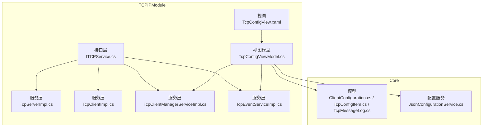
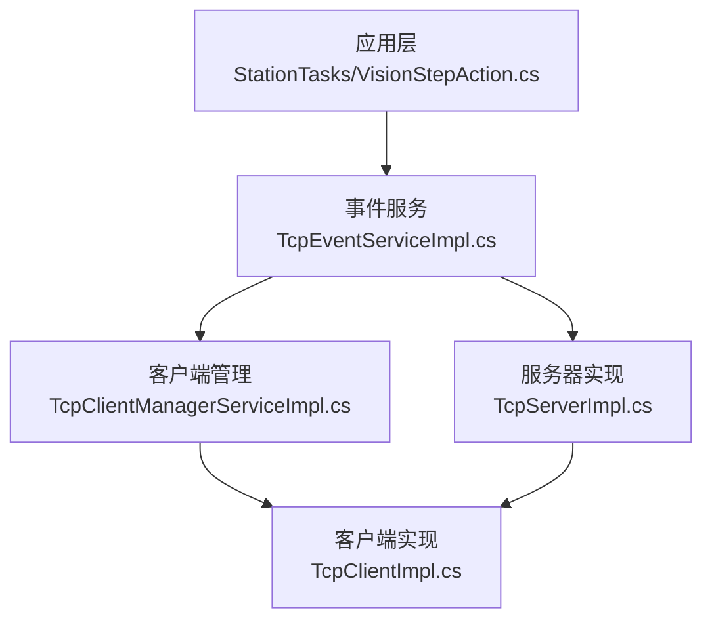
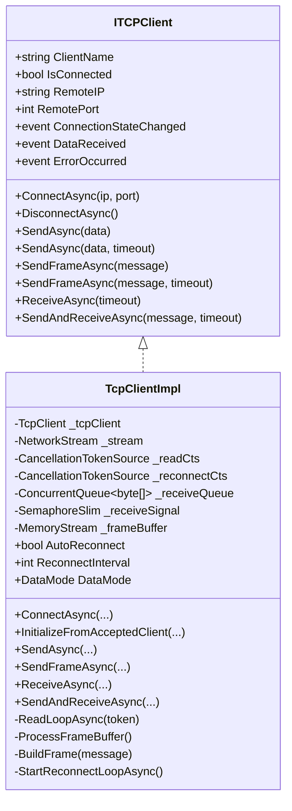
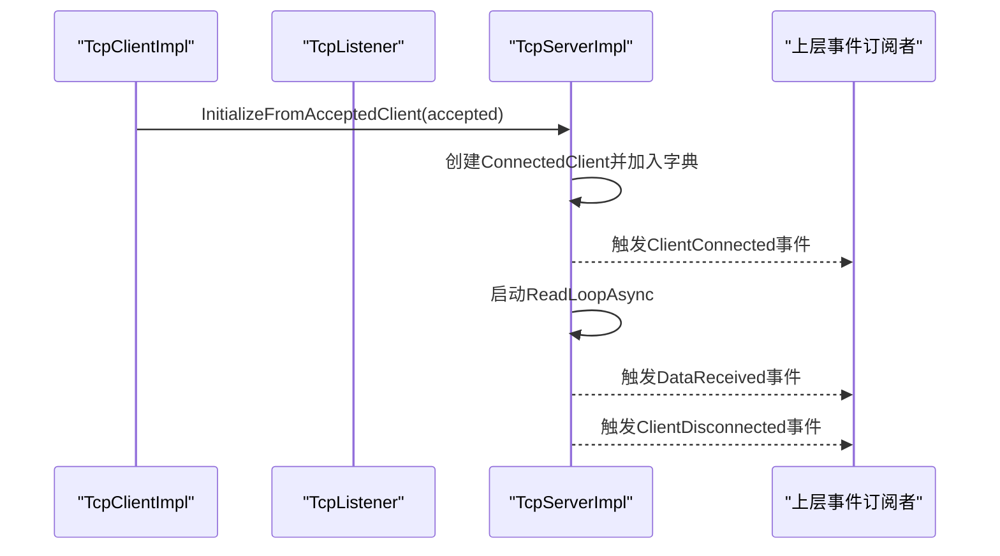
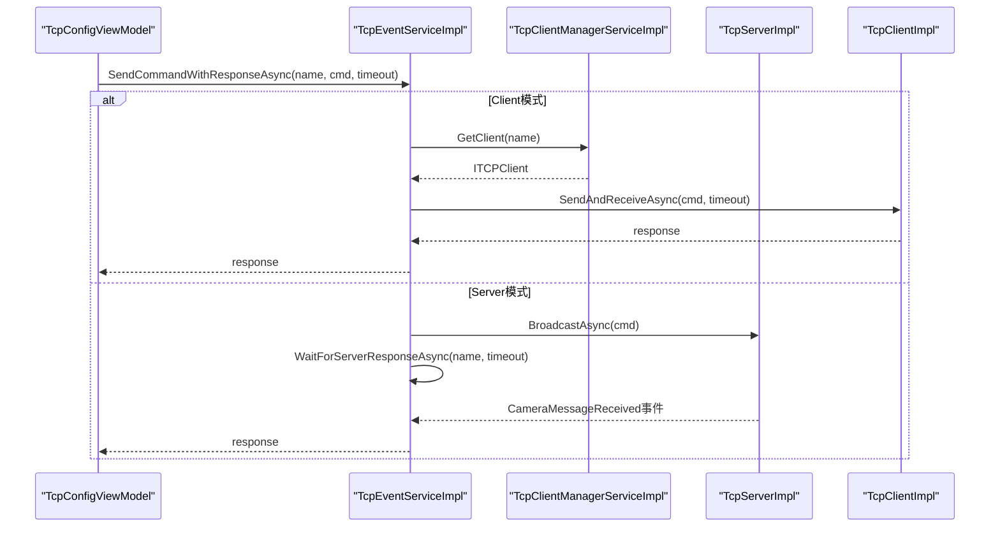
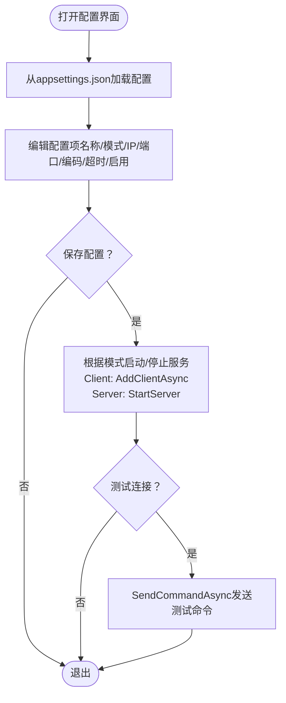
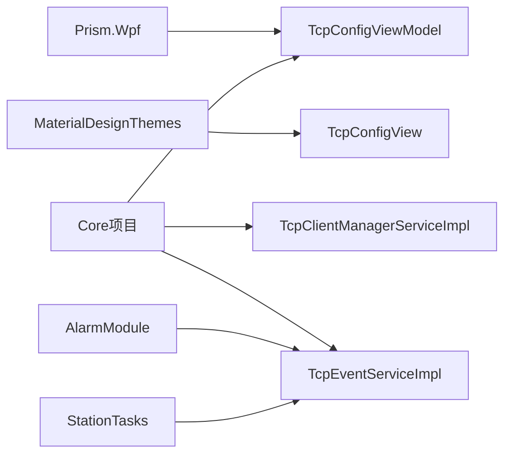

# 网络通信模块

<cite>
**本文档引用的文件**
- [TCPIPModule.csproj](file://TCPIPModule/TCPIPModule.csproj)
- [ITCPService.cs](file://TCPIPModule/Interfaces/ITCPService.cs)
- [TcpServerImpl.cs](file://TCPIPModule/Services/TcpServerImpl.cs)
- [TcpClientImpl.cs](file://TCPIPModule/Services/TcpClientImpl.cs)
- [TcpClientManagerServiceImpl.cs](file://TCPIPModule/Services/TcpClientManagerServiceImpl.cs)
- [TcpEventServiceImpl.cs](file://TCPIPModule/Services/TcpEventServiceImpl.cs)
- [TcpConfigViewModel.cs](file://TCPIPModule/ViewModels/TcpConfigViewModel.cs)
- [TcpConfigView.xaml](file://TCPIPModule/Views/TcpConfigView.xaml)
- [ClientConfiguration.cs](file://Core/Models/ClientConfiguration.cs)
- [TcpConfigItem.cs](file://Core/Models/TcpConfigItem.cs)
- [TcpMessageLog.cs](file://Core/Models/TcpMessageLog.cs)
- [VisionStepAction.cs](file://StationTasks/Actions/VisionStepAction.cs)
- [JsonConfigurationService.cs](file://Core/Services/JsonConfigurationService.cs)
- [版本修改记录.txt](file://版本修改记录.txt)
</cite>

## 目录
1. [引言](#引言)
2. [项目结构](#项目结构)
3. [核心组件](#核心组件)
4. [架构总览](#架构总览)
5. [详细组件分析](#详细组件分析)
6. [依赖关系分析](#依赖关系分析)
7. [性能考虑](#性能考虑)
8. [故障排查指南](#故障排查指南)
9. [结论](#结论)
10. [附录](#附录)

## 引言
本技术文档全面阐述网络通信模块的设计与实现，涵盖TCP/IP通信架构、服务器/客户端模式、连接管理策略、数据传输协议、事件桥接机制、消息格式定义、通信状态监控、网络设备集成、协议适配与错误重连机制，并提供网络配置参数、性能优化与安全防护的技术规范，以及远程控制接口、数据同步与状态上报的实现细节。

## 项目结构
网络通信模块位于 TCPIPModule 子项目中，采用分层设计：
- 接口层：定义统一的TCP客户端、服务器与事件服务接口，屏蔽具体实现差异
- 服务层：提供基于System.Net.Sockets的TCP客户端与服务器实现，以及客户端管理与事件协调服务
- 视图模型与视图：提供配置管理界面，支持客户端/服务器模式切换、连接测试、消息日志查看
- 核心模型：定义配置项、消息日志等数据结构

**图表来源**
- [ITCPService.cs:1-275](file://TCPIPModule/Interfaces/ITCPService.cs#L1-L275)
- [TcpServerImpl.cs:1-222](file://TCPIPModule/Services/TcpServerImpl.cs#L1-L222)
- [TcpClientImpl.cs:1-427](file://TCPIPModule/Services/TcpClientImpl.cs#L1-L427)
- [TcpClientManagerServiceImpl.cs:1-138](file://TCPIPModule/Services/TcpClientManagerServiceImpl.cs#L1-L138)
- [TcpEventServiceImpl.cs:1-542](file://TCPIPModule/Services/TcpEventServiceImpl.cs#L1-L542)
- [TcpConfigViewModel.cs:1-425](file://TCPIPModule/ViewModels/TcpConfigViewModel.cs#L1-L425)
- [TcpConfigView.xaml:1-371](file://TCPIPModule/Views/TcpConfigView.xaml#L1-L371)
- [ClientConfiguration.cs:1-23](file://Core/Models/ClientConfiguration.cs#L1-L23)
- [TcpConfigItem.cs:1-26](file://Core/Models/TcpConfigItem.cs#L1-L26)
- [TcpMessageLog.cs:1-29](file://Core/Models/TcpMessageLog.cs#L1-L29)
- [JsonConfigurationService.cs:1-60](file://Core/Services/JsonConfigurationService.cs#L1-L60)

**章节来源**
- [TCPIPModule.csproj:1-17](file://TCPIPModule/TCPIPModule.csproj#L1-L17)
- [ITCPService.cs:1-275](file://TCPIPModule/Interfaces/ITCPService.cs#L1-L275)

## 核心组件
- TCP客户端接口与实现：支持Raw/Frame两种数据模式，异步连接、自动重连、超时收发、帧解析与信号量同步
- TCP服务器接口与实现：支持多客户端连接管理、广播与定向发送、事件桥接
- 客户端管理服务：集中管理多个命名客户端，批量初始化、连接状态跟踪、广播
- 事件服务：统一协调Client/Server模式，提供命令发送/响应等待、连接状态回放、报警集成
- 配置管理视图模型与视图：支持配置持久化、模式切换、连接测试、消息日志展示

**章节来源**
- [ITCPService.cs:12-275](file://TCPIPModule/Interfaces/ITCPService.cs#L12-L275)
- [TcpClientImpl.cs:19-427](file://TCPIPModule/Services/TcpClientImpl.cs#L19-L427)
- [TcpServerImpl.cs:19-222](file://TCPIPModule/Services/TcpServerImpl.cs#L19-L222)
- [TcpClientManagerServiceImpl.cs:17-138](file://TCPIPModule/Services/TcpClientManagerServiceImpl.cs#L17-L138)
- [TcpEventServiceImpl.cs:22-542](file://TCPIPModule/Services/TcpEventServiceImpl.cs#L22-L542)
- [TcpConfigViewModel.cs:19-425](file://TCPIPModule/ViewModels/TcpConfigViewModel.cs#L19-L425)
- [TcpConfigView.xaml:1-371](file://TCPIPModule/Views/TcpConfigView.xaml#L1-L371)

## 架构总览
模块采用“接口抽象 + 多实现 + 事件桥接”的架构，通过ITCPEventService统一调度Client/Server两端，实现跨模式的命令路由与状态监控。

**图表来源**
- [VisionStepAction.cs:99-127](file://StationTasks/Actions/VisionStepAction.cs#L99-L127)
- [TcpEventServiceImpl.cs:22-542](file://TCPIPModule/Services/TcpEventServiceImpl.cs#L22-L542)
- [TcpClientManagerServiceImpl.cs:17-138](file://TCPIPModule/Services/TcpClientManagerServiceImpl.cs#L17-L138)
- [TcpServerImpl.cs:19-222](file://TCPIPModule/Services/TcpServerImpl.cs#L19-L222)
- [TcpClientImpl.cs:19-427](file://TCPIPModule/Services/TcpClientImpl.cs#L19-L427)

## 详细组件分析

### TCP客户端实现（TcpClientImpl）
- 数据模式
  - Raw：直接收发原始字节，兼容标准TCP设备
  - Frame：长度前缀帧协议[4字节长度][消息体]，防粘包/拆包
- 连接管理
  - 异步连接，5秒连接超时
  - 自动重连：可配置间隔，默认3秒
  - 断开时自动启动重连循环
- 读写与同步
  - 读取循环：按8KB缓冲区读取，Raw模式直接入队，Frame模式解析后入队
  - 接收队列：ConcurrentQueue + SemaphoreSlim信号量
  - 发送：支持超时发送与无超时发送
- 错误处理
  - 连接/读取异常通过ErrorOccurred事件上报
  - 自动重连失败时保持断开状态

**图表来源**
- [ITCPService.cs:12-75](file://TCPIPModule/Interfaces/ITCPService.cs#L12-L75)
- [TcpClientImpl.cs:19-427](file://TCPIPModule/Services/TcpClientImpl.cs#L19-L427)

**章节来源**
- [TcpClientImpl.cs:19-427](file://TCPIPModule/Services/TcpClientImpl.cs#L19-L427)

### TCP服务器实现（TcpServerImpl）
- 监听与接入
  - 支持指定IP/端口监听，AcceptTcpClientAsync循环接入
  - 使用InitializeFromAcceptedClient初始化已连接客户端，启动读取循环
- 广播与定向
  - BroadcastAsync：向所有已连接客户端广播（Frame模式）
  - SendToClientAsync：按客户端标识定向发送
- 事件桥接
  - ClientConnected/ClientDisconnected/ServerError/DataReceived事件向上层转发
  - 客户端标识生成规则：Client_{计数器}

**图表来源**
- [TcpServerImpl.cs:148-198](file://TCPIPModule/Services/TcpServerImpl.cs#L148-L198)
- [TcpClientImpl.cs:108-129](file://TCPIPModule/Services/TcpClientImpl.cs#L108-L129)

**章节来源**
- [TcpServerImpl.cs:19-222](file://TCPIPModule/Services/TcpServerImpl.cs#L19-L222)

### 客户端管理服务（TcpClientManagerServiceImpl）
- 批量初始化：从配置集合中仅连接启用的客户端
- 客户端生命周期：添加、移除、断开、释放资源
- 广播：向所有已连接客户端以帧协议广播数据
- 日志：记录初始化完成、添加/移除、连接状态变化

**章节来源**
- [TcpClientManagerServiceImpl.cs:17-138](file://TCPIPModule/Services/TcpClientManagerServiceImpl.cs#L17-L138)

### 事件服务（TcpEventServiceImpl）
- 统一入口：管理多个服务器实例与客户端，提供命令路由与响应等待
- 路由策略
  - Client模式：优先查询客户端管理器
  - Server模式：若名称匹配运行中的服务器，则广播至该服务器所有客户端
  - 精确匹配：否则在所有服务器的已连接客户端中查找
- 请求-响应
  - Client模式：通过SendAndReceiveAsync等待帧协议响应
  - Server模式：通过CameraMessageReceived事件等待响应，使用TaskCompletionSource+超时
- 状态回放与报警
  - 连接状态快照：解决首次订阅导致的上线日志丢失
  - 报警集成：掉线与通讯异常通过AlarmModule上报

**图表来源**
- [TcpEventServiceImpl.cs:287-383](file://TCPIPModule/Services/TcpEventServiceImpl.cs#L287-L383)
- [TcpClientImpl.cs:236-241](file://TCPIPModule/Services/TcpClientImpl.cs#L236-L241)
- [TcpServerImpl.cs:104-133](file://TCPIPModule/Services/TcpServerImpl.cs#L104-L133)

**章节来源**
- [TcpEventServiceImpl.cs:22-542](file://TCPIPModule/Services/TcpEventServiceImpl.cs#L22-L542)

### 配置管理视图模型与视图（TcpConfigViewModel/TcpConfigView）
- 配置持久化：通过IAppSettingService将ClientConfiguration序列化到appsettings.json
- 模式切换：Client/Server双模式，保存时按模式启动/停止对应组件
- 连接测试：SendCommandAsync单向发送测试命令，不等待响应
- 消息日志：实时记录发送/接收消息，支持清空与自动滚动
- UI交互：MaterialDesign主题，支持多语言标签

**图表来源**
- [TcpConfigViewModel.cs:239-354](file://TCPIPModule/ViewModels/TcpConfigViewModel.cs#L239-L354)
- [TcpConfigView.xaml:1-371](file://TCPIPModule/Views/TcpConfigView.xaml#L1-L371)

**章节来源**
- [TcpConfigViewModel.cs:19-425](file://TCPIPModule/ViewModels/TcpConfigViewModel.cs#L19-L425)
- [TcpConfigView.xaml:1-371](file://TCPIPModule/Views/TcpConfigView.xaml#L1-L371)

### 数据模型与配置
- ClientConfiguration：客户端连接配置（名称、模式、IP、端口、启用标志）
- TcpConfigItem：配方池持久化配置项（含超时、编码、描述）
- TcpMessageLog：消息日志记录（时间戳、方向、客户端名称、消息内容）

**章节来源**
- [ClientConfiguration.cs:12-21](file://Core/Models/ClientConfiguration.cs#L12-L21)
- [TcpConfigItem.cs:6-24](file://Core/Models/TcpConfigItem.cs#L6-L24)
- [TcpMessageLog.cs:8-28](file://Core/Models/TcpMessageLog.cs#L8-L28)

### 远程控制接口与数据同步
- 远程控制接口：通过SendCommandAsync/SendCommandWithResponseAsync实现命令下发与响应等待
- 数据同步：Server模式下通过广播实现多客户端同步；Client模式下通过各客户端独立连接实现点对点同步
- 状态上报：事件服务将连接状态、错误信息、消息接收通过统一事件桥接至UI与报警系统

**章节来源**
- [TcpEventServiceImpl.cs:287-383](file://TCPIPModule/Services/TcpEventServiceImpl.cs#L287-L383)
- [VisionStepAction.cs:99-127](file://StationTasks/Actions/VisionStepAction.cs#L99-L127)

## 依赖关系分析
- 模块依赖
  - Prism.Wpf：MVVM框架与命令绑定
  - MaterialDesignThemes：UI主题与控件
  - Core项目：配置模型、日志服务、应用设置服务
- 内部耦合
  - TcpEventServiceImpl依赖TcpClientManagerServiceImpl与TcpServerImpl
  - TcpConfigViewModel依赖ITCPEventService、ITCPClientManagerService与IAppSettingService
- 外部集成
  - AlarmModule：掉线与通讯异常报警
  - StationTasks：视觉步骤通过事件服务触发相机拍照命令

**图表来源**
- [TCPIPModule.csproj:8-15](file://TCPIPModule/TCPIPModule.csproj#L8-L15)
- [TcpEventServiceImpl.cs:68-73](file://TCPIPModule/Services/TcpEventServiceImpl.cs#L68-L73)
- [VisionStepAction.cs:107-110](file://StationTasks/Actions/VisionStepAction.cs#L107-L110)

**章节来源**
- [TCPIPModule.csproj:1-17](file://TCPIPModule/TCPIPModule.csproj#L1-L17)

## 性能考虑
- 缓冲与并发
  - 读取缓冲区大小：8KB，平衡吞吐与内存占用
  - 接收队列：ConcurrentQueue保证线程安全
  - 信号量：SemaphoreSlim实现等待/唤醒，避免忙轮询
- 协议优化
  - Frame模式：长度前缀帧有效防止粘包/拆包，建议长文本/二进制消息使用
  - Raw模式：直接透传，适合兼容标准设备
- 连接管理
  - 自动重连：避免长时间阻塞，建议结合业务重试策略
  - 广播：Task.WhenAll并行发送，注意服务器负载
- 日志与监控
  - 消息日志上限：默认200条，避免UI卡顿
  - 事件回放：减少首次订阅丢失的开销

[本节为通用性能指导，无需特定文件引用]

## 故障排查指南
- 连接失败
  - 检查IP/端口与防火墙设置
  - 查看连接超时（客户端5秒，服务器启动异常日志）
  - 确认自动重连是否启用
- 响应超时
  - 提高超时阈值或优化设备响应
  - Server模式下确认客户端是否正确返回消息
- 消息乱序/粘包
  - 切换至Frame模式，确保设备端也使用相同协议
- UI无日志
  - 确认已调用ReplayConnectedClients()回放连接状态
  - 检查事件订阅顺序（先订阅再回放）
- 报警未上报
  - 确认AlarmService注入与网络可达性

**章节来源**
- [TcpClientImpl.cs:79-102](file://TCPIPModule/Services/TcpClientImpl.cs#L79-L102)
- [TcpEventServiceImpl.cs:493-507](file://TCPIPModule/Services/TcpEventServiceImpl.cs#L493-L507)
- [版本修改记录.txt:229-253](file://版本修改记录.txt#L229-L253)

## 结论
网络通信模块通过清晰的接口抽象与事件桥接，实现了Client/Server双模式的统一管理与命令路由，具备完善的连接管理、协议适配、错误重连与状态监控能力。配合UI配置界面与日志系统，满足工业场景下的远程控制、数据同步与状态上报需求。

[本节为总结性内容，无需特定文件引用]

## 附录

### 网络配置参数清单
- 客户端配置（ClientConfiguration）
  - ClientName：客户端名称（唯一标识）
  - Mode：连接模式（Client/Server）
  - IP：远端IP地址
  - Port：端口号
  - IsEnabled：是否启用
  - Description：描述
- 配置项（TcpConfigItem）
  - Name：连接名称（唯一标识）
  - Mode：连接模式（Server/Client）
  - IP：IP地址
  - Port：端口号
  - Timeout：超时时间（毫秒）
  - Encoding：编码方式（UTF-8/ASCII等）
  - IsEnabled：是否启用
  - Description：描述

**章节来源**
- [ClientConfiguration.cs:12-21](file://Core/Models/ClientConfiguration.cs#L12-L21)
- [TcpConfigItem.cs:6-24](file://Core/Models/TcpConfigItem.cs#L6-L24)

### 数据传输协议
- Raw模式：直接发送原始字节，适用于兼容标准TCP设备
- Frame模式：长度前缀帧协议，防止粘包/拆包，建议用于长文本/二进制消息

**章节来源**
- [TcpClientImpl.cs:46-49](file://TCPIPModule/Services/TcpClientImpl.cs#L46-L49)
- [TcpClientImpl.cs:286-340](file://TCPIPModule/Services/TcpClientImpl.cs#L286-L340)

### 事件桥接机制
- 事件源：TcpServerImpl与TcpClientImpl的连接状态、数据接收、错误事件
- 事件汇聚：TcpEventServiceImpl统一订阅并转发至UI与报警系统
- 状态回放：连接状态快照与ReplayConnectedClients()确保首次订阅不丢失

**章节来源**
- [TcpServerImpl.cs:163-181](file://TCPIPModule/Services/TcpServerImpl.cs#L163-L181)
- [TcpClientImpl.cs:52-58](file://TCPIPModule/Services/TcpClientImpl.cs#L52-L58)
- [TcpEventServiceImpl.cs:493-507](file://TCPIPModule/Services/TcpEventServiceImpl.cs#L493-L507)

### 安全防护建议
- 网络层面：使用内网隔离、访问控制列表（ACL）、端口白名单
- 传输安全：在需要时引入TLS/SSL加密（当前实现为明文TCP）
- 认证授权：在应用层增加鉴权令牌与权限校验
- 日志审计：记录敏感操作与异常事件，定期审查

[本节为通用安全建议，无需特定文件引用]