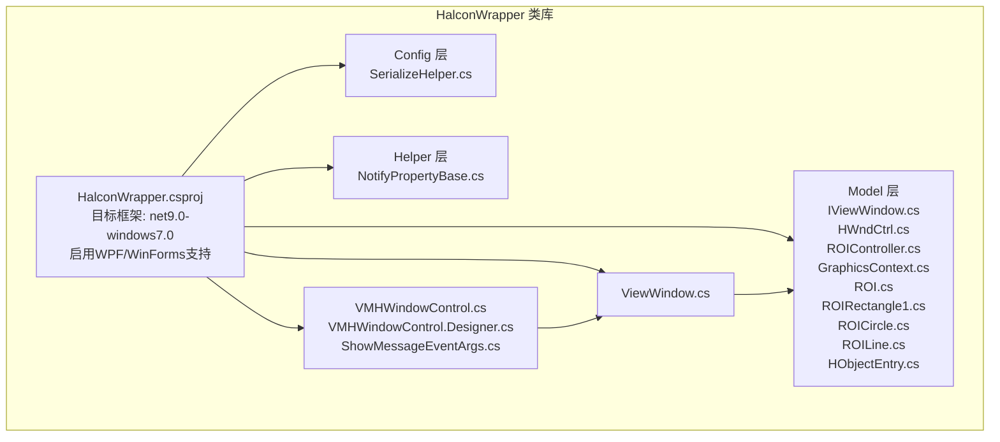
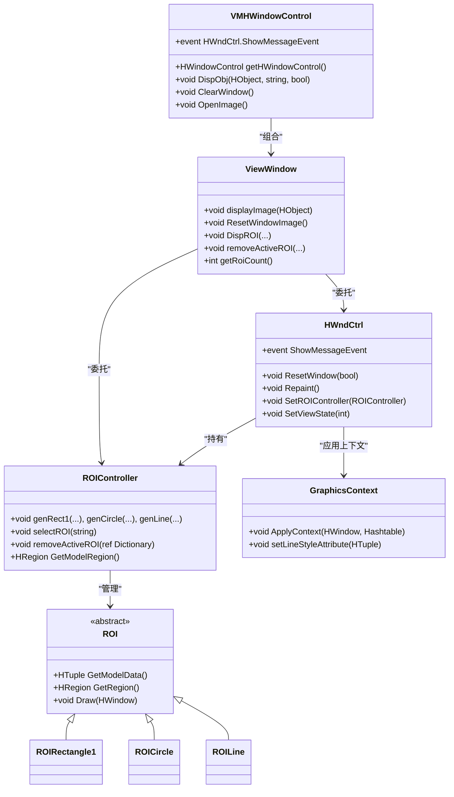
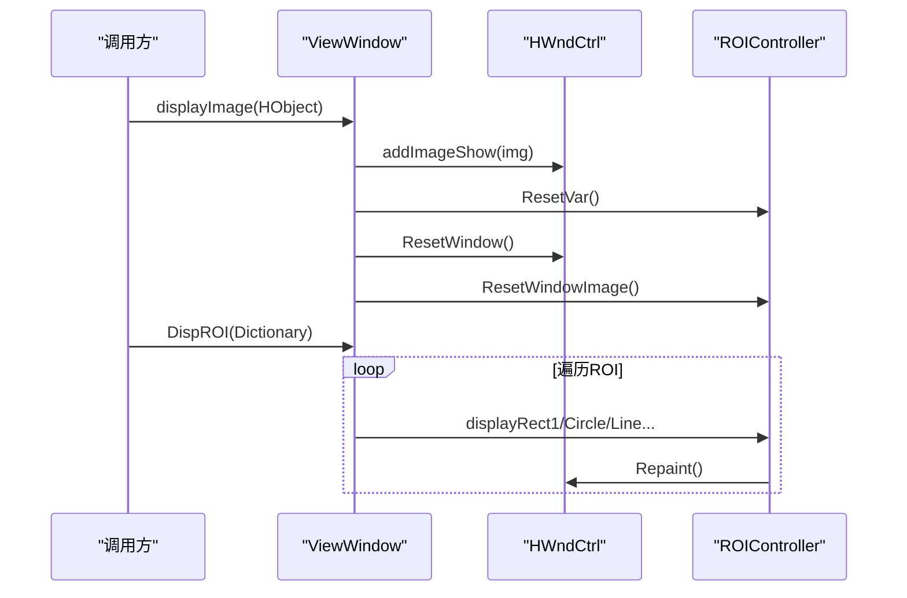
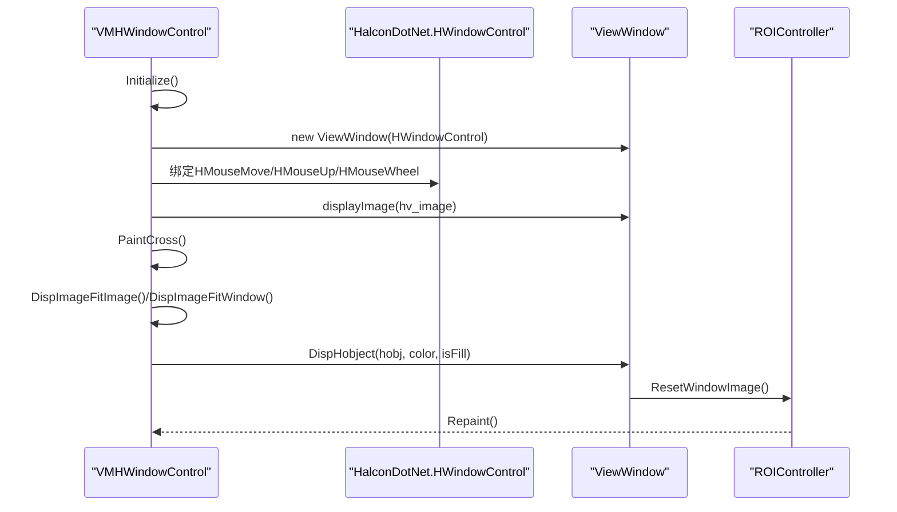
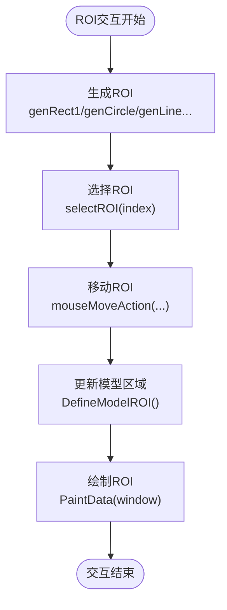
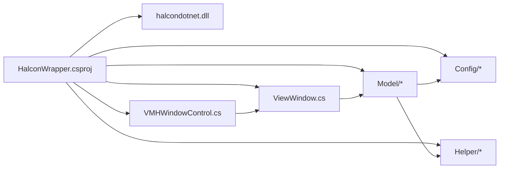

# Halcon包装器架构

<cite>
**本文档引用的文件**
- [HalconWrapper.csproj](file://HalconWrapper/HalconWrapper.csproj)
- [ViewWindow.cs](file://HalconWrapper/ViewWindow.cs)
- [VMHWindowControl.cs](file://HalconWrapper/VMHWindowControl.cs)
- [VMHWindowControl.Designer.cs](file://HalconWrapper/VMHWindowControl.Designer.cs)
- [IViewWindow.cs](file://HalconWrapper/Model/IViewWindow.cs)
- [HWndCtrl.cs](file://HalconWrapper/Model/HWndCtrl.cs)
- [ROIController.cs](file://HalconWrapper/Model/ROIController.cs)
- [GraphicsContext.cs](file://HalconWrapper/Model/GraphicsContext.cs)
- [ROI.cs](file://HalconWrapper/Model/ROI.cs)
- [ROIRectangle1.cs](file://HalconWrapper/Model/ROIRectangle1.cs)
- [ROICircle.cs](file://HalconWrapper/Model/ROICircle.cs)
- [ROILine.cs](file://HalconWrapper/Model/ROILine.cs)
- [SerializeHelper.cs](file://HalconWrapper/Config/SerializeHelper.cs)
- [NotifyPropertyBase.cs](file://HalconWrapper/Helper/NotifyPropertyBase.cs)
- [ShowMessageEventArgs.cs](file://HalconWrapper/ShowMessageEventArgs.cs)
</cite>

## 目录
1. [引言](#引言)
2. [项目结构](#项目结构)
3. [核心组件](#核心组件)
4. [架构总览](#架构总览)
5. [详细组件分析](#详细组件分析)
6. [依赖关系分析](#依赖关系分析)
7. [性能考虑](#性能考虑)
8. [故障排除指南](#故障排除指南)
9. [结论](#结论)

## 引言
本技术文档系统性阐述Halcon包装器的整体架构与实现细节，重点覆盖以下方面：
- .NET与Halcon SDK的集成方式与SDK配置
- WPF与WinForms双栈支持策略
- 视觉窗口ViewWindow与WinForms控件VMHWindowControl的设计原理
- ROI交互与图形上下文管理机制
- 事件处理与资源释放策略
- 依赖引用管理与编译属性设置
- 架构决策的技术背景与取舍说明

该文档旨在帮助开发者快速理解并高效扩展Halcon包装器，同时为后续维护与演进提供清晰的参考。

## 项目结构
HalconWrapper作为独立的类库项目，采用“模型-视图-控制器”分层组织，结合WinForms用户控件与Halcon可视化控件，形成统一的图像显示与交互框架。

**图表来源**
- [HalconWrapper.csproj:1-28](file://HalconWrapper/HalconWrapper.csproj#L1-L28)
- [VMHWindowControl.cs:1-120](file://HalconWrapper/VMHWindowControl.cs#L1-L120)
- [ViewWindow.cs:1-40](file://HalconWrapper/ViewWindow.cs#L1-L40)

**章节来源**
- [HalconWrapper.csproj:1-28](file://HalconWrapper/HalconWrapper.csproj#L1-L28)

## 核心组件
- ViewWindow：对外暴露的图像显示与ROI管理接口，封装HWndCtrl与ROIController，提供统一的显示与交互入口。
- VMHWindowControl：基于WinForms的用户控件，承载HalconDotNet.HWindowControl，负责UI事件、状态栏、菜单与图像/ROI绘制。
- HWndCtrl：Halcon窗口的图形控制核心，负责缩放、平移、鼠标事件处理、ROI绘制与刷新。
- ROIController：ROI的创建、选择、移动、删除与模型区域计算，协调HWndCtrl进行可视化更新。
- GraphicsContext：图形上下文管理，将颜色、线宽、样式等设置应用到Halcon窗口。
- ROI系列：具体ROI类型的实现（矩形、圆形、直线等），提供模型数据与绘制逻辑。
- SerializeHelper：序列化工具，支持XML/Binary等多种格式，用于ROI持久化。
- NotifyPropertyBase：MVVM通知基类，简化属性变更通知。

**章节来源**
- [ViewWindow.cs:12-357](file://HalconWrapper/ViewWindow.cs#L12-L357)
- [VMHWindowControl.cs:25-120](file://HalconWrapper/VMHWindowControl.cs#L25-L120)
- [HWndCtrl.cs:27-120](file://HalconWrapper/Model/HWndCtrl.cs#L27-L120)
- [ROIController.cs:26-120](file://HalconWrapper/Model/ROIController.cs#L26-L120)
- [GraphicsContext.cs:17-120](file://HalconWrapper/Model/GraphicsContext.cs#L17-L120)
- [ROI.cs:17-114](file://HalconWrapper/Model/ROI.cs#L17-L114)
- [SerializeHelper.cs:12-90](file://HalconWrapper/Config/SerializeHelper.cs#L12-L90)
- [NotifyPropertyBase.cs:11-31](file://HalconWrapper/Helper/NotifyPropertyBase.cs#L11-L31)

## 架构总览
Halcon包装器采用“控件层-窗口层-ROI层-图形上下文层”的分层架构，VMHWindowControl作为WinForms桥接层，ViewWindow作为对外API门面，内部委托HWndCtrl与ROIController完成具体工作。

**图表来源**
- [VMHWindowControl.cs:25-120](file://HalconWrapper/VMHWindowControl.cs#L25-L120)
- [ViewWindow.cs:12-120](file://HalconWrapper/ViewWindow.cs#L12-L120)
- [HWndCtrl.cs:27-120](file://HalconWrapper/Model/HWndCtrl.cs#L27-L120)
- [ROIController.cs:26-120](file://HalconWrapper/Model/ROIController.cs#L26-L120)
- [GraphicsContext.cs:17-120](file://HalconWrapper/Model/GraphicsContext.cs#L17-L120)
- [ROI.cs:17-114](file://HalconWrapper/Model/ROI.cs#L17-L114)
- [ROIRectangle1.cs:23-80](file://HalconWrapper/Model/ROIRectangle1.cs#L23-L80)
- [ROICircle.cs:14-88](file://HalconWrapper/Model/ROICircle.cs#L14-L88)
- [ROILine.cs:14-136](file://HalconWrapper/Model/ROILine.cs#L14-L136)

## 详细组件分析

### SDK配置与集成
- 目标框架与平台：目标框架为net9.0-windows7.0，启用WPF与WinForms支持，确保在Windows桌面环境中运行。
- 依赖引用：通过显式引用halcondotnet.dll（指向主应用输出目录）集成Halcon SDK，便于调试与部署一致性。
- 编译属性：允许使用BinaryFormatter以兼容遗留序列化场景，并抑制WinForms设计器相关告警。

**章节来源**
- [HalconWrapper.csproj:4-23](file://HalconWrapper/HalconWrapper.csproj#L4-L23)

### ViewWindow设计原理
- 角色定位：对外API门面，封装HWndCtrl与ROIController，屏蔽底层复杂性，提供简洁的图像显示与ROI管理接口。
- 关键职责：
  - 图像显示：addImageShow、displayImage、displayImageWithoutFit、ResetWindowImage等。
  - ROI管理：生成、选择、删除、序列化加载、按类型绘制。
  - 交互控制：缩放、平移、绘制模式切换、鼠标事件处理。
- 设计取舍：将Halcon窗口与ROI逻辑解耦，便于扩展不同显示策略与交互模式。

**图表来源**
- [ViewWindow.cs:38-282](file://HalconWrapper/ViewWindow.cs#L38-L282)
- [HWndCtrl.cs:394-440](file://HalconWrapper/Model/HWndCtrl.cs#L394-L440)
- [ROIController.cs:330-467](file://HalconWrapper/Model/ROIController.cs#L330-L467)

**章节来源**
- [ViewWindow.cs:12-357](file://HalconWrapper/ViewWindow.cs#L12-L357)

### VMHWindowControl设计原理
- 角色定位：WinForms用户控件，承载HalconDotNet.HWindowControl，提供右键菜单、状态栏、鼠标事件与图像/ROI绘制。
- 关键职责：
  - UI事件绑定：鼠标移动、离开、窗口尺寸变化等。
  - 图像管理：HobjectToHimage、OpenImage、保存截图与原始图像。
  - ROI绘制：DispObj重载、跨线程安全绘制（lock）、绘制填充选项。
  - 状态栏：显示坐标与灰度值，支持RGB三通道分离显示。
- 设计取舍：通过事件驱动与委托机制，将Halcon事件转换为UI可见的信息流。

**图表来源**
- [VMHWindowControl.cs:77-147](file://HalconWrapper/VMHWindowControl.cs#L77-L147)
- [VMHWindowControl.Designer.cs:30-105](file://HalconWrapper/VMHWindowControl.Designer.cs#L30-L105)
- [ViewWindow.cs:38-84](file://HalconWrapper/ViewWindow.cs#L38-L84)
- [HWndCtrl.cs:734-800](file://HalconWrapper/Model/HWndCtrl.cs#L734-L800)

**章节来源**
- [VMHWindowControl.cs:25-800](file://HalconWrapper/VMHWindowControl.cs#L25-L800)
- [VMHWindowControl.Designer.cs:30-114](file://HalconWrapper/VMHWindowControl.Designer.cs#L30-L114)

### ROI交互与图形上下文
- ROIController：集中管理ROI集合、活动ROI、模型区域计算与绘制。支持多种ROI类型生成与更新。
- ROI基类：抽象出ROI的通用行为（创建、绘制、移动、模型数据），具体类型实现差异化逻辑。
- GraphicsContext：将图形设置（颜色、线宽、样式等）应用到Halcon窗口，确保绘制一致性。
- HWndCtrl：负责鼠标事件处理、缩放/平移、ROI绘制刷新与消息事件触发。

**图表来源**
- [ROIController.cs:263-323](file://HalconWrapper/Model/ROIController.cs#L263-L323)
- [ROIController.cs:158-194](file://HalconWrapper/Model/ROIController.cs#L158-L194)
- [ROIController.cs:233-258](file://HalconWrapper/Model/ROIController.cs#L233-L258)
- [HWndCtrl.cs:532-640](file://HalconWrapper/Model/HWndCtrl.cs#L532-L640)

**章节来源**
- [ROIController.cs:26-875](file://HalconWrapper/Model/ROIController.cs#L26-L875)
- [ROI.cs:17-114](file://HalconWrapper/Model/ROI.cs#L17-L114)
- [GraphicsContext.cs:107-203](file://HalconWrapper/Model/GraphicsContext.cs#L107-L203)
- [HWndCtrl.cs:171-295](file://HalconWrapper/Model/HWndCtrl.cs#L171-L295)

### 事件处理与资源释放
- 事件机制：HWndCtrl通过ShowMessageEvent向UI传递鼠标位置与灰度信息；VMHWindowControl订阅并更新状态栏。
- 资源释放：HWndCtrl在Repaint过程中清理并重建绘制上下文；ROIController在ResetVar/RemoveActive时清理ROI列表；VMHWindowControl在Dispose中释放组件资源。
- 跨线程安全：VMHWindowControl在关键绘制路径使用lock与Invoke，确保UI线程安全。

**章节来源**
- [ShowMessageEventArgs.cs:11-25](file://HalconWrapper/ShowMessageEventArgs.cs#L11-L25)
- [HWndCtrl.cs:734-800](file://HalconWrapper/Model/HWndCtrl.cs#L734-L800)
- [ROIController.cs:198-205](file://HalconWrapper/Model/ROIController.cs#L198-L205)
- [VMHWindowControl.cs:546-566](file://HalconWrapper/VMHWindowControl.cs#L546-L566)
- [VMHWindowControl.Designer.cs:15-22](file://HalconWrapper/VMHWindowControl.Designer.cs#L15-L22)

## 依赖关系分析
- 项目级依赖：HalconWrapper.csproj直接引用halcondotnet.dll，确保运行时可用。
- 内部模块依赖：
  - VMHWindowControl依赖ViewWindow与HalconDotNet.HWindowControl。
  - ViewWindow依赖HWndCtrl与ROIController。
  - ROIController依赖HWndCtrl与ROI基类族。
  - GraphicsContext被HWndCtrl与ROIController使用。
  - SerializeHelper被ViewWindow用于ROI序列化。

**图表来源**
- [HalconWrapper.csproj:19-23](file://HalconWrapper/HalconWrapper.csproj#L19-L23)
- [VMHWindowControl.cs:1-20](file://HalconWrapper/VMHWindowControl.cs#L1-L20)
- [ViewWindow.cs:1-12](file://HalconWrapper/ViewWindow.cs#L1-L12)
- [HWndCtrl.cs:1-12](file://HalconWrapper/Model/HWndCtrl.cs#L1-L12)
- [ROIController.cs:1-6](file://HalconWrapper/Model/ROIController.cs#L1-L6)
- [SerializeHelper.cs:1-10](file://HalconWrapper/Config/SerializeHelper.cs#L1-L10)

**章节来源**
- [HalconWrapper.csproj:19-23](file://HalconWrapper/HalconWrapper.csproj#L19-L23)

## 性能考虑
- 绘制优化：HWndCtrl通过GraphicsContext批量应用图形设置，减少重复调用；Repaint采用“flush_graphic=false”批处理绘制，最后一次性刷新。
- ROI模型计算：ROIController在DefineModelROI中合并正负ROI，避免频繁重建区域对象。
- 跨线程绘制：VMHWindowControl使用lock与Invoke，降低UI线程阻塞风险。
- 图像适配：ResetWindow根据窗口与图像比例自动计算显示范围，避免过度缩放导致的性能损耗。

[本节为通用指导，无需特定文件引用]

## 故障排除指南
- 图像不显示或显示异常
  - 检查HalconDotNet.HWindowControl是否正确初始化，确认Image属性赋值与ChangeEnable流程。
  - 确认HWndCtrl的ImagePart与ZoomWndFactor设置是否合理。
- ROI无法交互
  - 检查ROIController的ActiveROIId与mouseDownAction/mouseMoveAction调用链。
  - 确认HWndCtrl的ViewState与drawModel状态未阻止交互。
- 序列化失败
  - 使用SerializeHelper的XML/Binary方法，确保对象具备可序列化特性且字段标注正确。
- 资源泄漏
  - 在VMHWindowControl.Dispose中释放组件；HWndCtrl在Repaint中清理GraphicsContext；ROIController在ResetVar中清理ROI列表。

**章节来源**
- [VMHWindowControl.cs:546-566](file://HalconWrapper/VMHWindowControl.cs#L546-L566)
- [HWndCtrl.cs:734-800](file://HalconWrapper/Model/HWndCtrl.cs#L734-L800)
- [ROIController.cs:198-205](file://HalconWrapper/Model/ROIController.cs#L198-L205)
- [SerializeHelper.cs:22-62](file://HalconWrapper/Config/SerializeHelper.cs#L22-L62)

## 结论
Halcon包装器通过清晰的分层架构与职责分离，实现了对Halcon SDK的稳健封装。VMHWindowControl与ViewWindow分别承担UI与业务逻辑的桥梁作用，HWndCtrl与ROIController提供强大的图像显示与ROI交互能力。配合GraphicsContext与NotifyPropertyBase，系统在功能完整性与可维护性之间取得良好平衡。未来可在以下方向演进：
- 增强WPF兼容性（如依赖注入、MVVM模式）
- 提升跨线程绘制的健壮性与性能
- 扩展更多ROI类型与可视化效果
- 完善错误日志与诊断工具