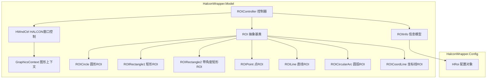
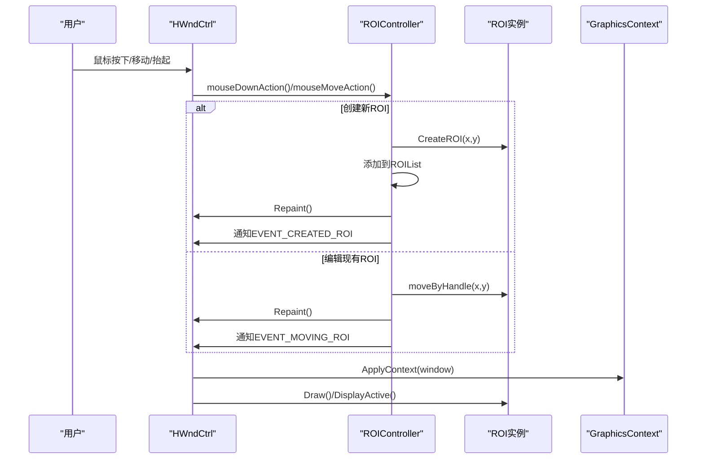
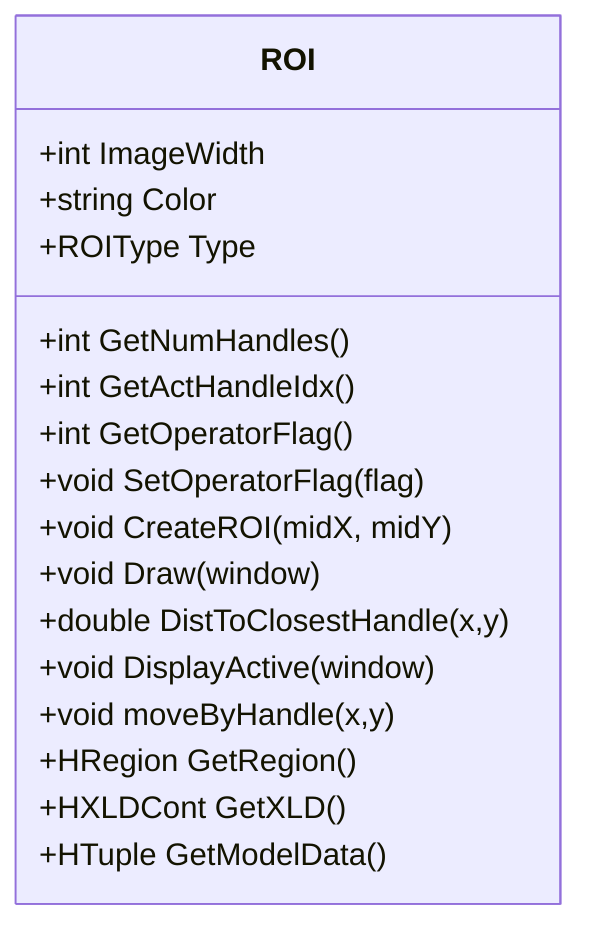
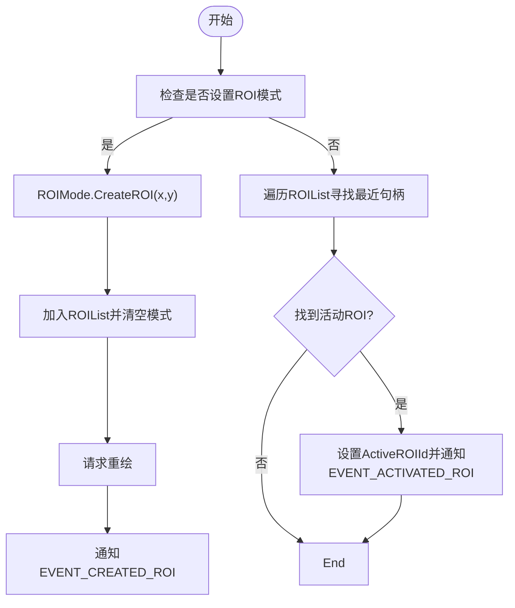
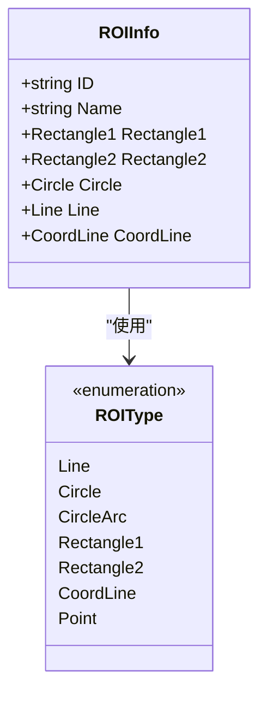
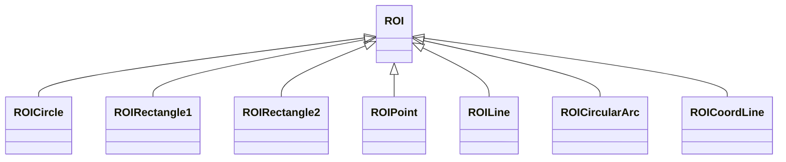
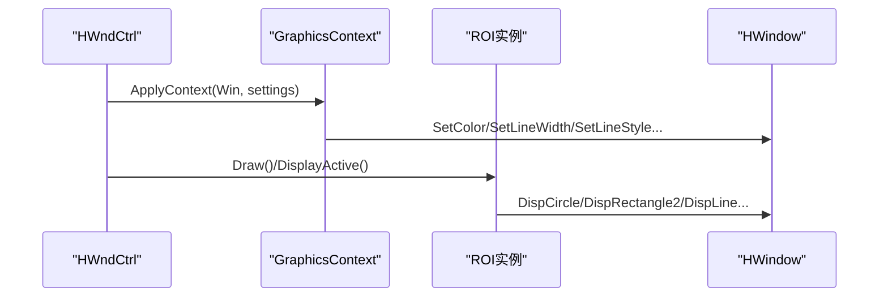
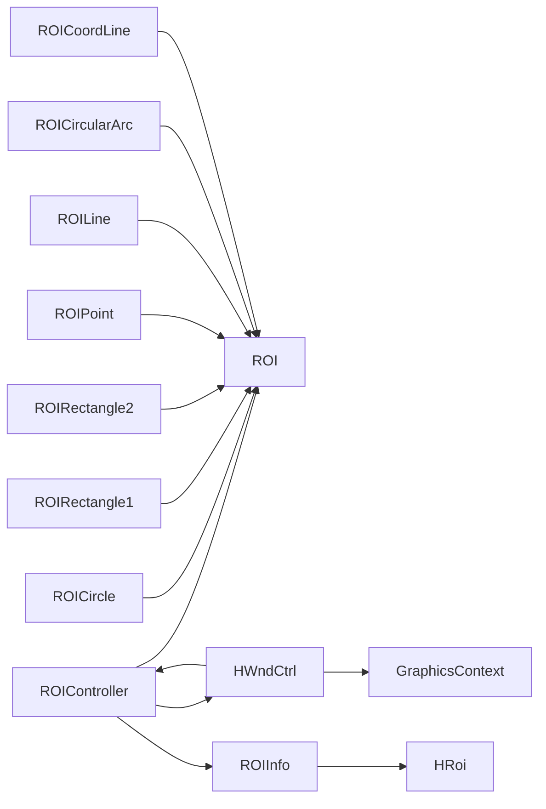

# ROI工具服务

<cite>
**本文档引用的文件**
- [ROI.cs](file://HalconWrapper/Model/ROI.cs)
- [ROIController.cs](file://HalconWrapper/Model/ROIController.cs)
- [ROIInfo.cs](file://HalconWrapper/Model/ROIInfo.cs)
- [ROICircle.cs](file://HalconWrapper/Model/ROICircle.cs)
- [ROIRectangle1.cs](file://HalconWrapper/Model/ROIRectangle1.cs)
- [ROIRectangle2.cs](file://HalconWrapper/Model/ROIRectangle2.cs)
- [ROIPoint.cs](file://HalconWrapper/Model/ROIPoint.cs)
- [ROILine.cs](file://HalconWrapper/Model/ROILine.cs)
- [ROICircularArc.cs](file://HalconWrapper/Model/ROICircularArc.cs)
- [ROICoordLine.cs](file://HalconWrapper/Model/ROICoordLine.cs)
- [GraphicsContext.cs](file://HalconWrapper/Model/GraphicsContext.cs)
- [HWndCtrl.cs](file://HalconWrapper/Model/HWndCtrl.cs)
- [HRoi.cs](file://HalconWrapper/Config/HRoi.cs)
</cite>

## 目录
1. [简介](#简介)
2. [项目结构](#项目结构)
3. [核心组件](#核心组件)
4. [架构总览](#架构总览)
5. [详细组件分析](#详细组件分析)
6. [依赖关系分析](#依赖关系分析)
7. [性能考虑](#性能考虑)
8. [故障排除指南](#故障排除指南)
9. [结论](#结论)
10. [附录](#附录)

## 简介
本文件面向ROI（感兴趣区域）工具服务的技术文档，系统性阐述ROI系统的架构设计、抽象基类与多态实现、控制器工作流、图形上下文交互机制，以及信息模型数据结构。文档同时提供使用示例、自定义ROI类型的扩展方法与性能优化建议，帮助开发者快速理解并高效使用该工具集。

## 项目结构
ROI工具位于HalconWrapper模块的Model与Config命名空间下，采用“抽象基类 + 多态派生类”的设计，配合控制器与图形上下文管理器完成交互式ROI的创建、编辑、删除与渲染。

**图表来源**
- [ROI.cs:17-112](file://HalconWrapper/Model/ROI.cs#L17-L112)
- [ROIController.cs:26-82](file://HalconWrapper/Model/ROIController.cs#L26-L82)
- [ROIInfo.cs:11-111](file://HalconWrapper/Model/ROIInfo.cs#L11-L111)
- [GraphicsContext.cs:17-105](file://HalconWrapper/Model/GraphicsContext.cs#L17-L105)
- [HWndCtrl.cs:27-169](file://HalconWrapper/Model/HWndCtrl.cs#L27-L169)
- [ROICircle.cs:14-46](file://HalconWrapper/Model/ROICircle.cs#L14-L46)
- [ROIRectangle1.cs:23-39](file://HalconWrapper/Model/ROIRectangle1.cs#L23-L39)
- [ROIRectangle2.cs:19-86](file://HalconWrapper/Model/ROIRectangle2.cs#L19-L86)
- [ROIPoint.cs:14-49](file://HalconWrapper/Model/ROIPoint.cs#L14-L49)
- [ROILine.cs:14-90](file://HalconWrapper/Model/ROILine.cs#L14-L90)
- [ROICircularArc.cs:13-51](file://HalconWrapper/Model/ROICircularArc.cs#L13-L51)
- [ROICoordLine.cs:17-56](file://HalconWrapper/Model/ROICoordLine.cs#L17-L56)
- [HRoi.cs:16-75](file://HalconWrapper/Config/HRoi.cs#L16-L75)

**章节来源**
- [ROI.cs:17-112](file://HalconWrapper/Model/ROI.cs#L17-L112)
- [ROIController.cs:26-110](file://HalconWrapper/Model/ROIController.cs#L26-L110)
- [ROIInfo.cs:11-111](file://HalconWrapper/Model/ROIInfo.cs#L11-L111)
- [GraphicsContext.cs:17-105](file://HalconWrapper/Model/GraphicsContext.cs#L17-L105)
- [HWndCtrl.cs:27-169](file://HalconWrapper/Model/HWndCtrl.cs#L27-L169)

## 核心组件
- ROI 抽象基类：定义所有ROI的通用接口与公共状态（如图像尺寸、颜色、类型、操作标志等），并提供绘制、距离计算、句柄移动、HALCON区域/轮廓转换等虚方法。
- ROIController 控制器：负责ROI列表管理、鼠标事件响应、活动ROI选择与编辑、正负运算组合生成模型区域、与HWndCtrl的交互。
- ROIInfo 信息模型：将具体ROI实例转换为可序列化的数据结构，便于保存与跨模块传递。
- GraphicsContext 图形上下文：封装HALCON绘图参数（颜色、线宽、样式、填充等），统一应用到窗口。
- HWndCtrl HALCON窗口控制：封装HWindowControl，处理缩放、平移、鼠标事件，并协调ROI绘制与刷新。
- 具体ROI类型：圆形、矩形（含带角度）、点、直线、圆弧、坐标线等，均继承自ROI并实现其虚方法。

**章节来源**
- [ROI.cs:17-112](file://HalconWrapper/Model/ROI.cs#L17-L112)
- [ROIController.cs:26-110](file://HalconWrapper/Model/ROIController.cs#L26-L110)
- [ROIInfo.cs:11-111](file://HalconWrapper/Model/ROIInfo.cs#L11-L111)
- [GraphicsContext.cs:17-105](file://HalconWrapper/Model/GraphicsContext.cs#L17-L105)
- [HWndCtrl.cs:27-169](file://HalconWrapper/Model/HWndCtrl.cs#L27-L169)

## 架构总览
ROI系统采用“控制器-模型-视图”架构：
- 视图层由HWndCtrl承载，负责用户输入与渲染。
- 控制器层由ROIController承担，协调ROI生命周期与事件通知。
- 模型层由ROI抽象类及各具体类型构成，提供几何建模与HALCON集成能力。
- 图形上下文层通过GraphicsContext统一管理绘图参数。

**图表来源**
- [HWndCtrl.cs:444-640](file://HalconWrapper/Model/HWndCtrl.cs#L444-L640)
- [ROIController.cs:263-323](file://HalconWrapper/Model/ROIController.cs#L263-L323)
- [GraphicsContext.cs:112-203](file://HalconWrapper/Model/GraphicsContext.cs#L112-L203)
- [ROI.cs:74-88](file://HalconWrapper/Model/ROI.cs#L74-L88)

**章节来源**
- [HWndCtrl.cs:444-640](file://HalconWrapper/Model/HWndCtrl.cs#L444-L640)
- [ROIController.cs:263-323](file://HalconWrapper/Model/ROIController.cs#L263-L323)
- [GraphicsContext.cs:112-203](file://HalconWrapper/Model/GraphicsContext.cs#L112-L203)

## 详细组件分析

### ROI 抽象基类
- 职责：定义ROI通用行为与状态，提供创建、绘制、句柄交互、HALCON区域/轮廓输出等接口。
- 关键字段与属性：图像尺寸、颜色、类型、句柄数量、活动句柄索引、运算标志（正/负）、线型样式。
- 关键方法：CreateXXX系列、Draw/DisplayActive、DistToClosestHandle、moveByHandle、GetXLD/GetRegion、GetModelData、SetOperatorFlag等。
- 设计要点：通过虚方法实现多态；句柄系统用于交互式编辑；运算标志支持正负运算组合模型区域。

**图表来源**
- [ROI.cs:17-112](file://HalconWrapper/Model/ROI.cs#L17-L112)

**章节来源**
- [ROI.cs:17-112](file://HalconWrapper/Model/ROI.cs#L17-L112)

### ROIController 控制器
- 职责：管理ROI列表、响应鼠标事件、维护活动ROI、生成模型区域、设置颜色与运算标志、与HWndCtrl通信。
- 关键功能：
  - ROI选择与编辑：mouseDownAction/mouseMoveAction，基于句柄最近距离判断激活ROI并调用moveByHandle。
  - ROI增删改：新增ROI、删除活动ROI、重置变量、重置当前模式。
  - 模型区域生成：根据正负运算标志对ROI区域进行并/差运算，得到最终模型区域。
  - 绘制与通知：统一设置绘图参数，调用ROI.Draw/DisplayActive，触发事件通知。
- 性能注意：DefineModelROI按正负集合分别Union后做差，避免重复计算；Repaint在事件驱动下触发。

**图表来源**
- [ROIController.cs:263-301](file://HalconWrapper/Model/ROIController.cs#L263-L301)

**章节来源**
- [ROIController.cs:26-215](file://HalconWrapper/Model/ROIController.cs#L26-L215)
- [ROIController.cs:158-194](file://HalconWrapper/Model/ROIController.cs#L158-L194)
- [ROIController.cs:263-323](file://HalconWrapper/Model/ROIController.cs#L263-L323)

### ROIInfo 信息模型
- 职责：将具体ROI实例转换为可序列化结构，包含ID、名称与对应几何参数，便于持久化与跨模块共享。
- 数据结构：按ROI类型（矩形1/2、圆、直线、坐标线、点、圆弧）映射到相应配置对象，同时保留颜色信息。
- 使用场景：保存ROI配置、模板化ROI、跨进程传输。

**图表来源**
- [ROIInfo.cs:11-111](file://HalconWrapper/Model/ROIInfo.cs#L11-L111)
- [ROIInfo.cs:113-143](file://HalconWrapper/Model/ROIInfo.cs#L113-L143)

**章节来源**
- [ROIInfo.cs:11-111](file://HalconWrapper/Model/ROIInfo.cs#L11-L111)

### 具体ROI类型实现
- 圆形（ROICircle）：中心点+半径，两个句柄（边界点与中点），支持距离计算与半径调整。
- 矩形1（ROIRectangle1）：对角两点定义，五个句柄（四角+中点），支持整体拖拽与边角拉伸。
- 矩形2（ROIRectangle2）：中心点+角度+半长轴，六个句柄（四角+中点+旋转箭头），支持旋转与缩放。
- 点（ROIPoint）：中点+方向角，两个句柄，适合定位标记。
- 直线（ROILine）：起点/终点/中点，带箭头显示，适合测量与方向指示。
- 圆弧（ROICircularArc）：圆心+半径+起止角度，四个句柄，支持正负方向与角度约束。
- 坐标线（ROICoordLine）：增强版直线，绘制X/Y轴标注与箭头，适合坐标系标注。

**图表来源**
- [ROICircle.cs:14-46](file://HalconWrapper/Model/ROICircle.cs#L14-L46)
- [ROIRectangle1.cs:23-39](file://HalconWrapper/Model/ROIRectangle1.cs#L23-L39)
- [ROIRectangle2.cs:19-86](file://HalconWrapper/Model/ROIRectangle2.cs#L19-L86)
- [ROIPoint.cs:14-49](file://HalconWrapper/Model/ROIPoint.cs#L14-L49)
- [ROILine.cs:14-90](file://HalconWrapper/Model/ROILine.cs#L14-L90)
- [ROICircularArc.cs:13-51](file://HalconWrapper/Model/ROICircularArc.cs#L13-L51)
- [ROICoordLine.cs:17-56](file://HalconWrapper/Model/ROICoordLine.cs#L17-L56)

**章节来源**
- [ROICircle.cs:14-200](file://HalconWrapper/Model/ROICircle.cs#L14-L200)
- [ROIRectangle1.cs:23-236](file://HalconWrapper/Model/ROIRectangle1.cs#L23-L236)
- [ROIRectangle2.cs:19-316](file://HalconWrapper/Model/ROIRectangle2.cs#L19-L316)
- [ROIPoint.cs:14-166](file://HalconWrapper/Model/ROIPoint.cs#L14-L166)
- [ROILine.cs:14-303](file://HalconWrapper/Model/ROILine.cs#L14-L303)
- [ROICircularArc.cs:13-347](file://HalconWrapper/Model/ROICircularArc.cs#L13-L347)
- [ROICoordLine.cs:17-282](file://HalconWrapper/Model/ROICoordLine.cs#L17-L282)

### 图形上下文与HALCON窗口
- GraphicsContext：集中管理颜色、线宽、样式、填充等绘图参数，ApplyContext按需设置HALCON窗口状态。
- HWndCtrl：封装HWindowControl，处理缩放/平移/滚轮/拖拽等事件，协调ROI绘制与刷新，支持刷子/画笔模式。

**图表来源**
- [GraphicsContext.cs:112-203](file://HalconWrapper/Model/GraphicsContext.cs#L112-L203)
- [HWndCtrl.cs:772-800](file://HalconWrapper/Model/HWndCtrl.cs#L772-L800)

**章节来源**
- [GraphicsContext.cs:17-405](file://HalconWrapper/Model/GraphicsContext.cs#L17-L405)
- [HWndCtrl.cs:734-800](file://HalconWrapper/Model/HWndCtrl.cs#L734-L800)

## 依赖关系分析
- ROIController 依赖 ROI 抽象类族与 HWndCtrl，通过事件回调与Repaint协作。
- ROIInfo 依赖 ROI 类型枚举与配置对象（HRoi）。
- HWndCtrl 依赖 GraphicsContext 与 ROIController，负责事件分发与渲染。
- 各具体ROI类型依赖 ROI 抽象类，实现几何与交互细节。

**图表来源**
- [ROIController.cs:26-110](file://HalconWrapper/Model/ROIController.cs#L26-L110)
- [ROIInfo.cs:11-111](file://HalconWrapper/Model/ROIInfo.cs#L11-L111)
- [HRoi.cs:16-75](file://HalconWrapper/Config/HRoi.cs#L16-L75)
- [HWndCtrl.cs:27-169](file://HalconWrapper/Model/HWndCtrl.cs#L27-L169)
- [ROI.cs:17-112](file://HalconWrapper/Model/ROI.cs#L17-L112)

**章节来源**
- [ROIController.cs:26-110](file://HalconWrapper/Model/ROIController.cs#L26-L110)
- [ROIInfo.cs:11-111](file://HalconWrapper/Model/ROIInfo.cs#L11-L111)
- [HRoi.cs:16-75](file://HalconWrapper/Config/HRoi.cs#L16-L75)
- [HWndCtrl.cs:27-169](file://HalconWrapper/Model/HWndCtrl.cs#L27-L169)

## 性能考虑
- ROI数量与句柄计算：DistToClosestHandle与DisplayActive涉及多次距离计算，建议在交互密集场景限制句柄数量或采用空间索引（当前实现未见索引，可按需扩展）。
- 模型区域生成：DefineModelROI对正负集合分别Union再做差，避免重复区域合并；建议在批量更新时减少Repaint次数。
- 渲染优化：GraphicsContext按需设置参数，避免频繁切换；HWndCtrl在Repaint中统一Flush Graphic，减少闪烁。
- HALCON对象复用：尽量复用XLD/Region对象，避免频繁创建销毁。

[本节为通用指导，无需特定文件引用]

## 故障排除指南
- ROI未显示或颜色异常：检查GraphicsContext.ApplyContext是否正确设置颜色/样式；确认HWndCtrl.Repaint被触发。
- 无法选择/编辑ROI：确认ROIController.ActiveROIId非空且DispROI模式为包含ROI；检查mouseDownAction/mouseMoveAction路径。
- 模型区域为空：检查DefineModelROI返回值与ROIList是否为空；核对运算标志（正/负）与区域面积。
- HALCON异常：GraphicsContext在ApplyContext中捕获异常并通过通知委托上报；查看NotifyIconObserver错误码。

**章节来源**
- [GraphicsContext.cs:198-203](file://HalconWrapper/Model/GraphicsContext.cs#L198-L203)
- [HWndCtrl.cs:225-229](file://HalconWrapper/Model/HWndCtrl.cs#L225-L229)
- [ROIController.cs:158-194](file://HalconWrapper/Model/ROIController.cs#L158-L194)

## 结论
ROI工具服务通过清晰的抽象与多态设计，提供了可扩展的交互式ROI体系。控制器与窗口控制层解耦良好，图形上下文统一管理绘图参数，便于维护与扩展。建议在复杂场景中结合事件驱动与批处理渲染，进一步提升性能与用户体验。

[本节为总结性内容，无需特定文件引用]

## 附录

### 使用示例（步骤说明）
- 创建圆形ROI：调用ROIController.displayCircle(...)，传入名称、颜色与中心/半径参数，随后通过EVENT_CREATED_ROI获取结果。
- 选择并编辑ROI：鼠标点击最近句柄激活ROI，拖动句柄触发EVENT_MOVING_ROI，控制器调用moveByHandle更新几何。
- 删除ROI：调用RemoveActive，触发EVENT_DELETED_ACTROI。
- 生成模型区域：调用DefineModelROI，按正负运算组合得到最终HRegion。

**章节来源**
- [ROIController.cs:330-467](file://HalconWrapper/Model/ROIController.cs#L330-L467)
- [ROIController.cs:142-154](file://HalconWrapper/Model/ROIController.cs#L142-L154)
- [ROIController.cs:158-194](file://HalconWrapper/Model/ROIController.cs#L158-L194)

### 自定义ROI类型扩展方法
- 新建类继承ROI，实现以下关键方法：CreateROI、Draw、DisplayActive、DistToClosestHandle、moveByHandle、GetXLD/GetRegion、GetModelData。
- 在ROIController中增加对应的displayXxx/genXxx方法，以便从UI或配置创建实例。
- 如需参与模型区域运算，确保SetOperatorFlag生效并在DefineModelROI中正确处理。

**章节来源**
- [ROI.cs:64-88](file://HalconWrapper/Model/ROI.cs#L64-L88)
- [ROIController.cs:470-683](file://HalconWrapper/Model/ROIController.cs#L470-L683)

### ROIInfo 序列化与配置
- ROIInfo支持按类型构造，自动提取ROI模型数据并设置颜色。
- HRoi提供更广泛的图形元素（如文字、测量线、屏蔽区等），可用于复合显示。

**章节来源**
- [ROIInfo.cs:23-80](file://HalconWrapper/Model/ROIInfo.cs#L23-L80)
- [HRoi.cs:16-75](file://HalconWrapper/Config/HRoi.cs#L16-L75)