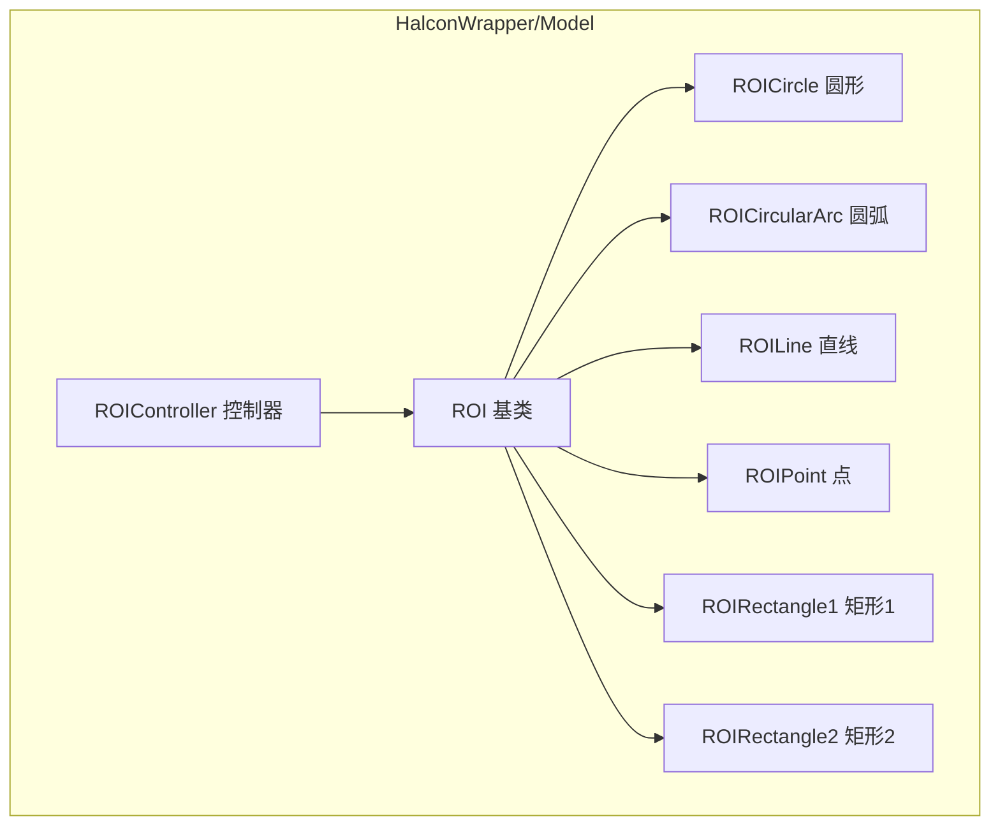
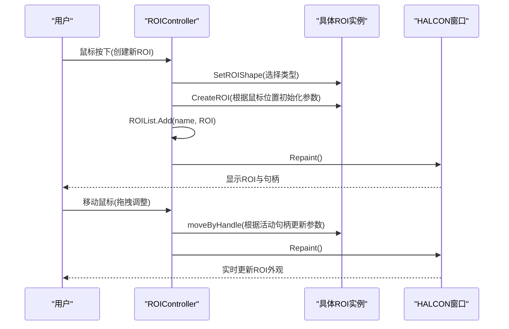
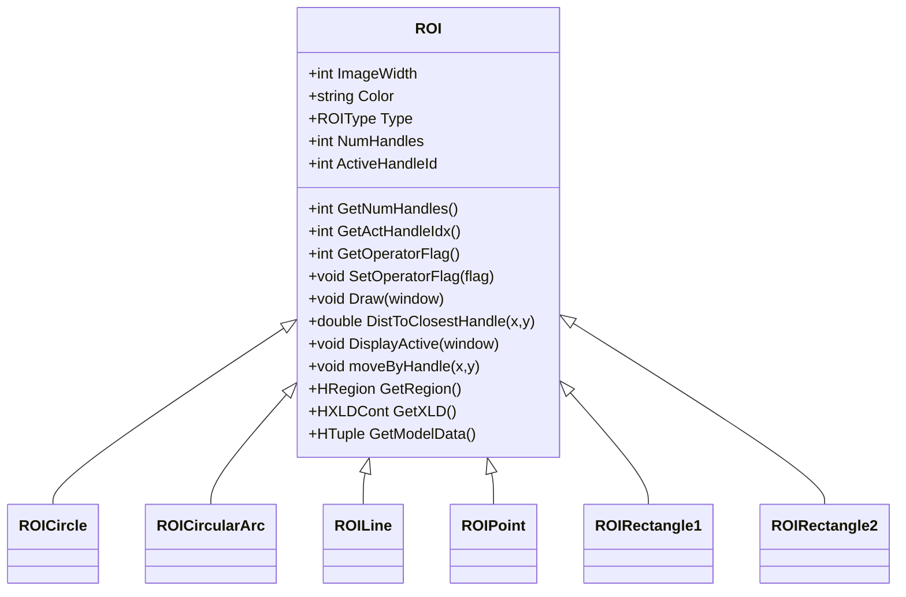

# ROI类型实现

<cite>
**本文引用的文件**
- [ROI.cs](file://HalconWrapper/Model/ROI.cs)
- [ROICircle.cs](file://HalconWrapper/Model/ROICircle.cs)
- [ROICircularArc.cs](file://HalconWrapper/Model/ROICircularArc.cs)
- [ROILine.cs](file://HalconWrapper/Model/ROILine.cs)
- [ROIPoint.cs](file://HalconWrapper/Model/ROIPoint.cs)
- [ROIRectangle1.cs](file://HalconWrapper/Model/ROIRectangle1.cs)
- [ROIRectangle2.cs](file://HalconWrapper/Model/ROIRectangle2.cs)
- [ROIController.cs](file://HalconWrapper/Model/ROIController.cs)
</cite>

## 目录
1. [简介](#简介)
2. [项目结构](#项目结构)
3. [核心组件](#核心组件)
4. [架构总览](#架构总览)
5. [详细组件分析](#详细组件分析)
6. [依赖关系分析](#依赖关系分析)
7. [性能考量](#性能考量)
8. [故障排查指南](#故障排查指南)
9. [结论](#结论)
10. [附录：自定义ROI类型开发模板与最佳实践](#附录自定义roi类型开发模板与最佳实践)

## 简介
本技术文档系统性梳理了HalconWrapper模块中ROI（感兴趣区域）类型的实现，覆盖圆形、圆弧、直线、点、矩形（矩形1与矩形2）等六种典型ROI类型。文档从架构设计、数据流、处理逻辑、参数校验与边界检测算法入手，给出各类型几何定义、参数设置、绘制方法与交互控制流程，并提供选择指南、性能对比与扩展开发模板，帮助开发者快速理解与二次开发。

## 项目结构
围绕ROI功能的核心文件位于HalconWrapper/Model目录，采用“基类+多态实现”的分层组织方式：
- 基类ROI：定义统一接口与通用属性（如颜色、操作标志、句柄数量与当前活动句柄等）
- 具体ROI类型：ROICircle、ROICircularArc、ROILine、ROIPoint、ROIRectangle1、ROIRectangle2
- ROI控制器：ROIController负责ROI对象的创建、管理、模型合并、绘制与交互事件响应

图表来源
- [ROI.cs:16-114](file://HalconWrapper/Model/ROI.cs#L16-L114)
- [ROIController.cs:26-120](file://HalconWrapper/Model/ROIController.cs#L26-L120)

章节来源
- [ROI.cs:16-114](file://HalconWrapper/Model/ROI.cs#L16-L114)
- [ROIController.cs:26-120](file://HalconWrapper/Model/ROIController.cs#L26-L120)

## 核心组件
- ROI基类：提供ROI通用能力（创建、绘制、句柄距离计算、活动句柄高亮、获取HALCON区域/轮廓、模型数据导出、操作符正负标志等）。子类通过覆写虚方法实现具体几何与交互行为。
- ROIController：集中管理ROI集合、当前激活ROI、鼠标事件处理（按下/移动）、模型区域生成（正负ROI叠加/相减）、颜色与样式设置、批量绘制与通知回调。

章节来源
- [ROI.cs:16-114](file://HalconWrapper/Model/ROI.cs#L16-L114)
- [ROIController.cs:26-120](file://HalconWrapper/Model/ROIController.cs#L26-L120)

## 架构总览
下图展示了从用户交互到ROI渲染与模型生成的关键流程：

图表来源
- [ROIController.cs:263-323](file://HalconWrapper/Model/ROIController.cs#L263-L323)
- [ROI.cs:70-89](file://HalconWrapper/Model/ROI.cs#L70-L89)

章节来源
- [ROIController.cs:263-323](file://HalconWrapper/Model/ROIController.cs#L263-L323)
- [ROI.cs:70-89](file://HalconWrapper/Model/ROI.cs#L70-L89)

## 详细组件分析

### ROI基类与通用能力
- 几何与参数
  - 颜色、类型、图像尺寸、操作符标志（正/负）、句柄数量与当前活动句柄
- 绘制与交互
  - Draw/DisplayActive：在HALCON窗口中绘制ROI与活动句柄
  - DistToClosestHandle：计算点到各句柄的距离，返回最近句柄索引
  - moveByHandle：依据活动句柄与鼠标坐标更新ROI参数
- HALCON集成
  - GetRegion/GetXLD：输出HRegion/HXLDCont供后续视觉算法使用
  - GetModelData：导出模型参数（用于保存/传输/复现）

章节来源
- [ROI.cs:16-114](file://HalconWrapper/Model/ROI.cs#L16-L114)

### 圆形ROI（ROICircle）
- 几何定义
  - 中心点与半径；两个句柄：圆周上的一个点（用于调节半径）与中心点（用于平移）
- 参数设置
  - CenterX/CenterY：圆心坐标
  - Radius：半径
- 绘制方法
  - 调用HALCON绘制圆与句柄矩形
- 句柄与边界检测
  - DistToClosestHandle比较圆周点与中心点到鼠标距离，选择最近者
  - moveByHandle支持两种模式：移动中心（平移）与拖拽圆周点以改变半径
- 边界检测算法
  - 使用两点间距离计算；角度参数用于生成轮廓
- 适用场景
  - 对称目标检测、孔/圆盘定位、均匀分布的特征识别

章节来源
- [ROICircle.cs:14-201](file://HalconWrapper/Model/ROICircle.cs#L14-L201)

### 圆弧ROI（ROICircularArc）
- 几何定义
  - 圆心、半径、起始角度与弧长角度（extentPhi）；四个句柄：圆心、圆周点（半径端点）、起始点、终止点
- 参数设置
  - midR/midC：圆心
  - radius：半径
  - startPhi/extentPhi：起始与扫掠角度（弧度）
  - circDir：绘制方向（正/负）
- 绘制方法
  - 生成圆弧轮廓并绘制；起始点与终止点分别以矩形与箭头表示
- 句柄与边界检测
  - DistToClosestHandle比较四点距离，选择最近句柄
  - moveByHandle支持：移动圆心、拖动半径端点改变半径、拖动起始/终止点调整角度范围
- 边界检测算法
  - 通过Atan2计算角度，结合方向约束与范围归一化，避免角度跳变
- 适用场景
  - 弧面/弯道/环形特征检测、带方向性的引导线

章节来源
- [ROICircularArc.cs:13-347](file://HalconWrapper/Model/ROICircularArc.cs#L13-L347)

### 直线ROI（ROILine）
- 几何定义
  - 起点与终点；三个句柄：两端点与中点
- 参数设置
  - StartX/StartY、EndX/EndY：端点坐标
  - MidX/MidY：中点
  - Phi：直线方向角
- 绘制方法
  - 绘制线段与箭头；端点与中点以矩形高亮
- 句柄与边界检测
  - DistToClosestHandle比较三处距离
  - moveByHandle支持：拖动端点改变长度/方向、拖动中点整体平移
- 边界检测算法
  - 使用点到线段距离与角度计算
- 适用场景
  - 缺口/划痕/边缘检测、对齐基准线

章节来源
- [ROILine.cs:14-303](file://HalconWrapper/Model/ROILine.cs#L14-L303)

### 点ROI（ROIPoint）
- 几何定义
  - 单点；两个句柄：点本身与方向箭头（用于设定角度）
- 参数设置
  - midR/midC：点坐标
  - phi：方向角
- 绘制方法
  - 绘制十字与方向箭头；句柄矩形与箭头随缩放因子变化
- 句柄与边界检测
  - DistToClosestHandle比较点与箭头位置
  - moveByHandle支持：移动点位置与旋转方向
- 边界检测算法
  - 点到点距离；方向角由Atan2计算
- 适用场景
  - 精确定位、参考点、微小缺陷检测

章节来源
- [ROIPoint.cs:14-166](file://HalconWrapper/Model/ROIPoint.cs#L14-L166)

### 矩形ROI1（ROIRectangle1）
- 几何定义
  - 由左上与右下两角定义的轴对齐矩形；五个句柄：四角与中心
- 参数设置
  - row1/col1、row2/col2：左上与右下角
  - midR/midC：中心
- 绘制方法
  - 绘制矩形与四角/中心句柄
- 句柄与边界检测
  - DistToClosestHandle比较四角与中心距离
  - moveByHandle支持：拖动四角改变尺寸、拖动中心整体平移
- 边界检测算法
  - 角点顺序与尺寸有效性校验，防止尺寸倒置
- 适用场景
  - 轴对齐区域选择、简单框选

章节来源
- [ROIRectangle1.cs:23-236](file://HalconWrapper/Model/ROIRectangle1.cs#L23-L236)

### 矩形ROI2（ROIRectangle2）
- 几何定义
  - 中心点、方向角phi与半边长Length1/Length2；六个句柄：四角、中心、方向箭头
- 参数设置
  - MidR/MidC：中心
  - Phi：方向角（弧度/角度互转）
  - Length1/Length2：垂直与平行于方向的半边长
- 绘制方法
  - 绘制旋转矩形与方向箭头；句柄随Homography变换更新
- 句柄与边界检测
  - DistToClosestHandle比较六点距离
  - moveByHandle支持：拖动四角改变尺寸、拖动中心平移、拖动方向箭头改变角度
- 边界检测算法
  - Homography矩阵变换更新句柄位置；对Length1/Length2进行范围检查，避免塌缩
- 适用场景
  - 非轴对齐工件定位、装配基准框

章节来源
- [ROIRectangle2.cs:19-316](file://HalconWrapper/Model/ROIRectangle2.cs#L19-L316)

### ROI控制器（ROIController）
- 创建与管理
  - SetROIShape/SetROISign：设置当前ROI类型与正负操作符
  - mouseDownAction/mouseMoveAction：响应鼠标事件，激活ROI并调用moveByHandle更新
- 模型区域生成
  - DefineModelROI：按正负标志对ROI区域进行并/差运算，生成最终模型区域
- 绘制与颜色
  - PaintData：批量绘制所有ROI及活动ROI与句柄
- 快捷生成
  - 提供display*/gen*系列方法，快速生成指定类型的ROI并加入列表

章节来源
- [ROIController.cs:26-800](file://HalconWrapper/Model/ROIController.cs#L26-L800)

## 依赖关系分析
- 类继承关系
  - ROICircle、ROICircularArc、ROILine、ROIPoint、ROIRectangle1、ROIRectangle2均继承自ROI
- 控制器依赖
  - ROIController持有ROI列表与当前激活项，依赖各ROI实例的Draw/DisplayActive/GetRegion/GetModelData等接口
- HALCON集成
  - 各ROI通过HALCON操作生成HRegion/HXLDCont；控制器统一设置颜色、线宽、样式

图表来源
- [ROI.cs:16-114](file://HalconWrapper/Model/ROI.cs#L16-L114)
- [ROICircle.cs:14-201](file://HalconWrapper/Model/ROICircle.cs#L14-L201)
- [ROICircularArc.cs:13-347](file://HalconWrapper/Model/ROICircularArc.cs#L13-L347)
- [ROILine.cs:14-303](file://HalconWrapper/Model/ROILine.cs#L14-L303)
- [ROIPoint.cs:14-166](file://HalconWrapper/Model/ROIPoint.cs#L14-L166)
- [ROIRectangle1.cs:23-236](file://HalconWrapper/Model/ROIRectangle1.cs#L23-L236)
- [ROIRectangle2.cs:19-316](file://HalconWrapper/Model/ROIRectangle2.cs#L19-L316)

章节来源
- [ROI.cs:16-114](file://HalconWrapper/Model/ROI.cs#L16-L114)
- [ROICircle.cs:14-201](file://HalconWrapper/Model/ROICircle.cs#L14-L201)
- [ROICircularArc.cs:13-347](file://HalconWrapper/Model/ROICircularArc.cs#L13-L347)
- [ROILine.cs:14-303](file://HalconWrapper/Model/ROILine.cs#L14-L303)
- [ROIPoint.cs:14-166](file://HalconWrapper/Model/ROIPoint.cs#L14-L166)
- [ROIRectangle1.cs:23-236](file://HalconWrapper/Model/ROIRectangle1.cs#L23-L236)
- [ROIRectangle2.cs:19-316](file://HalconWrapper/Model/ROIRectangle2.cs#L19-L316)

## 性能考量
- 绘制开销
  - ROI绘制集中在控制器统一调用，避免重复设置颜色/样式
  - 句柄数量越少（如点/线），交互时距离计算与重绘成本越低
- 区域生成
  - 正负ROI叠加/相减使用HRegion并/差运算，复杂度与ROI数量与形状有关
- 交互效率
  - DistToClosestHandle采用常数级句柄遍历，适合实时交互
  - 矩形2的句柄更新涉及矩阵变换，但仅在句柄移动时触发

[本节为通用性能讨论，不直接分析具体文件]

## 故障排查指南
- 无法激活ROI
  - 检查鼠标按下距离阈值与DistToClosestHandle返回值
  - 确认ROI列表非空且ActiveROIId被正确设置
- ROI变形异常
  - 矩形1/矩形2在尺寸倒置或长度过小情况下会进行保护性修正
  - 圆弧角度范围需满足方向一致性，避免角度跳变导致的异常
- 模型区域为空
  - 检查DefineModelROI中正负ROI是否有效，确保至少存在可合并的区域

章节来源
- [ROIController.cs:158-194](file://HalconWrapper/Model/ROIController.cs#L158-L194)
- [ROIRectangle1.cs:212-229](file://HalconWrapper/Model/ROIRectangle1.cs#L212-L229)
- [ROIRectangle2.cs:278-309](file://HalconWrapper/Model/ROIRectangle2.cs#L278-L309)
- [ROICircularArc.cs:192-228](file://HalconWrapper/Model/ROICircularArc.cs#L192-L228)

## 结论
该ROI体系以基类抽象与多态实现为核心，配合控制器统一管理与HALCON高效渲染，形成一套完整、可扩展的交互式ROI解决方案。不同ROI类型在参数表达、句柄策略与边界检测上各有侧重，适用于从简单点/线到复杂圆弧/旋转矩形的广泛场景。通过统一接口与模型导出，可无缝接入视觉检测流水线。

[本节为总结性内容，不直接分析具体文件]

## 附录：自定义ROI类型开发模板与最佳实践
- 开发步骤
  - 新建类继承自ROI，声明必要的几何参数与句柄数量
  - 实现CreateROI/CreateXXX（按类型）、Draw、DistToClosestHandle、DisplayActive、moveByHandle、GetRegion/GetXLD/GetModelData
  - 在ROIController中添加对应的display*/gen*方法，便于外部创建与管理
- 最佳实践
  - 句柄数量应尽量精简，保证交互流畅
  - moveByHandle内需进行参数范围校验（如长度非负、角度归一化）
  - 绘制时注意颜色与样式的一致性，必要时使用FlagLineStyle区分正负
  - 将几何参数封装为可序列化字段，便于保存/加载
  - 在GetModelData中导出最小可复现实参，便于跨模块共享

章节来源
- [ROI.cs:16-114](file://HalconWrapper/Model/ROI.cs#L16-L114)
- [ROIController.cs:329-467](file://HalconWrapper/Model/ROIController.cs#L329-L467)