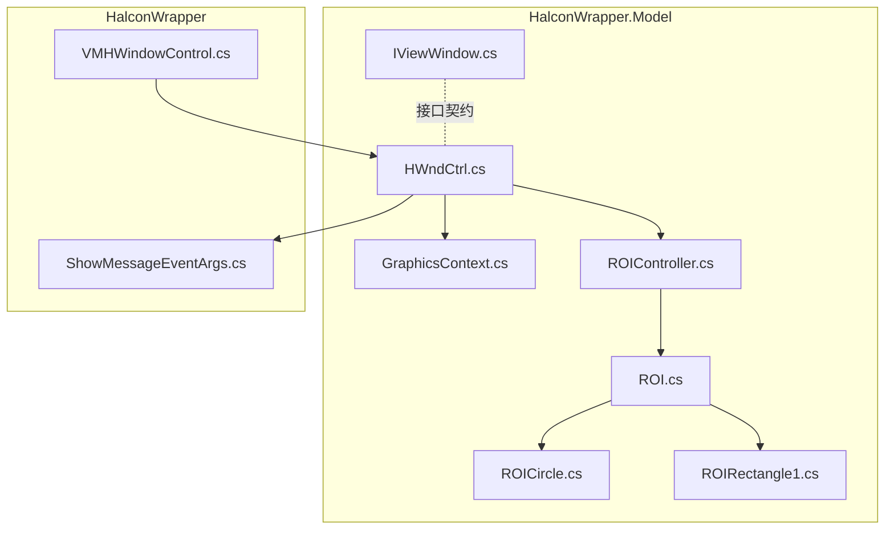
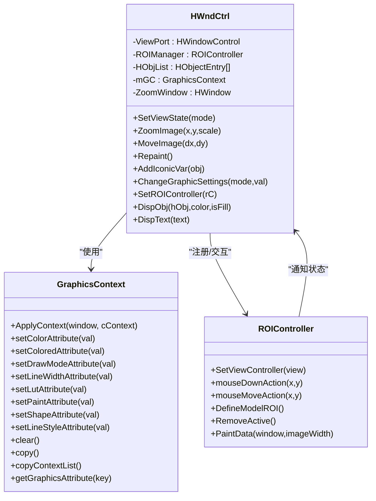
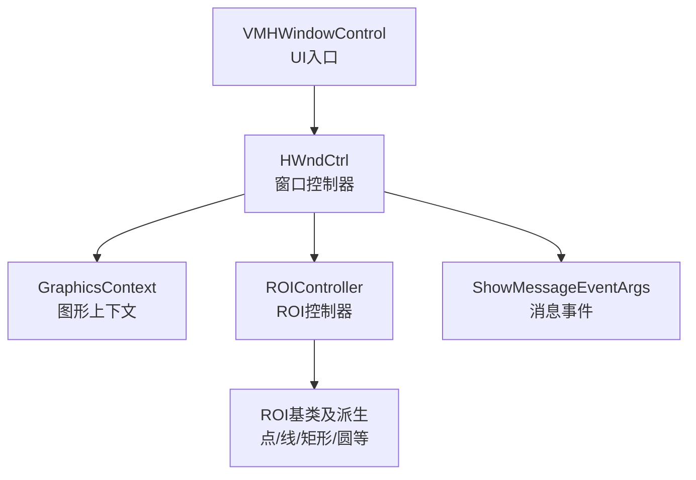
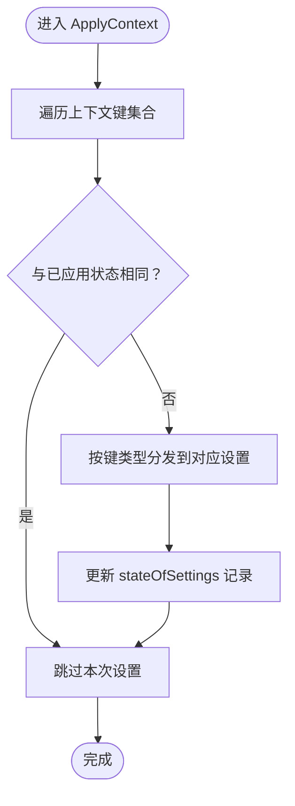
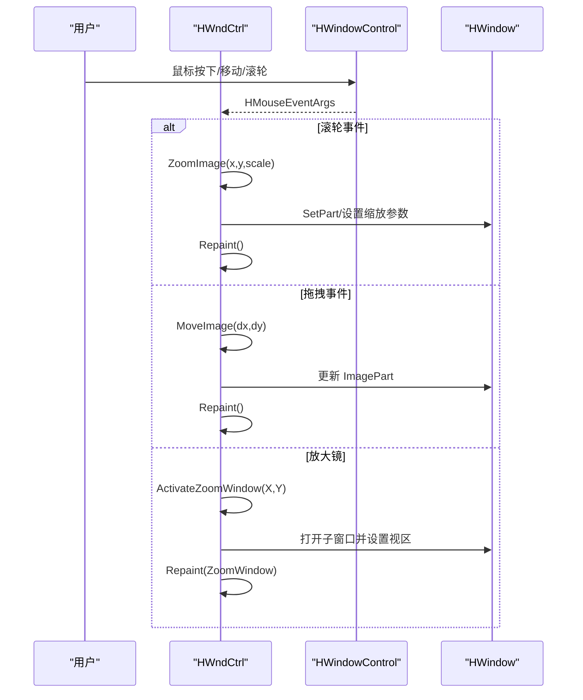
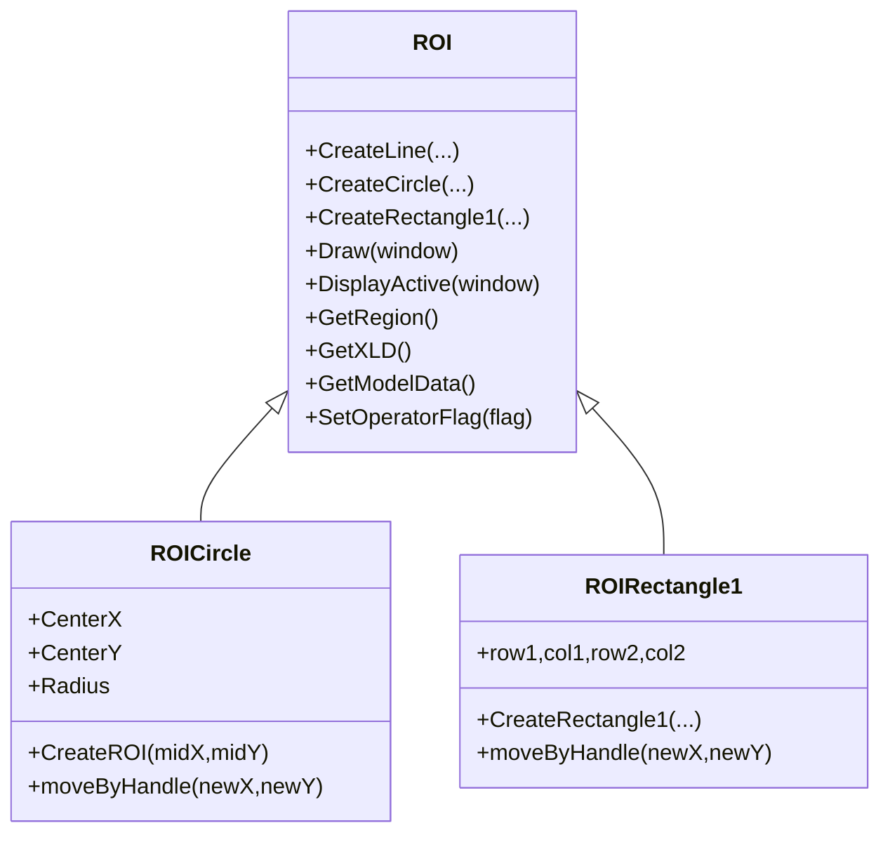
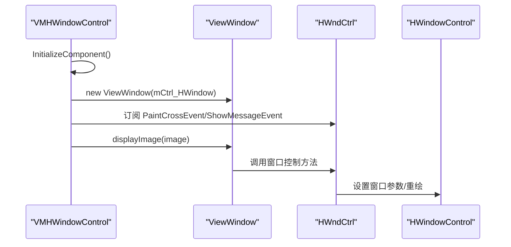
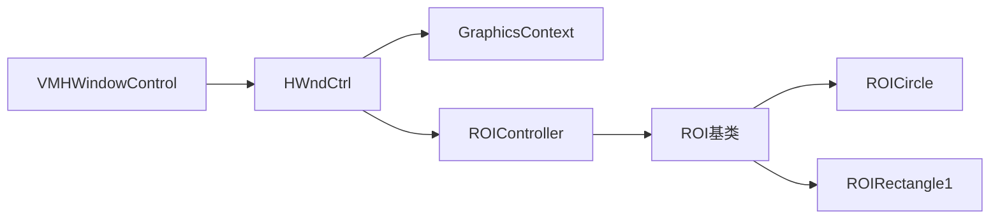

# 图形上下文管理

<cite>
**本文档引用的文件**
- [GraphicsContext.cs](file://HalconWrapper/Model/GraphicsContext.cs)
- [HWndCtrl.cs](file://HalconWrapper/Model/HWndCtrl.cs)
- [IViewWindow.cs](file://HalconWrapper/Model/IViewWindow.cs)
- [ROIController.cs](file://HalconWrapper/Model/ROIController.cs)
- [ROI.cs](file://HalconWrapper/Model/ROI.cs)
- [ROICircle.cs](file://HalconWrapper/Model/ROICircle.cs)
- [ROIRectangle1.cs](file://HalconWrapper/Model/ROIRectangle1.cs)
- [VMHWindowControl.cs](file://HalconWrapper/VMHWindowControl.cs)
- [ShowMessageEventArgs.cs](file://HalconWrapper/ShowMessageEventArgs.cs)
</cite>

## 目录
1. [引言](#引言)
2. [项目结构](#项目结构)
3. [核心组件](#核心组件)
4. [架构总览](#架构总览)
5. [详细组件分析](#详细组件分析)
6. [依赖关系分析](#依赖关系分析)
7. [性能考虑](#性能考虑)
8. [故障排查指南](#故障排查指南)
9. [结论](#结论)

## 引言
本文件面向图形上下文管理系统，系统性梳理以下关键能力：
- GraphicsContext：图形渲染上下文的创建、配置与应用，支持颜色、线宽、填充模式、形状、查找表、画笔、样式等多维渲染属性。
- HWndCtrl：Halcon 窗口控制器，负责窗口句柄管理、交互式缩放/平移、绘图命令队列与重绘、ROI 控制器集成、消息通知等。
- IViewWindow：视图窗口统一接口，抽象出图像显示、缩放/平移、ROI 生成与选择、数据导出等通用能力。

文档同时覆盖生命周期管理、内存优化、线程安全等关键技术细节，帮助读者快速理解并正确使用该系统。

## 项目结构
围绕 HalconWrapper 的图形显示与交互模块，核心文件分布如下：
- Model 层：GraphicsContext、HWndCtrl、ROI 及其控制器、视图接口等
- VMHWindowControl：WinForms 用户控件封装，桥接 HWndCtrl 与 UI 事件
- ShowMessageEventArgs：消息事件参数类型

**图表来源**
- [HWndCtrl.cs:144-169](file://HalconWrapper/Model/HWndCtrl.cs#L144-L169)
- [GraphicsContext.cs:85-105](file://HalconWrapper/Model/GraphicsContext.cs#L85-L105)
- [ROIController.cs:58-71](file://HalconWrapper/Model/ROIController.cs#L58-L71)
- [VMHWindowControl.cs:81-84](file://HalconWrapper/VMHWindowControl.cs#L81-L84)

**章节来源**
- [HWndCtrl.cs:144-169](file://HalconWrapper/Model/HWndCtrl.cs#L144-L169)
- [VMHWindowControl.cs:77-84](file://HalconWrapper/VMHWindowControl.cs#L77-L84)

## 核心组件
本节从职责、数据结构、处理逻辑、错误处理与性能特征等方面，对三大核心组件进行深入剖析。

### GraphicsContext：图形上下文管理
- 设计理念
  - 以“图形模式键值对”描述渲染状态，键集合由 GC_* 常量定义，值根据类型分为字符串、整数或 HTuple。
  - 通过 ApplyContext 将当前上下文与 HALCON 窗口同步，并维护 stateOfSettings 记录已应用状态，避免重复设置。
- 关键数据结构
  - graphicalSettings：Hashtable，存储当前上下文键值
  - stateOfSettings：Hashtable，记录已应用到窗口的状态，用于增量更新
  - gcNotification：委托，用于转发 HALCON 异常消息
- 主要方法
  - ApplyContext：遍历键值，按模式调用 HWindow 对应设置；若值未变化则跳过；异常时通过 gcNotification 通知观察者
  - setColorAttribute/setColoredAttribute/setDrawModeAttribute/...：便捷设置各类图形模式
  - clear/copy/copyContextList/getGraphicsAttribute：上下文清理、克隆、复制与查询
- 性能与内存
  - 使用 Hashtable 并设置初始容量与负载因子，减少扩容成本
  - 仅在值变化时应用，降低 HALCON 调用次数
- 错误处理
  - 捕获 HOperatorException 并通过 gcNotification 传递异常文本
- 线程安全
  - 未见显式锁保护；建议在 UI 线程中调用 ApplyContext

**章节来源**
- [GraphicsContext.cs:17-105](file://HalconWrapper/Model/GraphicsContext.cs#L17-L105)
- [GraphicsContext.cs:112-203](file://HalconWrapper/Model/GraphicsContext.cs#L112-L203)
- [GraphicsContext.cs:206-295](file://HalconWrapper/Model/GraphicsContext.cs#L206-L295)
- [GraphicsContext.cs:361-406](file://HalconWrapper/Model/GraphicsContext.cs#L361-L406)

### HWndCtrl：窗口控制器与交互
- 设计理念
  - 包装 HWindow，提供缩放、平移、滚轮缩放、交互式 ROI、图形栈管理、绘图对象持久化与重绘等能力
  - 采用“图形栈 + 图形上下文”的方式，确保每次重绘时按需应用上下文
- 关键数据结构
  - ViewPort：HWindowControl 实例，承载 HALCON 窗口句柄与事件
  - ROIManager：ROIController 实例，负责 ROI 的创建、编辑与模型生成
  - HObjList：HObjectEntry 列表，图形栈，限制最大数量以控制内存
  - mGC：GraphicsContext 实例，全局图形上下文
  - ZoomWindow：缩放子窗口，用于放大镜效果
- 主要功能
  - 视图状态与交互：SetViewState、ZoomImage、MoveImage、ScaleWindow、SetZoomWndFactor
  - 鼠标事件处理：MouseDown/MouseUp/MouseMoved/MouseWheel，支持平移、缩放、放大镜、ROI 操作
  - 图形栈与重绘：AddIconicVar、ClearList、Repaint、ShowHObjectList、ClearHObjectList
  - 图形上下文变更：ChangeGraphicSettings、ClearGraphicContext、GetGraphicContext
  - ROI 集成：SetROIController、SetDispLevel、PaintCrossEvent、ShowMessageEvent
- 生命周期与资源管理
  - ZoomWindow 在激活放大镜时创建，释放时 Dispose
  - HObjList 中的 HObjectEntry 在新增新图像时清理旧项，避免无限增长
  - hObjectList/roiTextList 保存临时绘制对象，ClearHObjectList 统一释放
- 线程安全
  - 对外公开的 DispObj/DispText/ShowHObjectList 等方法使用 lock(this)，保证同一控件实例内的线程安全
- 错误处理
  - 异常捕获与消息通知：ExceptionGC 通过 NotifyIconObserver 通知上层错误
  - MouseMoved 中对图像类型与初始化状态进行检查，避免空指针

**图表来源**
- [HWndCtrl.cs:144-169](file://HalconWrapper/Model/HWndCtrl.cs#L144-L169)
- [GraphicsContext.cs:112-203](file://HalconWrapper/Model/GraphicsContext.cs#L112-L203)
- [ROIController.cs:68-71](file://HalconWrapper/Model/ROIController.cs#L68-L71)

**章节来源**
- [HWndCtrl.cs:144-169](file://HalconWrapper/Model/HWndCtrl.cs#L144-L169)
- [HWndCtrl.cs:171-295](file://HalconWrapper/Model/HWndCtrl.cs#L171-L295)
- [HWndCtrl.cs:374-440](file://HalconWrapper/Model/HWndCtrl.cs#L374-L440)
- [HWndCtrl.cs:444-640](file://HalconWrapper/Model/HWndCtrl.cs#L444-L640)
- [HWndCtrl.cs:734-805](file://HalconWrapper/Model/HWndCtrl.cs#L734-L805)
- [HWndCtrl.cs:816-855](file://HalconWrapper/Model/HWndCtrl.cs#L816-L855)
- [HWndCtrl.cs:873-977](file://HalconWrapper/Model/HWndCtrl.cs#L873-L977)
- [HWndCtrl.cs:986-991](file://HalconWrapper/Model/HWndCtrl.cs#L986-L991)
- [HWndCtrl.cs:1016-1131](file://HalconWrapper/Model/HWndCtrl.cs#L1016-L1131)

### IViewWindow：视图窗口统一接口
- 抽象目标
  - 定义视图窗口的统一行为契约：图像显示、窗口重置、缩放/平移、ROI 生成与选择、数据导出等
- 关键方法
  - displayImage、ResetWindowImage、zoomWindowImage、moveWindowImage、noneWindowImage：窗口操作
  - genPoint/genCircle/genLine/...：ROI 生成族
  - smallestActiveROI/selectROI/DispROI/removeActiveROI/saveROI/loadROI：ROI 管理
- 设计意义
  - 通过接口约束，使上层业务与具体视图实现解耦，便于替换不同视图实现（如 WinForms、WPF）

**章节来源**
- [IViewWindow.cs:9-31](file://HalconWrapper/Model/IViewWindow.cs#L9-L31)

## 架构总览
系统采用“用户控件桥接 + 窗口控制器 + 图形上下文 + ROI 控制器”的分层架构：
- VMHWindowControl 作为 UI 入口，持有 HWndCtrl 实例，绑定 HALCON 窗口与事件
- HWndCtrl 负责窗口交互、图形栈与重绘、ROI 协同
- GraphicsContext 提供统一的图形属性配置与应用
- ROIController 负责 ROI 的创建、编辑、模型生成与可视化

**图表来源**
- [VMHWindowControl.cs:81-84](file://HalconWrapper/VMHWindowControl.cs#L81-L84)
- [HWndCtrl.cs:144-169](file://HalconWrapper/Model/HWndCtrl.cs#L144-L169)
- [GraphicsContext.cs:17-105](file://HalconWrapper/Model/GraphicsContext.cs#L17-L105)
- [ROIController.cs:58-71](file://HalconWrapper/Model/ROIController.cs#L58-L71)
- [ROI.cs:17-63](file://HalconWrapper/Model/ROI.cs#L17-L63)

## 详细组件分析

### GraphicsContext 应用流程（ApplyContext）

**图表来源**
- [GraphicsContext.cs:112-203](file://HalconWrapper/Model/GraphicsContext.cs#L112-L203)

**章节来源**
- [GraphicsContext.cs:112-203](file://HalconWrapper/Model/GraphicsContext.cs#L112-L203)

### HWndCtrl 鼠标交互序列（平移/缩放/放大镜）

**图表来源**
- [HWndCtrl.cs:171-295](file://HalconWrapper/Model/HWndCtrl.cs#L171-L295)
- [HWndCtrl.cs:444-640](file://HalconWrapper/Model/HWndCtrl.cs#L444-L640)
- [HWndCtrl.cs:476-496](file://HalconWrapper/Model/HWndCtrl.cs#L476-L496)

**章节来源**
- [HWndCtrl.cs:171-295](file://HalconWrapper/Model/HWndCtrl.cs#L171-L295)
- [HWndCtrl.cs:444-640](file://HalconWrapper/Model/HWndCtrl.cs#L444-L640)

### ROI 控制与模型生成
- ROIController 负责：
  - 注册视图控制器，接收鼠标事件并驱动 ROI 创建/移动
  - 维护 ROI 列表与活动 ROI，计算正负 ROI 的并差模型
  - 通知观察者（如 HWndCtrl）状态变更
- ROI 基类与派生类：
  - ROI 定义通用接口与操作标志位
  - ROICircle/ROIRectangle1 等实现具体几何绘制与变换

**图表来源**
- [ROI.cs:17-112](file://HalconWrapper/Model/ROI.cs#L17-L112)
- [ROICircle.cs:14-88](file://HalconWrapper/Model/ROICircle.cs#L14-L88)
- [ROIRectangle1.cs:23-150](file://HalconWrapper/Model/ROIRectangle1.cs#L23-L150)

**章节来源**
- [ROIController.cs:58-71](file://HalconWrapper/Model/ROIController.cs#L58-L71)
- [ROIController.cs:158-194](file://HalconWrapper/Model/ROIController.cs#L158-L194)
- [ROI.cs:17-112](file://HalconWrapper/Model/ROI.cs#L17-L112)
- [ROICircle.cs:56-88](file://HalconWrapper/Model/ROICircle.cs#L56-L88)
- [ROIRectangle1.cs:40-80](file://HalconWrapper/Model/ROIRectangle1.cs#L40-L80)

### VMHWindowControl 与 HWndCtrl 的协作
- VMHWindowControl 作为 WinForms 用户控件，初始化 ViewWindow（内部持有 HWndCtrl），绑定 PaintCrossEvent 与 ShowMessageEvent
- 提供图像显示、缩放适配、十字线绘制、状态栏信息显示、右键菜单等功能

**图表来源**
- [VMHWindowControl.cs:77-84](file://HalconWrapper/VMHWindowControl.cs#L77-L84)
- [VMHWindowControl.cs:148-162](file://HalconWrapper/VMHWindowControl.cs#L148-L162)

**章节来源**
- [VMHWindowControl.cs:77-84](file://HalconWrapper/VMHWindowControl.cs#L77-L84)
- [VMHWindowControl.cs:148-162](file://HalconWrapper/VMHWindowControl.cs#L148-L162)

## 依赖关系分析
- HWndCtrl 依赖 GraphicsContext 进行渲染状态应用，依赖 ROIController 进行 ROI 管理
- ROIController 依赖 ROI 基类及其派生类（如 ROICircle、ROIRectangle1）实现具体几何
- VMHWindowControl 依赖 HWndCtrl 提供的统一视图能力，并通过事件与消息参数进行 UI 同步

**图表来源**
- [HWndCtrl.cs:144-169](file://HalconWrapper/Model/HWndCtrl.cs#L144-L169)
- [GraphicsContext.cs:17-105](file://HalconWrapper/Model/GraphicsContext.cs#L17-L105)
- [ROIController.cs:58-71](file://HalconWrapper/Model/ROIController.cs#L58-L71)
- [ROI.cs:17-63](file://HalconWrapper/Model/ROI.cs#L17-L63)
- [ROICircle.cs:14-40](file://HalconWrapper/Model/ROICircle.cs#L14-L40)
- [ROIRectangle1.cs:23-34](file://HalconWrapper/Model/ROIRectangle1.cs#L23-L34)

**章节来源**
- [HWndCtrl.cs:144-169](file://HalconWrapper/Model/HWndCtrl.cs#L144-L169)
- [ROIController.cs:58-71](file://HalconWrapper/Model/ROIController.cs#L58-L71)

## 性能考虑
- 图形上下文应用
  - 通过 stateOfSettings 去重，避免重复设置，降低 HALCON 调用开销
  - ApplyContext 内部使用迭代器遍历，时间复杂度 O(N)
- 图形栈与内存
  - HWndCtrl 限制 HObjList 最大长度，防止内存膨胀
  - ClearHObjectList 统一释放临时绘制对象，避免泄漏
- 重绘策略
  - 使用 flush_graphic=false 批量绘制，最后一次性刷新，提升重绘效率
- 线程安全
  - 对外公开的绘制方法使用 lock(this，确保同一控件实例内线程安全，避免并发写入导致的异常

[本节为通用指导，不直接分析具体文件]

## 故障排查指南
- 图形上下文异常
  - 现象：ApplyContext 抛出 HALCON 异常
  - 处理：通过 gcNotification 获取异常文本，结合 NotifyIconObserver 进行提示
  - 参考路径：[GraphicsContext.cs:198-202](file://HalconWrapper/Model/GraphicsContext.cs#L198-L202)，[HWndCtrl.cs:225-229](file://HalconWrapper/Model/HWndCtrl.cs#L225-L229)
- 鼠标事件无效或无响应
  - 检查 drawModel 是否开启（绘制模式下禁用缩放与右键菜单）
  - 确认 ROIManager 是否正确注册到 HWndCtrl
  - 参考路径：[VMHWindowControl.cs:166-185](file://HalconWrapper/VMHWindowControl.cs#L166-L185)，[HWndCtrl.cs:986-991](file://HalconWrapper/Model/HWndCtrl.cs#L986-L991)
- 图像显示异常或黑屏
  - 检查图像是否初始化、是否为图像类型
  - 确认 SetImagePart 与 ZoomWndFactor 设置是否合理
  - 参考路径：[HWndCtrl.cs:816-855](file://HalconWrapper/Model/HWndCtrl.cs#L816-L855)，[HWndCtrl.cs:394-440](file://HalconWrapper/Model/HWndCtrl.cs#L394-L440)
- ROI 模型为空
  - 检查 ROI 列表是否为空、正负 ROI 的组合是否有效
  - 参考路径：[ROIController.cs:158-194](file://HalconWrapper/Model/ROIController.cs#L158-L194)

**章节来源**
- [GraphicsContext.cs:198-202](file://HalconWrapper/Model/GraphicsContext.cs#L198-L202)
- [HWndCtrl.cs:225-229](file://HalconWrapper/Model/HWndCtrl.cs#L225-L229)
- [VMHWindowControl.cs:166-185](file://HalconWrapper/VMHWindowControl.cs#L166-L185)
- [HWndCtrl.cs:986-991](file://HalconWrapper/Model/HWndCtrl.cs#L986-L991)
- [HWndCtrl.cs:816-855](file://HalconWrapper/Model/HWndCtrl.cs#L816-L855)
- [HWndCtrl.cs:394-440](file://HalconWrapper/Model/HWndCtrl.cs#L394-L440)
- [ROIController.cs:158-194](file://HalconWrapper/Model/ROIController.cs#L158-L194)

## 结论
本系统通过 GraphicsContext、HWndCtrl 与 ROIController 的协同，提供了完整的图形上下文管理、窗口交互与 ROI 编辑能力。其设计强调：
- 渲染状态的可配置与增量应用
- 图形栈与资源的生命周期管理
- 线程安全与性能优化
- 接口抽象与模块解耦

建议在实际工程中：
- 在 UI 线程中调用图形上下文与重绘方法
- 合理设置图形栈上限，及时清理临时对象
- 通过事件与委托进行状态同步，避免紧耦合
- 对异常进行捕获与用户提示，提升可用性