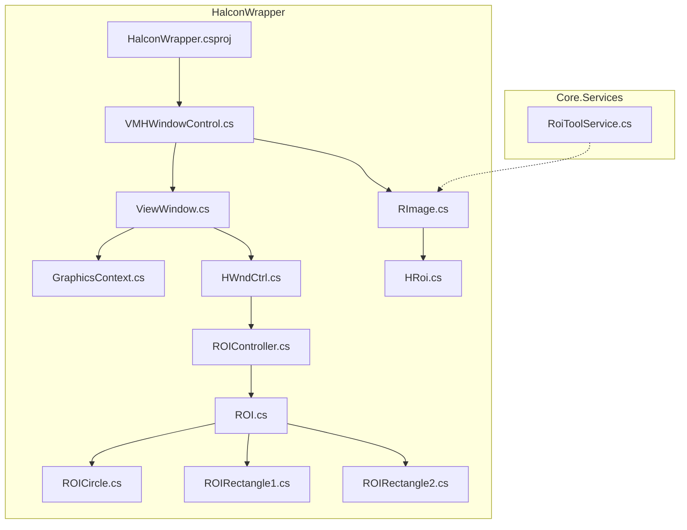
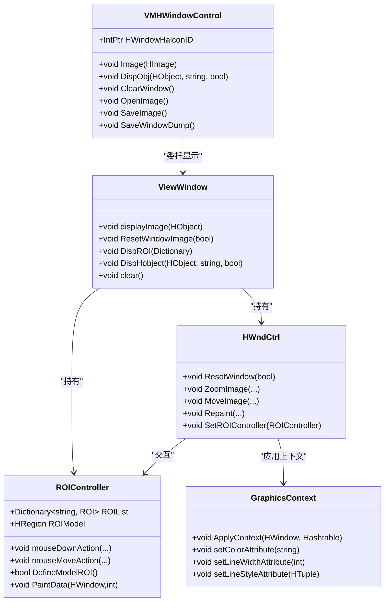
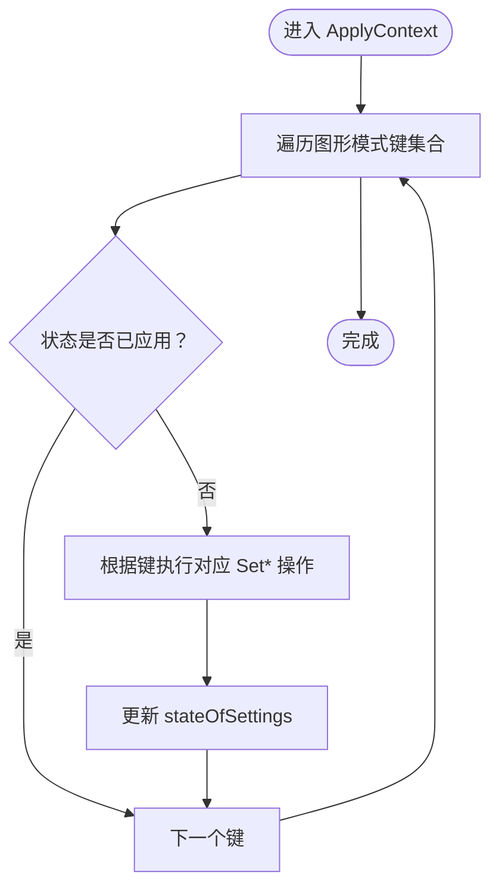
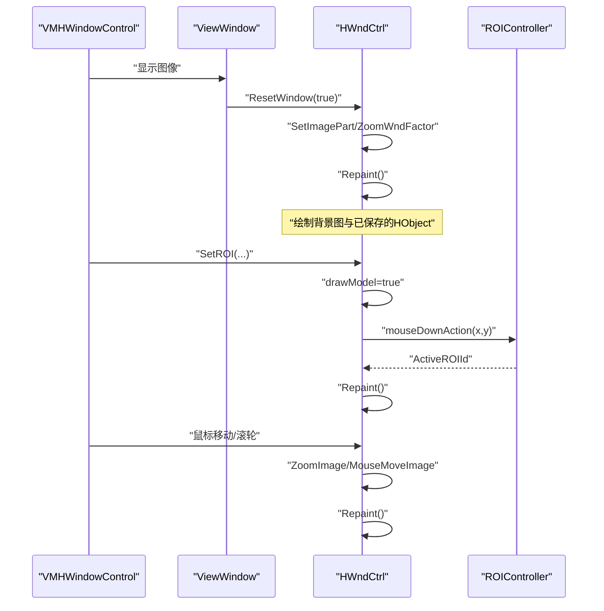
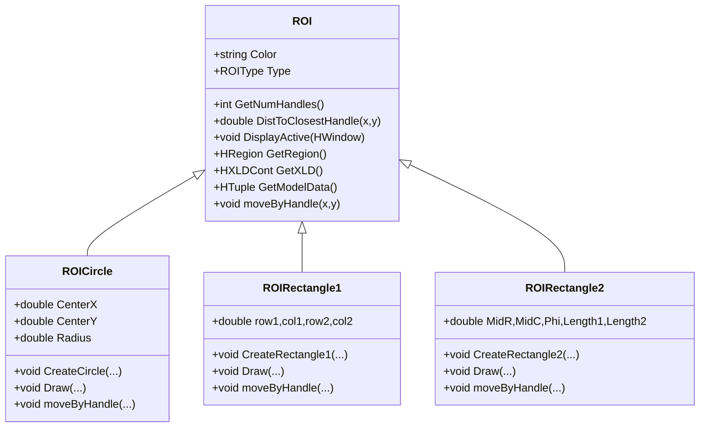
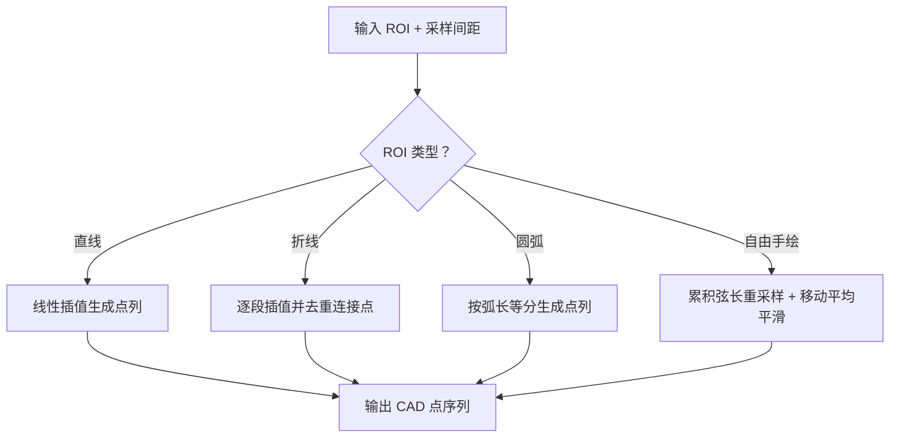
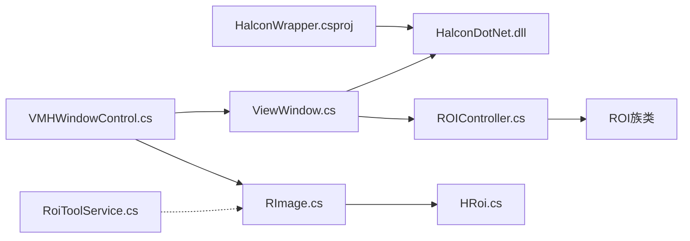

# 视觉处理模块

<cite>
**本文档引用的文件**
- [HalconWrapper.csproj](file://HalconWrapper/HalconWrapper.csproj)
- [VMHWindowControl.cs](file://HalconWrapper/VMHWindowControl.cs)
- [ViewWindow.cs](file://HalconWrapper/ViewWindow.cs)
- [GraphicsContext.cs](file://HalconWrapper/Model/GraphicsContext.cs)
- [HWndCtrl.cs](file://HalconWrapper/Model/HWndCtrl.cs)
- [ROIController.cs](file://HalconWrapper/Model/ROIController.cs)
- [ROI.cs](file://HalconWrapper/Model/ROI.cs)
- [ROICircle.cs](file://HalconWrapper/Model/ROICircle.cs)
- [ROIRectangle1.cs](file://HalconWrapper/Model/ROIRectangle1.cs)
- [ROIRectangle2.cs](file://HalconWrapper/Model/ROIRectangle2.cs)
- [RImage.cs](file://HalconWrapper/Config/RImage.cs)
- [HRoi.cs](file://HalconWrapper/Config/HRoi.cs)
- [RoiToolService.cs](file://Core/Services/RoiToolService.cs)
</cite>

## 目录
1. [简介](#简介)
2. [项目结构](#项目结构)
3. [核心组件](#核心组件)
4. [架构总览](#架构总览)
5. [详细组件分析](#详细组件分析)
6. [依赖关系分析](#依赖关系分析)
7. [性能考虑](#性能考虑)
8. [故障排除指南](#故障排除指南)
9. [结论](#结论)
10. [附录](#附录)

## 简介
本技术文档面向视觉处理模块，系统性阐述基于Halcon的封装库在WPF/WinForms中的应用架构与实现细节。重点包括：
- 图形上下文管理与渲染管线
- ROI工具服务与交互式区域管理
- 图像显示控件的实现与扩展
- 视觉检测算法的集成方式与图像预处理流程
- 特征提取策略与典型视觉工具（边缘检测、模板匹配、形状检测等）
- 视觉参数配置、结果可视化与质量评估
- 相机标定、坐标变换与精度校准的实现指南

## 项目结构
视觉处理模块主要由以下层次构成：
- HalconWrapper：Halcon封装层，提供图像显示控件、图形上下文、ROI控制器与可视化工具
- Core.Services：通用视觉工具服务，如ROI采样与离散化
- Core.Models：与视觉相关的模型与配置（如坐标变换、标定参数等）

**图表来源**
- [HalconWrapper.csproj:1-28](file://HalconWrapper/HalconWrapper.csproj#L1-L28)
- [VMHWindowControl.cs:1-894](file://HalconWrapper/VMHWindowControl.cs#L1-L894)
- [ViewWindow.cs:1-357](file://HalconWrapper/ViewWindow.cs#L1-L357)
- [GraphicsContext.cs:1-407](file://HalconWrapper/Model/GraphicsContext.cs#L1-L407)
- [HWndCtrl.cs:1-1136](file://HalconWrapper/Model/HWndCtrl.cs#L1-L1136)
- [ROIController.cs:1-875](file://HalconWrapper/Model/ROIController.cs#L1-L875)
- [ROI.cs:1-114](file://HalconWrapper/Model/ROI.cs#L1-L114)
- [ROICircle.cs:1-201](file://HalconWrapper/Model/ROICircle.cs#L1-L201)
- [ROIRectangle1.cs:1-236](file://HalconWrapper/Model/ROIRectangle1.cs#L1-L236)
- [ROIRectangle2.cs:1-316](file://HalconWrapper/Model/ROIRectangle2.cs#L1-L316)
- [RImage.cs:1-291](file://HalconWrapper/Config/RImage.cs#L1-L291)
- [HRoi.cs:1-179](file://HalconWrapper/Config/HRoi.cs#L1-L179)
- [RoiToolService.cs:1-354](file://Core/Services/RoiToolService.cs#L1-L354)

**章节来源**
- [HalconWrapper.csproj:1-28](file://HalconWrapper/HalconWrapper.csproj#L1-L28)
- [VMHWindowControl.cs:1-894](file://HalconWrapper/VMHWindowControl.cs#L1-L894)
- [ViewWindow.cs:1-357](file://HalconWrapper/ViewWindow.cs#L1-L357)
- [RoiToolService.cs:1-354](file://Core/Services/RoiToolService.cs#L1-L354)

## 核心组件
- 图形上下文管理（GraphicsContext）：统一管理Halcon窗口的绘制参数（颜色、线宽、填充、样式等），支持增量应用与状态备份，避免重复设置带来的性能损耗。
- 图像显示控件（VMHWindowControl + ViewWindow + HWndCtrl）：提供缩放、平移、鼠标交互、十字线、状态栏、截图与保存等功能；封装Halcon窗口与可视化栈，支持ROI绘制与交互。
- ROI工具服务（ROIController + ROI族类）：支持点、线、矩形1/2、圆、圆弧等ROI类型，提供交互式编辑、模型区域构建、正负运算组合等能力。
- 视觉配置与可视化（RImage + HRoi）：扩展HImage以携带位置、姿态、像素比例、标定信息以及要叠加显示的ROI与文本；支持序列化与深度克隆。
- ROI采样工具（Core.Services.RoiToolService）：对直线、折线、圆弧、自由手绘等几何ROI进行等间距采样与平滑，输出CAD点序列。

**章节来源**
- [GraphicsContext.cs:1-407](file://HalconWrapper/Model/GraphicsContext.cs#L1-L407)
- [VMHWindowControl.cs:1-894](file://HalconWrapper/VMHWindowControl.cs#L1-L894)
- [ViewWindow.cs:1-357](file://HalconWrapper/ViewWindow.cs#L1-L357)
- [HWndCtrl.cs:1-1136](file://HalconWrapper/Model/HWndCtrl.cs#L1-L1136)
- [ROIController.cs:1-875](file://HalconWrapper/Model/ROIController.cs#L1-L875)
- [ROI.cs:1-114](file://HalconWrapper/Model/ROI.cs#L1-L114)
- [ROICircle.cs:1-201](file://HalconWrapper/Model/ROICircle.cs#L1-L201)
- [ROIRectangle1.cs:1-236](file://HalconWrapper/Model/ROIRectangle1.cs#L1-L236)
- [ROIRectangle2.cs:1-316](file://HalconWrapper/Model/ROIRectangle2.cs#L1-L316)
- [RImage.cs:1-291](file://HalconWrapper/Config/RImage.cs#L1-L291)
- [HRoi.cs:1-179](file://HalconWrapper/Config/HRoi.cs#L1-L179)
- [RoiToolService.cs:1-354](file://Core/Services/RoiToolService.cs#L1-L354)

## 架构总览
视觉处理模块采用“控件-视图-控制器-模型”的分层架构：
- 控件层：VMHWindowControl承载Halcon窗口，提供UI交互入口
- 视图层：ViewWindow协调显示逻辑，封装HWndCtrl与ROIController
- 控制器层：HWndCtrl负责鼠标事件、缩放/平移、ROI绘制；ROIController负责ROI生命周期与模型区域生成
- 模型层：GraphicsContext管理图形上下文；ROI族类定义具体几何；RImage/HRoi承载图像与可视化元数据

**图表来源**
- [VMHWindowControl.cs:1-894](file://HalconWrapper/VMHWindowControl.cs#L1-L894)
- [ViewWindow.cs:1-357](file://HalconWrapper/ViewWindow.cs#L1-L357)
- [HWndCtrl.cs:1-1136](file://HalconWrapper/Model/HWndCtrl.cs#L1-L1136)
- [ROIController.cs:1-875](file://HalconWrapper/Model/ROIController.cs#L1-L875)
- [GraphicsContext.cs:1-407](file://HalconWrapper/Model/GraphicsContext.cs#L1-L407)

## 详细组件分析

### 图形上下文管理（GraphicsContext）
- 设计要点
  - 使用Hashtable维护图形模式键值对（颜色、线宽、填充、样式等）
  - 通过ApplyContext增量应用，避免重复设置
  - 维护stateOfSettings记录已应用状态，减少无效调用
- 性能特性
  - 仅在状态变化时更新，降低Halcon系统调用频率
  - 支持通知回调，便于错误追踪与日志

**图表来源**
- [GraphicsContext.cs:107-203](file://HalconWrapper/Model/GraphicsContext.cs#L107-L203)

**章节来源**
- [GraphicsContext.cs:1-407](file://HalconWrapper/Model/GraphicsContext.cs#L1-L407)

### 图像显示控件（VMHWindowControl + ViewWindow + HWndCtrl）
- 功能概览
  - 图像加载、缩放、平移、十字线、状态栏（坐标/灰度）、截图与保存
  - ROI绘制与交互（点选、拖拽、正负运算）
  - 绘图模式开关，禁用缩放与右键菜单
- 关键流程
  - 初始化：绑定Halcon窗口、注册菜单项、启用状态栏
  - 显示：displayImage -> ResetWindow -> Repaint
  - 交互：鼠标事件驱动ZoomImage/MouseMoveImage，Repaint刷新
  - ROI：SetROI触发绘制模式，ROIController响应鼠标事件

**图表来源**
- [VMHWindowControl.cs:568-894](file://HalconWrapper/VMHWindowControl.cs#L568-L894)
- [ViewWindow.cs:37-104](file://HalconWrapper/ViewWindow.cs#L37-L104)
- [HWndCtrl.cs:444-640](file://HalconWrapper/Model/HWndCtrl.cs#L444-L640)
- [ROIController.cs:263-323](file://HalconWrapper/Model/ROIController.cs#L263-L323)

**章节来源**
- [VMHWindowControl.cs:1-894](file://HalconWrapper/VMHWindowControl.cs#L1-L894)
- [ViewWindow.cs:1-357](file://HalconWrapper/ViewWindow.cs#L1-L357)
- [HWndCtrl.cs:1-1136](file://HalconWrapper/Model/HWndCtrl.cs#L1-L1136)
- [ROIController.cs:1-875](file://HalconWrapper/Model/ROIController.cs#L1-L875)

### ROI工具服务（ROIController + ROI族类）
- ROI类型
  - 点、线、坐标线、矩形1/2、圆、圆弧
  - 每种类型提供CreateXXX、Draw、DisplayActive、GetRegion/XLD、GetModelData、moveByHandle等
- 模型区域构建
  - 支持正负运算组合，生成最终模型区域用于检测
  - 提供DefineModelROI、RemoveActive、selectROI等管理接口

**图表来源**
- [ROI.cs:1-114](file://HalconWrapper/Model/ROI.cs#L1-L114)
- [ROICircle.cs:1-201](file://HalconWrapper/Model/ROICircle.cs#L1-L201)
- [ROIRectangle1.cs:1-236](file://HalconWrapper/Model/ROIRectangle1.cs#L1-L236)
- [ROIRectangle2.cs:1-316](file://HalconWrapper/Model/ROIRectangle2.cs#L1-L316)

**章节来源**
- [ROIController.cs:1-875](file://HalconWrapper/Model/ROIController.cs#L1-L875)
- [ROI.cs:1-114](file://HalconWrapper/Model/ROI.cs#L1-L114)
- [ROICircle.cs:1-201](file://HalconWrapper/Model/ROICircle.cs#L1-L201)
- [ROIRectangle1.cs:1-236](file://HalconWrapper/Model/ROIRectangle1.cs#L1-L236)
- [ROIRectangle2.cs:1-316](file://HalconWrapper/Model/ROIRectangle2.cs#L1-L316)

### 视觉配置与可视化（RImage + HRoi）
- RImage扩展HImage，增加位置、姿态、像素比例、标定信息与可视化列表
- HRoi/HText用于在图像上叠加显示ROI与文本标注
- 支持序列化与深度克隆，便于工程化存储与传输

**章节来源**
- [RImage.cs:1-291](file://HalconWrapper/Config/RImage.cs#L1-L291)
- [HRoi.cs:1-179](file://HalconWrapper/Config/HRoi.cs#L1-L179)

### ROI采样工具（Core.Services.RoiToolService）
- 支持直线、折线、圆弧、自由手绘四类几何ROI的等间距采样
- 自由手绘采用累积弦长重采样与移动平均平滑，提升轨迹稳定性
- 输出CAD点序列，便于后续路径规划与测量

**图表来源**
- [RoiToolService.cs:77-314](file://Core/Services/RoiToolService.cs#L77-L314)

**章节来源**
- [RoiToolService.cs:1-354](file://Core/Services/RoiToolService.cs#L1-L354)

## 依赖关系分析
- HalconWrapper对halcondotnet.dll存在直接依赖，需确保运行时可用
- 控件层与视图层解耦，通过接口与委托交互
- ROIController与HWndCtrl强耦合，共同完成交互式ROI管理
- RImage/HRoi与显示控件配合，形成“数据-显示”分离

**图表来源**
- [HalconWrapper.csproj:19-23](file://HalconWrapper/HalconWrapper.csproj#L19-L23)
- [VMHWindowControl.cs:1-14](file://HalconWrapper/VMHWindowControl.cs#L1-L14)
- [ViewWindow.cs:1-25](file://HalconWrapper/ViewWindow.cs#L1-L25)
- [ROIController.cs:1-56](file://HalconWrapper/Model/ROIController.cs#L1-L56)
- [RImage.cs:1-16](file://HalconWrapper/Config/RImage.cs#L1-L16)
- [HRoi.cs:1-15](file://HalconWrapper/Config/HRoi.cs#L1-L15)
- [RoiToolService.cs:1-13](file://Core/Services/RoiToolService.cs#L1-L13)

**章节来源**
- [HalconWrapper.csproj:1-28](file://HalconWrapper/HalconWrapper.csproj#L1-L28)
- [VMHWindowControl.cs:1-14](file://HalconWrapper/VMHWindowControl.cs#L1-L14)
- [ViewWindow.cs:1-25](file://HalconWrapper/ViewWindow.cs#L1-L25)
- [ROIController.cs:1-56](file://HalconWrapper/Model/ROIController.cs#L1-L56)
- [RImage.cs:1-16](file://HalconWrapper/Config/RImage.cs#L1-L16)
- [HRoi.cs:1-15](file://HalconWrapper/Config/HRoi.cs#L1-L15)
- [RoiToolService.cs:1-13](file://Core/Services/RoiToolService.cs#L1-L13)

## 性能考虑
- 图形上下文增量应用：避免重复设置，减少Halcon系统调用
- 可视化栈优化：HWndCtrl限制图标对象列表数量，降低渲染压力
- ROI模型区域缓存：DefineModelROI一次性计算，避免重复运算
- 采样平滑：移动平均平滑减少高频抖动，提高后续处理鲁棒性
- 序列化优化：RImage在序列化前清理无效HObject，降低体积与异常风险

[本节为通用指导，无需特定文件引用]

## 故障排除指南
- 图像无显示或显示异常
  - 检查Image属性赋值与Dispose时机，确保控件线程安全调用
  - 确认ResetWindow参数与图像尺寸匹配
- ROI无法交互或绘制失败
  - 确认drawModel状态与鼠标事件绑定
  - 检查ActiveROIId与ROIList索引一致性
- 性能卡顿
  - 减少Repaint调用频率，合并多次更新
  - 降低ROI数量或简化绘制样式
- 序列化异常
  - 确保HObject有效且已初始化
  - 使用深度克隆替代浅拷贝

**章节来源**
- [VMHWindowControl.cs:190-237](file://HalconWrapper/VMHWindowControl.cs#L190-L237)
- [HWndCtrl.cs:374-440](file://HalconWrapper/Model/HWndCtrl.cs#L374-L440)
- [ROIController.cs:158-205](file://HalconWrapper/Model/ROIController.cs#L158-L205)
- [RImage.cs:258-288](file://HalconWrapper/Config/RImage.cs#L258-L288)

## 结论
该视觉处理模块通过清晰的分层设计与完善的ROI/显示/上下文管理机制，提供了稳定高效的图像显示与交互能力。结合Core.Services的ROI采样工具，能够支撑从几何建模到路径规划的完整链路。建议在实际工程中重点关注：
- 图形上下文的增量应用与状态管理
- ROI交互的线程安全与事件处理
- 采样与平滑策略的参数调优
- 标定与坐标变换的一致性与精度

[本节为总结性内容，无需特定文件引用]

## 附录

### 视觉检测算法集成与图像预处理流程
- 集成方式
  - 将Halcon检测算子封装为服务方法，输入RImage，输出检测结果与ROI
  - 使用HRoi叠加标注，通过VMHWindowControl显示
- 预处理流程
  - 图像读取与格式转换（RImage.ReadRImage）
  - 坐标变换与标定（RImage.GetHome/GetAngle）
  - ROI采样与离散化（RoiToolService.SamplePoints）

**章节来源**
- [RImage.cs:118-125](file://HalconWrapper/Config/RImage.cs#L118-L125)
- [RoiToolService.cs:77-97](file://Core/Services/RoiToolService.cs#L77-L97)

### 特征提取策略与典型视觉工具
- 边缘检测：使用边缘算子生成边缘区域，结合ROI进行定向测量
- 模板匹配：生成模板ROI，使用模板匹配算子定位目标
- 形状检测：利用形状描述子（如矩形、圆形）进行识别与定位
- 质量评估：通过灰度统计、边缘连续性、匹配置信度等指标量化结果

[本节为通用指导，无需特定文件引用]

### 视觉参数配置、结果可视化与质量评估
- 参数配置
  - ROI类型与参数（点/线/矩形/圆/圆弧）
  - 采样间距与平滑窗口大小
  - 显示颜色与样式（GraphicsContext）
- 结果可视化
  - 使用HRoi/HText叠加标注
  - 通过VMHWindowControl显示与导出
- 质量评估
  - 统计指标：均值、方差、极值
  - 几何指标：长度、面积、角度、曲率
  - 一致性：多帧对比与标定误差

**章节来源**
- [HRoi.cs:158-179](file://HalconWrapper/Config/HRoi.cs#L158-L179)
- [GraphicsContext.cs:206-295](file://HalconWrapper/Model/GraphicsContext.cs#L206-L295)

### 相机标定、坐标变换与精度校准
- 相机标定
  - 通过标定板建立像素坐标与世界坐标的映射关系
  - 存储BoardRow/BoardCol/BoardX/BoardY与IsCal标志
- 坐标变换
  - 使用RImage.GetHome（ScaleX/ScaleY）与GetAngle（PhiX/PhiY）进行复合变换
- 精度校准
  - 对齐误差最小化，迭代优化标定参数
  - 使用已知标准尺寸进行验证

**章节来源**
- [RImage.cs:42-53](file://HalconWrapper/Config/RImage.cs#L42-L53)
- [RImage.cs:118-125](file://HalconWrapper/Config/RImage.cs#L118-L125)