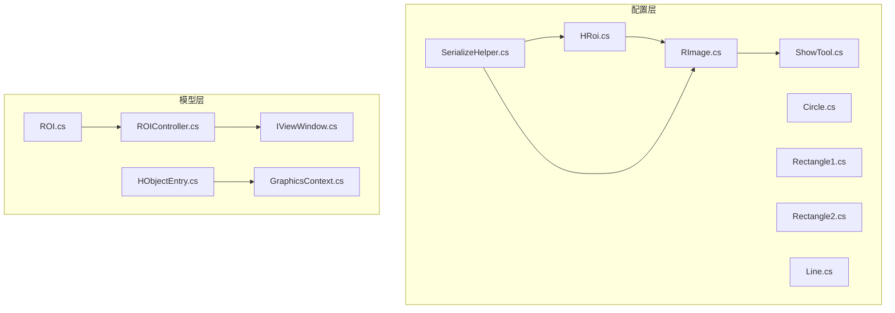
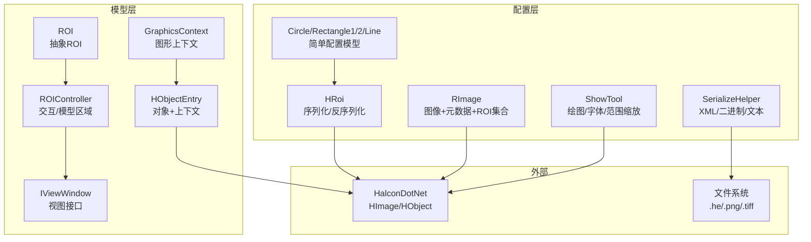
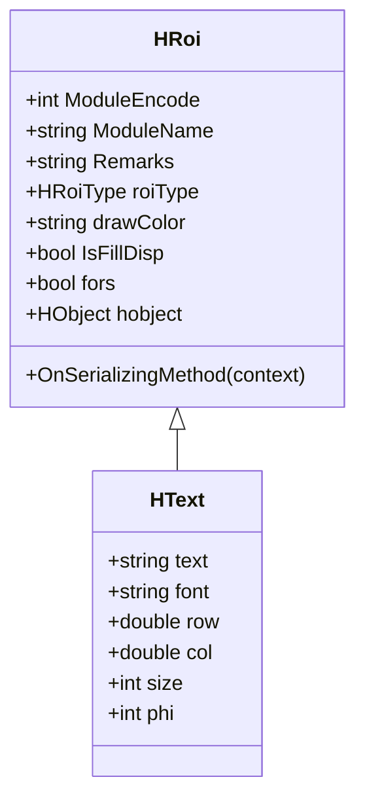
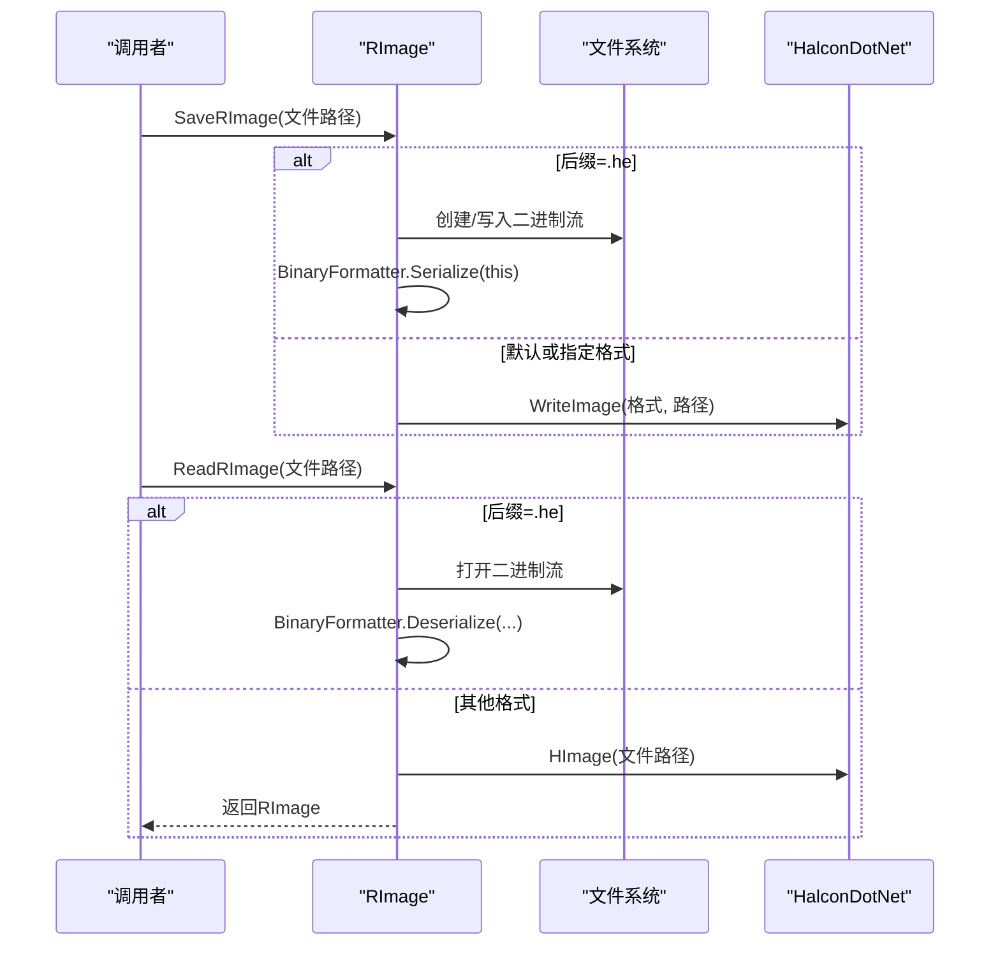
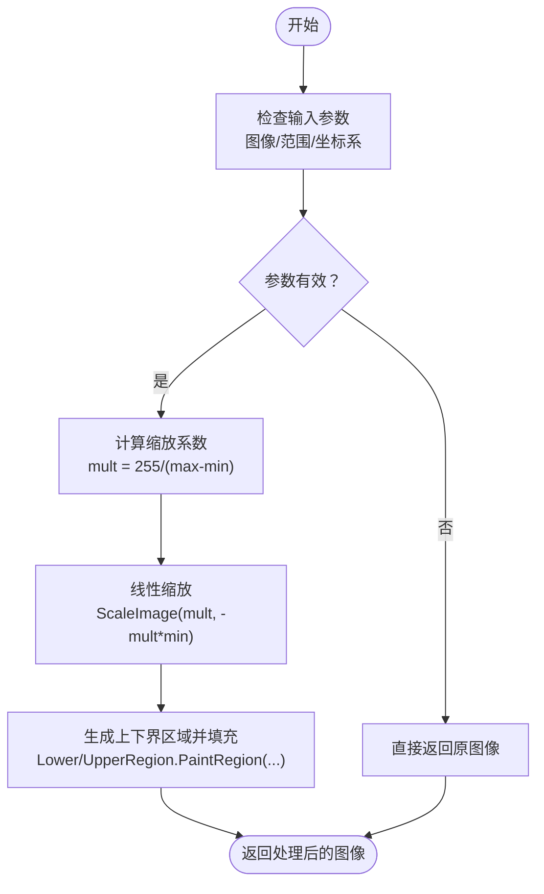
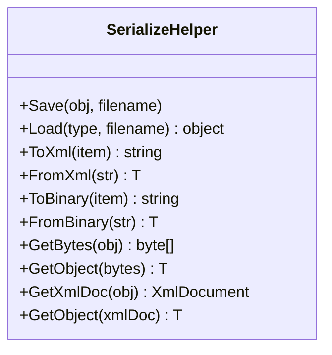
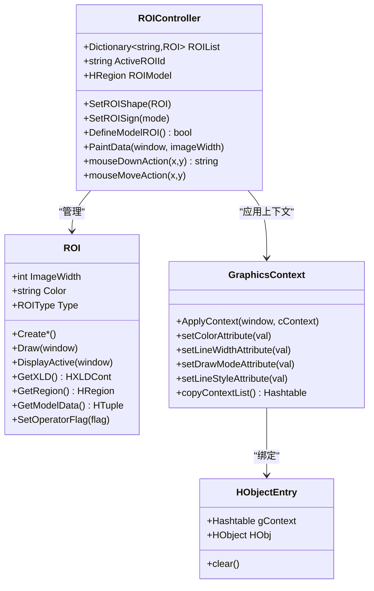
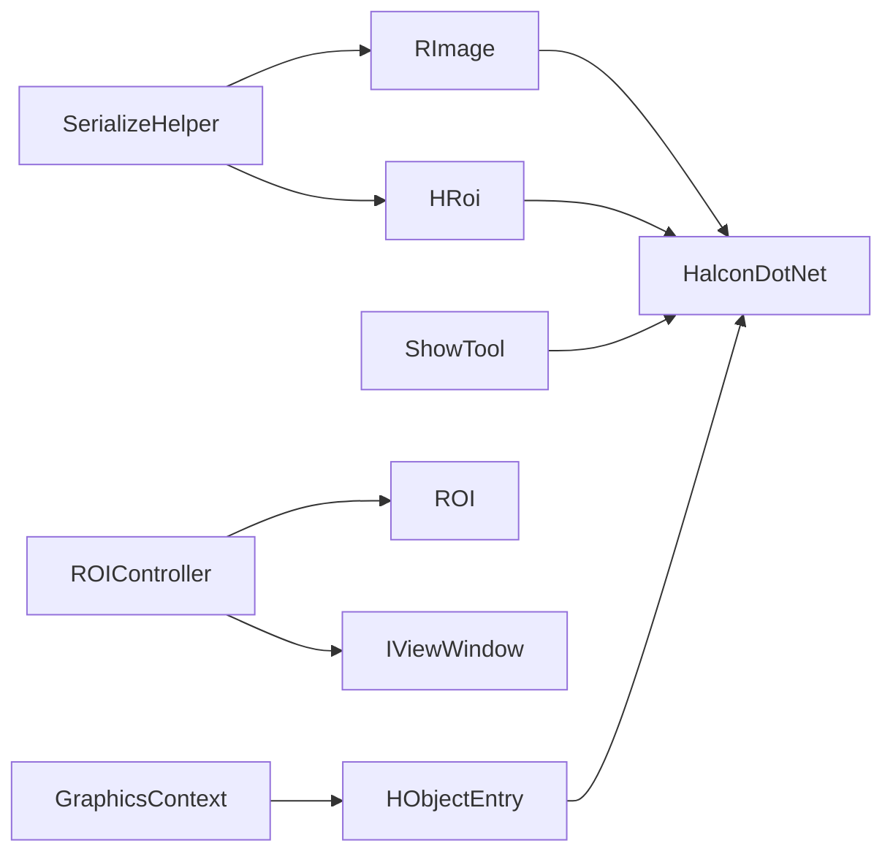

# 配置与工具集

<cite>
**本文引用的文件**
- [HRoi.cs](file://HalconWrapper/Config/HRoi.cs)
- [RImage.cs](file://HalconWrapper/Config/RImage.cs)
- [ShowTool.cs](file://HalconWrapper/Config/ShowTool.cs)
- [SerializeHelper.cs](file://HalconWrapper/Config/SerializeHelper.cs)
- [Circle.cs](file://HalconWrapper/Config/Circle.cs)
- [Rectangle1.cs](file://HalconWrapper/Config/Rectangle1.cs)
- [Rectangle2.cs](file://HalconWrapper/Config/Rectangle2.cs)
- [Line.cs](file://HalconWrapper/Config/Line.cs)
- [HObjectEntry.cs](file://HalconWrapper/Model/HObjectEntry.cs)
- [GraphicsContext.cs](file://HalconWrapper/Model/GraphicsContext.cs)
- [ROI.cs](file://HalconWrapper/Model/ROI.cs)
- [ROIController.cs](file://HalconWrapper/Model/ROIController.cs)
- [IViewWindow.cs](file://HalconWrapper/Model/IViewWindow.cs)
</cite>

## 目录
1. [引言](#引言)
2. [项目结构](#项目结构)
3. [核心组件](#核心组件)
4. [架构总览](#架构总览)
5. [详细组件分析](#详细组件分析)
6. [依赖关系分析](#依赖关系分析)
7. [性能考虑](#性能考虑)
8. [故障排查指南](#故障排查指南)
9. [结论](#结论)
10. [附录](#附录)

## 引言
本文件面向视觉处理配置与工具集，聚焦以下主题：
- HRoi 配置类的设计：ROI 的序列化、反序列化、配置文件管理
- RImage 图像配置：图像格式转换、内存管理、性能优化
- ShowTool 显示工具：图形绘制参数、样式配置、显示效果控制
- SerializeHelper 序列化助手：对象序列化、配置持久化、版本兼容性处理
- 配置文件结构、参数验证规则与错误处理机制

目标是帮助开发者快速理解并正确使用这些组件，确保在图像显示、ROI 管理与配置持久化方面具备可维护性与可扩展性。

## 项目结构
本节概览与视觉处理相关的配置与模型层组织方式，重点文件分布如下：
- 配置层（HalconWrapper/Config）：HRoi、RImage、ShowTool、SerializeHelper 及若干简单配置模型（Circle、Rectangle1、Rectangle2、Line）
- 模型层（HalconWrapper/Model）：HObjectEntry、GraphicsContext、ROI、ROIController、IViewWindow

图示来源
- [HRoi.cs](file://HalconWrapper/Config/HRoi.cs)
- [RImage.cs](file://HalconWrapper/Config/RImage.cs)
- [ShowTool.cs](file://HalconWrapper/Config/ShowTool.cs)
- [SerializeHelper.cs](file://HalconWrapper/Config/SerializeHelper.cs)
- [Circle.cs](file://HalconWrapper/Config/Circle.cs)
- [Rectangle1.cs](file://HalconWrapper/Config/Rectangle1.cs)
- [Rectangle2.cs](file://HalconWrapper/Config/Rectangle2.cs)
- [Line.cs](file://HalconWrapper/Config/Line.cs)
- [HObjectEntry.cs](file://HalconWrapper/Model/HObjectEntry.cs)
- [GraphicsContext.cs](file://HalconWrapper/Model/GraphicsContext.cs)
- [ROI.cs](file://HalconWrapper/Model/ROI.cs)
- [ROIController.cs](file://HalconWrapper/Model/ROIController.cs)
- [IViewWindow.cs](file://HalconWrapper/Model/IViewWindow.cs)

章节来源
- [HRoi.cs](file://HalconWrapper/Config/HRoi.cs)
- [RImage.cs](file://HalconWrapper/Config/RImage.cs)
- [ShowTool.cs](file://HalconWrapper/Config/ShowTool.cs)
- [SerializeHelper.cs](file://HalconWrapper/Config/SerializeHelper.cs)
- [Circle.cs](file://HalconWrapper/Config/Circle.cs)
- [Rectangle1.cs](file://HalconWrapper/Config/Rectangle1.cs)
- [Rectangle2.cs](file://HalconWrapper/Config/Rectangle2.cs)
- [Line.cs](file://HalconWrapper/Config/Line.cs)
- [HObjectEntry.cs](file://HalconWrapper/Model/HObjectEntry.cs)
- [GraphicsContext.cs](file://HalconWrapper/Model/GraphicsContext.cs)
- [ROI.cs](file://HalconWrapper/Model/ROI.cs)
- [ROIController.cs](file://HalconWrapper/Model/ROIController.cs)
- [IViewWindow.cs](file://HalconWrapper/Model/IViewWindow.cs)

## 核心组件
- HRoi：用于展示效果的 HObject 容器，支持序列化钩子以规避未初始化 HObject 导致的异常；提供 HText 文本标注扩展
- RImage：继承自 HImage，实现 ISerializable，负责图像元数据、标定信息、显示 ROI/文本集合、序列化与反序列化、图像保存与读取
- ShowTool：提供统一的 Halcon 绘图接口，包括消息框绘制、字体设置、图像范围缩放等
- SerializeHelper：提供 XML、二进制、文本化序列化与反序列化能力，支持对象字节数组与 XML 文档互转
- ROI/ROIController：交互式 ROI 管理与绘制，支持多种几何形状与模型区域生成
- GraphicsContext/HObjectEntry：图形上下文与 HALCON 对象绑定，用于窗口绘制前的状态应用

章节来源
- [HRoi.cs](file://HalconWrapper/Config/HRoi.cs)
- [RImage.cs](file://HalconWrapper/Config/RImage.cs)
- [ShowTool.cs](file://HalconWrapper/Config/ShowTool.cs)
- [SerializeHelper.cs](file://HalconWrapper/Config/SerializeHelper.cs)
- [ROI.cs](file://HalconWrapper/Model/ROI.cs)
- [ROIController.cs](file://HalconWrapper/Model/ROIController.cs)
- [GraphicsContext.cs](file://HalconWrapper/Model/GraphicsContext.cs)
- [HObjectEntry.cs](file://HalconWrapper/Model/HObjectEntry.cs)

## 架构总览
下图展示配置与工具集在视觉处理中的角色与交互关系：

图示来源
- [HRoi.cs](file://HalconWrapper/Config/HRoi.cs)
- [RImage.cs](file://HalconWrapper/Config/RImage.cs)
- [ShowTool.cs](file://HalconWrapper/Config/ShowTool.cs)
- [SerializeHelper.cs](file://HalconWrapper/Config/SerializeHelper.cs)
- [Circle.cs](file://HalconWrapper/Config/Circle.cs)
- [Rectangle1.cs](file://HalconWrapper/Config/Rectangle1.cs)
- [Rectangle2.cs](file://HalconWrapper/Config/Rectangle2.cs)
- [Line.cs](file://HalconWrapper/Config/Line.cs)
- [ROI.cs](file://HalconWrapper/Model/ROI.cs)
- [ROIController.cs](file://HalconWrapper/Model/ROIController.cs)
- [GraphicsContext.cs](file://HalconWrapper/Model/GraphicsContext.cs)
- [HObjectEntry.cs](file://HalconWrapper/Model/HObjectEntry.cs)
- [IViewWindow.cs](file://HalconWrapper/Model/IViewWindow.cs)

## 详细组件分析

### HRoi 配置类设计
- 设计要点
  - 通过 [Serializable] 标注与 OnSerializing 钩子，确保序列化前清理未初始化的 HObject，避免异常
  - 提供 HText 文本标注扩展，支持字体、颜色、位置、大小、角度等属性
  - 支持循环显示标志位，便于批量或增量更新
- 关键字段与行为
  - 模块标识：模块编码、名称、备注
  - 类型与外观：ROI 类型、绘制颜色、填充显示
  - 数据载体：HObject（轮廓/区域）、数组形式构造
- 序列化与配置文件管理
  - 与 RImage 的 mHRoi/mHText 集合配合，实现 ROI 的持久化与加载
  - 在 OnSerializing 钩子中保证 HObject 初始化状态，提升跨版本兼容性

图示来源
- [HRoi.cs](file://HalconWrapper/Config/HRoi.cs)

章节来源
- [HRoi.cs](file://HalconWrapper/Config/HRoi.cs)

### RImage 图像配置实现
- 设计要点
  - 继承 HImage 并实现 ISerializable，提供完整的序列化/反序列化流程
  - 元数据：名称、视图ID、采集位置与姿态、像素比例、标定映射
  - 显示集合：mHRoi、mHText，支持按模块名增删改查
  - 图像保存与读取：支持 .he 二进制与通用图像格式（自动推断）
- 关键流程
  - 序列化：写入元数据、ROI 集合、图像数据（HSerializedItem）
  - 反序列化：读取元数据与集合，必要时进行兼容性修正（如 ScaleX/Y 缺省值）
  - 深拷贝：通过二进制序列化实现安全克隆，过滤无效 HObject
  - 图像范围缩放：提供 HHomMat2D 计算，结合 ScaleX/ScaleY 与 PhiX 实现校正

图示来源
- [RImage.cs](file://HalconWrapper/Config/RImage.cs)

章节来源
- [RImage.cs](file://HalconWrapper/Config/RImage.cs)

### ShowTool 显示工具设计理念
- 设计理念
  - 封装 Halcon 绘图常用操作，统一消息框绘制、字体设置、图像范围缩放
  - 通过参数化接口简化调用复杂度，减少重复样板代码
- 关键功能
  - SetMsg：支持窗口/图像坐标系、颜色盒、阴影、多行文本等
  - SetFont：跨平台字体查询与组合，支持粗体/斜体
  - ScaleImageRange：对单通道图像进行线性范围映射与裁剪，避免溢出
- 参数与样式
  - 坐标系统：'window'/'image'
  - 颜色：支持空/自动/具体颜色字符串
  - 字体：'mono'/'sans'/'serif'/'Courier' 等族别映射
  - 样式：阴影开关、盒背景色、描边模式

图示来源
- [ShowTool.cs](file://HalconWrapper/Config/ShowTool.cs)

章节来源
- [ShowTool.cs](file://HalconWrapper/Config/ShowTool.cs)

### SerializeHelper 序列化助手使用方法
- 使用场景
  - 配置文件持久化：XML/二进制/文本化
  - 对象序列化：字节数组/XmlDocument
  - 版本兼容：通过二进制/文本化存储，便于跨版本迁移
- 方法概览
  - XML：Save/Load、ToXml/FromXml
  - 二进制：ToBinary/FromBinary、GetBytes/GetObject
  - 文档：GetXmlDoc/GetObject(XmlDocument)
- 注意事项
  - 二进制序列化依赖类型可序列化，注意跨平台/跨框架兼容
  - XML 序列化需类型公开且具备无参构造

图示来源
- [SerializeHelper.cs](file://HalconWrapper/Config/SerializeHelper.cs)

章节来源
- [SerializeHelper.cs](file://HalconWrapper/Config/SerializeHelper.cs)

### ROI 与 ROIController：交互式图形管理
- ROI 抽象
  - 定义创建、绘制、激活、移动、模型数据导出等接口
  - 支持正负运算标志，决定模型区域的并差运算
- ROIController
  - 管理 ROI 列表、活动 ROI、模型区域生成
  - 提供鼠标事件响应（创建/移动/删除），并通知观察者
  - 支持多种几何形状的生成与显示
- GraphicsContext/HObjectEntry
  - 将图形上下文（颜色、线宽、绘制模式、样式等）应用于窗口
  - 通过 HObjectEntry 将 HALCON 对象与其图形上下文绑定

图示来源
- [ROI.cs](file://HalconWrapper/Model/ROI.cs)
- [ROIController.cs](file://HalconWrapper/Model/ROIController.cs)
- [GraphicsContext.cs](file://HalconWrapper/Model/GraphicsContext.cs)
- [HObjectEntry.cs](file://HalconWrapper/Model/HObjectEntry.cs)

章节来源
- [ROI.cs](file://HalconWrapper/Model/ROI.cs)
- [ROIController.cs](file://HalconWrapper/Model/ROIController.cs)
- [GraphicsContext.cs](file://HalconWrapper/Model/GraphicsContext.cs)
- [HObjectEntry.cs](file://HalconWrapper/Model/HObjectEntry.cs)

## 依赖关系分析
- 配置层内部依赖
  - HRoi/RImage/ShowTool/SerializeHelper 彼此独立，但 RImage 与 HRoi 通过 mHRoi/mHText 协作
  - Circle/Rectangle1/Rectangle2/Line 作为简单配置模型，可与 HRoi 结合使用
- 模型层内部依赖
  - ROIController 依赖 ROI 抽象与多种具体 ROI 实现
  - GraphicsContext 与 HObjectEntry 协同，将上下文应用到 HALCON 对象
- 外部依赖
  - HalconDotNet：HImage/HObject/HTuple 等
  - 文件系统：.he 二进制与通用图像格式读写

图示来源
- [SerializeHelper.cs](file://HalconWrapper/Config/SerializeHelper.cs)
- [RImage.cs](file://HalconWrapper/Config/RImage.cs)
- [HRoi.cs](file://HalconWrapper/Config/HRoi.cs)
- [ShowTool.cs](file://HalconWrapper/Config/ShowTool.cs)
- [ROIController.cs](file://HalconWrapper/Model/ROIController.cs)
- [ROI.cs](file://HalconWrapper/Model/ROI.cs)
- [IViewWindow.cs](file://HalconWrapper/Model/IViewWindow.cs)
- [GraphicsContext.cs](file://HalconWrapper/Model/GraphicsContext.cs)
- [HObjectEntry.cs](file://HalconWrapper/Model/HObjectEntry.cs)

章节来源
- [SerializeHelper.cs](file://HalconWrapper/Config/SerializeHelper.cs)
- [RImage.cs](file://HalconWrapper/Config/RImage.cs)
- [HRoi.cs](file://HalconWrapper/Config/HRoi.cs)
- [ShowTool.cs](file://HalconWrapper/Config/ShowTool.cs)
- [ROIController.cs](file://HalconWrapper/Model/ROIController.cs)
- [ROI.cs](file://HalconWrapper/Model/ROI.cs)
- [IViewWindow.cs](file://HalconWrapper/Model/IViewWindow.cs)
- [GraphicsContext.cs](file://HalconWrapper/Model/GraphicsContext.cs)
- [HObjectEntry.cs](file://HalconWrapper/Model/HObjectEntry.cs)

## 性能考虑
- 序列化与内存
  - RImage 的深拷贝通过二进制序列化实现，避免浅拷贝导致的 HObject 生命周期问题
  - OnSerializing 钩子提前清理未初始化 HObject，降低序列化失败概率
- 图像处理
  - ScaleImageRange 采用线性变换与区域裁剪，避免逐像素遍历，提高效率
- 绘图上下文
  - GraphicsContext 仅在状态变化时应用，减少不必要的窗口设置调用

章节来源
- [RImage.cs](file://HalconWrapper/Config/RImage.cs)
- [ShowTool.cs](file://HalconWrapper/Config/ShowTool.cs)
- [GraphicsContext.cs](file://HalconWrapper/Model/GraphicsContext.cs)

## 故障排查指南
- 序列化异常
  - 现象：序列化/反序列化抛出异常
  - 排查：确认 HObject 是否初始化；检查 OnSerializing 钩子是否生效；优先使用二进制/文本化序列化
- 图像读取失败
  - 现象：ReadRImage 返回空或异常
  - 排查：检查文件后缀与格式；确认 .he 文件完整性；验证图像路径存在
- 绘图参数错误
  - 现象：SetMsg/SetFont 抛出 HalconException
  - 排查：核对颜色/字体/坐标系参数；确保窗口句柄有效；检查字体可用性
- ROI 模型为空
  - 现象：DefineModelROI 返回 false
  - 排查：确认 ROI 列表非空；检查正负运算标志；验证 ROI 几何有效性

章节来源
- [RImage.cs](file://HalconWrapper/Config/RImage.cs)
- [ShowTool.cs](file://HalconWrapper/Config/ShowTool.cs)
- [ROIController.cs](file://HalconWrapper/Model/ROIController.cs)

## 结论
本配置与工具集围绕 ROI、图像与绘图三大核心展开，通过严谨的序列化策略、完善的元数据管理与统一的绘图接口，实现了良好的可维护性与可扩展性。建议在实际工程中：
- 使用 RImage 管理图像与显示 ROI，配合 SerializeHelper 进行持久化
- 通过 HRoi/HText 描述可视化要素，利用 OnSerializing 钩子保障稳定性
- 使用 ShowTool 统一绘图入口，确保样式与参数一致性
- 在需要跨版本兼容时，优先采用二进制/文本化序列化方案

## 附录
- 配置文件结构与参数验证
  - Circle/Rectangle1/Rectangle2/Line：提供 XML 序列化支持，字段带 ElementName 映射，适合与 HRoi/HText 组合使用
  - 参数验证建议：颜色字符串合法性、坐标范围合理性、半径/长度非负性
- 错误处理机制
  - RImage：读取/保存异常捕获与返回空值
  - ShowTool：Halcon 异常包装与日志输出
  - SerializeHelper：显式抛出异常以便上层处理

章节来源
- [Circle.cs](file://HalconWrapper/Config/Circle.cs)
- [Rectangle1.cs](file://HalconWrapper/Config/Rectangle1.cs)
- [Rectangle2.cs](file://HalconWrapper/Config/Rectangle2.cs)
- [Line.cs](file://HalconWrapper/Config/Line.cs)
- [RImage.cs](file://HalconWrapper/Config/RImage.cs)
- [ShowTool.cs](file://HalconWrapper/Config/ShowTool.cs)
- [SerializeHelper.cs](file://HalconWrapper/Config/SerializeHelper.cs)