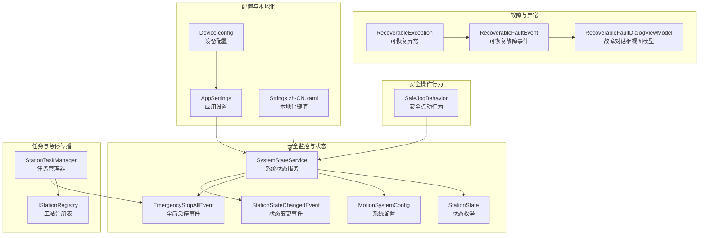
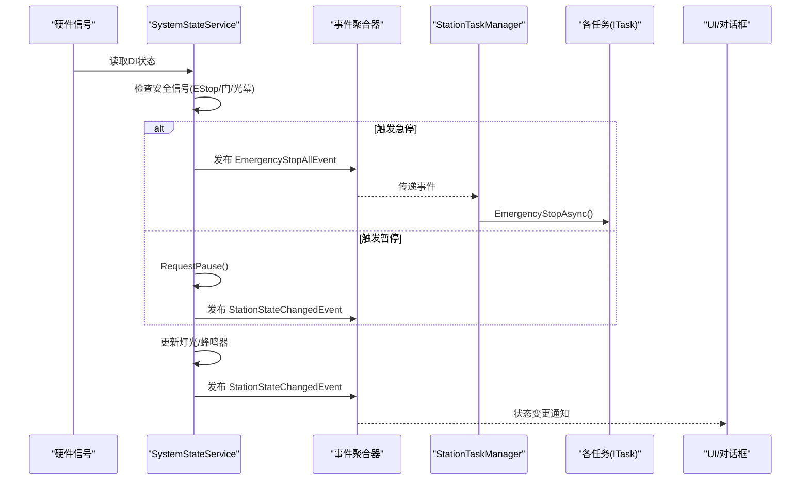
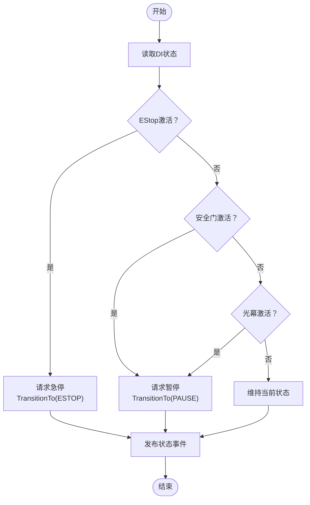
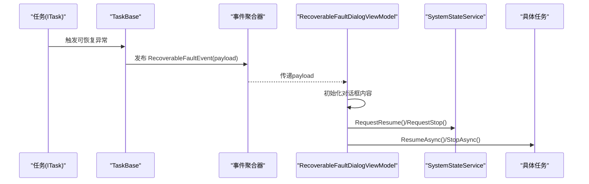
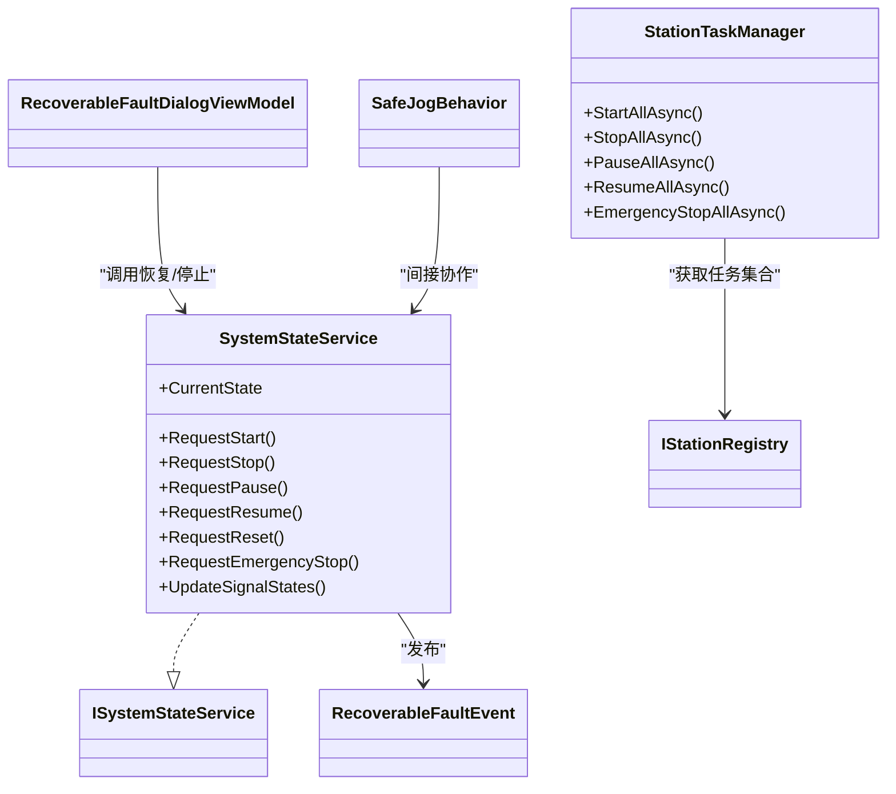
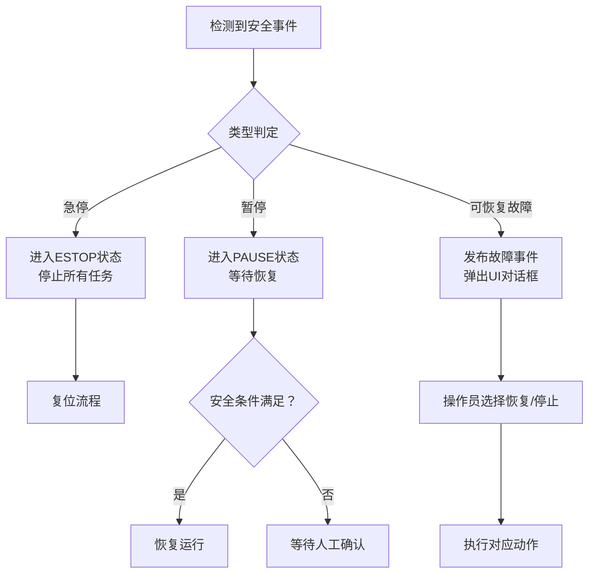

# 安全保护机制

<cite>
**本文档引用的文件**
- [SystemStateService.cs](file://MotionControl/Services/SystemStateService.cs)
- [ISystemStateService.cs](file://MotionControl/Interfaces/ISystemStateService.cs)
- [StationState.cs](file://MotionControl/Models/StationState.cs)
- [MotionSystemConfig.cs](file://MotionControl/Models/MotionSystemConfig.cs)
- [StationStateChangedEvent.cs](file://MotionControl/Events/StationStateChangedEvent.cs)
- [EmergencyStopAllEvent.cs](file://MotionControl/Events/EmergencyStopAllEvent.cs)
- [RecoverableFaultEvent.cs](file://MotionControl/Events/RecoverableFaultEvent.cs)
- [RecoverableException.cs](file://MotionControl/Exceptions/RecoverableException.cs)
- [RecoverableFaultDialogViewModel.cs](file://MotionControl/ViewModels/RecoverableFaultDialogViewModel.cs)
- [StationTaskManager.cs](file://MotionControl/Services/StationTaskManager.cs)
- [SafeJogBehavior.cs](file://MotionControl/Behaviors/SafeJogBehavior.cs)
- [AppSettings.cs](file://Core/Configuration/AppSettings.cs)
- [IStationRegistry.cs](file://Core/Abstraction/IStationRegistry.cs)
- [Strings.zh-CN.xaml](file://MainApp/Languages/Strings.zh-CN.xaml)
- [Device.config](file://MainApp/Device.config)
</cite>

## 目录
1. [简介](#简介)
2. [项目结构](#项目结构)
3. [核心组件](#核心组件)
4. [架构总览](#架构总览)
5. [详细组件分析](#详细组件分析)
6. [依赖关系分析](#依赖关系分析)
7. [性能考量](#性能考量)
8. [故障排查指南](#故障排查指南)
9. [结论](#结论)
10. [附录](#附录)

## 简介
本文件面向运动控制系统中的安全保护机制，系统化梳理急停机制、限位/联锁保护、可恢复故障处理、安全状态监控与指示灯/蜂鸣器联动、以及安全操作行为与权限验证相关的设计与实现。文档以代码为依据，结合可视化图示，帮助非专业读者理解系统如何在硬件信号与软件服务之间建立可靠的安全闭环。

## 项目结构
安全保护机制主要分布在以下模块与文件：
- 系统状态与安全监控：SystemStateService、StationState、MotionSystemConfig、StationStateChangedEvent、EmergencyStopAllEvent
- 故障与异常：RecoverableFaultEvent、RecoverableException、RecoverableFaultDialogViewModel
- 任务与急停传播：StationTaskManager
- 安全操作行为：SafeJogBehavior
- 配置与本地化：AppSettings、Device.config、Strings.zh-CN.xaml
- 注册表与扩展：IStationRegistry

**图表来源**
- [SystemStateService.cs:15-86](file://MotionControl/Services/SystemStateService.cs#L15-L86)
- [StationState.cs:3-15](file://MotionControl/Models/StationState.cs#L3-L15)
- [MotionSystemConfig.cs:5-71](file://MotionControl/Models/MotionSystemConfig.cs#L5-L71)
- [StationStateChangedEvent.cs:6-17](file://MotionControl/Events/StationStateChangedEvent.cs#L6-L17)
- [EmergencyStopAllEvent.cs:5-6](file://MotionControl/Events/EmergencyStopAllEvent.cs#L5-L6)
- [RecoverableFaultEvent.cs:13-23](file://MotionControl/Events/RecoverableFaultEvent.cs#L13-L23)
- [RecoverableException.cs:8-24](file://MotionControl/Exceptions/RecoverableException.cs#L8-L24)
- [RecoverableFaultDialogViewModel.cs:11-61](file://MotionControl/ViewModels/RecoverableFaultDialogViewModel.cs#L11-L61)
- [StationTaskManager.cs:13-64](file://MotionControl/Services/StationTaskManager.cs#L13-L64)
- [SafeJogBehavior.cs:23-76](file://MotionControl/Behaviors/SafeJogBehavior.cs#L23-L76)
- [AppSettings.cs:10-39](file://Core/Configuration/AppSettings.cs#L10-L39)
- [Device.config:1-1](file://MainApp/Device.config#L1-L1)
- [Strings.zh-CN.xaml:1689-1706](file://MainApp/Languages/Strings.zh-CN.xaml#L1689-L1706)

**章节来源**
- [SystemStateService.cs:15-86](file://MotionControl/Services/SystemStateService.cs#L15-L86)
- [MotionSystemConfig.cs:5-71](file://MotionControl/Models/MotionSystemConfig.cs#L5-L71)
- [AppSettings.cs:10-39](file://Core/Configuration/AppSettings.cs#L10-L39)

## 核心组件
- 系统状态服务：负责轮询输入信号、判定安全条件、驱动状态机转换、控制灯光与蜂鸣器、发布状态事件。
- 状态机：定义运行、暂停、停止、急停、复位等状态及转换条件。
- 可恢复故障：封装可预期的工艺阻碍，提供建议措施，并通过事件与UI对话框进行人机交互。
- 急停传播：通过全局事件向各任务广播急停，确保系统一致停止。
- 安全点动：保证点动操作在多种交互场景下的安全停止。
- 配置与本地化：运行时热更新安全开关，提供界面文案支撑。

**章节来源**
- [ISystemStateService.cs:5-22](file://MotionControl/Interfaces/ISystemStateService.cs#L5-L22)
- [StationState.cs:3-15](file://MotionControl/Models/StationState.cs#L3-L15)
- [RecoverableFaultEvent.cs:5-23](file://MotionControl/Events/RecoverableFaultEvent.cs#L5-L23)
- [RecoverableException.cs:8-24](file://MotionControl/Exceptions/RecoverableException.cs#L8-L24)
- [StationTaskManager.cs:59-64](file://MotionControl/Services/StationTaskManager.cs#L59-L64)
- [SafeJogBehavior.cs:23-76](file://MotionControl/Behaviors/SafeJogBehavior.cs#L23-L76)
- [AppSettings.cs:26-29](file://Core/Configuration/AppSettings.cs#L26-L29)

## 架构总览
系统采用“硬件信号—状态服务—任务管理—人机交互”的分层设计。SystemStateService作为中枢，读取DI信号，判定安全条件，驱动状态机；通过事件向任务与UI广播；同时控制DO输出（指示灯、蜂鸣器）。StationTaskManager订阅全局急停事件，向各任务传播停止指令，确保一致性。

**图表来源**
- [SystemStateService.cs:147-235](file://MotionControl/Services/SystemStateService.cs#L147-L235)
- [EmergencyStopAllEvent.cs:5-6](file://MotionControl/Events/EmergencyStopAllEvent.cs#L5-L6)
- [StationTaskManager.cs:59-64](file://MotionControl/Services/StationTaskManager.cs#L59-L64)
- [StationStateChangedEvent.cs:8-16](file://MotionControl/Events/StationStateChangedEvent.cs#L8-L16)

## 详细组件分析

### 急停机制与全局传播
- 急停触发：SystemStateService轮询EStop信号，一旦激活即请求急停并进入ESTOP状态；同时记录安全事件日志。
- 急停传播：SystemStateService内部订阅全局急停事件；StationTaskManager订阅该事件并向所有任务广播EmergencyStopAsync，确保各工站一致停止。
- 急停解除：需要先完成复位流程，复位成功后进入WAITRUN，方可继续运行。

**图表来源**
- [SystemStateService.cs:207-235](file://MotionControl/Services/SystemStateService.cs#L207-L235)
- [StationStateChangedEvent.cs:8-16](file://MotionControl/Events/StationStateChangedEvent.cs#L8-L16)

**章节来源**
- [SystemStateService.cs:207-235](file://MotionControl/Services/SystemStateService.cs#L207-L235)
- [EmergencyStopAllEvent.cs:5-6](file://MotionControl/Events/EmergencyStopAllEvent.cs#L5-L6)
- [StationTaskManager.cs:59-64](file://MotionControl/Services/StationTaskManager.cs#L59-L64)

### 限位/安全联锁（安全门与光幕）
- 安全信号分组：SystemStateService将信号按组归类（ControlButtons、EStop、SafetyGates、Grating），统一处理。
- 联锁策略：当安全门或光幕激活且系统处于RUNNING时，自动请求暂停；仅在确认安全解除后才允许恢复运行。
- 复位条件：复位前需满足配置中“ResetMustOff/On”等DI条件，避免误复位。
- 日志记录：启用安全事件日志时，记录信号状态变化详情，便于追溯。

**章节来源**
- [SystemStateService.cs:105-140](file://MotionControl/Services/SystemStateService.cs#L105-L140)
- [SystemStateService.cs:207-235](file://MotionControl/Services/SystemStateService.cs#L207-L235)
- [SystemStateService.cs:334-341](file://MotionControl/Services/SystemStateService.cs#L334-L341)
- [MotionSystemConfig.cs:41-48](file://MotionControl/Models/MotionSystemConfig.cs#L41-L48)

### 可恢复故障处理与人机交互
- 异常模型：RecoverableException携带错误消息与建议措施，便于一线操作员快速定位与处置。
- 事件发布：TaskBase在检测到可恢复异常时，发布RecoverableFaultEvent，携带任务、步骤、错误与建议信息。
- UI响应：RecoverableFaultDialogViewModel接收事件，弹窗展示错误与建议，提供“恢复/暂停/停止”操作，调用SystemStateService与对应任务的异步方法完成后续动作。

**图表来源**
- [RecoverableException.cs:8-24](file://MotionControl/Exceptions/RecoverableException.cs#L8-L24)
- [RecoverableFaultEvent.cs:13-23](file://MotionControl/Events/RecoverableFaultEvent.cs#L13-L23)
- [RecoverableFaultDialogViewModel.cs:63-115](file://MotionControl/ViewModels/RecoverableFaultDialogViewModel.cs#L63-L115)
- [SystemStateService.cs:279-294](file://MotionControl/Services/SystemStateService.cs#L279-L294)

**章节来源**
- [RecoverableException.cs:8-24](file://MotionControl/Exceptions/RecoverableException.cs#L8-L24)
- [RecoverableFaultEvent.cs:5-23](file://MotionControl/Events/RecoverableFaultEvent.cs#L5-L23)
- [RecoverableFaultDialogViewModel.cs:11-61](file://MotionControl/ViewModels/RecoverableFaultDialogViewModel.cs#L11-L61)
- [SystemStateService.cs:279-294](file://MotionControl/Services/SystemStateService.cs#L279-L294)

### 安全状态监控与指示灯/蜂鸣器联动
- 状态机到灯光：SystemStateService根据当前状态设置绿/红/橙灯常亮或闪烁，同步到硬件DO。
- 蜂鸣器策略：在ALARM/ESTOP等状态开启蜂鸣器脉冲；Reset按钮长按（5秒）会触发停止并关闭蜂鸣器。
- 事件通知：状态变化时发布StationStateChangedEvent，携带灯光与蜂鸣器状态，供UI刷新。

**章节来源**
- [SystemStateService.cs:343-385](file://MotionControl/Services/SystemStateService.cs#L343-L385)
- [SystemStateService.cs:386-397](file://MotionControl/Services/SystemStateService.cs#L386-L397)
- [SystemStateService.cs:408-425](file://MotionControl/Services/SystemStateService.cs#L408-L425)
- [StationStateChangedEvent.cs:8-16](file://MotionControl/Events/StationStateChangedEvent.cs#L8-L16)

### 安全操作行为（安全点动）
- 行为要点：使用Mouse.Capture强制捕获鼠标，确保在按钮外松开也能触发停止；窗口失活、按钮卸载均触发停止；双重保障EnsureStop（JogStop+StopAxis）。
- 场景覆盖：修复了原实现中拖动离开按钮后松开不停止的问题，提升交互安全性。

**章节来源**
- [SafeJogBehavior.cs:78-148](file://MotionControl/Behaviors/SafeJogBehavior.cs#L78-L148)
- [SafeJogBehavior.cs:205-224](file://MotionControl/Behaviors/SafeJogBehavior.cs#L205-L224)
- [SafeJogBehavior.cs:229-249](file://MotionControl/Behaviors/SafeJogBehavior.cs#L229-L249)
- [SafeJogBehavior.cs:255-269](file://MotionControl/Behaviors/SafeJogBehavior.cs#L255-L269)

### 安全配置与本地化
- 运行时热更新：SystemStateService订阅设备配置变更事件，动态更新安全开关（安全门、光幕、蜂鸣器、安全事件日志）。
- 配置来源：AppSettings提供安全相关布尔开关；Device.config提供初始配置；Strings.zh-CN.xaml提供界面文案。
- 复位条件：通过MotionSystemConfig中的信号分组与“ResetMustOff/On”条件，确保复位前硬件状态满足要求。

**章节来源**
- [SystemStateService.cs:90-104](file://MotionControl/Services/SystemStateService.cs#L90-L104)
- [AppSettings.cs:26-29](file://Core/Configuration/AppSettings.cs#L26-L29)
- [Device.config:1-1](file://MainApp/Device.config#L1-L1)
- [Strings.zh-CN.xaml:1689-1706](file://MainApp/Languages/Strings.zh-CN.xaml#L1689-L1706)
- [MotionSystemConfig.cs:41-48](file://MotionControl/Models/MotionSystemConfig.cs#L41-L48)

## 依赖关系分析
- SystemStateService依赖IMotionService读写DI/DO、IEventAggregator发布事件、IAppSettingService读取配置、ILoggerService记录日志。
- StationTaskManager依赖IStationRegistry获取所有任务实例，统一传播急停。
- RecoverableFaultEvent与RecoverableFaultDialogViewModel形成事件-UI闭环。
- SafeJogBehavior与SystemStateService解耦，通过事件与任务协作实现安全停止。

**图表来源**
- [ISystemStateService.cs:5-22](file://MotionControl/Interfaces/ISystemStateService.cs#L5-L22)
- [SystemStateService.cs:15-86](file://MotionControl/Services/SystemStateService.cs#L15-L86)
- [StationTaskManager.cs:13-30](file://MotionControl/Services/StationTaskManager.cs#L13-L30)
- [RecoverableFaultEvent.cs:13-23](file://MotionControl/Events/RecoverableFaultEvent.cs#L13-L23)
- [RecoverableFaultDialogViewModel.cs:11-61](file://MotionControl/ViewModels/RecoverableFaultDialogViewModel.cs#L11-L61)
- [SafeJogBehavior.cs:23-76](file://MotionControl/Behaviors/SafeJogBehavior.cs#L23-L76)

**章节来源**
- [SystemStateService.cs:15-86](file://MotionControl/Services/SystemStateService.cs#L15-L86)
- [StationTaskManager.cs:13-30](file://MotionControl/Services/StationTaskManager.cs#L13-L30)
- [RecoverableFaultEvent.cs:13-23](file://MotionControl/Events/RecoverableFaultEvent.cs#L13-L23)
- [RecoverableFaultDialogViewModel.cs:11-61](file://MotionControl/ViewModels/RecoverableFaultDialogViewModel.cs#L11-L61)
- [SafeJogBehavior.cs:23-76](file://MotionControl/Behaviors/SafeJogBehavior.cs#L23-L76)

## 性能考量
- 轮询频率：SystemStateService使用定时器每20ms轮询DI状态，兼顾实时性与CPU占用。
- 状态更新：灯光与蜂鸣器更新采用定时器闪烁与脉冲控制，避免高频IO操作。
- 事件传播：全局急停通过事件聚合器广播，避免直接耦合，降低复杂度。
- 任务并发：StationTaskManager并行启动/停止任务，提高整体响应效率。

**章节来源**
- [SystemStateService.cs:82-85](file://MotionControl/Services/SystemStateService.cs#L82-L85)
- [SystemStateService.cs:386-397](file://MotionControl/Services/SystemStateService.cs#L386-L397)
- [StationTaskManager.cs:32-57](file://MotionControl/Services/StationTaskManager.cs#L32-L57)

## 故障排查指南
- 急停无法解除
  - 检查EStop信号是否仍激活；确认系统已进入ESTOP状态并完成复位流程。
  - 查看安全事件日志，定位触发源。
- 无法恢复运行
  - 确认安全门/光幕信号是否仍激活；确认复位条件（ResetMustOff/On）满足。
- 蜂鸣器异常
  - 检查EnableBuzzer开关；确认Reset按钮长按逻辑是否触发停止。
- 可恢复故障频繁
  - 查看RecoverableFaultEvent负载与建议措施；核对传感器/限位接线与参数设置。
- 点动操作不安全
  - 确认SafeJogBehavior已正确绑定；检查鼠标捕获与窗口失活事件处理。

**章节来源**
- [SystemStateService.cs:207-235](file://MotionControl/Services/SystemStateService.cs#L207-L235)
- [SystemStateService.cs:334-341](file://MotionControl/Services/SystemStateService.cs#L334-L341)
- [SystemStateService.cs:343-385](file://MotionControl/Services/SystemStateService.cs#L343-L385)
- [RecoverableFaultEvent.cs:15-23](file://MotionControl/Events/RecoverableFaultEvent.cs#L15-L23)
- [SafeJogBehavior.cs:78-148](file://MotionControl/Behaviors/SafeJogBehavior.cs#L78-L148)

## 结论
该安全保护机制通过“硬件信号—状态服务—任务传播—人机交互”的闭环设计，实现了急停、联锁、可恢复故障与安全操作行为的统一管控。SystemStateService为核心枢纽，既保证了实时性与可靠性，又提供了良好的可维护性与可扩展性。配合运行时热更新与详尽日志，系统能够在复杂工业环境中稳定运行。

## 附录

### 安全配置指南
- 启用项
  - 安全门联锁：EnableSafetyGate
  - 光幕联锁：EnableGrating
  - 蜂鸣器：EnableBuzzer
  - 安全事件日志：EnableSafetyEventLog
- 配置位置
  - 运行时：AppSettings（核心配置）
  - 初始：Device.config（设备配置）
  - 界面：Strings.zh-CN.xaml（本地化键值）

**章节来源**
- [AppSettings.cs:26-29](file://Core/Configuration/AppSettings.cs#L26-L29)
- [Device.config:1-1](file://MainApp/Device.config#L1-L1)
- [Strings.zh-CN.xaml:1689-1706](file://MainApp/Languages/Strings.zh-CN.xaml#L1689-L1706)

### 应急预案
- 急停
  - 立即按下急停按钮，系统进入ESTOP；断电复位后，检查并确认安全条件满足，再进行复位。
- 暂停
  - 安全门/光幕触发时系统自动暂停；确认现场安全后，解除触发源并恢复运行。
- 可恢复故障
  - 根据建议措施处理后，通过UI对话框选择“恢复”；若问题持续，选择“停止”。

**章节来源**
- [SystemStateService.cs:207-235](file://MotionControl/Services/SystemStateService.cs#L207-L235)
- [RecoverableFaultDialogViewModel.cs:90-115](file://MotionControl/ViewModels/RecoverableFaultDialogViewModel.cs#L90-L115)

### 故障处理流程

**图表来源**
- [SystemStateService.cs:207-235](file://MotionControl/Services/SystemStateService.cs#L207-L235)
- [RecoverableFaultEvent.cs:13-23](file://MotionControl/Events/RecoverableFaultEvent.cs#L13-L23)
- [RecoverableFaultDialogViewModel.cs:90-115](file://MotionControl/ViewModels/RecoverableFaultDialogViewModel.cs#L90-L115)

### 安全标准符合性与风险评估
- 符合性要点
  - 采用硬件联锁（EStop/安全门/光幕）与软件状态机协同，满足基本安全架构要求。
  - 提供安全事件日志与蜂鸣器提示，增强可追溯性与警示能力。
- 风险评估
  - 交互风险：点动操作的边界条件（鼠标捕获、窗口失活、按钮卸载）已覆盖，降低误操作风险。
  - 传播风险：全局急停事件确保多任务一致性，避免局部停止导致的二次风险。
  - 配置风险：运行时热更新需谨慎，建议在复位状态下调整安全开关并验证。

**章节来源**
- [SafeJogBehavior.cs:78-148](file://MotionControl/Behaviors/SafeJogBehavior.cs#L78-L148)
- [SystemStateService.cs:78-85](file://MotionControl/Services/SystemStateService.cs#L78-L85)
- [SystemStateService.cs:90-104](file://MotionControl/Services/SystemStateService.cs#L90-L104)