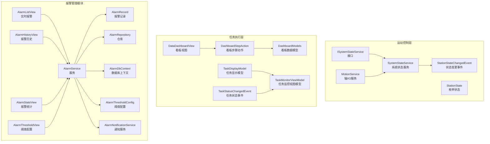
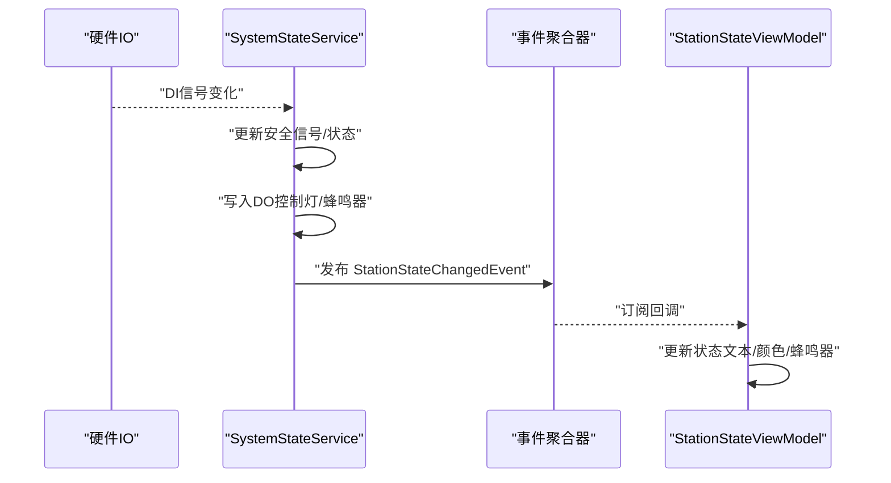
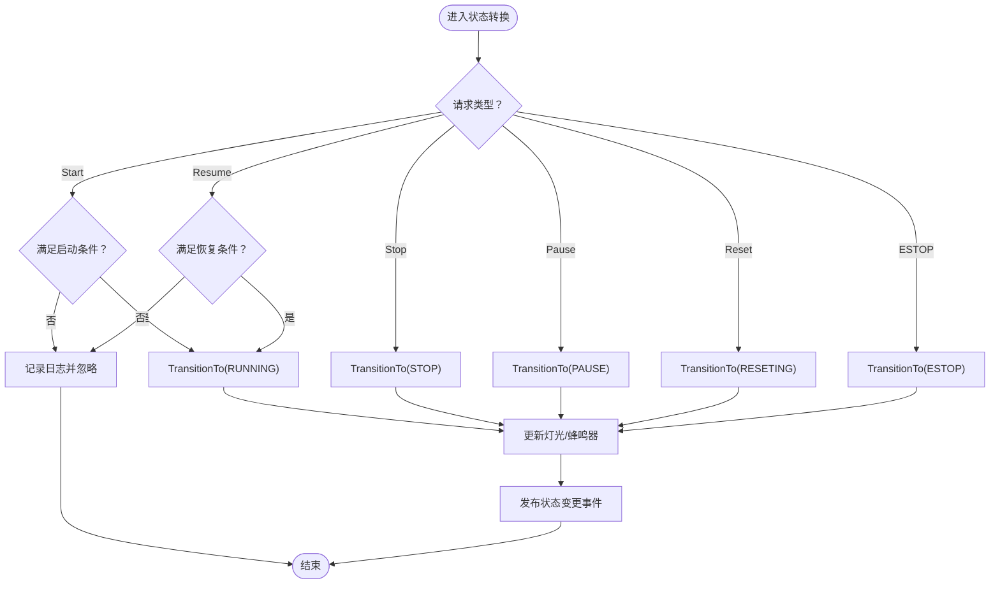
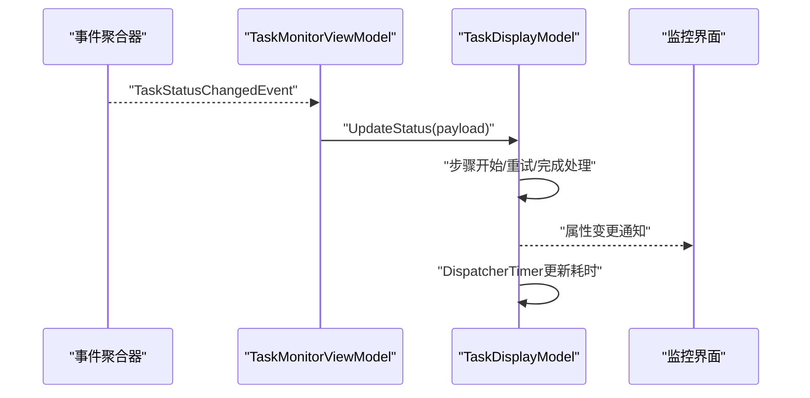
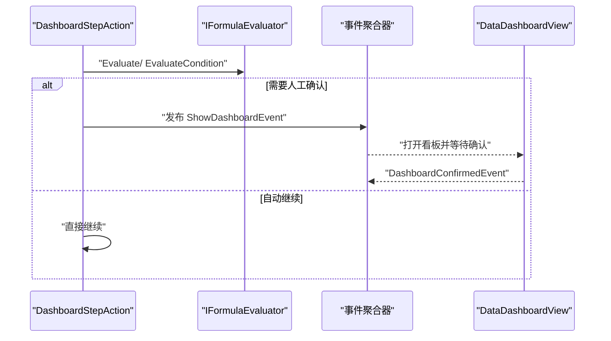
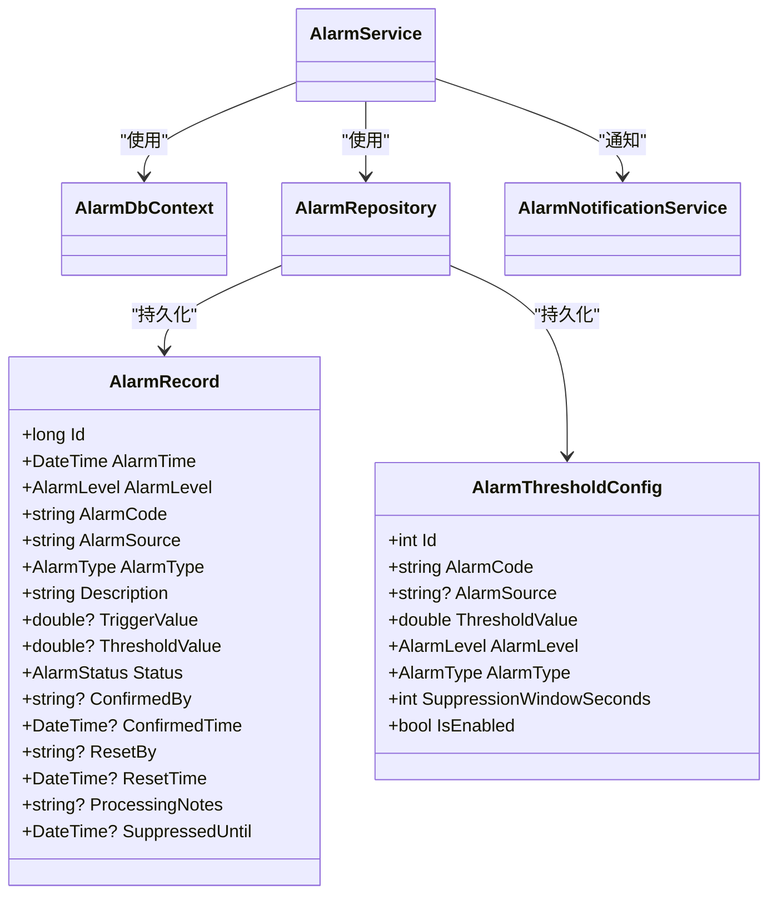
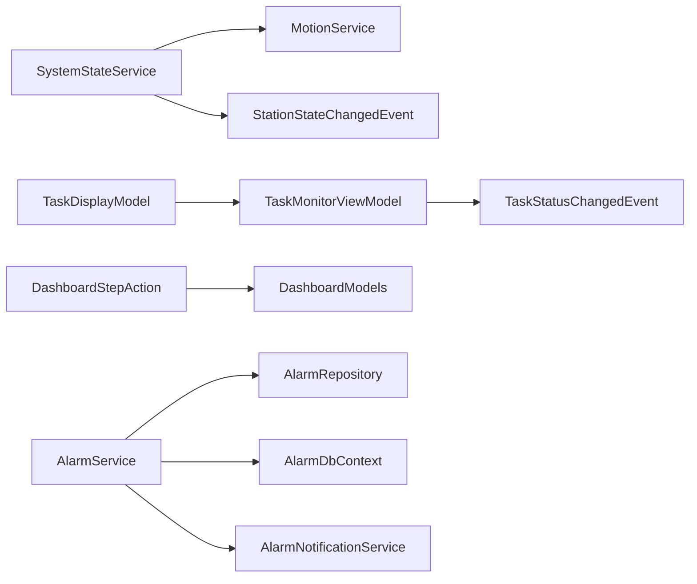

# 状态监控系统

<cite>
**本文引用的文件**
- [SystemStateService.cs](file://MotionControl/Services/SystemStateService.cs)
- [ISystemStateService.cs](file://MotionControl/Interfaces/ISystemStateService.cs)
- [StationState.cs](file://MotionControl/Models/StationState.cs)
- [StationStateChangedEvent.cs](file://MotionControl/Events/StationStateChangedEvent.cs)
- [TaskMonitorViewModel.cs](file://MotionControl/ViewModels/TaskMonitorViewModel.cs)
- [TaskDisplayModel.cs](file://MotionControl/Models/TaskDisplayModel.cs)
- [TaskStatusChangedEvent.cs](file://MotionControl/Events/TaskStatusChangedEvent.cs)
- [StationStateViewModel.cs](file://MotionControl/ViewModels/StationStateViewModel.cs)
- [DashboardStepAction.cs](file://StationTasks/Actions/DashboardStepAction.cs)
- [DashboardModels.cs](file://Core/Models/DashboardModels.cs)
- [DataDashboardView.xaml](file://Module/Controls/StepDetails/DataDashboardView.xaml)
- [AlarmRecord.cs](file://AlarmModule/Models/AlarmRecord.cs)
- [AlarmThresholdConfig.cs](file://AlarmModule/Models/AlarmThresholdConfig.cs)
- [AlarmListView.xaml](file://AlarmModule/Views/AlarmListView.xaml)
- [AlarmHistoryView.xaml](file://AlarmModule/Views/AlarmHistoryView.xaml)
- [AlarmStatsView.xaml](file://AlarmModule/Views/AlarmStatsView.xaml)
- [AlarmThresholdView.xaml](file://AlarmModule/Views/AlarmThresholdView.xaml)
- [AlarmDbContext.cs](file://AlarmModule/Data/AlarmDbContext.cs)
- [AlarmRepository.cs](file://AlarmModule/Data/AlarmRepository.cs)
- [AlarmService.cs](file://AlarmModule/Services/AlarmService.cs)
- [AlarmNotificationService.cs](file://AlarmModule/Services/AlarmNotificationService.cs)
- [GripperControlView.xaml](file://Module/Controls/Grippers/GripperControlView.xaml)
- [PrimModel.cs](file://Module/PrimModel.cs)
- [MotionService.cs](file://MotionControl/Services/MotionService.cs)
</cite>

## 目录
1. [引言](#引言)
2. [项目结构](#项目结构)
3. [核心组件](#核心组件)
4. [架构总览](#架构总览)
5. [详细组件分析](#详细组件分析)
6. [依赖关系分析](#依赖关系分析)
7. [性能考量](#性能考量)
8. [故障排查指南](#故障排查指南)
9. [结论](#结论)
10. [附录](#附录)

## 引言
本技术文档面向状态监控系统，聚焦于运动控制系统中的状态监控架构，涵盖运动状态采集、设备状态跟踪、任务执行监控的实现机制。文档详细说明状态数据模型、监控指标定义、实时更新机制，并阐述状态可视化展示、历史数据记录与趋势分析功能。同时提供监控配置选项、告警阈值设置、性能指标分析，以及状态数据的存储策略、查询接口与报表生成能力。

## 项目结构
状态监控系统由多个模块协同组成：
- 运动控制层：负责系统状态机、IO轮询、灯光与蜂鸣器输出、任务状态事件发布。
- 任务执行层：负责步骤执行、看板展示、人工确认与超时处理。
- 报警管理模块：负责报警记录、阈值配置、历史查询与统计分析。
- 视图层：提供状态灯、蜂鸣器、任务监控面板与看板界面。

图表来源
- [SystemStateService.cs:15-475](file://MotionControl/Services/SystemStateService.cs#L15-L475)
- [ISystemStateService.cs:5-22](file://MotionControl/Interfaces/ISystemStateService.cs#L5-L22)
- [StationStateChangedEvent.cs:6-17](file://MotionControl/Events/StationStateChangedEvent.cs#L6-L17)
- [StationState.cs:3-15](file://MotionControl/Models/StationState.cs#L3-L15)
- [MotionService.cs:60-100](file://MotionControl/Services/MotionService.cs#L60-L100)
- [DashboardStepAction.cs:17-141](file://StationTasks/Actions/DashboardStepAction.cs#L17-L141)
- [DashboardModels.cs:9-144](file://Core/Models/DashboardModels.cs#L9-L144)
- [DataDashboardView.xaml:1-386](file://Module/Controls/StepDetails/DataDashboardView.xaml#L1-L386)
- [TaskStatusChangedEvent.cs:10-22](file://MotionControl/Events/TaskStatusChangedEvent.cs#L10-L22)
- [TaskDisplayModel.cs:12-131](file://MotionControl/Models/TaskDisplayModel.cs#L12-L131)
- [TaskMonitorViewModel.cs:13-94](file://MotionControl/ViewModels/TaskMonitorViewModel.cs#L13-L94)
- [AlarmRecord.cs:12-61](file://AlarmModule/Models/AlarmRecord.cs#L12-L61)
- [AlarmThresholdConfig.cs:10-36](file://AlarmModule/Models/AlarmThresholdConfig.cs#L10-L36)
- [AlarmDbContext.cs](file://AlarmModule/Data/AlarmDbContext.cs)
- [AlarmRepository.cs](file://AlarmModule/Data/AlarmRepository.cs)
- [AlarmService.cs](file://AlarmModule/Services/AlarmService.cs)
- [AlarmNotificationService.cs](file://AlarmModule/Services/AlarmNotificationService.cs)

章节来源
- [SystemStateService.cs:15-475](file://MotionControl/Services/SystemStateService.cs#L15-L475)
- [ISystemStateService.cs:5-22](file://MotionControl/Interfaces/ISystemStateService.cs#L5-L22)
- [StationState.cs:3-15](file://MotionControl/Models/StationState.cs#L3-L15)
- [StationStateChangedEvent.cs:6-17](file://MotionControl/Events/StationStateChangedEvent.cs#L6-L17)
- [MotionService.cs:60-100](file://MotionControl/Services/MotionService.cs#L60-L100)
- [DashboardStepAction.cs:17-141](file://StationTasks/Actions/DashboardStepAction.cs#L17-L141)
- [DashboardModels.cs:9-144](file://Core/Models/DashboardModels.cs#L9-L144)
- [DataDashboardView.xaml:1-386](file://Module/Controls/StepDetails/DataDashboardView.xaml#L1-L386)
- [TaskStatusChangedEvent.cs:10-22](file://MotionControl/Events/TaskStatusChangedEvent.cs#L10-L22)
- [TaskDisplayModel.cs:12-131](file://MotionControl/Models/TaskDisplayModel.cs#L12-L131)
- [TaskMonitorViewModel.cs:13-94](file://MotionControl/ViewModels/TaskMonitorViewModel.cs#L13-L94)
- [AlarmRecord.cs:12-61](file://AlarmModule/Models/AlarmRecord.cs#L12-L61)
- [AlarmThresholdConfig.cs:10-36](file://AlarmModule/Models/AlarmThresholdConfig.cs#L10-L36)
- [AlarmDbContext.cs](file://AlarmModule/Data/AlarmDbContext.cs)
- [AlarmRepository.cs](file://AlarmModule/Data/AlarmRepository.cs)
- [AlarmService.cs](file://AlarmModule/Services/AlarmService.cs)
- [AlarmNotificationService.cs](file://AlarmModule/Services/AlarmNotificationService.cs)

## 核心组件
- 系统状态服务：维护并转换系统状态，驱动灯光与蜂鸣器输出，发布状态变更事件，提供启动/暂停/恢复/紧急停止等请求入口。
- 任务监控模型：按任务维度记录当前步骤、耗时、重试次数与历史步骤，提供UI刷新与历史上限控制。
- 看板步骤动作：计算字段公式、条件判断、发布看板事件、等待人工确认或超时自动确认。
- 报警管理：记录报警生命周期、阈值配置、历史查询与统计分析，支持防抖抑制与批量确认/复位。

章节来源
- [SystemStateService.cs:15-475](file://MotionControl/Services/SystemStateService.cs#L15-L475)
- [TaskDisplayModel.cs:12-131](file://MotionControl/Models/TaskDisplayModel.cs#L12-L131)
- [DashboardStepAction.cs:17-141](file://StationTasks/Actions/DashboardStepAction.cs#L17-L141)
- [AlarmRecord.cs:12-61](file://AlarmModule/Models/AlarmRecord.cs#L12-L61)
- [AlarmThresholdConfig.cs:10-36](file://AlarmModule/Models/AlarmThresholdConfig.cs#L10-L36)

## 架构总览
系统采用事件驱动与MVVM模式：
- 状态机与IO轮询：SystemStateService在轮询线程中读取DI/DO，根据安全门与光栅信号、系统状态进行状态转换，驱动灯光与蜂鸣器，并发布状态变更事件。
- 任务状态：各工站任务通过TaskStatusChangedEvent上报当前步骤与状态，TaskMonitorViewModel聚合并展示。
- 看板交互：DashboardStepAction在步骤执行时计算字段与条件，必要时弹出看板等待人工确认。
- 报警管理：AlarmService基于阈值配置与实时数据生成报警记录，支持历史查询与统计分析。

图表来源
- [SystemStateService.cs:316-325](file://MotionControl/Services/SystemStateService.cs#L316-L325)
- [StationStateChangedEvent.cs:6-17](file://MotionControl/Events/StationStateChangedEvent.cs#L6-L17)
- [StationStateViewModel.cs:61-93](file://MotionControl/ViewModels/StationStateViewModel.cs#L61-L93)

## 详细组件分析

### 系统状态监控（SystemStateService）
- 状态机与转换：维护当前StationState，提供CanStart/CanPause/CanResume等条件判断，响应Start/Pause/Resume/Stop/Reset/EmergencyStop请求，触发状态转换并更新灯光与蜂鸣器。
- IO轮询与安全逻辑：通过定时器周期读取DI信号，结合安全门与光栅配置，阻止在不安全状态下恢复运行。
- 实时通知：状态变更时发布StationStateChangedEvent，携带状态描述与灯光/蜂鸣器状态。

图表来源
- [SystemStateService.cs:268-315](file://MotionControl/Services/SystemStateService.cs#L268-L315)
- [SystemStateService.cs:316-325](file://MotionControl/Services/SystemStateService.cs#L316-L325)
- [StationStateChangedEvent.cs:6-17](file://MotionControl/Events/StationStateChangedEvent.cs#L6-L17)

章节来源
- [SystemStateService.cs:15-475](file://MotionControl/Services/SystemStateService.cs#L15-L475)
- [ISystemStateService.cs:5-22](file://MotionControl/Interfaces/ISystemStateService.cs#L5-L22)
- [StationState.cs:3-15](file://MotionControl/Models/StationState.cs#L3-L15)
- [StationStateChangedEvent.cs:6-17](file://MotionControl/Events/StationStateChangedEvent.cs#L6-L17)

### 任务执行监控（TaskMonitorViewModel 与 TaskDisplayModel）
- 任务聚合：TaskMonitorViewModel订阅Station注册/注销事件与TaskStatusChangedEvent，动态增删任务并更新其状态。
- 步骤追踪：TaskDisplayModel记录当前步骤、累计耗时、重试次数；当步骤名变化时判定为新步骤或重试，超过历史上限时移除最旧记录。
- UI刷新：使用DispatcherTimer每秒更新当前时间与当前步骤耗时，保证UI实时性。

图表来源
- [TaskMonitorViewModel.cs:81-91](file://MotionControl/ViewModels/TaskMonitorViewModel.cs#L81-L91)
- [TaskDisplayModel.cs:51-121](file://MotionControl/Models/TaskDisplayModel.cs#L51-L121)
- [TaskStatusChangedEvent.cs:10-22](file://MotionControl/Events/TaskStatusChangedEvent.cs#L10-L22)

章节来源
- [TaskMonitorViewModel.cs:13-94](file://MotionControl/ViewModels/TaskMonitorViewModel.cs#L13-L94)
- [TaskDisplayModel.cs:12-131](file://MotionControl/Models/TaskDisplayModel.cs#L12-L131)
- [TaskStatusChangedEvent.cs:10-22](file://MotionControl/Events/TaskStatusChangedEvent.cs#L10-L22)

### 看板与人工确认（DashboardStepAction 与 DataDashboardView）
- 字段计算：遍历DashboardStepDetail.Fields，使用公式求值器计算数值型字段与条件型字段。
- 交互等待：若RequireManualConfirm为真，发布ShowDashboardEvent打开看板UI；支持AutoConfirmTimeout超时自动确认。
- 视图绑定：DataDashboardView提供字段编辑、公式编辑器、全局变量插入、确认继续按钮等交互。

图表来源
- [DashboardStepAction.cs:32-82](file://StationTasks/Actions/DashboardStepAction.cs#L32-L82)
- [DashboardStepAction.cs:108-133](file://StationTasks/Actions/DashboardStepAction.cs#L108-L133)
- [DashboardModels.cs:9-144](file://Core/Models/DashboardModels.cs#L9-L144)
- [DataDashboardView.xaml:75-100](file://Module/Controls/StepDetails/DataDashboardView.xaml#L75-L100)
- [DataDashboardView.xaml:375-383](file://Module/Controls/StepDetails/DataDashboardView.xaml#L375-L383)

章节来源
- [DashboardStepAction.cs:17-141](file://StationTasks/Actions/DashboardStepAction.cs#L17-L141)
- [DashboardModels.cs:9-144](file://Core/Models/DashboardModels.cs#L9-L144)
- [DataDashboardView.xaml:1-386](file://Module/Controls/StepDetails/DataDashboardView.xaml#L1-L386)

### 报警管理与阈值配置（AlarmModule）
- 报警记录：AlarmRecord包含报警时间、级别、类型、源、描述、触发值、阈值、状态、确认/复位信息与处理备注、防抖截止时间等。
- 阈值配置：AlarmThresholdConfig支持按AlarmCode与AlarmSource配置阈值、级别、类型、防抖窗口与启用状态。
- 查询与统计：提供实时报警、历史查询（多条件过滤、分页、导出）、统计分析（等级分布、频率排名、趋势分析）与阈值配置界面。
- 存储与服务：AlarmDbContext提供数据库上下文，AlarmRepository封装仓储操作，AlarmService协调业务流程与通知。

图表来源
- [AlarmRecord.cs:12-61](file://AlarmModule/Models/AlarmRecord.cs#L12-L61)
- [AlarmThresholdConfig.cs:10-36](file://AlarmModule/Models/AlarmThresholdConfig.cs#L10-L36)
- [AlarmDbContext.cs](file://AlarmModule/Data/AlarmDbContext.cs)
- [AlarmRepository.cs](file://AlarmModule/Data/AlarmRepository.cs)
- [AlarmService.cs](file://AlarmModule/Services/AlarmService.cs)
- [AlarmNotificationService.cs](file://AlarmModule/Services/AlarmNotificationService.cs)

章节来源
- [AlarmRecord.cs:12-61](file://AlarmModule/Models/AlarmRecord.cs#L12-L61)
- [AlarmThresholdConfig.cs:10-36](file://AlarmModule/Models/AlarmThresholdConfig.cs#L10-L36)
- [AlarmDbContext.cs](file://AlarmModule/Data/AlarmDbContext.cs)
- [AlarmRepository.cs](file://AlarmModule/Data/AlarmRepository.cs)
- [AlarmService.cs](file://AlarmModule/Services/AlarmService.cs)
- [AlarmNotificationService.cs](file://AlarmModule/Services/AlarmNotificationService.cs)

### 状态可视化与交互
- 系统状态视图模型：订阅StationStateChangedEvent，根据状态闪烁红/绿/橙灯与蜂鸣器状态，更新UI颜色与文字描述。
- 工站控制：提供Home/Reset等操作按钮，Reset对应系统复位流程。
- 导航菜单：PrimModel中定义了报警相关导航项，包括实时报警、报警历史、报警统计与阈值配置。

章节来源
- [StationStateViewModel.cs:61-93](file://MotionControl/ViewModels/StationStateViewModel.cs#L61-L93)
- [GripperControlView.xaml:177-198](file://Module/Controls/Grippers/GripperControlView.xaml#L177-L198)
- [PrimModel.cs:34-42](file://Module/PrimModel.cs#L34-L42)

## 依赖关系分析
- 组件耦合与内聚：SystemStateService与MotionService、事件聚合器耦合紧密，负责状态转换与IO输出；TaskMonitorViewModel与TaskDisplayModel内聚于任务状态展示；DashboardStepAction与FormulaEvaluator、事件聚合器协作完成看板交互。
- 外部依赖：AlarmModule依赖EF Core进行数据持久化，依赖通知服务进行告警推送。
- 事件契约：StationStateChangedEvent与TaskStatusChangedEvent作为跨模块通信的契约，确保UI与业务逻辑解耦。

图表来源
- [SystemStateService.cs:15-475](file://MotionControl/Services/SystemStateService.cs#L15-L475)
- [MotionService.cs:60-100](file://MotionControl/Services/MotionService.cs#L60-L100)
- [StationStateChangedEvent.cs:6-17](file://MotionControl/Events/StationStateChangedEvent.cs#L6-L17)
- [TaskMonitorViewModel.cs:13-94](file://MotionControl/ViewModels/TaskMonitorViewModel.cs#L13-L94)
- [TaskStatusChangedEvent.cs:10-22](file://MotionControl/Events/TaskStatusChangedEvent.cs#L10-L22)
- [TaskDisplayModel.cs:12-131](file://MotionControl/Models/TaskDisplayModel.cs#L12-L131)
- [DashboardStepAction.cs:17-141](file://StationTasks/Actions/DashboardStepAction.cs#L17-L141)
- [DashboardModels.cs:9-144](file://Core/Models/DashboardModels.cs#L9-L144)
- [AlarmService.cs](file://AlarmModule/Services/AlarmService.cs)
- [AlarmRepository.cs](file://AlarmModule/Data/AlarmRepository.cs)
- [AlarmDbContext.cs](file://AlarmModule/Data/AlarmDbContext.cs)
- [AlarmNotificationService.cs](file://AlarmModule/Services/AlarmNotificationService.cs)

## 性能考量
- 轮询与线程模型：SystemStateService使用定时器轮询DI信号，避免阻塞UI线程；MotionService在轮询线程中发布轴状态事件，确保UI线程安全。
- UI刷新频率：TaskDisplayModel使用DispatcherTimer每秒刷新，兼顾实时性与性能；任务历史记录上限控制在50条，避免内存膨胀。
- 事件订阅管理：DashboardStepAction在等待确认后及时取消事件订阅，防止内存泄漏。
- 报警防抖：AlarmThresholdConfig提供SuppressionWindowSeconds，降低高频触发带来的系统压力。

章节来源
- [SystemStateService.cs:31-32](file://MotionControl/Services/SystemStateService.cs#L31-L32)
- [MotionService.cs:60-100](file://MotionControl/Services/MotionService.cs#L60-L100)
- [TaskDisplayModel.cs:18-48](file://MotionControl/Models/TaskDisplayModel.cs#L18-L48)
- [DashboardStepAction.cs:128-133](file://StationTasks/Actions/DashboardStepAction.cs#L128-L133)
- [AlarmThresholdConfig.cs](file://AlarmModule/Models/AlarmThresholdConfig.cs#L32)

## 故障排查指南
- 系统无法恢复运行：检查安全门与光栅信号是否仍处于激活状态，SystemStateService在CanResume中会拒绝恢复。
- 状态灯不亮或蜂鸣器异常：确认WriteDo输出逻辑与配置映射，检查SystemStateService中灯光/蜂鸣器写入分支。
- 任务监控无更新：确认TaskStatusChangedEvent是否被正确发布与订阅，TaskMonitorViewModel是否已加载任务。
- 看板不弹出或确认无效：检查RequireManualConfirm与AutoConfirmTimeout配置，确认DashboardConfirmedEvent订阅与取消订阅逻辑。
- 报警未记录或重复触发：核对AlarmThresholdConfig的阈值与防抖窗口，检查AlarmRecord的状态流转与SuppressedUntil逻辑。

章节来源
- [SystemStateService.cs:275-295](file://MotionControl/Services/SystemStateService.cs#L275-L295)
- [SystemStateService.cs:426-436](file://MotionControl/Services/SystemStateService.cs#L426-L436)
- [TaskMonitorViewModel.cs:81-91](file://MotionControl/ViewModels/TaskMonitorViewModel.cs#L81-L91)
- [DashboardStepAction.cs:64-78](file://StationTasks/Actions/DashboardStepAction.cs#L64-L78)
- [AlarmThresholdConfig.cs](file://AlarmModule/Models/AlarmThresholdConfig.cs#L32)

## 结论
状态监控系统通过清晰的事件契约与模块化设计，实现了运动状态的实时采集与可视化、任务执行的细粒度监控、以及报警的全生命周期管理。系统具备良好的扩展性与可维护性，支持配置化阈值、历史查询与统计分析，并提供直观的UI交互体验。

## 附录
- 监控配置选项
  - 安全功能开关：安全门、光栅、蜂鸣器、安全事件日志等可通过配置热更新。
  - 看板配置：RequireManualConfirm与AutoConfirmTimeout控制人工确认行为。
  - 阈值配置：AlarmThresholdConfig支持按报警码与来源设置阈值、级别、类型与防抖窗口。
- 告警阈值设置
  - 在AlarmThresholdView中配置AlarmCode/AlarmSource、阈值、级别、类型与启用状态。
- 性能指标分析
  - 任务步骤耗时、重试次数、历史记录上限、轮询间隔与UI刷新频率。
- 存储策略与查询接口
  - AlarmDbContext与AlarmRepository提供EF Core数据访问；支持多条件过滤、分页与导出。
- 报表生成
  - AlarmStatsView提供等级分布、频率排名与趋势分析，辅助运维决策。

章节来源
- [SystemStateService.cs:22-27](file://MotionControl/Services/SystemStateService.cs#L22-L27)
- [DataDashboardView.xaml:75-82](file://Module/Controls/StepDetails/DataDashboardView.xaml#L75-L82)
- [AlarmThresholdConfig.cs:10-36](file://AlarmModule/Models/AlarmThresholdConfig.cs#L10-L36)
- [AlarmDbContext.cs](file://AlarmModule/Data/AlarmDbContext.cs)
- [AlarmRepository.cs](file://AlarmModule/Data/AlarmRepository.cs)
- [AlarmStatsView.xaml](file://AlarmModule/Views/AlarmStatsView.xaml)