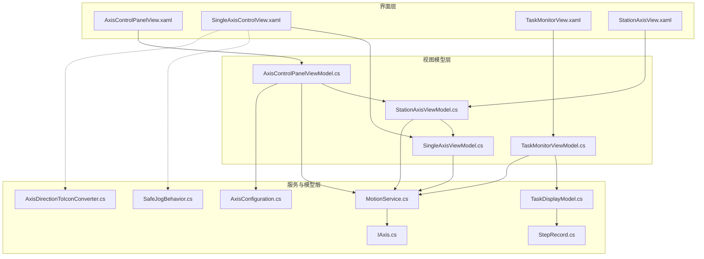
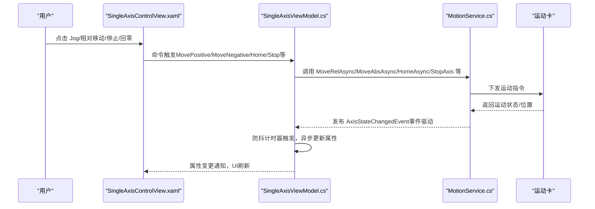
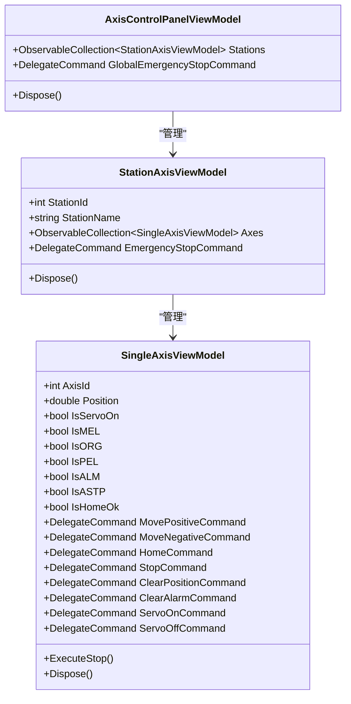
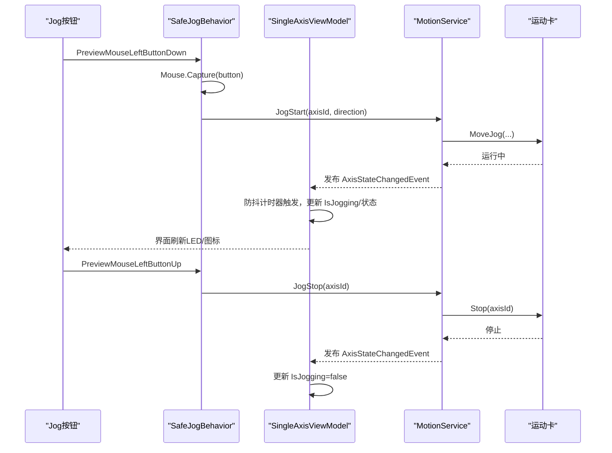
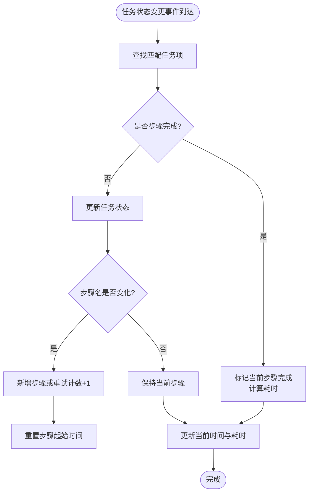
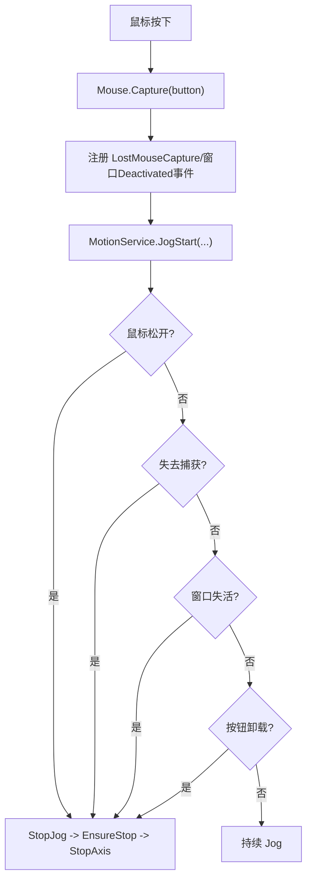
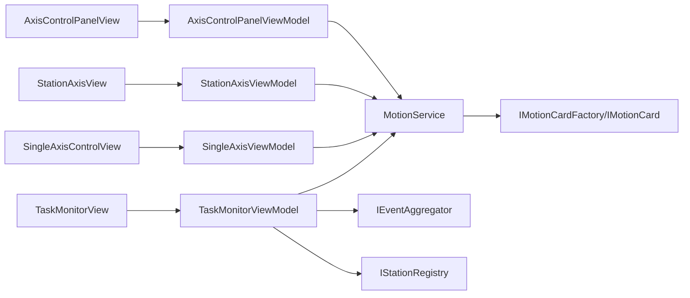

# 用户界面组件

<cite>
**本文档引用的文件**
- [AxisControlPanelView.xaml](file://MotionControl/Views/AxisControlPanelView.xaml)
- [SingleAxisControlView.xaml](file://MotionControl/Views/SingleAxisControlView.xaml)
- [TaskMonitorView.xaml](file://MotionControl/Views/TaskMonitorView.xaml)
- [AxisControlPanelViewModel.cs](file://MotionControl/ViewModels/AxisControlPanelViewModel.cs)
- [SingleAxisViewModel.cs](file://MotionControl/ViewModels/SingleAxisViewModel.cs)
- [StationAxisViewModel.cs](file://MotionControl/ViewModels/StationAxisViewModel.cs)
- [TaskMonitorViewModel.cs](file://MotionControl/ViewModels/TaskMonitorViewModel.cs)
- [StationAxisView.xaml](file://MotionControl/Views/StationAxisView.xaml)
- [SafeJogBehavior.cs](file://MotionControl/Behaviors/SafeJogBehavior.cs)
- [AxisDirectionToIconConverter.cs](file://MotionControl/Converters/AxisDirectionToIconConverter.cs)
- [TaskDisplayModel.cs](file://MotionControl/Models/TaskDisplayModel.cs)
- [StepRecord.cs](file://MotionControl/Models/StepRecord.cs)
- [IAxis.cs](file://MotionControl/Interfaces/IAxis.cs)
- [MotionService.cs](file://MotionControl/Services/MotionService.cs)
- [AxisConfiguration.cs](file://MotionControl/Models/AxisConfiguration.cs)
</cite>

## 目录
1. [简介](#简介)
2. [项目结构](#项目结构)
3. [核心组件](#核心组件)
4. [架构总览](#架构总览)
5. [详细组件分析](#详细组件分析)
6. [依赖关系分析](#依赖关系分析)
7. [性能考量](#性能考量)
8. [故障排查指南](#故障排查指南)
9. [结论](#结论)
10. [附录](#附录)

## 简介
本文件面向运动控制UI组件，围绕轴控制面板、单轴控制界面、任务监控视图三大部分，系统阐述设计理念、数据绑定机制、命令模式实现、实时状态更新与事件驱动架构。文档同时给出用户操作流程、界面响应逻辑、视觉反馈机制，并提供界面定制指南、主题配置、响应式设计建议，以及用户体验优化、无障碍访问支持与性能优化策略。

## 项目结构
运动控制UI位于 MotionControl 模块，采用 Prism MVVM 框架与 Material Design XAML 主题，界面由 XAML 视图与 ViewModel 绑定构成，行为通过附加行为扩展，状态通过事件驱动服务推送，形成“视图-视图模型-服务-硬件卡”的清晰分层。

图表来源
- [AxisControlPanelView.xaml:1-124](file://MotionControl/Views/AxisControlPanelView.xaml#L1-L124)
- [SingleAxisControlView.xaml:1-217](file://MotionControl/Views/SingleAxisControlView.xaml#L1-L217)
- [TaskMonitorView.xaml:1-142](file://MotionControl/Views/TaskMonitorView.xaml#L1-L142)
- [StationAxisView.xaml:1-47](file://MotionControl/Views/StationAxisView.xaml#L1-L47)
- [AxisControlPanelViewModel.cs:1-134](file://MotionControl/ViewModels/AxisControlPanelViewModel.cs#L1-L134)
- [StationAxisViewModel.cs:1-92](file://MotionControl/ViewModels/StationAxisViewModel.cs#L1-L92)
- [SingleAxisViewModel.cs:1-428](file://MotionControl/ViewModels/SingleAxisViewModel.cs#L1-L428)
- [TaskMonitorViewModel.cs:1-94](file://MotionControl/ViewModels/TaskMonitorViewModel.cs#L1-L94)
- [MotionService.cs:1-741](file://MotionControl/Services/MotionService.cs#L1-L741)
- [TaskDisplayModel.cs:1-131](file://MotionControl/Models/TaskDisplayModel.cs#L1-L131)
- [StepRecord.cs:1-39](file://MotionControl/Models/StepRecord.cs#L1-L39)
- [SafeJogBehavior.cs:1-284](file://MotionControl/Behaviors/SafeJogBehavior.cs#L1-L284)
- [AxisDirectionToIconConverter.cs:1-97](file://MotionControl/Converters/AxisDirectionToIconConverter.cs#L1-L97)
- [IAxis.cs:1-15](file://MotionControl/Interfaces/IAxis.cs#L1-L15)
- [AxisConfiguration.cs:1-298](file://MotionControl/Models/AxisConfiguration.cs#L1-L298)

章节来源
- [AxisControlPanelView.xaml:1-124](file://MotionControl/Views/AxisControlPanelView.xaml#L1-L124)
- [SingleAxisControlView.xaml:1-217](file://MotionControl/Views/SingleAxisControlView.xaml#L1-L217)
- [TaskMonitorView.xaml:1-142](file://MotionControl/Views/TaskMonitorView.xaml#L1-L142)
- [AxisControlPanelViewModel.cs:1-134](file://MotionControl/ViewModels/AxisControlPanelViewModel.cs#L1-L134)
- [SingleAxisViewModel.cs:1-428](file://MotionControl/ViewModels/SingleAxisViewModel.cs#L1-L428)
- [StationAxisViewModel.cs:1-92](file://MotionControl/ViewModels/StationAxisViewModel.cs#L1-L92)
- [TaskMonitorViewModel.cs:1-94](file://MotionControl/ViewModels/TaskMonitorViewModel.cs#L1-L94)
- [MotionService.cs:1-741](file://MotionControl/Services/MotionService.cs#L1-L741)

## 核心组件
- 轴控制面板（AxisControlPanelView + AxisControlPanelViewModel）
  - 设计理念：按任务/子系统分组为多个工站标签页，顶部提供全局紧急停止，主区域为导航铁轨风格的 TabControl。
  - 数据绑定：通过 Stations 集合动态生成 TabItem，内容模板绑定 StationAxisView。
  - 命令模式：全局紧急停止命令遍历各工站并触发其紧急停止。
- 单轴控制界面（SingleAxisControlView + SingleAxisViewModel）
  - 设计理念：紧凑布局，分为轴信息、位置与初始化、相对移动、速度、Jog、运动操作、伺服控制、状态指示灯等列。
  - 数据绑定：位置、速度、步距、状态位等双向/单向绑定；Jog 状态通过附加行为与 ViewModel 同步。
  - 实时更新：事件驱动（IObservable<AxisStateChangedEvent>）+ 防抖计时器，避免 UI 频繁刷新。
  - 命令模式：MovePositive/MoveNegative、Home、Stop、ClearPosition、ClearAlarm、ServoOn/Off。
- 任务监控视图（TaskMonitorView + TaskMonitorViewModel + TaskDisplayModel）
  - 设计理念：卡片式展示每个任务的当前状态、当前步骤与耗时、历史步骤列表，支持自动滚动与重试高亮。
  - 数据绑定：Tasks 集合绑定到 ItemsControl，StepHistory 绑定到 ListBox。
  - 实时更新：通过事件聚合器订阅任务状态变化，动态更新当前步骤、耗时与历史记录。
- 安全 Jog 行为（SafeJogBehavior）
  - 设计理念：通过附加属性实现安全 Jog，解决鼠标拖拽离开按钮后松开不停止的问题，具备鼠标捕获、窗口失活、按钮卸载等多重停止保障。
- 轴方向图标转换器（AxisDirectionToIconConverter）
  - 设计理念：将 hwcfg.xml 中的方向描述映射为 Material Design 图标，兼容正负向与旋转方向。

章节来源
- [AxisControlPanelView.xaml:1-124](file://MotionControl/Views/AxisControlPanelView.xaml#L1-L124)
- [AxisControlPanelViewModel.cs:1-134](file://MotionControl/ViewModels/AxisControlPanelViewModel.cs#L1-L134)
- [SingleAxisControlView.xaml:1-217](file://MotionControl/Views/SingleAxisControlView.xaml#L1-L217)
- [SingleAxisViewModel.cs:1-428](file://MotionControl/ViewModels/SingleAxisViewModel.cs#L1-L428)
- [TaskMonitorView.xaml:1-142](file://MotionControl/Views/TaskMonitorView.xaml#L1-L142)
- [TaskMonitorViewModel.cs:1-94](file://MotionControl/ViewModels/TaskMonitorViewModel.cs#L1-L94)
- [TaskDisplayModel.cs:1-131](file://MotionControl/Models/TaskDisplayModel.cs#L1-L131)
- [SafeJogBehavior.cs:1-284](file://MotionControl/Behaviors/SafeJogBehavior.cs#L1-L284)
- [AxisDirectionToIconConverter.cs:1-97](file://MotionControl/Converters/AxisDirectionToIconConverter.cs#L1-L97)

## 架构总览
运动控制UI采用事件驱动架构：底层 MotionService 通过轮询线程读取硬件状态，解析状态位并发布 AxisStateChangedEvent；上层 SingleAxisViewModel 订阅事件，经防抖与异步更新，驱动 UI 实时刷新；命令通过 Prism 命令封装，统一入口调用服务层。

图表来源
- [SingleAxisViewModel.cs:208-286](file://MotionControl/ViewModels/SingleAxisViewModel.cs#L208-L286)
- [MotionService.cs:418-579](file://MotionControl/Services/MotionService.cs#L418-L579)

章节来源
- [SingleAxisViewModel.cs:1-428](file://MotionControl/ViewModels/SingleAxisViewModel.cs#L1-L428)
- [MotionService.cs:1-741](file://MotionControl/Services/MotionService.cs#L1-L741)

## 详细组件分析

### 轴控制面板（AxisControlPanelView + AxisControlPanelViewModel）
- 用户交互设计
  - 顶部全局紧急停止区域：醒目的红色背景与提示文本，一键停止所有工站轴。
  - 导航铁轨式 TabControl：右侧放置标签头，图标+名称+轴数量角标，直观区分工站。
- 数据绑定机制
  - Stations 为 ObservableCollection<StationAxisViewModel>，动态绑定到 TabControl.ItemsSource。
  - 内容模板绑定 StationAxisView，头部模板绑定 StationIconConverter。
- 命令模式实现
  - GlobalEmergencyStopCommand 遍历 Stations 并调用其 EmergencyStopCommand。
- 实时状态更新
  - 通过 StationAxisViewModel 管理各轴 ViewModel，进而由 SingleAxisViewModel 的事件驱动更新。
- 视觉反馈机制
  - 工站 Tab 头部包含轴数量徽章，状态指示灯在单轴界面中体现。

图表来源
- [AxisControlPanelViewModel.cs:1-134](file://MotionControl/ViewModels/AxisControlPanelViewModel.cs#L1-L134)
- [StationAxisViewModel.cs:1-92](file://MotionControl/ViewModels/StationAxisViewModel.cs#L1-L92)
- [SingleAxisViewModel.cs:1-428](file://MotionControl/ViewModels/SingleAxisViewModel.cs#L1-L428)

章节来源
- [AxisControlPanelView.xaml:1-124](file://MotionControl/Views/AxisControlPanelView.xaml#L1-L124)
- [AxisControlPanelViewModel.cs:1-134](file://MotionControl/ViewModels/AxisControlPanelViewModel.cs#L1-L134)
- [StationAxisView.xaml:1-47](file://MotionControl/Views/StationAxisView.xaml#L1-L47)
- [StationAxisViewModel.cs:1-92](file://MotionControl/ViewModels/StationAxisViewModel.cs#L1-L92)

### 单轴控制界面（SingleAxisControlView + SingleAxisViewModel）
- 用户交互设计
  - 相对移动：步距下拉框 + 负/正按钮，支持小步精调。
  - 速度控制：滑块范围 1–30 mm/s，数值同步显示。
  - Jog 控制：安全 Jog 行为，LED 指示当前 Jog 状态，图标随方向变化。
  - 运动操作：回零、停止、清零、清除报警。
  - 伺服控制：伺服开启/关闭。
  - 状态指示灯：ON、MEL、ORG、PEL、ALM、ASTP 六类状态灯。
- 数据绑定机制
  - 位置、速度、步距、状态位均通过属性绑定到 UI。
  - Jog 状态通过 SafeJogBehavior 与 ViewModel.IsJogging 双向同步。
- 命令模式实现
  - 所有操作封装为 DelegateCommand，调用 MotionService 对应方法。
- 实时状态更新
  - 订阅 IMotionService 的 IObservable<AxisStateChangedEvent>，手动过滤当前轴事件，配合 DispatcherTimer 防抖，异步更新属性。
- 视觉反馈机制
  - 状态灯颜色与提示文本；Jog LED 随状态闪烁；方向图标随正负向切换。

图表来源
- [SingleAxisViewModel.cs:208-286](file://MotionControl/ViewModels/SingleAxisViewModel.cs#L208-L286)
- [SafeJogBehavior.cs:78-174](file://MotionControl/Behaviors/SafeJogBehavior.cs#L78-L174)
- [MotionService.cs:292-295](file://MotionControl/Services/MotionService.cs#L292-L295)

章节来源
- [SingleAxisControlView.xaml:1-217](file://MotionControl/Views/SingleAxisControlView.xaml#L1-L217)
- [SingleAxisViewModel.cs:1-428](file://MotionControl/ViewModels/SingleAxisViewModel.cs#L1-L428)
- [SafeJogBehavior.cs:1-284](file://MotionControl/Behaviors/SafeJogBehavior.cs#L1-L284)
- [AxisDirectionToIconConverter.cs:1-97](file://MotionControl/Converters/AxisDirectionToIconConverter.cs#L1-L97)

### 任务监控视图（TaskMonitorView + TaskMonitorViewModel + TaskDisplayModel）
- 用户交互设计
  - 卡片式布局：每个任务一个面板，顶部状态灯+任务名+实时时间，中部当前步骤与耗时，底部历史步骤列表。
  - 自动滚动：StepList 绑定 ListBoxAutoScroll，新步骤自动滚动到底部。
  - 重试高亮：历史步骤根据 RetryCount 设置不同背景色，便于识别重试。
- 数据绑定机制
  - Tasks 为 ObservableCollection<TaskDisplayModel>，绑定到 ItemsControl。
  - StepHistory 为 ObservableCollection<StepRecord>，绑定到 ListBox。
- 实时状态更新
  - TaskMonitorViewModel 订阅 TaskStatusChangedEvent 与工站注册事件，动态增删任务项并更新状态。
  - TaskDisplayModel 内部 DispatcherTimer 每秒刷新当前时间与当前步骤耗时。
- 视觉反馈机制
  - 状态灯根据 State（Running/Paused/Error/Homing/Idle/Stopped）设置不同颜色。
  - 当前步骤高亮（蓝色背景+粗体），重试步骤橙色预警。

图表来源
- [TaskMonitorViewModel.cs:81-91](file://MotionControl/ViewModels/TaskMonitorViewModel.cs#L81-L91)
- [TaskDisplayModel.cs:51-125](file://MotionControl/Models/TaskDisplayModel.cs#L51-L125)

章节来源
- [TaskMonitorView.xaml:1-142](file://MotionControl/Views/TaskMonitorView.xaml#L1-L142)
- [TaskMonitorViewModel.cs:1-94](file://MotionControl/ViewModels/TaskMonitorViewModel.cs#L1-L94)
- [TaskDisplayModel.cs:1-131](file://MotionControl/Models/TaskDisplayModel.cs#L1-L131)
- [StepRecord.cs:1-39](file://MotionControl/Models/StepRecord.cs#L1-L39)

### 安全 Jog 行为（SafeJogBehavior）
- 设计理念
  - 通过附加属性实现安全 Jog，解决鼠标拖拽离开按钮后松开不停止的严重漏洞。
  - 采用 Mouse.Capture(button) 后按钮可接收全局鼠标松开事件，确保可靠停止。
- 关键机制
  - 鼠标按下：强制捕获鼠标 + 开始 Jog。
  - 鼠标松开：立即停止（捕获后按钮可收到）。
  - 失去鼠标捕获：立即停止。
  - 窗口失活：停止所有 Jog。
  - 按钮卸载：清理并停止。
- 双重保障
  - EnsureStop：先 JogStop 再 StopAxis，确保轴完全停止。

图表来源
- [SafeJogBehavior.cs:78-174](file://MotionControl/Behaviors/SafeJogBehavior.cs#L78-L174)
- [SafeJogBehavior.cs:205-269](file://MotionControl/Behaviors/SafeJogBehavior.cs#L205-L269)

章节来源
- [SafeJogBehavior.cs:1-284](file://MotionControl/Behaviors/SafeJogBehavior.cs#L1-L284)

### 轴方向图标转换器（AxisDirectionToIconConverter）
- 设计理念
  - 将 hwcfg.xml 中的描述性方向名（如 Left_Right、Down_Up、Rotate_antiClock）与简单方向名（X、Y、Z、R、-X 等）映射为 Material Design 图标。
  - 支持正向/反向参数，自动选择箭头或旋转图标。
- 使用场景
  - SingleAxisControlView 中 Jog 图标随方向变化，增强视觉引导。

章节来源
- [AxisDirectionToIconConverter.cs:1-97](file://MotionControl/Converters/AxisDirectionToIconConverter.cs#L1-L97)
- [SingleAxisControlView.xaml:124-137](file://MotionControl/Views/SingleAxisControlView.xaml#L124-L137)

## 依赖关系分析
- 视图与视图模型
  - AxisControlPanelView ↔ AxisControlPanelViewModel
  - StationAxisView ↔ StationAxisViewModel
  - SingleAxisControlView ↔ SingleAxisViewModel
  - TaskMonitorView ↔ TaskMonitorViewModel
- 视图模型与服务
  - SingleAxisViewModel、StationAxisViewModel、AxisControlPanelViewModel 依赖 IMotionService。
  - TaskMonitorViewModel 依赖 IEventAggregator 与 IStationRegistry。
- 服务与硬件
  - MotionService 通过 IMotionCardFactory 与 IMotionCard 与硬件卡通信，实现 MoveRelAsync、HomeAsync、StopAxis 等操作。
- 转换器与行为
  - AxisDirectionToIconConverter 用于图标映射。
  - SafeJogBehavior 用于安全 Jog 行为扩展。

图表来源
- [AxisControlPanelViewModel.cs:1-134](file://MotionControl/ViewModels/AxisControlPanelViewModel.cs#L1-L134)
- [StationAxisViewModel.cs:1-92](file://MotionControl/ViewModels/StationAxisViewModel.cs#L1-L92)
- [SingleAxisViewModel.cs:1-428](file://MotionControl/ViewModels/SingleAxisViewModel.cs#L1-L428)
- [TaskMonitorViewModel.cs:1-94](file://MotionControl/ViewModels/TaskMonitorViewModel.cs#L1-L94)
- [MotionService.cs:1-741](file://MotionControl/Services/MotionService.cs#L1-L741)

章节来源
- [AxisControlPanelViewModel.cs:1-134](file://MotionControl/ViewModels/AxisControlPanelViewModel.cs#L1-L134)
- [StationAxisViewModel.cs:1-92](file://MotionControl/ViewModels/StationAxisViewModel.cs#L1-L92)
- [SingleAxisViewModel.cs:1-428](file://MotionControl/ViewModels/SingleAxisViewModel.cs#L1-L428)
- [TaskMonitorViewModel.cs:1-94](file://MotionControl/ViewModels/TaskMonitorViewModel.cs#L1-L94)
- [MotionService.cs:1-741](file://MotionControl/Services/MotionService.cs#L1-L741)

## 性能考量
- 事件驱动替代轮询
  - SingleAxisViewModel 通过 IObservable<AxisStateChangedEvent> 订阅状态事件，避免 DispatcherTimer 轮询带来的 UI 抖动与资源消耗。
- 防抖与异步更新
  - 使用 DispatcherTimer 防抖（约 50ms），合并短时间内多次事件，减少 UI 刷新频率。
  - UpdateStatusFromEventAsync 使用 SemaphoreSlim 非阻塞重入保护，避免并发更新导致的 UI 卡顿。
- 轮询线程优化
  - MotionService 的 PollLoop 采用高优先级后台线程，快速报警检查（每 10ms），每 3 次完整轮询一次，平衡实时性与 CPU 占用。
- 虚拟化与滚动
  - StationAxisView 的 ItemsControl 使用 VirtualizingStackPanel，提高大量轴时的渲染性能。
  - TaskMonitorView 的 ListBox 配合 ListBoxAutoScroll，避免频繁布局计算。
- 资源释放
  - 所有 ViewModel 实现 IDisposable，在 Dispose 中释放计时器、订阅与锁对象，防止内存泄漏。

章节来源
- [SingleAxisViewModel.cs:208-286](file://MotionControl/ViewModels/SingleAxisViewModel.cs#L208-L286)
- [MotionService.cs:418-579](file://MotionControl/Services/MotionService.cs#L418-L579)
- [StationAxisView.xaml:30-44](file://MotionControl/Views/StationAxisView.xaml#L30-L44)
- [TaskMonitorView.xaml:100-102](file://MotionControl/Views/TaskMonitorView.xaml#L100-L102)

## 故障排查指南
- Jog 不停止或松手不停止
  - 检查 SafeJogBehavior 是否正确附加到按钮，确认 Mouse.Capture 是否生效。
  - 查看窗口 Deactivated 事件是否被正确注册与注销。
- 状态不更新或延迟
  - 确认 IMotionService 的 IObservable<AxisStateChangedEvent> 是否正常发布事件。
  - 检查 SingleAxisViewModel 的事件订阅与防抖计时器是否运行。
- 任务监控不显示或不刷新
  - 检查 IEventAggregator 的 TaskStatusChangedEvent 是否被正确订阅。
  - 确认 TaskMonitorViewModel 的 LoadTasks 与动态添加/移除逻辑。
- 报警与急停
  - MotionService 的 PollFullStatus 会解析状态位并发布报警事件；若报警未触发，检查硬件卡状态与 IO 读取。
- 伺服/限位/原点状态灯异常
  - 检查状态位解析逻辑（MEL、ORG、PEL、ALM、ASTP）与硬件卡定义一致。

章节来源
- [SafeJogBehavior.cs:78-174](file://MotionControl/Behaviors/SafeJogBehavior.cs#L78-L174)
- [SingleAxisViewModel.cs:208-286](file://MotionControl/ViewModels/SingleAxisViewModel.cs#L208-L286)
- [TaskMonitorViewModel.cs:81-91](file://MotionControl/ViewModels/TaskMonitorViewModel.cs#L81-L91)
- [MotionService.cs:515-579](file://MotionControl/Services/MotionService.cs#L515-L579)

## 结论
运动控制UI组件以 Prism MVVM 为核心，结合事件驱动与附加行为，实现了安全、稳定、高性能的轴控制与任务监控体验。通过合理的数据绑定、命令封装与实时状态更新机制，用户可以高效地完成轴操作与任务跟踪；通过防抖、异步更新与轮询优化，系统在复杂场景下仍能保持流畅与可靠。

## 附录

### 用户操作流程与界面响应逻辑
- 相对移动
  - 用户选择步距并点击正/负按钮，SingleAxisViewModel 调用 MoveRelAsync，MotionService 下发指令，事件驱动更新位置。
- Jog
  - 鼠标按下开始 Jog，LED 指示；松手或失去捕获立即停止，确保安全。
- 回零/停止/清零/清除报警/伺服开关
  - 对应命令封装，调用 MotionService 对应方法，事件驱动更新状态灯与初始化状态文本。
- 任务监控
  - 任务状态变化时，TaskMonitorViewModel 更新当前步骤与耗时；历史步骤列表自动滚动并高亮重试。

章节来源
- [SingleAxisControlView.xaml:146-170](file://MotionControl/Views/SingleAxisControlView.xaml#L146-L170)
- [SingleAxisViewModel.cs:305-388](file://MotionControl/ViewModels/SingleAxisViewModel.cs#L305-L388)
- [TaskMonitorView.xaml:76-135](file://MotionControl/Views/TaskMonitorView.xaml#L76-L135)
- [TaskDisplayModel.cs:51-125](file://MotionControl/Models/TaskDisplayModel.cs#L51-L125)

### 界面定制指南与主题配置
- 主题与样式
  - 使用 Material Design XAML 主题，统一圆角、阴影与颜色体系；可通过资源字典覆盖主题色。
- 字体与字号
  - 建议使用等宽字体（如 Consolas）显示耗时，避免数字跳动。
- 响应式设计
  - Grid 列宽采用固定与比例混合，适配不同分辨率；必要时可引入视图尺寸触发的样式变体。
- 可访问性
  - 为按钮提供 ToolTip 与键盘焦点可见性；状态灯提供文本提示；颜色不作为唯一信息载体。

章节来源
- [AxisControlPanelView.xaml:1-124](file://MotionControl/Views/AxisControlPanelView.xaml#L1-L124)
- [SingleAxisControlView.xaml:1-217](file://MotionControl/Views/SingleAxisControlView.xaml#L1-L217)
- [TaskMonitorView.xaml:1-142](file://MotionControl/Views/TaskMonitorView.xaml#L1-L142)