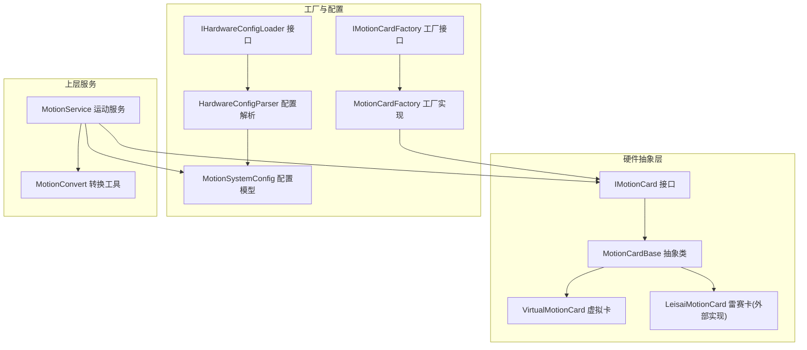
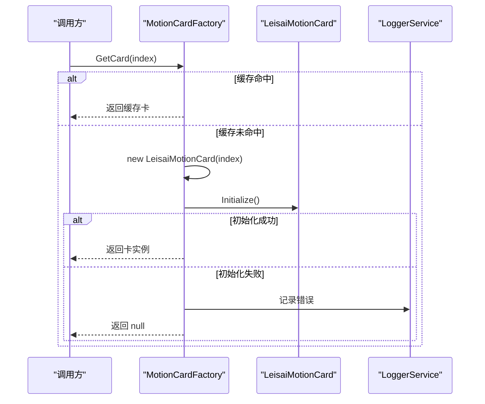
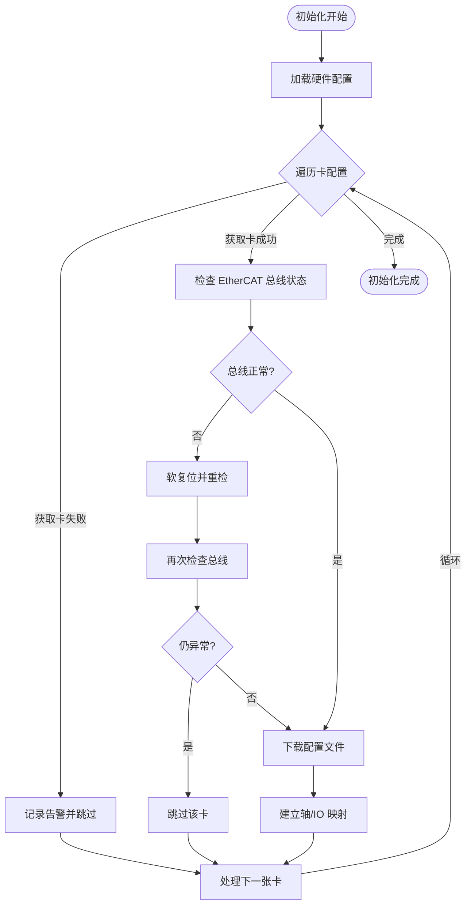
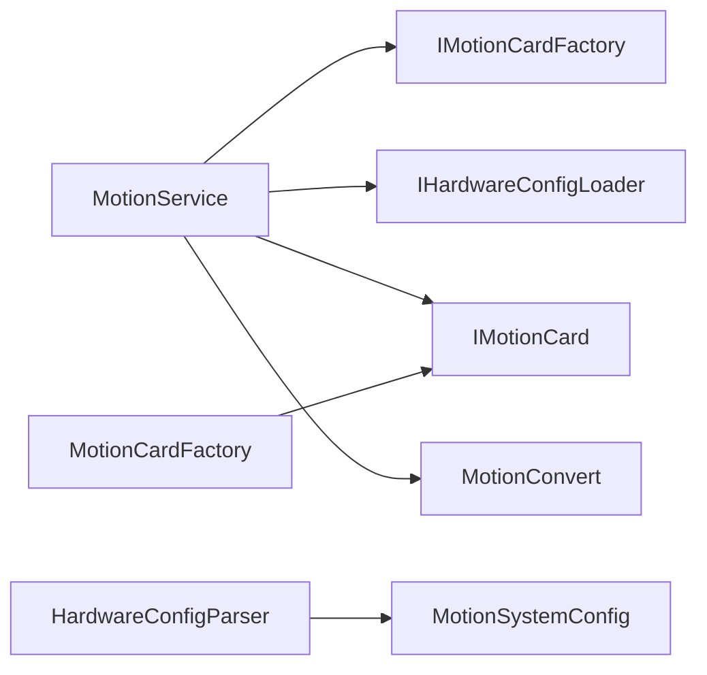

# 硬件适配层

<cite>
**本文引用的文件**
- [MotionCardBase.cs](file://MotionControl/Card/MotionCardBase.cs)
- [IMotionCard.cs](file://MotionControl/Interfaces/IMotionCard.cs)
- [MotionCardFactory.cs](file://MotionControl/Card/MotionCardFactory.cs)
- [IMotionCardFactory.cs](file://MotionControl/Interfaces/IMotionCardFactory.cs)
- [VirtualMotionCard.cs](file://MotionControl/Card/VirtualMotionCard.cs)
- [MotionConvert.cs](file://MotionControl/Card/MotionConvert.cs)
- [MotionService.cs](file://MotionControl/Services/MotionService.cs)
- [MotionSystemConfig.cs](file://MotionControl/Models/MotionSystemConfig.cs)
- [AxisConfiguration.cs](file://MotionControl/Models/AxisConfiguration.cs)
- [HardwareConfigParser.cs](file://MotionControl/Services/HardwareConfigParser.cs)
- [IHardwareConfigLoader.cs](file://MotionControl/Interfaces/IHardwareConfigLoader.cs)
</cite>

## 目录
1. [简介](#简介)
2. [项目结构](#项目结构)
3. [核心组件](#核心组件)
4. [架构总览](#架构总览)
5. [详细组件分析](#详细组件分析)
6. [依赖关系分析](#依赖关系分析)
7. [性能考量](#性能考量)
8. [故障诊断指南](#故障诊断指南)
9. [结论](#结论)
10. [附录](#附录)

## 简介
本技术文档聚焦于硬件适配层（Hal），系统性阐述运动控制硬件抽象层的设计与实现，包括：
- MotionCardBase 抽象基类的职责与接口设计
- MotionCardFactory 工厂模式的卡发现、实例化与缓存策略
- 具体硬件实现（以雷赛 Leisai 为例）的适配策略与虚拟硬件模拟
- 硬件初始化流程、通信协议与数据传输格式
- 硬件配置指南、驱动安装说明、兼容性测试方法
- 硬件故障诊断、性能调优与扩展新硬件的支持方案

## 项目结构
硬件适配层位于 MotionControl 子项目中，围绕 IMotionCard 接口与 MotionCardBase 抽象类构建，通过工厂模式屏蔽具体硬件差异，配合配置解析与运动服务实现统一的运动控制能力。

图示来源
- [IMotionCard.cs:1-66](file://MotionControl/Interfaces/IMotionCard.cs#L1-L66)
- [MotionCardBase.cs:1-57](file://MotionControl/Card/MotionCardBase.cs#L1-L57)
- [VirtualMotionCard.cs:1-68](file://MotionControl/Card/VirtualMotionCard.cs#L1-L68)
- [MotionCardFactory.cs:1-57](file://MotionControl/Card/MotionCardFactory.cs#L1-L57)
- [IMotionCardFactory.cs:1-13](file://MotionControl/Interfaces/IMotionCardFactory.cs#L1-L13)
- [HardwareConfigParser.cs:1-131](file://MotionControl/Services/HardwareConfigParser.cs#L1-L131)
- [IHardwareConfigLoader.cs:1-11](file://MotionControl/Interfaces/IHardwareConfigLoader.cs#L1-L11)
- [MotionSystemConfig.cs:1-71](file://MotionControl/Models/MotionSystemConfig.cs#L1-L71)
- [MotionService.cs:1-741](file://MotionControl/Services/MotionService.cs#L1-L741)
- [MotionConvert.cs:1-87](file://MotionControl/Card/MotionConvert.cs#L1-L87)

章节来源
- [MotionCardBase.cs:1-57](file://MotionControl/Card/MotionCardBase.cs#L1-L57)
- [IMotionCard.cs:1-66](file://MotionControl/Interfaces/IMotionCard.cs#L1-L66)
- [MotionCardFactory.cs:1-57](file://MotionControl/Card/MotionCardFactory.cs#L1-L57)
- [IMotionCardFactory.cs:1-13](file://MotionControl/Interfaces/IMotionCardFactory.cs#L1-L13)
- [VirtualMotionCard.cs:1-68](file://MotionControl/Card/VirtualMotionCard.cs#L1-L68)
- [MotionConvert.cs:1-87](file://MotionControl/Card/MotionConvert.cs#L1-L87)
- [MotionService.cs:1-741](file://MotionControl/Services/MotionService.cs#L1-L741)
- [MotionSystemConfig.cs:1-71](file://MotionControl/Models/MotionSystemConfig.cs#L1-L71)
- [AxisConfiguration.cs:1-298](file://MotionControl/Models/AxisConfiguration.cs#L1-L298)
- [HardwareConfigParser.cs:1-131](file://MotionControl/Services/HardwareConfigParser.cs#L1-L131)
- [IHardwareConfigLoader.cs:1-11](file://MotionControl/Interfaces/IHardwareConfigLoader.cs#L1-L11)

## 核心组件
- 抽象接口 IMotionCard：定义运动控制卡的标准能力集，覆盖初始化、IO、运动、回零、连续插补、轴参数设置等。
- 抽象基类 MotionCardBase：提供 IMotionCard 的默认空实现骨架，便于具体卡继承并按需覆盖。
- 工厂接口 IMotionCardFactory 与实现 MotionCardFactory：负责扫描硬件、实例化具体卡、缓存与返回卡实例。
- 虚拟卡 VirtualMotionCard：在无硬件环境下提供“成功即返回”的行为，保障系统可用性与测试便利。
- 运动服务 MotionService：面向业务的运动控制入口，负责初始化、映射、轮询、事件发布、异常处理与模拟量读取。
- 配置模型与解析：MotionSystemConfig 与 HardwareConfigParser 提供硬件配置的结构化描述与 XML 解析。
- 转换工具 MotionConvert：提供位操作、单位换算与字符串数组转换等通用工具。

章节来源
- [IMotionCard.cs:1-66](file://MotionControl/Interfaces/IMotionCard.cs#L1-L66)
- [MotionCardBase.cs:1-57](file://MotionControl/Card/MotionCardBase.cs#L1-L57)
- [MotionCardFactory.cs:1-57](file://MotionControl/Card/MotionCardFactory.cs#L1-L57)
- [IMotionCardFactory.cs:1-13](file://MotionControl/Interfaces/IMotionCardFactory.cs#L1-L13)
- [VirtualMotionCard.cs:1-68](file://MotionControl/Card/VirtualMotionCard.cs#L1-L68)
- [MotionService.cs:1-741](file://MotionControl/Services/MotionService.cs#L1-L741)
- [MotionSystemConfig.cs:1-71](file://MotionControl/Models/MotionSystemConfig.cs#L1-L71)
- [HardwareConfigParser.cs:1-131](file://MotionControl/Services/HardwareConfigParser.cs#L1-L131)
- [MotionConvert.cs:1-87](file://MotionControl/Card/MotionConvert.cs#L1-L87)

## 架构总览
硬件适配层采用“接口 + 抽象基类 + 工厂 + 虚拟卡 + 上层服务”的分层设计，屏蔽底层硬件差异，提供统一的运动控制能力。

```mermaid
classDiagram
class IMotionCard {
+CardId : int
+Initialize() : int
+Close() : int
+SoftReset() : int
+LoadConfig(path) : int
+SetServo(axis, enable) : int
+MoveAbs(axis, pos, vel) : int
+MoveRel(axis, dist, vel) : int
+GoHome(axis) : int
+SetHomeMode(axis, mode, minVel, maxVel) : int
+Stop(axis) : int
+EStop(axis) : int
+GetPosition(axis) : double
+GetMotionIO(axis, status) : int
+ClearAlarm(axis) : int
+SetDo(port, value) : int
+GetDi(port, value) : int
+GetDo(port, value) : int
+MoveLineAbs(coord, axes, pos, vel) : int
+MoveJog(axis, dir) : int
+CheckDone(axis) : int
+CheckHomeDone(axis) : int
+CheckCoordDone(coord) : int
+SetVectorProfileUnit(coord, startVel, maxVel, acc, dec, endVel) : int
+ContiSetLookaheadMode(coord, mode, fifo, r1, r2) : int
+SetVectorSProfile(coord, r, s) : int
+SetArcLimit(coord, r1, r2, r3) : int
+ContiOpenList(coord, axisCount, axes) : int
+ContiLineUnit(coord, axisCount, axes, pos, mode, mark) : int
+ContiStartList(coord) : int
+ContiCloseList(coord) : int
+ContiPauseList(coord) : int
+CheckCoordMotionDone(coord) : int
+SetPulseEquivalent(axis, pulses) : int
+SetEmergencyStopMode(axis, enabled, level) : int
+SetAxisIOMap(axis, ioType, mapType, mapIndex, filter) : int
+SetHomeProfile(axis, mode, lowVel, highVel, accT, decT, offset) : int
+SetProfileUnit(axis, startVel, maxVel, accT, decT, stopVel) : int
+SetSProfile(axis, r, s) : int
+SetDecStopTime(axis, decStopT) : int
}
class MotionCardBase {
<<abstract>>
+CardId : int
+Initialize() : int
+Close() : int
+SoftReset() : int
+LoadConfig(path) : int
+SetServo(axis, enable) : int
+MoveAbs(axis, pos, vel) : int
+MoveRel(axis, dist, vel) : int
+GoHome(axis) : int
+SetHomeMode(axis, mode, minVel, maxVel) : int
+Stop(axis) : int
+EStop(axis) : int
+GetPosition(axis) : double
+GetMotionIO(axis, status) : int
+ClearAlarm(axis) : int
+SetDo(port, value) : int
+GetDi(port, value) : int
+GetDo(port, value) : int
+MoveLineAbs(coord, axes, pos, vel) : int
+MoveJog(axis, dir) : int
+CheckDone(axis) : int
+CheckHomeDone(axis) : int
+CheckCoordDone(coord) : int
+SetVectorProfileUnit(coord, startVel, maxVel, acc, dec, endVel) : int
+ContiSetLookaheadMode(coord, mode, fifo, r1, r2) : int
+SetVectorSProfile(coord, r, s) : int
+SetArcLimit(coord, r1, r2, r3) : int
+ContiOpenList(coord, axisCount, axes) : int
+ContiLineUnit(coord, axisCount, axes, pos, mode, mark) : int
+ContiStartList(coord) : int
+ContiCloseList(coord) : int
+ContiPauseList(coord) : int
+CheckCoordMotionDone(coord) : int
+SetPulseEquivalent(axis, pulses) : int
+SetEmergencyStopMode(axis, enabled, level) : int
+SetAxisIOMap(axis, ioType, mapType, mapIndex, filter) : int
+SetHomeProfile(axis, mode, lowVel, highVel, accT, decT, offset) : int
+SetProfileUnit(axis, startVel, maxVel, accT, decT, stopVel) : int
+SetSProfile(axis, r, s) : int
+SetDecStopTime(axis, decStopT) : int
}
class VirtualMotionCard {
+CardId : int
+Initialize() : int
+Close() : int
+SoftReset() : int
+LoadConfig(path) : int
+SetServo(axis, enable) : int
+MoveAbs(axis, pos, vel) : int
+MoveRel(axis, dist, vel) : int
+GoHome(axis) : int
+SetHomeMode(axis, mode, minVel, maxVel) : int
+Stop(axis) : int
+EStop(axis) : int
+GetPosition(axis) : double
+GetMotionIO(axis, status) : int
+ClearAlarm(axis) : int
+SetDo(port, value) : int
+GetDi(port, value) : int
+GetDo(port, value) : int
+MoveLineAbs(coord, axes, pos, vel) : int
+MoveJog(axis, dir) : int
+CheckDone(axis) : int
+CheckHomeDone(axis) : int
+CheckEtherCatStatus() : int
+Write_rxpdo(port, addr, len, val) : int
+ClearEncoder(channel) : int
+SetTriggerPosition(...) : int
+CheckCoordDone(coord) : int
+SetVectorProfileUnit(coord, startVel, maxVel, acc, dec, endVel) : int
+ContiSetLookaheadMode(coord, mode, fifo, r1, r2) : int
+SetVectorSProfile(coord, r, s) : int
+SetArcLimit(coord, r1, r2, r3) : int
+ContiOpenList(coord, axisCount, axes) : int
+ContiLineUnit(coord, axisCount, axes, pos, mode, mark) : int
+ContiStartList(coord) : int
+ContiCloseList(coord) : int
+ContiPauseList(coord) : int
+CheckCoordMotionDone(coord) : int
+SetPulseEquivalent(axis, pulses) : int
+SetEmergencyStopMode(axis, enabled, level) : int
+SetAxisIOMap(axis, ioType, mapType, mapIndex, filter) : int
+SetHomeProfile(axis, mode, lowVel, highVel, accT, decT, offset) : int
+SetProfileUnit(axis, startVel, maxVel, accT, decT, stopVel) : int
+SetSProfile(axis, r, s) : int
+SetDecStopTime(axis, decStopT) : int
}
class MotionCardFactory {
+CardCount : int
+GetCard(index) : IMotionCard?
+GetDefaultCard() : IMotionCard?
-ScanCardCount() : int
}
class IMotionCardFactory {
+GetCard(index) : IMotionCard?
+GetDefaultCard() : IMotionCard?
+CardCount : int
}
class MotionService {
+InitializeAsync() : Task
+Shutdown() : void
+EnableAxis(axis) : void
+DisableAxis(axis) : void
+MoveAbsAsync(axis, pos, vel, token) : Task
+MoveRelAsync(axis, dist, vel, token) : Task
+MoveLineAbsAsync(coord, axes, pos, vel, token) : Task
+HomeAsync(axis, mode, minVel, maxVel, token) : Task
+JogStart(axis, positive) : void
+JogStop(axis) : void
+StopAxis(axis) : void
+EmergencyStop(axis) : void
+GetAxisState(axis) : IAxis?
+ClearAlarm(axis) : void
+ReadDi(logicalId) : bool
+ReadDo(logicalId) : bool
+WriteDo(logicalId, value) : void
+StartPolling(intervalMs) : void
+StopPolling() : void
+ReadAnalogChannelAsync(cardNo, channel) : Task<double>
+ReadAnalogChannelsAsync(map) : Task<Dictionary>
+InitializeContinuousInterpolation(coord, axes, params) : void
+AddLineSegment(coord, targetPos, mode, mark) : void
+ExecuteContinuousInterpolation(coord) : void
+PauseContinuousInterpolation(coord) : void
+WaitForCoordMotionCompletionAsync(coord, timeout, token) : Task<bool>
}
IMotionCard <|.. MotionCardBase
MotionCardBase <|-- VirtualMotionCard
IMotionCardFactory <|.. MotionCardFactory
MotionService --> IMotionCard : "依赖"
MotionService --> IMotionCardFactory : "依赖"
MotionService --> IHardwareConfigLoader : "依赖"
```

图示来源
- [IMotionCard.cs:1-66](file://MotionControl/Interfaces/IMotionCard.cs#L1-L66)
- [MotionCardBase.cs:1-57](file://MotionControl/Card/MotionCardBase.cs#L1-L57)
- [VirtualMotionCard.cs:1-68](file://MotionControl/Card/VirtualMotionCard.cs#L1-L68)
- [IMotionCardFactory.cs:1-13](file://MotionControl/Interfaces/IMotionCardFactory.cs#L1-L13)
- [MotionCardFactory.cs:1-57](file://MotionControl/Card/MotionCardFactory.cs#L1-L57)
- [MotionService.cs:1-741](file://MotionControl/Services/MotionService.cs#L1-L741)

## 详细组件分析

### MotionCardBase 抽象基类
- 设计要点
  - 以抽象类形式提供 IMotionCard 的完整方法签名，便于子类按需覆盖。
  - 包含基础运动控制、IO、回零、连续插补与轴参数设置等方法族。
- 使用建议
  - 子类只需覆盖实际需要的方法，未覆盖的方法将沿用抽象基类的默认实现（通常为返回成功码）。

章节来源
- [MotionCardBase.cs:1-57](file://MotionControl/Card/MotionCardBase.cs#L1-L57)
- [IMotionCard.cs:1-66](file://MotionControl/Interfaces/IMotionCard.cs#L1-L66)

### MotionCardFactory 工厂模式
- 卡发现与缓存
  - 构造函数中快速扫描硬件数量，不初始化具体卡对象，降低启动成本。
  - GetCard(index) 通过索引创建具体卡实例（当前实现为 LeisaiMotionCard），并缓存以复用。
- 错误处理
  - 初始化失败时记录日志并返回空，避免中断整体初始化流程。
- 默认卡
  - GetDefaultCard 返回索引 0 的卡实例，便于上层简化调用。

图示来源
- [MotionCardFactory.cs:1-57](file://MotionControl/Card/MotionCardFactory.cs#L1-L57)

章节来源
- [MotionCardFactory.cs:1-57](file://MotionControl/Card/MotionCardFactory.cs#L1-L57)
- [IMotionCardFactory.cs:1-13](file://MotionControl/Interfaces/IMotionCardFactory.cs#L1-L13)

### VirtualMotionCard 虚拟硬件
- 行为特征
  - 所有方法返回成功码（0），部分查询方法返回默认值。
  - 运动完成检查始终返回“完成”，总线状态检查返回正常。
- 应用场景
  - 无硬件环境下的开发与测试。
  - 当真实卡不可用时，作为后备卡保障系统可用性。

章节来源
- [VirtualMotionCard.cs:1-68](file://MotionControl/Card/VirtualMotionCard.cs#L1-L68)

### MotionService 运动服务
- 初始化流程
  - 加载硬件配置，逐卡调用工厂获取卡实例。
  - 检查 EtherCAT 总线状态，必要时软复位并重检。
  - 下载配置文件，建立轴与 IO 的逻辑到物理映射。
- 运动与状态管理
  - 提供绝对/相对/回零/点动/急停等运动命令。
  - 通过轮询线程与事件发布实现状态驱动，支持高精度等待与位置校验。
- 模拟量读取
  - 直接调用底层 AD 读取 API 并结合 AD 值转换器转换为物理量。
- 连续插补
  - 提供初始化、添加段、启动/暂停/关闭列表与完成等待等接口。

图示来源
- [MotionService.cs:125-161](file://MotionControl/Services/MotionService.cs#L125-L161)

章节来源
- [MotionService.cs:1-741](file://MotionControl/Services/MotionService.cs#L1-L741)

### 配置模型与解析
- 配置模型
  - MotionSystemConfig 描述系统中的卡、轴、输入输出、任务、信号组与灯光等。
  - AxisConfiguration 提供轴参数、回零、急停、运动曲线等参数模型。
- 配置解析
  - HardwareConfigParser 从 XML 文件解析配置，支持信号组与输出组的解析。
  - IHardwareConfigLoader 作为解析器的接口，便于替换实现。

章节来源
- [MotionSystemConfig.cs:1-71](file://MotionControl/Models/MotionSystemConfig.cs#L1-L71)
- [AxisConfiguration.cs:1-298](file://MotionControl/Models/AxisConfiguration.cs#L1-L298)
- [HardwareConfigParser.cs:1-131](file://MotionControl/Services/HardwareConfigParser.cs#L1-L131)
- [IHardwareConfigLoader.cs:1-11](file://MotionControl/Interfaces/IHardwareConfigLoader.cs#L1-L11)

### MotionConvert 转换工具
- 位操作：检查/设置/清除位，以及按原项目习惯对低16位取反。
- 数值转换：毫米与脉冲互转（默认参数符合常见步进/伺服系统）。
- 字符串与数组：支持多种分隔符的字符串与数组互转。

章节来源
- [MotionConvert.cs:1-87](file://MotionControl/Card/MotionConvert.cs#L1-L87)

## 依赖关系分析
- 组件耦合
  - MotionService 依赖 IMotionCardFactory、IHardwareConfigLoader、IMotionCard 等接口，降低对具体实现的耦合。
  - 工厂与卡实现之间通过接口解耦，便于替换不同品牌的运动控制卡。
- 外部依赖
  - 底层通过 LTDMC API 访问雷赛运动控制卡，MotionService 中直接调用 AD 读取与总线状态检查等。
- 循环依赖
  - 未见明显循环依赖；接口与抽象类形成清晰的单向依赖链。

图示来源
- [MotionService.cs:1-741](file://MotionControl/Services/MotionService.cs#L1-L741)
- [MotionCardFactory.cs:1-57](file://MotionControl/Card/MotionCardFactory.cs#L1-L57)
- [HardwareConfigParser.cs:1-131](file://MotionControl/Services/HardwareConfigParser.cs#L1-L131)
- [MotionSystemConfig.cs:1-71](file://MotionControl/Models/MotionSystemConfig.cs#L1-L71)
- [MotionConvert.cs:1-87](file://MotionControl/Card/MotionConvert.cs#L1-L87)

章节来源
- [MotionService.cs:1-741](file://MotionControl/Services/MotionService.cs#L1-L741)
- [MotionCardFactory.cs:1-57](file://MotionControl/Card/MotionCardFactory.cs#L1-L57)
- [HardwareConfigParser.cs:1-131](file://MotionControl/Services/HardwareConfigParser.cs#L1-L131)
- [MotionSystemConfig.cs:1-71](file://MotionControl/Models/MotionSystemConfig.cs#L1-L71)
- [MotionConvert.cs:1-87](file://MotionControl/Card/MotionConvert.cs#L1-L87)

## 性能考量
- 轮询与等待
  - 采用高优先级后台线程进行周期性轮询，快速报警检查与较慢的全状态轮询分离，减少 UI 阻塞。
  - 等待完成采用 SpinWait 自旋 + 短暂 Sleep 的混合策略，兼顾响应性与 CPU 占用。
- 时间精度
  - 通过 Windows 多媒体定时器 API 提升系统定时器精度，改善等待循环的抖动与延迟。
- 连续插补
  - 提供专用的连续插补初始化与等待接口，满足点胶等工业场景对实时性的严格要求。

章节来源
- [MotionService.cs:417-741](file://MotionControl/Services/MotionService.cs#L417-L741)

## 故障诊断指南
- 总线与卡状态
  - 初始化阶段若 EtherCAT 总线异常，将尝试软复位；若仍失败则跳过该卡并记录错误。
- 报警与急停
  - 轮询线程定期读取 IO 状态字，识别报警与急停位，触发事件与报警模块记录。
- 位置校验
  - 运动完成后进行位置误差校验，超出容差将抛出可恢复异常，提示检查机械与传感器状态。
- 回零流程
  - 回零过程包含回零完成与运动停止两个阶段的等待，异常状态会抛出可恢复异常并给出建议动作。
- 虚拟卡模式
  - 当无真实卡时自动启用虚拟卡，确保系统可运行；可通过 IsSimulationMode 判断当前模式。

章节来源
- [MotionService.cs:125-387](file://MotionControl/Services/MotionService.cs#L125-L387)

## 结论
硬件适配层通过抽象接口、工厂模式与虚拟卡策略，有效屏蔽了不同品牌运动控制卡的差异，提供了统一且可扩展的运动控制能力。结合完善的配置解析、事件驱动的状态轮询与严格的故障诊断机制，能够在真实硬件与仿真环境中稳定运行，并为后续扩展新的硬件品牌提供清晰的接入路径。

## 附录

### 硬件初始化流程（步骤说明）
- 加载配置：从 XML 文件解析系统配置。
- 卡发现：工厂扫描硬件数量，但不初始化具体卡。
- 卡实例化：按配置索引获取卡实例，记录初始化结果。
- 总线检查：对每张卡检查 EtherCAT 总线状态，必要时软复位。
- 配置下载：在总线正常后下载配置文件。
- 建立映射：将逻辑轴与 IO 映射到物理卡与通道。
- 启动轮询：开启高精度轮询线程，发布轴状态事件。

章节来源
- [MotionService.cs:125-203](file://MotionControl/Services/MotionService.cs#L125-L203)
- [HardwareConfigParser.cs:21-122](file://MotionControl/Services/HardwareConfigParser.cs#L21-L122)

### 通信协议与数据传输格式
- 通信接口
  - 通过 IMotionCard 接口暴露统一方法，具体卡实现（如 LeisaiMotionCard）对接底层 LTDMC API。
- 数据传输
  - 运动参数（位置、速度、加速度）以数值形式传递；IO 状态通过状态字整型返回。
  - 模拟量通道通过底层 AD 读取 API 获取原始值，再由 AD 值转换器转换为物理量。

章节来源
- [IMotionCard.cs:1-66](file://MotionControl/Interfaces/IMotionCard.cs#L1-L66)
- [MotionService.cs:603-643](file://MotionControl/Services/MotionService.cs#L603-L643)

### 硬件配置指南
- 配置文件
  - 使用 XML 文件描述卡、轴、输入输出、任务、信号组与灯光等。
- 关键字段
  - MotionCard：actCardId、name、XCommandCard、path。
  - Axis：setCardId、actAxisId、setAxisId、name、taskId、axisDirection。
  - DI/DO：setCardId、channel、actDiId/actDoId、name、isInput。
- 读取路径
  - 通过 IHardwareConfigLoader 接口注入解析器，解析器默认从应用目录的 Config/HWConfig/hwcfg.xml 读取。

章节来源
- [MotionSystemConfig.cs:1-71](file://MotionControl/Models/MotionSystemConfig.cs#L1-L71)
- [HardwareConfigParser.cs:15-19](file://MotionControl/Services/HardwareConfigParser.cs#L15-L19)
- [IHardwareConfigLoader.cs:1-11](file://MotionControl/Interfaces/IHardwareConfigLoader.cs#L1-L11)

### 驱动安装说明（基于现有实现）
- 雷赛驱动
  - 代码中直接调用 LTDMC API，表明系统需安装雷赛运动控制卡驱动与 SDK。
- 安装建议
  - 安装与配置雷赛官方驱动与运行库，确保 LTDMC 动态库可用。
  - 确认 EtherCAT 总线连接与供电正常，避免初始化阶段总线异常。

章节来源
- [MotionService.cs:138-151](file://MotionControl/Services/MotionService.cs#L138-L151)

### 兼容性测试方法
- 无硬件测试
  - 通过虚拟卡模式验证运动服务与 UI 交互，确保功能正确性。
- 回归测试
  - 使用最小配置文件，逐步增加轴与 IO 数量，验证映射与轮询稳定性。
- 异常场景
  - 模拟总线异常、回零失败、运动未到位等场景，验证异常处理与告警记录。

章节来源
- [VirtualMotionCard.cs:1-68](file://MotionControl/Card/VirtualMotionCard.cs#L1-L68)
- [MotionService.cs:255-387](file://MotionControl/Services/MotionService.cs#L255-L387)

### 扩展新硬件的支持方案
- 新增卡实现
  - 继承 MotionCardBase 并实现 IMotionCard，仅覆盖需要的方法。
- 工厂扩展
  - 在工厂中根据卡类型或配置选择具体卡实现，保持对外接口一致。
- 配置扩展
  - 在 XML 中新增卡类型与路径，解析器按需扩展字段支持。
- 测试与验证
  - 提供单元测试与集成测试，覆盖初始化、运动、IO、插补与异常处理。

章节来源
- [MotionCardBase.cs:1-57](file://MotionControl/Card/MotionCardBase.cs#L1-L57)
- [IMotionCard.cs:1-66](file://MotionControl/Interfaces/IMotionCard.cs#L1-L66)
- [MotionCardFactory.cs:1-57](file://MotionControl/Card/MotionCardFactory.cs#L1-L57)
- [HardwareConfigParser.cs:21-122](file://MotionControl/Services/HardwareConfigParser.cs#L21-L122)