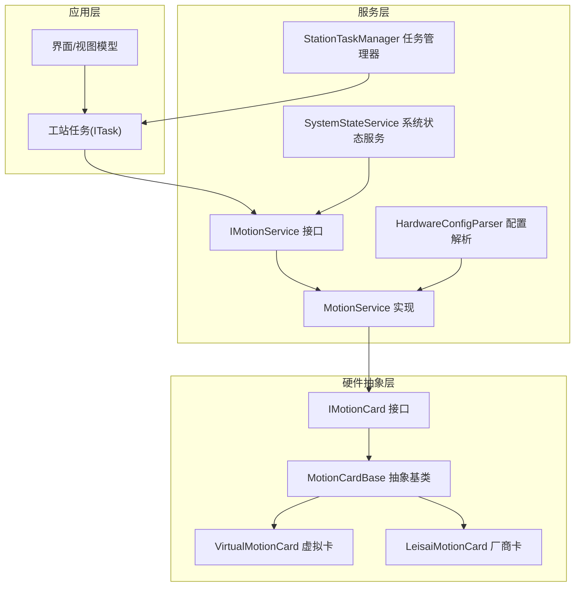
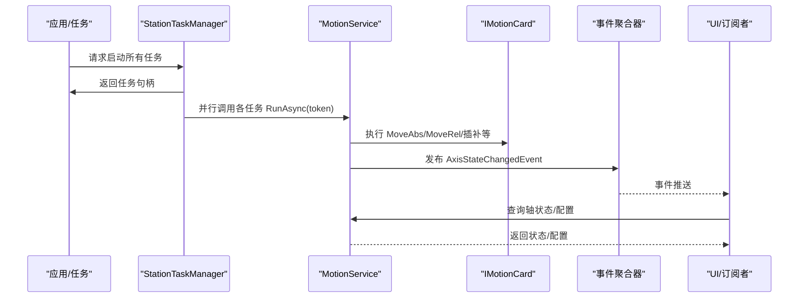
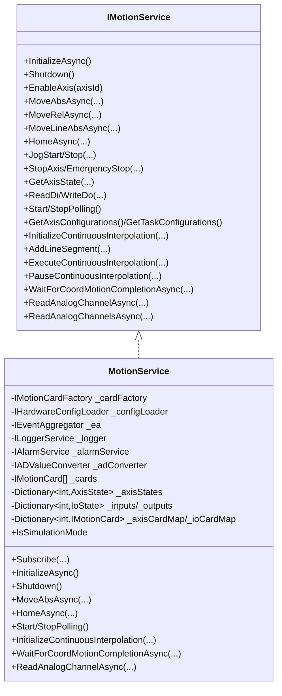
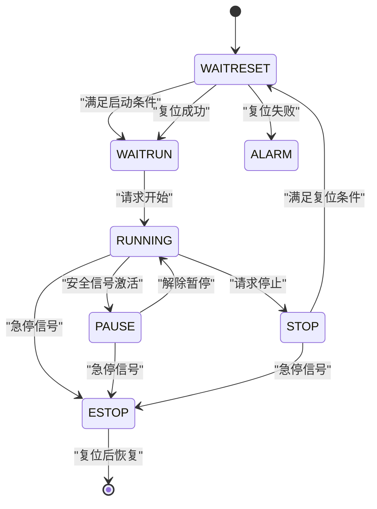
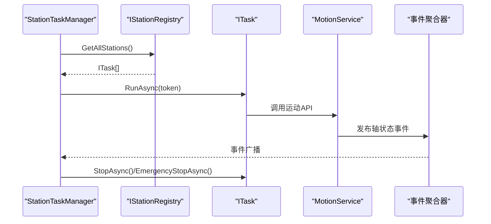
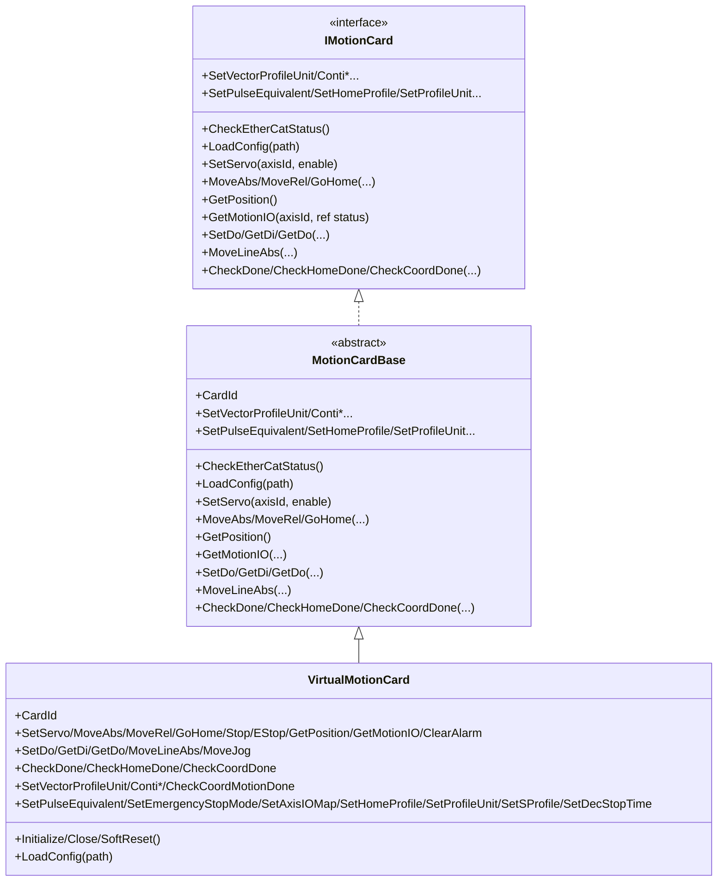
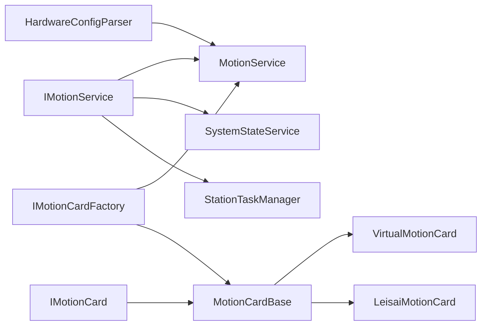

# 运动控制架构设计

<cite>
**本文档引用的文件**
- [IMotionService.cs](file://MotionControl/Interfaces/IMotionService.cs)
- [MotionService.cs](file://MotionControl/Services/MotionService.cs)
- [SystemStateService.cs](file://MotionControl/Services/SystemStateService.cs)
- [StationTaskManager.cs](file://MotionControl/Services/StationTaskManager.cs)
- [IMotionCard.cs](file://MotionControl/Interfaces/IMotionCard.cs)
- [MotionCardBase.cs](file://MotionControl/Card/MotionCardBase.cs)
- [VirtualMotionCard.cs](file://MotionControl/Card/VirtualMotionCard.cs)
- [IMotionCardFactory.cs](file://MotionControl/Interfaces/IMotionCardFactory.cs)
- [MotionSystemConfig.cs](file://MotionControl/Models/MotionSystemConfig.cs)
- [HardwareConfigParser.cs](file://MotionControl/Services/HardwareConfigParser.cs)
- [AxisStateChangedEvent.cs](file://MotionControl/Events/AxisStateChangedEvent.cs)
- [ITask.cs](file://MotionControl/Interfaces/ITask.cs)
- [StationState.cs](file://MotionControl/Models/StationState.cs)
- [MotionControlModule.cs](file://MotionControl/MotionControlModule.cs)
- [项目架构.txt](file://MainApp/项目架构.txt)
</cite>

## 目录
1. [简介](#简介)
2. [项目结构](#项目结构)
3. [核心组件](#核心组件)
4. [架构总览](#架构总览)
5. [详细组件分析](#详细组件分析)
6. [依赖关系分析](#依赖关系分析)
7. [性能考量](#性能考量)
8. [故障排查指南](#故障排查指南)
9. [结论](#结论)
10. [附录](#附录)

## 简介
本文件面向运动控制架构设计，围绕 IMotionService 接口设计、MotionService 核心实现、系统状态管理机制展开，系统性阐述从应用层到硬件抽象层的分层架构理念，运动任务调度、状态同步与异常处理的架构模式，并提供架构图、组件交互流程、设计原则与扩展性考虑。同时给出性能优化策略、并发控制机制与错误恢复方案。

## 项目结构
运动控制子系统位于 MotionControl 模块，采用清晰的分层组织：
- 接口层：定义 IMotionService、IMotionCard、IMotionCardFactory 等核心契约
- 服务层：实现运动控制服务、系统状态服务、任务管理器、配置解析器
- 卡适配层：抽象 IMotionCard，提供 MotionCardBase 与具体厂商实现（如 Leisai）
- 事件与模型：定义轴状态事件、系统状态枚举、硬件配置模型
- 模块集成：通过 Prism IModule 注册与装配

**图表来源**
- [MotionControlModule.cs:36-59](file://MotionControl/MotionControlModule.cs#L36-L59)
- [项目架构.txt:1-43](file://MainApp/项目架构.txt#L1-L43)

**章节来源**
- [MotionControlModule.cs:36-59](file://MotionControl/MotionControlModule.cs#L36-L59)
- [项目架构.txt:1-43](file://MainApp/项目架构.txt#L1-L43)

## 核心组件
- IMotionService：定义运动控制能力与事件驱动接口，支持绝对/相对/回零/点动/连续插补/模拟量读取等
- MotionService：实现 IMotionService，负责卡初始化、轴/IO映射、轮询与事件发布、运动完成校验、异常抛出
- SystemStateService：系统状态机与安全联锁，基于 DI 信号与配置驱动状态流转，控制指示灯与蜂鸣器
- StationTaskManager：统一调度各工站任务，支持并行运行、暂停/恢复、急停、回零与复位结果上报
- IMotionCard/IMotionCardFactory：硬件抽象与工厂，支持真实卡与虚拟卡
- 配置与事件：HardwareConfigParser 解析 hwcfg.xml，AxisStateChangedEvent 事件承载轴状态

**章节来源**
- [IMotionService.cs:12-91](file://MotionControl/Interfaces/IMotionService.cs#L12-L91)
- [MotionService.cs:26-161](file://MotionControl/Services/MotionService.cs#L26-L161)
- [SystemStateService.cs:15-86](file://MotionControl/Services/SystemStateService.cs#L15-L86)
- [StationTaskManager.cs:13-111](file://MotionControl/Services/StationTaskManager.cs#L13-L111)
- [IMotionCard.cs:4-66](file://MotionControl/Interfaces/IMotionCard.cs#L4-L66)
- [IMotionCardFactory.cs:5-12](file://MotionControl/Interfaces/IMotionCardFactory.cs#L5-L12)
- [HardwareConfigParser.cs:11-131](file://MotionControl/Services/HardwareConfigParser.cs#L11-L131)
- [AxisStateChangedEvent.cs:9-51](file://MotionControl/Events/AxisStateChangedEvent.cs#L9-L51)

## 架构总览
运动控制采用“事件驱动 + 高频轮询”的混合策略：
- 事件驱动：IMotionService 实现 IObservable<AxisStateChangedEvent>，MotionService 在轮询中发布轴状态变更事件，UI/订阅者即时获知状态
- 高频轮询：10ms 快周期检查报警与关键 I/O，每 3 次快周期执行一次完整轮询，读取位置与运动状态，降低 UI 轮询开销
- 任务编排：StationTaskManager 统一启动/停止/暂停/恢复各工站任务，HomeAllAsync 并行回零并汇总复位结果
- 系统状态：SystemStateService 基于 hwcfg.xml 中的信号分组与灯光/蜂鸣器配置，实现安全联锁与状态指示

**图表来源**
- [StationTaskManager.cs:32-57](file://MotionControl/Services/StationTaskManager.cs#L32-L57)
- [MotionService.cs:221-290](file://MotionControl/Services/MotionService.cs#L221-L290)
- [AxisStateChangedEvent.cs:9-51](file://MotionControl/Events/AxisStateChangedEvent.cs#L9-L51)

**章节来源**
- [MotionService.cs:418-579](file://MotionControl/Services/MotionService.cs#L418-L579)
- [StationTaskManager.cs:32-91](file://MotionControl/Services/StationTaskManager.cs#L32-L91)

## 详细组件分析

### IMotionService 接口设计
- 能力覆盖：轴使能/禁用、绝对/相对/回零、点动、停止/急停、位置查询、DI/DO 读写、轮询启停、配置查询、连续插补、模拟量读取
- 事件驱动：实现 IObservable<AxisStateChangedEvent>，替代传统定时器轮询，降低 CPU 占用并提高响应性
- 取消令牌：多处 API 支持 CancellationToken，实现急停/停止的微秒级响应
- 模拟模式：IsSimulationMode 标识是否使用 VirtualMotionCard

**章节来源**
- [IMotionService.cs:12-91](file://MotionControl/Interfaces/IMotionService.cs#L12-L91)

### MotionService 核心实现
- 初始化与映射：加载 hwcfg.xml，逐卡检查 EtherCAT 总线状态，软复位后下载配置；建立轴/IO 到卡的映射，无真实卡时自动注入虚拟卡
- 轴操作：MoveAbs/MoveRel/MoveLineAbs/Home/Jog/Stop/EStop 等均路由到对应卡；运动完成后进行位置校验，超差抛出可恢复异常
- 轮询与事件：10ms 快周期检查报警与关键 I/O；每 3 次快周期执行完整轮询，读取位置与状态，发布 AxisStateChangedEvent
- 连续插补：Initialize/Add/Execute/Pause/WaitForCoordMotionCompletion，支持高精度轨迹运动与急停秒响应
- 模拟量：单通道与批量读取，结合 IADValueConverter 转换为物理量

**图表来源**
- [IMotionService.cs:12-91](file://MotionControl/Interfaces/IMotionService.cs#L12-L91)
- [MotionService.cs:26-161](file://MotionControl/Services/MotionService.cs#L26-L161)

**章节来源**
- [MotionService.cs:126-203](file://MotionControl/Services/MotionService.cs#L126-L203)
- [MotionService.cs:221-387](file://MotionControl/Services/MotionService.cs#L221-L387)
- [MotionService.cs:418-725](file://MotionControl/Services/MotionService.cs#L418-L725)

### 系统状态管理机制
- 状态机：StationState 枚举定义系统状态，SystemStateService 实现状态流转与条件判断
- 安全联锁：基于 hwcfg.xml 的 SignalGroups/OutputGroups/Lights 配置，读取 DI 信号，判定安全门/光栅/急停等
- 指示灯与蜂鸣器：根据当前状态动态控制灯光闪烁与蜂鸣器脉冲，支持运行时热更新安全开关
- 事件联动：接收全局急停/复位结果事件，驱动状态切换与告警记录

**图表来源**
- [StationState.cs:3-16](file://MotionControl/Models/StationState.cs#L3-L16)
- [SystemStateService.cs:147-341](file://MotionControl/Services/SystemStateService.cs#L147-L341)

**章节来源**
- [SystemStateService.cs:15-86](file://MotionControl/Services/SystemStateService.cs#L15-L86)
- [SystemStateService.cs:207-341](file://MotionControl/Services/SystemStateService.cs#L207-L341)
- [SystemStateService.cs:343-450](file://MotionControl/Services/SystemStateService.cs#L343-L450)

### 运动任务调度与状态同步
- 任务接口：ITask 定义 Run/Pause/Resume/Stop/Home/EmergencyStop 等生命周期方法
- 统一管理：StationTaskManager 通过 IStationRegistry 获取所有工站任务，支持并行运行、统一停止/急停、并行 HomeAllAsync
- 状态同步：MotionService 通过事件驱动向订阅者推送轴状态；SystemStateService 基于 DI 信号与状态机同步系统状态

**图表来源**
- [StationTaskManager.cs:23-64](file://MotionControl/Services/StationTaskManager.cs#L23-L64)
- [ITask.cs:18-31](file://MotionControl/Interfaces/ITask.cs#L18-L31)
- [MotionService.cs:99-111](file://MotionControl/Services/MotionService.cs#L99-L111)

**章节来源**
- [StationTaskManager.cs:13-111](file://MotionControl/Services/StationTaskManager.cs#L13-L111)
- [ITask.cs:18-31](file://MotionControl/Interfaces/ITask.cs#L18-L31)

### 硬件抽象层与扩展性
- IMotionCard 抽象：统一 EtherCAT 总线、轴控制、IO、连续插补、轴参数设置等接口
- MotionCardBase：提供 IMotionCard 的默认空实现，便于扩展厂商卡
- VirtualMotionCard：无硬件时的仿真实现，所有操作返回成功，便于开发与测试
- 工厂模式：IMotionCardFactory 提供 GetCard/GetDefaultCard，支持多卡与默认卡选择

**图表来源**
- [IMotionCard.cs:4-66](file://MotionControl/Interfaces/IMotionCard.cs#L4-L66)
- [MotionCardBase.cs:5-57](file://MotionControl/Card/MotionCardBase.cs#L5-L57)
- [VirtualMotionCard.cs:8-68](file://MotionControl/Card/VirtualMotionCard.cs#L8-L68)

**章节来源**
- [IMotionCard.cs:4-66](file://MotionControl/Interfaces/IMotionCard.cs#L4-L66)
- [MotionCardBase.cs:5-57](file://MotionControl/Card/MotionCardBase.cs#L5-L57)
- [VirtualMotionCard.cs:8-68](file://MotionControl/Card/VirtualMotionCard.cs#L8-L68)

### 配置与事件模型
- 硬件配置：HardwareConfigParser 从 hwcfg.xml 解析卡、轴、DI/DO、任务、信号组、输出组、灯光等配置
- 轴状态事件：AxisStateChangedEvent 包含轴实时位置、运动状态、报警/急停/原点/极限等位信息
- 系统状态：StationState 枚举与 SystemStateService 状态机共同驱动系统行为

**章节来源**
- [HardwareConfigParser.cs:21-131](file://MotionControl/Services/HardwareConfigParser.cs#L21-L131)
- [AxisStateChangedEvent.cs:9-51](file://MotionControl/Events/AxisStateChangedEvent.cs#L9-L51)
- [MotionSystemConfig.cs:5-71](file://MotionControl/Models/MotionSystemConfig.cs#L5-L71)

## 依赖关系分析
- 服务依赖：MotionService 依赖 IMotionCardFactory/IHardwareConfigLoader/IEventAggregator/ILoggerService/IAlarmService/IADValueConverter
- 状态服务：SystemStateService 依赖 IMotionService/IHardwareConfigLoader/IEventAggregator/ILoggerService/IAppSettingService
- 任务管理：StationTaskManager 依赖 IStationRegistry/IEventAggregator/ILoggerService
- 硬件抽象：IMotionCardFactory -> IMotionCard -> MotionCardBase -> VirtualMotionCard/LeisaiMotionCard

**图表来源**
- [MotionService.cs:113-123](file://MotionControl/Services/MotionService.cs#L113-L123)
- [SystemStateService.cs:66-74](file://MotionControl/Services/SystemStateService.cs#L66-L74)
- [StationTaskManager.cs:25-30](file://MotionControl/Services/StationTaskManager.cs#L25-L30)
- [IMotionCardFactory.cs:5-12](file://MotionControl/Interfaces/IMotionCardFactory.cs#L5-L12)

**章节来源**
- [MotionService.cs:113-123](file://MotionControl/Services/MotionService.cs#L113-L123)
- [SystemStateService.cs:66-74](file://MotionControl/Services/SystemStateService.cs#L66-L74)
- [StationTaskManager.cs:25-30](file://MotionControl/Services/StationTaskManager.cs#L25-L30)

## 性能考量
- 轮询策略：10ms 快周期 + 每 3 次快周期完整轮询，平衡实时性与 CPU 开销
- 自旋等待：WaitForDone/WaitForCoordDone 使用 SpinWait，避免线程阻塞，实现微秒级急停响应
- 异步与取消：MoveAbs/MoveRel/Home/WaitForCoordMotionCompletionAsync 全面支持 CancellationToken，保障急停/停止快速生效
- 并行任务：StationTaskManager 并行启动任务，Task.WhenAll 聚合结果，提升吞吐
- 模拟量读取：批量读取 + 并行处理，减少 I/O 往返
- 定时器精度：必要时通过 Windows 多媒体定时器 API 提升系统定时器精度

**章节来源**
- [MotionService.cs:418-468](file://MotionControl/Services/MotionService.cs#L418-L468)
- [MotionService.cs:332-354](file://MotionControl/Services/MotionService.cs#L332-L354)
- [MotionService.cs:686-712](file://MotionControl/Services/MotionService.cs#L686-L712)
- [StationTaskManager.cs:35-75](file://MotionControl/Services/StationTaskManager.cs#L35-L75)
- [MotionService.cs:629-643](file://MotionControl/Services/MotionService.cs#L629-L643)

## 故障排查指南
- 轴报警与急停：轮询中检测 MIO_ALM/MIO_EMG，触发 AxisAlarmEvent 与 AlarmModule 报警记录
- 回零失败：HomeAsync 返回负值时抛出可恢复异常，建议检查原点传感器、方向与限位
- 未到位：WaitForDone/WaitForCoordDone 校验位置误差，超差抛出可恢复异常，建议检查机械卡死/限位
- 复位流程：SystemStateService 根据 hwcfg.xml 的 ResetMustOff/ResetMustOn 条件判断复位可行性
- 模拟模式：IsSimulationMode 为真时使用 VirtualMotionCard，便于离线调试

**章节来源**
- [MotionService.cs:472-504](file://MotionControl/Services/MotionService.cs#L472-L504)
- [MotionService.cs:255-290](file://MotionControl/Services/MotionService.cs#L255-L290)
- [MotionService.cs:346-353](file://MotionControl/Services/MotionService.cs#L346-L353)
- [SystemStateService.cs:334-341](file://MotionControl/Services/SystemStateService.cs#L334-L341)
- [MotionService.cs:46](file://MotionControl/Services/MotionService.cs#L46)

## 结论
该运动控制架构以 IMotionService 为核心，结合事件驱动与高频轮询，实现了高实时性与低开销的状态监控；通过 SystemStateService 将安全联锁与系统状态统一管理；StationTaskManager 提供了可扩展的任务编排能力。硬件抽象层支持真实卡与虚拟卡，便于开发、测试与部署。整体设计具备良好的并发控制、异常处理与错误恢复能力，适合工业自动化场景的稳定运行与持续演进。

## 附录
- 设计原则
  - 分层解耦：接口层、服务层、硬件抽象层职责清晰
  - 事件驱动：替代轮询，降低 CPU 占用，提高响应性
  - 可恢复异常：明确错误语义与建议动作，便于上层处理
  - 可扩展性：工厂模式与抽象基类，支持多厂商卡接入
- 扩展建议
  - 新增运动卡：实现 IMotionCard 并注册到工厂
  - 新增信号类型：在 hwcfg.xml 中扩展 SignalGroups/OutputGroups
  - 新增系统状态：扩展 StationState 与 SystemStateService 的状态机分支
  - 性能优化：根据设备特性调整轮询频率与自旋策略