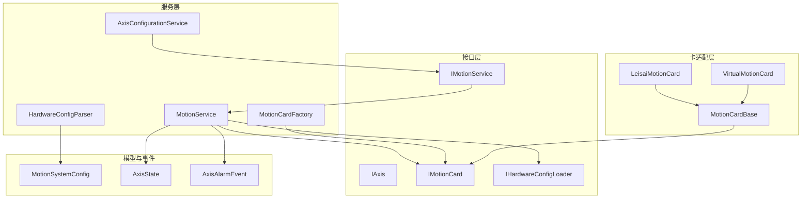
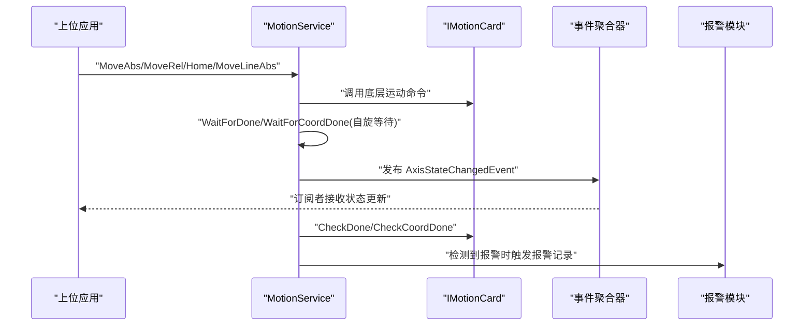
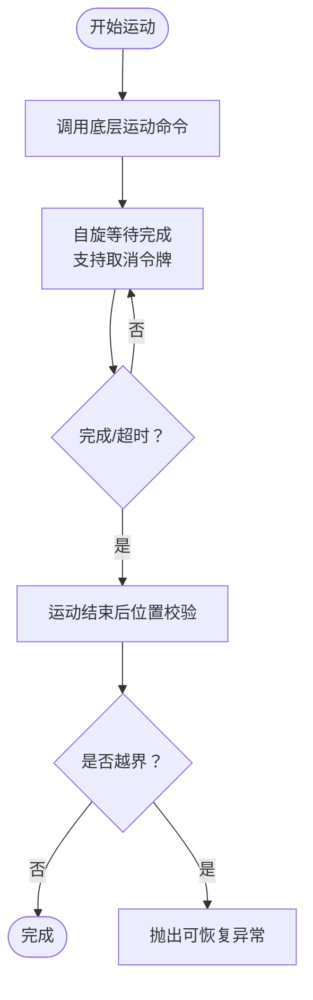
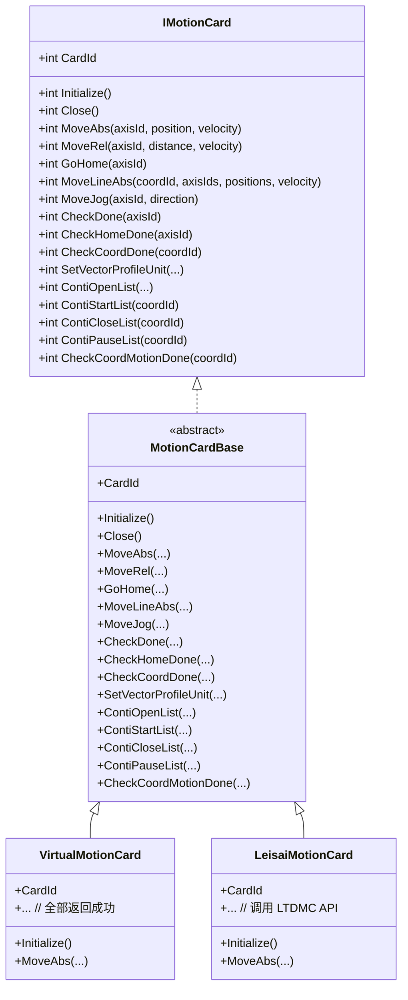
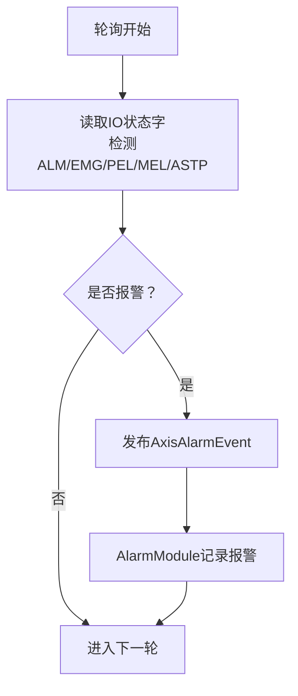
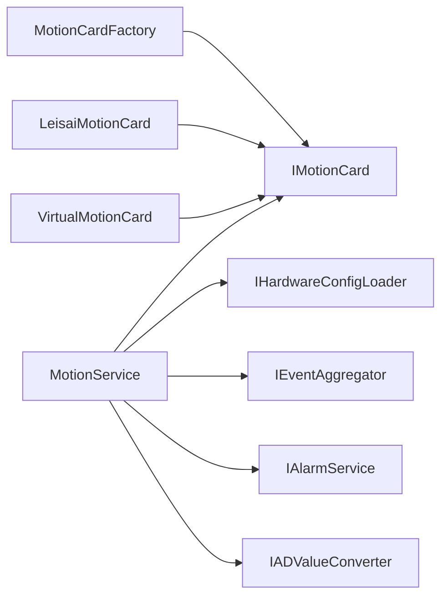

# 运动控制模块

<cite>
**本文引用的文件**
- [MotionControl.csproj](file://MotionControl/MotionControl.csproj)
- [IAxis.cs](file://MotionControl/Interfaces/IAxis.cs)
- [IMotionService.cs](file://MotionControl/Interfaces/IMotionService.cs)
- [IMotionCard.cs](file://MotionControl/Interfaces/IMotionCard.cs)
- [MotionCardBase.cs](file://MotionControl/Card/MotionCardBase.cs)
- [VirtualMotionCard.cs](file://MotionControl/Card/VirtualMotionCard.cs)
- [LeisaiMotionCard.cs](file://MotionControl/Card/Leisai/LeisaiMotionCard.cs)
- [MotionService.cs](file://MotionControl/Services/MotionService.cs)
- [AxisConfigurationService.cs](file://MotionControl/Services/AxisConfigurationService.cs)
- [HardwareConfigParser.cs](file://MotionControl/Services/HardwareConfigParser.cs)
- [MotionCardFactory.cs](file://MotionControl/Card/MotionCardFactory.cs)
- [MotionSystemConfig.cs](file://MotionControl/Models/MotionSystemConfig.cs)
- [AxisConfiguration.cs](file://MotionControl/Models/AxisConfiguration.cs)
- [MotionStatus.cs](file://MotionControl/Models/MotionStatus.cs)
- [AxisAlarmEvent.cs](file://MotionControl/Events/AxisAlarmEvent.cs)
</cite>

## 目录
1. [简介](#简介)
2. [项目结构](#项目结构)
3. [核心组件](#核心组件)
4. [架构总览](#架构总览)
5. [详细组件分析](#详细组件分析)
6. [依赖关系分析](#依赖关系分析)
7. [性能考虑](#性能考虑)
8. [故障排查指南](#故障排查指南)
9. [结论](#结论)
10. [附录](#附录)

## 简介
本技术文档面向运动控制模块，系统性阐述其架构设计与实现要点，覆盖以下主题：
- 运动服务抽象层与硬件适配层的分层设计
- 安全保护机制（急停、限位、报警、故障恢复）
- 电机控制算法与位置控制策略、速度曲线规划
- 运动状态监控、轨迹规划与精度控制
- 硬件接口规范、通信协议与调试方法

## 项目结构
运动控制模块位于 MotionControl 子项目，采用“接口抽象 + 工厂 + 卡适配 + 服务实现”的分层架构：
- 接口层：定义轴、运动卡、服务、配置加载等契约
- 卡适配层：抽象基类与具体卡实现（虚拟卡、雷赛卡）
- 服务层：运动服务、轴配置服务、硬件配置解析器、卡工厂
- 模型与事件：系统配置模型、轴状态模型、报警事件

图表来源
- [IMotionService.cs:1-91](file://MotionControl/Interfaces/IMotionService.cs#L1-L91)
- [IMotionCard.cs:1-66](file://MotionControl/Interfaces/IMotionCard.cs#L1-L66)
- [MotionCardBase.cs:1-57](file://MotionControl/Card/MotionCardBase.cs#L1-L57)
- [VirtualMotionCard.cs:1-68](file://MotionControl/Card/VirtualMotionCard.cs#L1-L68)
- [LeisaiMotionCard.cs:1-586](file://MotionControl/Card/Leisai/LeisaiMotionCard.cs#L1-L586)
- [MotionService.cs:1-741](file://MotionControl/Services/MotionService.cs#L1-L741)
- [AxisConfigurationService.cs:1-69](file://MotionControl/Services/AxisConfigurationService.cs#L1-L69)
- [HardwareConfigParser.cs:1-131](file://MotionControl/Services/HardwareConfigParser.cs#L1-L131)
- [MotionCardFactory.cs:1-57](file://MotionControl/Card/MotionCardFactory.cs#L1-L57)
- [MotionSystemConfig.cs:1-71](file://MotionControl/Models/MotionSystemConfig.cs#L1-L71)
- [MotionStatus.cs:1-37](file://MotionControl/Models/MotionStatus.cs#L1-L37)
- [AxisAlarmEvent.cs:1-12](file://MotionControl/Events/AxisAlarmEvent.cs#L1-L12)

章节来源
- [MotionControl.csproj:1-23](file://MotionControl/MotionControl.csproj#L1-L23)

## 核心组件
- 运动服务接口 IMotionService：统一暴露轴控制、IO、连续插补、模拟量读取、配置查询等能力，并支持事件驱动的状态发布。
- 运动卡接口 IMotionCard 与抽象基类 MotionCardBase：封装底层硬件命令集，屏蔽不同厂商卡差异。
- 具体卡实现：虚拟卡（仿真）、雷赛卡（LeisaiMotionCard）。
- 运动服务实现 MotionService：负责卡初始化、轴/IO映射、轮询与事件发布、运动完成校验、插补与等待、模拟量读取。
- 配置与工厂：HardwareConfigParser（解析 hwcfg.xml）、MotionCardFactory（卡实例化与缓存）、AxisConfigurationService（按工站获取轴定义）。

章节来源
- [IMotionService.cs:1-91](file://MotionControl/Interfaces/IMotionService.cs#L1-L91)
- [IMotionCard.cs:1-66](file://MotionControl/Interfaces/IMotionCard.cs#L1-L66)
- [MotionCardBase.cs:1-57](file://MotionControl/Card/MotionCardBase.cs#L1-L57)
- [VirtualMotionCard.cs:1-68](file://MotionControl/Card/VirtualMotionCard.cs#L1-L68)
- [LeisaiMotionCard.cs:1-586](file://MotionControl/Card/Leisai/LeisaiMotionCard.cs#L1-L586)
- [MotionService.cs:1-741](file://MotionControl/Services/MotionService.cs#L1-L741)
- [HardwareConfigParser.cs:1-131](file://MotionControl/Services/HardwareConfigParser.cs#L1-L131)
- [MotionCardFactory.cs:1-57](file://MotionControl/Card/MotionCardFactory.cs#L1-L57)
- [AxisConfigurationService.cs:1-69](file://MotionControl/Services/AxisConfigurationService.cs#L1-L69)

## 架构总览
运动控制模块采用“事件驱动 + 高频轮询 + 低开销等待”的混合策略：
- 事件驱动：通过 IObservable<AxisStateChangedEvent> 向订阅者推送轴状态变化，避免 UI 线程阻塞。
- 高频轮询：后台线程以固定周期（默认 10ms）快速检查报警/急停，每 3 次完整轮询一次全量状态读取。
- 低开销等待：运动完成检测采用 SpinWait 自旋 + 短暂 Sleep，确保急停/停止的微秒级响应。
- 插补与轨迹：连续插补（多轴联动）支持前瞻模式、S 形曲线、圆弧限制，满足点胶等高精度轨迹需求。

图表来源
- [MotionService.cs:221-387](file://MotionControl/Services/MotionService.cs#L221-L387)
- [IMotionService.cs:23-45](file://MotionControl/Interfaces/IMotionService.cs#L23-L45)
- [AxisAlarmEvent.cs:1-12](file://MotionControl/Events/AxisAlarmEvent.cs#L1-L12)

## 详细组件分析

### 组件A：运动服务抽象层与实现
- 职责
  - 卡初始化与总线状态检查（含软复位）
  - 轴/IO 映射与事件发布
  - 运动命令封装与完成校验（位置容差）
  - 连续插补初始化、添加段、执行与暂停
  - 模拟量通道读取与批量转换
  - 轮询策略：高频报警检查 + 低频全量状态读取
- 关键算法
  - 运动完成等待：SpinWait 自旋 + 取消令牌，确保急停秒响应
  - 位置校验：运动结束后对比实际与目标位置，越界则抛出可恢复异常
  - 插补完成等待：异步自旋 + 超时控制，工业级实时性
- 安全机制
  - 急停/停止：立即中断等待循环，避免抖动
  - 报警检测：快速路径检测 ALM/EMG，异常时触发报警记录
  - 回零流程：分阶段等待（回零完成、运动停止、位置校验）

图表来源
- [MotionService.cs:332-354](file://MotionControl/Services/MotionService.cs#L332-L354)
- [MotionService.cs:358-387](file://MotionControl/Services/MotionService.cs#L358-L387)

章节来源
- [IMotionService.cs:1-91](file://MotionControl/Interfaces/IMotionService.cs#L1-L91)
- [MotionService.cs:1-741](file://MotionControl/Services/MotionService.cs#L1-L741)

### 组件B：硬件适配层（卡抽象与实现）
- 抽象基类 MotionCardBase：定义统一的卡接口，包含轴控制、IO、连续插补、参数设置等方法。
- 虚拟卡 VirtualMotionCard：无硬件时的仿真实现，所有操作返回成功并提供默认值，便于开发与测试。
- 雷赛卡 LeisaiMotionCard：封装 LTDMC API，实现绝对/相对运动、回零、JOG、连续插补、IO 读写、状态查询等。

图表来源
- [IMotionCard.cs:1-66](file://MotionControl/Interfaces/IMotionCard.cs#L1-L66)
- [MotionCardBase.cs:1-57](file://MotionControl/Card/MotionCardBase.cs#L1-L57)
- [VirtualMotionCard.cs:1-68](file://MotionControl/Card/VirtualMotionCard.cs#L1-L68)
- [LeisaiMotionCard.cs:1-586](file://MotionControl/Card/Leisai/LeisaiMotionCard.cs#L1-L586)

章节来源
- [MotionCardBase.cs:1-57](file://MotionControl/Card/MotionCardBase.cs#L1-L57)
- [VirtualMotionCard.cs:1-68](file://MotionControl/Card/VirtualMotionCard.cs#L1-L68)
- [LeisaiMotionCard.cs:1-586](file://MotionControl/Card/Leisai/LeisaiMotionCard.cs#L1-L586)

### 组件C：安全保护机制
- 急停与停止
  - 急停：立即中断等待循环，避免运动继续
  - 停止：调用底层停止命令
- 限位与报警
  - 快速报警检查：每轮询周期读取 IO 状态字，检测 ALM/EMG/PEL/MEL/ASTP 等位
  - 报警事件：检测到新报警时发布 AxisAlarmEvent 并触发 AlarmModule 记录
- 故障恢复
  - 可恢复异常：位置校验失败或回零失败时抛出 RecoverableException，提示检查限位/报警/机械卡死
  - 软复位：初始化时若总线错误，尝试软复位并重新检查状态

图表来源
- [MotionService.cs:472-514](file://MotionControl/Services/MotionService.cs#L472-L514)
- [AxisAlarmEvent.cs:1-12](file://MotionControl/Events/AxisAlarmEvent.cs#L1-L12)

章节来源
- [MotionService.cs:472-514](file://MotionControl/Services/MotionService.cs#L472-L514)
- [AxisAlarmEvent.cs:1-12](file://MotionControl/Events/AxisAlarmEvent.cs#L1-L12)

### 组件D：电机控制算法与速度曲线规划
- 速度曲线
  - 支持 S 形曲线（SetSProfile/SetVectorSProfile）与加减速时间（SetProfileUnit/SetVectorProfileUnit）
  - 插补模式：多轴联动时设置矢量速度与加减速
- 回零策略
  - 设置回零档位、低/高速、加速/减速时间与偏移
  - 分阶段等待：回零完成、运动停止、位置校验
- 连续插补
  - 初始化：前瞻模式、S 形曲线、圆弧限制、打开列表
  - 添加段：直线段（ContiLineUnit）
  - 执行：启动列表、关闭列表、暂停列表
  - 等待：CheckCoordMotionDone + 超时控制

章节来源
- [IMotionService.cs:71-83](file://MotionControl/Interfaces/IMotionService.cs#L71-L83)
- [LeisaiMotionCard.cs:468-526](file://MotionControl/Card/Leisai/LeisaiMotionCard.cs#L468-L526)
- [MotionService.cs:649-725](file://MotionControl/Services/MotionService.cs#L649-L725)

### 组件E：运动状态监控与精度控制
- 状态监控
  - 轮询线程：后台线程以 10ms 周期运行，快速报警检查 + 每 3 次一次全量状态读取
  - 事件发布：将位置、运动状态、IO 状态字、报警等打包为 AxisStateChangedEvent
- 精度控制
  - 位置容差：运动完成后对比目标与实际位置，越界抛出异常
  - 插补校验：坐标系运动结束后逐轴校验位置
  - 模拟量读取：AD 原始值经 IADValueConverter 转换为物理量

章节来源
- [MotionService.cs:418-579](file://MotionControl/Services/MotionService.cs#L418-L579)
- [MotionService.cs:332-387](file://MotionControl/Services/MotionService.cs#L332-L387)
- [MotionService.cs:612-643](file://MotionControl/Services/MotionService.cs#L612-L643)

### 组件F：硬件接口规范与通信协议
- 硬件接口
  - 运动卡：通过 IMotionCard 统一抽象，具体由 LeisaiMotionCard 调用 LTDMC API
  - IO：DI/DO 通道映射到逻辑 ID，支持读取与写入
  - 模拟量：AD 通道读取并通过 IADValueConverter 转换
- 通信协议
  - 雷赛卡通信：LTDMC API（dmc_* 命令族），包括板卡初始化、配置下载、运动命令、状态查询、插补控制等
  - EtherCAT 总线：CheckEtherCatStatus + SoftReset，确保总线健康

章节来源
- [IMotionCard.cs:1-66](file://MotionControl/Interfaces/IMotionCard.cs#L1-L66)
- [LeisaiMotionCard.cs:28-105](file://MotionControl/Card/Leisai/LeisaiMotionCard.cs#L28-L105)
- [MotionService.cs:126-161](file://MotionControl/Services/MotionService.cs#L126-L161)

### 组件G：配置与工站集成
- 硬件配置解析
  - 从 hwcfg.xml 解析卡、轴、DI/DO、任务、信号组、塔灯等配置
  - IHardwareConfigLoader 统一加载入口
- 工站轴映射
  - AxisConfigurationService 根据工站标识（TaskConfig.Type）筛选轴定义
  - 自动推断单位（旋转轴用度，线性轴用毫米）

章节来源
- [HardwareConfigParser.cs:1-131](file://MotionControl/Services/HardwareConfigParser.cs#L1-L131)
- [AxisConfigurationService.cs:1-69](file://MotionControl/Services/AxisConfigurationService.cs#L1-L69)
- [MotionSystemConfig.cs:1-71](file://MotionControl/Models/MotionSystemConfig.cs#L1-L71)
- [AxisConfiguration.cs:1-298](file://MotionControl/Models/AxisConfiguration.cs#L1-L298)

## 依赖关系分析
- 组件耦合
  - MotionService 依赖 IMotionCardFactory、IHardwareConfigLoader、IEventAggregator、IAlarmService、IADValueConverter
  - 卡工厂负责卡实例化与缓存，避免重复初始化
  - 虚拟卡与真实卡均实现 IMotionCard，保证行为一致性
- 外部依赖
  - Prism.Event：事件发布/订阅
  - AlarmModule：报警记录
  - Core：配置、工具、参数存储等基础能力

图表来源
- [MotionService.cs:113-123](file://MotionControl/Services/MotionService.cs#L113-L123)
- [MotionCardFactory.cs:19-36](file://MotionControl/Card/MotionCardFactory.cs#L19-L36)
- [IMotionCard.cs:1-66](file://MotionControl/Interfaces/IMotionCard.cs#L1-L66)

章节来源
- [MotionService.cs:1-741](file://MotionControl/Services/MotionService.cs#L1-L741)
- [MotionCardFactory.cs:1-57](file://MotionControl/Card/MotionCardFactory.cs#L1-L57)

## 性能考虑
- 轮询精度：通过 Windows 多媒体定时器 API（timeBeginPeriod）提升系统定时器精度，降低等待抖动
- 等待策略：SpinWait 自旋 + 短暂 Sleep，兼顾响应性与 CPU 占用
- 插补实时性：连续插补配合 CheckCoordMotionDone 异步自旋等待，实现工业级实时性
- 缓存与映射：卡与轴/IO 的映射表减少查找成本；卡实例缓存避免重复初始化

## 故障排查指南
- 初始化失败
  - 现象：总线状态错误或软复位失败
  - 处理：检查硬件连接、供电、固件版本；查看日志中的错误码
- 回零失败
  - 现象：回零状态返回负值
  - 处理：检查原点传感器、回零方向、限位开关；复位后重试
- 运动未到位
  - 现象：位置校验越界
  - 处理：检查是否存在限位触发、机械卡死、伺服报警；复位后重试
- 报警频繁触发
  - 现象：ALM/EMG/PEL/MEL/ASTP 位异常
  - 处理：检查外部安全链路（急停、门禁、光栅）与接线；确认参数设置合理
- 插补异常
  - 现象：坐标系运动完成但部分轴位置偏差
  - 处理：检查插补参数（速度、加速度、S 形曲线）与机械刚性；优化轨迹

章节来源
- [MotionService.cs:126-161](file://MotionControl/Services/MotionService.cs#L126-L161)
- [MotionService.cs:255-290](file://MotionControl/Services/MotionService.cs#L255-L290)
- [MotionService.cs:332-387](file://MotionControl/Services/MotionService.cs#L332-L387)
- [MotionService.cs:472-514](file://MotionControl/Services/MotionService.cs#L472-L514)
- [MotionService.cs:649-725](file://MotionControl/Services/MotionService.cs#L649-L725)

## 结论
运动控制模块通过清晰的分层设计与事件驱动机制，在保证实时性的同时提供了良好的可扩展性与可维护性。其安全保护机制完善，支持急停、限位、报警与故障恢复；速度曲线与连续插补满足高精度轨迹需求；完善的配置解析与工站映射便于多工站协同。建议在生产环境中结合硬件配置与参数调优，持续优化插补与等待策略，确保稳定运行。

## 附录
- 硬件配置文件：hwcfg.xml（由 HardwareConfigParser 解析）
- 事件定义：AxisAlarmEvent（报警事件）
- 模型定义：MotionSystemConfig、AxisState、AxisConfiguration（轴参数、回零、急停、运动配置）