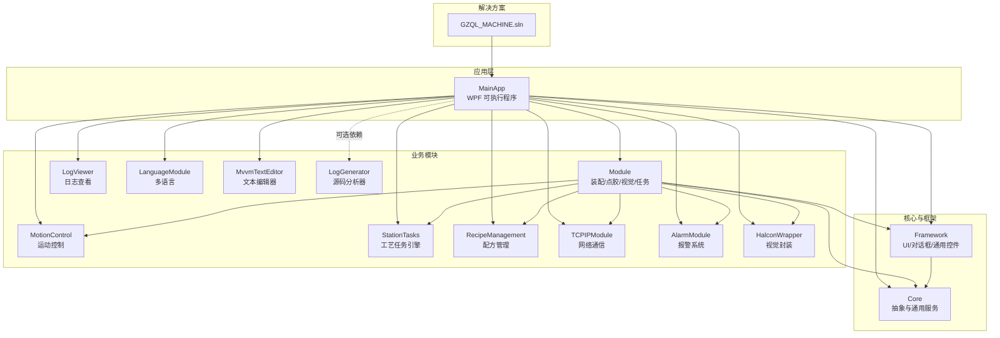
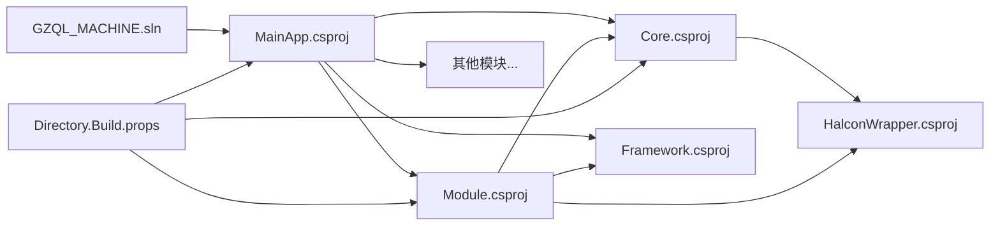
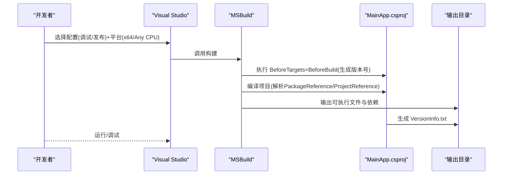
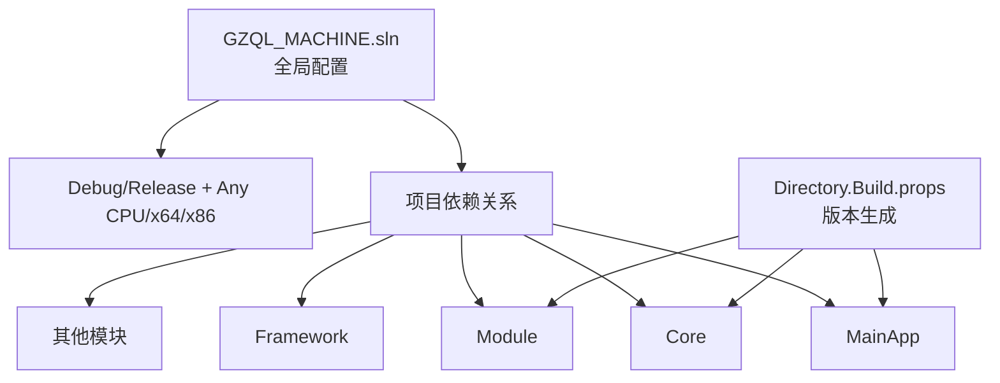

# 构建与部署

<cite>
**本文引用的文件**
- [GZQL_MACHINE.sln](file://GZQL_MACHINE.sln)
- [Directory.Build.props](file://Directory.Build.props)
- [MainApp.csproj](file://MainApp/MainApp.csproj)
- [Core.csproj](file://Core/Core.csproj)
- [Framework.csproj](file://Framework/Framework.csproj)
- [Module.csproj](file://Module/Module.csproj)
- [LogGenerator.csproj](file://LogGenerator/LogGenerator.csproj)
- [launchSettings.json](file://MainApp/Properties/launchSettings.json)
- [FodyWeavers.xml (Core)](file://Core/FodyWeavers.xml)
- [FodyWeavers.xml (Framework)](file://Framework/FodyWeavers.xml)
</cite>

## 目录
1. [简介](#简介)
2. [项目结构](#项目结构)
3. [核心组件](#核心组件)
4. [架构总览](#架构总览)
5. [详细组件分析](#详细组件分析)
6. [依赖关系分析](#依赖关系分析)
7. [性能考虑](#性能考虑)
8. [故障排查指南](#故障排查指南)
9. [结论](#结论)
10. [附录](#附录)

## 简介
本指南面向构建与部署工程师与高级开发者，系统性说明本项目的构建配置、编译流程、依赖管理策略，以及在 Visual Studio 与命令行两种方式下的构建与发布差异。文档还覆盖解决方案结构、NuGet 包管理、版本控制集成、构建脚本与自动化流程建议，并提供常见构建错误的排查与解决方案，最后给出部署前准备与环境要求。

## 项目结构
本仓库采用多项目解决方案组织，主应用为 WPF 应用，其余模块以类库形式提供功能复用与解耦。核心模块包括 Core、Framework、Module、MotionControl、StationTasks、RecipeManagement、TCPIPModule、AlarmModule、HalconWrapper、LogViewer、LanguageModule、MvvmTextEditor、LogGenerator 等。解决方案文件定义了所有项目及其依赖关系，支持 Debug/Release 双配置与 Any CPU/x64/x86 平台组合。

图表来源
- [GZQL_MACHINE.sln](file://GZQL_MACHINE.sln)
- [MainApp.csproj](file://MainApp/MainApp.csproj)
- [Module.csproj](file://Module/Module.csproj)
- [Core.csproj](file://Core/Core.csproj)
- [Framework.csproj](file://Framework/Framework.csproj)

章节来源
- [GZQL_MACHINE.sln](file://GZQL_MACHINE.sln)
- [MainApp.csproj](file://MainApp/MainApp.csproj)

## 核心组件
- 目标框架与平台：统一使用 net9.0-windows7.0，WPF 启用 UseWPF=true；部分项目在 Debug 配置下固定 x64 平台目标。
- 版本生成：通过 Directory.Build.props 在 BeforeBuild 阶段计算版本号，自动注入 Version、AssemblyVersion、FileVersion、InformationalVersion。
- 生成版本信息：MainApp 在 Build 后生成 VersionInfo.txt，包含构建版本、时间与配置信息，便于发布追踪。
- 源链接：部分项目启用 Microsoft.SourceLink.GitHub，便于二进制回溯源码。
- 属性变更通知：Core 与 Framework 使用 PropertyChanged.Fody，在编译期注入 INotifyPropertyChanged 实现，减少样板代码。

章节来源
- [Directory.Build.props](file://Directory.Build.props)
- [MainApp.csproj](file://MainApp/MainApp.csproj)
- [Core.csproj](file://Core/Core.csproj)
- [Framework.csproj](file://Framework/Framework.csproj)
- [FodyWeavers.xml (Core)](file://Core/FodyWeavers.xml)
- [FodyWeavers.xml (Framework)](file://Framework/FodyWeavers.xml)

## 架构总览
构建与部署涉及以下关键路径：
- 解决方案配置：GZQL_MACHINE.sln 定义所有项目与配置平台映射。
- 项目依赖：MainApp 引用 Core、Framework、Module、MotionControl、StationTasks、RecipeManagement、TCPIPModule、AlarmModule、HalconWrapper、LogViewer、LanguageModule、MvvmTextEditor；Module 再引用 Core、Framework、HalconWrapper 等。
- 外部依赖：通过 PackageReference 引入 NuGet 包；部分原生或第三方 DLL 通过 HintPath 或 CopyToOutputDirectory 方式随输出分发。
- 版本与元数据：Directory.Build.props 统一版本生成；MainApp 生成 VersionInfo.txt 辅助发布审计。

图表来源
- [GZQL_MACHINE.sln](file://GZQL_MACHINE.sln)
- [MainApp.csproj](file://MainApp/MainApp.csproj)
- [Module.csproj](file://Module/Module.csproj)
- [Core.csproj](file://Core/Core.csproj)
- [Directory.Build.props](file://Directory.Build.props)

## 详细组件分析

### MainApp（主应用）
- 目标框架与平台：net9.0-windows7.0，WPF；Debug 配置固定 x64。
- 依赖：引用 Core、Framework、Module、MotionControl、StationTasks、RecipeManagement、TCPIPModule、AlarmModule、HalconWrapper、LogViewer、LanguageModule、MvvmTextEditor；另引用 halcondotnet、MvvmTextEditor 作为本地引用。
- 资源：嵌入图标与图片资源，复制 NLog.config 到输出目录。
- 版本信息：构建后生成 VersionInfo.txt，包含版本、时间、配置等。
- 启动设置：launchSettings.json 指定工作目录与命令名。

图表来源
- [MainApp.csproj](file://MainApp/MainApp.csproj)
- [Directory.Build.props](file://Directory.Build.props)
- [launchSettings.json](file://MainApp/Properties/launchSettings.json)

章节来源
- [MainApp.csproj](file://MainApp/MainApp.csproj)
- [launchSettings.json](file://MainApp/Properties/launchSettings.json)

### Core（核心库）
- 目标框架：net9.0-windows7.0，WPF；启用 Nullable 与 ImplicitUsings。
- 依赖：MathNet.Numerics、Microsoft.AspNetCore.Http.Abstractions、Microsoft.Extensions.DependencyInjection.Abstractions、NLog、Prism.Wpf、PropertyChanged.Fody；引用 HalconWrapper；本地引用 halcondotnet、Newtonsoft.Json、NLog。
- 用途：提供数学、配置、日志、依赖注入、MVVM 抽象与通用服务。

章节来源
- [Core.csproj](file://Core/Core.csproj)

### Framework（框架库）
- 目标框架：net9.0-windows7.0，WPF；启用 Nullable 与 ImplicitUsings。
- 依赖：Extended.Wpf.Toolkit、MaterialDesignColors、MaterialDesignExtensions、MaterialDesignThemes、Newtonsoft.Json、Prism.Unity、Prism.Wpf、PropertyChanged.Fody；引用 Core。
- 用途：提供 UI 控件、对话框、主题与通用视图模型基类。

章节来源
- [Framework.csproj](file://Framework/Framework.csproj)

### Module（业务模块）
- 目标框架：net9.0-windows7.0，WPF；Debug 配置允许不安全代码。
- 依赖：大量第三方 NuGet 包（图像、可视化、串口、二维码等）；本地引用 Basler.Pylon、MvCameraControl.Net、halcondotnet、NLog。
- 资源：包含大量相机运行时与 OpenCV 动态库，均设置 CopyToOutputDirectory=PreserveNewest。
- 用途：实现装配、点胶、视觉、路径规划、任务调度等业务能力。

章节来源
- [Module.csproj](file://Module/Module.csproj)

### LogGenerator（源码分析器）
- 目标框架：net9.0-windows7.0；作为 Roslyn 分析器组件 IsRoslynComponent=true。
- 用途：在 Core 与 Framework 中被注释掉的 ProjectReference（OutputItemType=Analyzer），用于开发阶段的代码生成或分析。

章节来源
- [LogGenerator.csproj](file://LogGenerator/LogGenerator.csproj)

## 依赖关系分析
- 解决方案配置：GZQL_MACHINE.sln 定义 Debug/Release 与 Any CPU/x64/x86 的全局配置映射，确保各项目在不同平台下正确构建。
- 项目间依赖：MainApp 依赖 Core、Framework、Module、MotionControl、StationTasks、RecipeManagement、TCPIPModule、AlarmModule、HalconWrapper、LogViewer、LanguageModule、MvvmTextEditor；Module 再依赖 Core、Framework、HalconWrapper 等。
- 外部依赖：通过 PackageReference 引入 NuGet 包；部分第三方 DLL 通过 HintPath 或资源复制方式随应用分发。
- 版本与元数据：Directory.Build.props 统一注入版本号；MainApp 生成 VersionInfo.txt 便于发布审计。

图表来源
- [GZQL_MACHINE.sln](file://GZQL_MACHINE.sln)
- [Directory.Build.props](file://Directory.Build.props)

章节来源
- [GZQL_MACHINE.sln](file://GZQL_MACHINE.sln)
- [Directory.Build.props](file://Directory.Build.props)

## 性能考虑
- 构建性能
  - 使用多核并行构建：MSBuild 默认启用，可在 CI 环境中通过参数提升并发度。
  - 减少不必要的重编译：合理使用增量编译与缓存，避免频繁清理输出目录。
  - 依赖隔离：将大型第三方 DLL（如 OpenCV、相机 SDK）按需复制，避免无谓拷贝。
- 发布体积
  - 发布前清理无用资源与调试符号；对非托管依赖进行最小化打包。
  - 使用 ReadyToRun 或单文件发布（视需求评估）以优化启动时间。
- 日志与诊断
  - 启用 SourceLink 便于发布后定位源码；结合 NLog 配置进行运行时诊断。

## 故障排查指南

### CS2012 文件锁定错误
- 症状：构建时报错提示无法访问输出文件（例如 halcondotnet.dll 或 Newtonsoft.Json.dll 被占用）。
- 排查步骤
  - 关闭正在运行的应用实例（MainApp）与 IDE。
  - 检查是否有外部进程（如杀毒软件、文件索引服务）占用输出目录。
  - 清理解决方案并重新生成，确保输出目录为空。
  - 若使用外部工具（如相机 SDK 运行时），先停止相关服务再尝试构建。
- 预防措施
  - 避免在构建期间手动修改输出目录中的文件。
  - 将相机/硬件运行时依赖放在独立目录，避免与项目输出混放。

章节来源
- [Module.csproj](file://Module/Module.csproj)
- [Core.csproj](file://Core/Core.csproj)

### Newtonsoft.Json 版本冲突
- 症状：构建或运行时报错，提示 Newtonsoft.Json 版本不兼容（例如 Core 与 Framework 引用不同版本）。
- 排查步骤
  - 统一 Newtonsoft.Json 版本：Framework 与 Module 已指定版本，Core 通过 HintPath 指向 MainApp 输出目录的 Newtonsoft.Json.dll。
  - 确保 Core 的 HintPath 指向正确的版本文件，避免加载到旧版本。
  - 在 CI 环境中，使用 NuGet.config 或包还原策略保证一致版本。
- 预防措施
  - 在 Directory.Build.props 中集中声明常用包版本，避免分散配置导致冲突。
  - 对于强依赖第三方 DLL 的场景，优先通过 NuGet 包管理，必要时再使用 HintPath。

章节来源
- [Framework.csproj](file://Framework/Framework.csproj)
- [Module.csproj](file://Module/Module.csproj)
- [Core.csproj](file://Core/Core.csproj)

### halcondotnet 未找到或版本不匹配
- 症状：运行时报错找不到 halcondotnet 或加载失败。
- 排查步骤
  - 确认 MainApp 输出目录存在 halcondotnet.dll，并且 Module/Core 的 HintPath 指向该文件。
  - 检查目标平台是否与 Halcon 运行时匹配（x64）。
  - 在 CI 环境中，确保 Halcon 安装与运行时库随构建产物一起部署。
- 预防措施
  - 将 Halcon 运行时与应用一起打包，避免运行机缺少依赖。

章节来源
- [MainApp.csproj](file://MainApp/MainApp.csproj)
- [Module.csproj](file://Module/Module.csproj)
- [Core.csproj](file://Core/Core.csproj)

### 调试与发布差异
- 调试（Debug）
  - 固定平台为 x64（MainApp/Module），便于本地硬件调试。
  - 不启用优化，保留调试符号，便于断点与变量检查。
- 发布（Release）
  - 通常开启优化与裁剪，减小体积并提升性能。
  - 建议在发布前进行端到端测试，确保第三方依赖完整分发。

章节来源
- [MainApp.csproj](file://MainApp/MainApp.csproj)
- [Module.csproj](file://Module/Module.csproj)

## 结论
本项目采用清晰的多项目结构与统一的版本生成策略，通过 NuGet 管理公共依赖，同时对第三方原生库采用本地引用与资源复制的方式保障运行时可用。建议在团队内统一版本策略与构建流程，完善 CI/CD 自动化，以降低构建与部署风险。

## 附录

### Visual Studio 构建与调试
- 在解决方案中选择目标配置（Debug/Release）与平台（Any CPU/x64/x86），右键启动项目进行调试。
- 启动设置由 launchSettings.json 提供，工作目录指向 MainApp 目录。

章节来源
- [GZQL_MACHINE.sln](file://GZQL_MACHINE.sln)
- [launchSettings.json](file://MainApp/Properties/launchSettings.json)

### 命令行构建与发布
- 基本命令
  - 恢复包：dotnet restore
  - 构建：dotnet build -c Debug|Release -p:Platform=x64
  - 发布：dotnet publish -c Release -p:Platform=x64 -o ./publish
- 注意事项
  - 确保输出目录权限充足，避免 CS2012 锁定错误。
  - 发布前确认第三方 DLL（如 halcondotnet、相机运行时）随应用一起分发。

### 自动化构建流程建议
- CI/CD 流程
  - 触发：提交/PR 合并
  - 步骤：恢复包 → 构建 → 单元测试（如有） → 生成版本信息 → 打包发布 → 上传制品
- 版本控制集成
  - 使用 Directory.Build.props 自动生成版本号，便于追溯。
  - SourceLink 配合 GitHub 仓库，发布后可回溯源码。