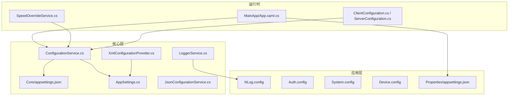
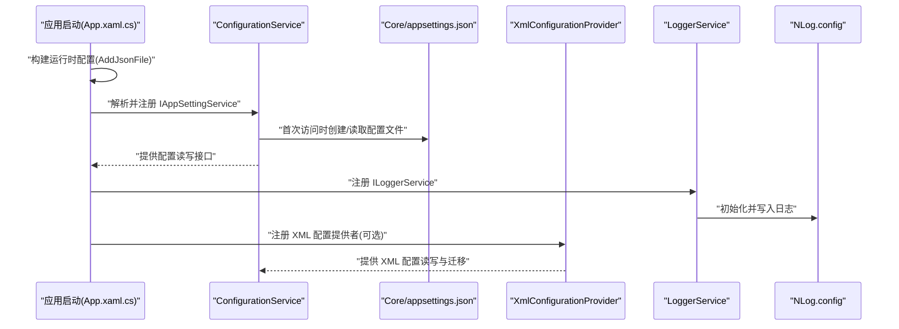
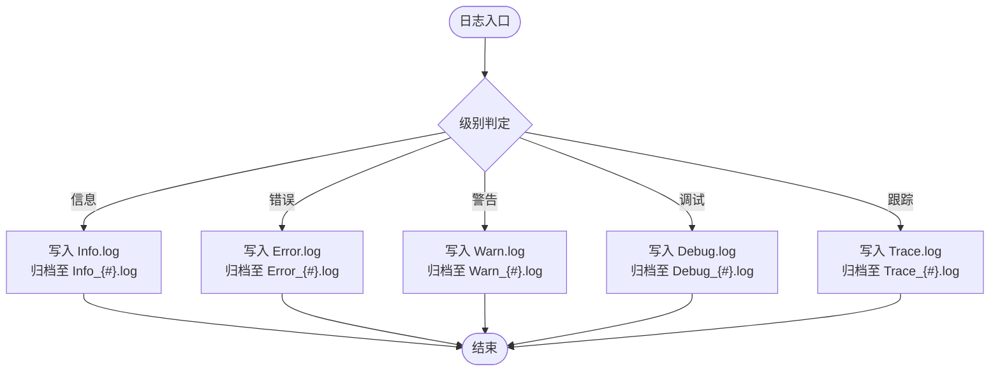
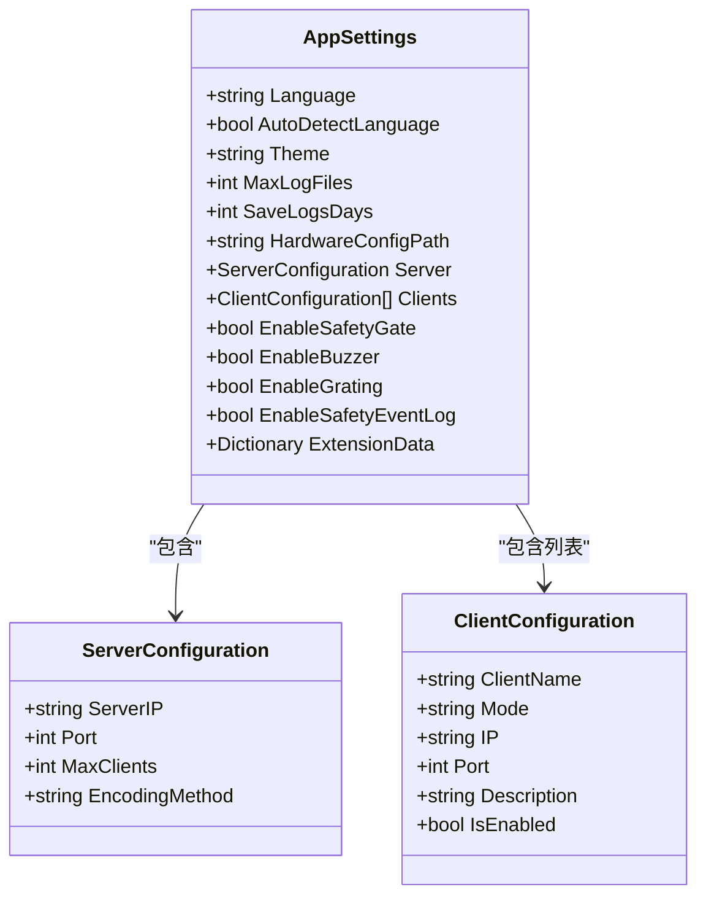
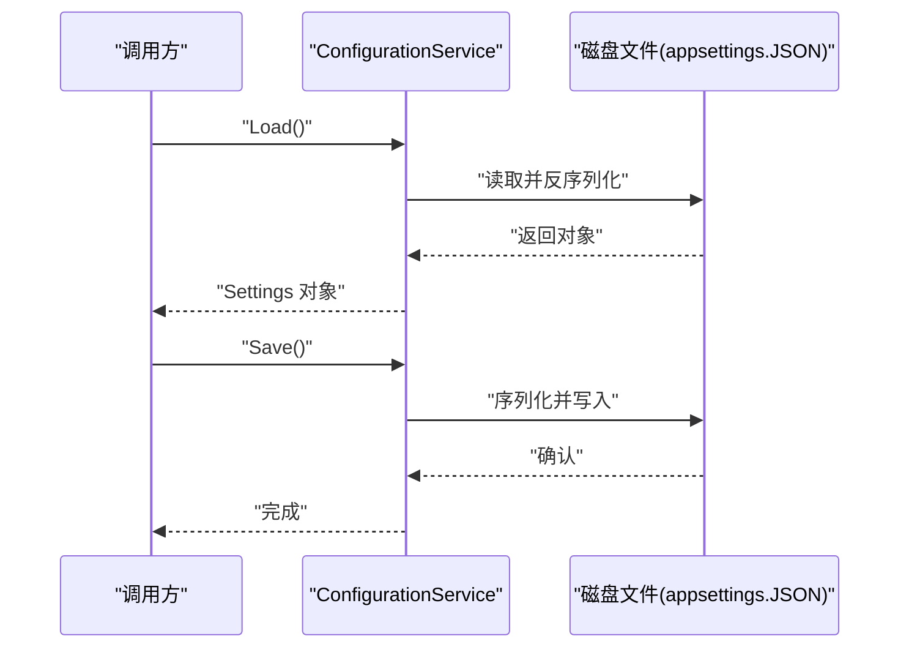
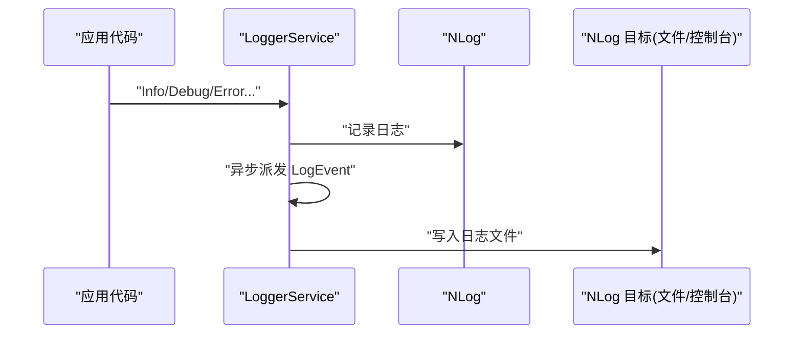
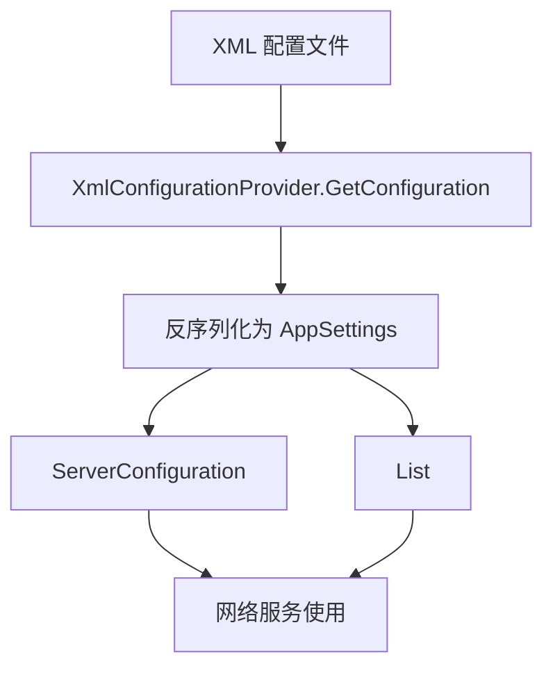
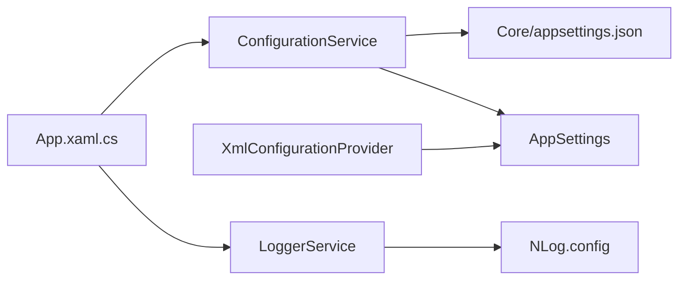

# 环境配置

<cite>
**本文引用的文件**
- [MainApp\NLog.config](file://MainApp/NLog.config)
- [MainApp\Auth.config](file://MainApp/Auth.config)
- [MainApp\System.config](file://MainApp/System.config)
- [MainApp\Device.config](file://MainApp/Device.config)
- [Core\appsettings.json](file://Core/appsettings.json)
- [MainApp\Properties\appsettings.json](file://MainApp/Properties/appsettings.json)
- [Core\Configuration\AppSettings.cs](file://Core/Configuration/AppSettings.cs)
- [Core\Services\ConfigurationService.cs](file://Core/Services/ConfigurationService.cs)
- [Core\Services\JsonConfigurationService.cs](file://Core/Services/JsonConfigurationService.cs)
- [Core\XmlConfigurationProvider.cs](file://Core/XmlConfigurationProvider.cs)
- [Core\Models\ClientConfiguration.cs](file://Core/Models/ClientConfiguration.cs)
- [Core\Utilities\LoggerService.cs](file://Core/Utilities/LoggerService.cs)
- [MainApp\App.xaml.cs](file://MainApp/App.xaml.cs)
- [MotionControl\Services\SpeedOverrideService.cs](file://MotionControl/Services/SpeedOverrideService.cs)
</cite>

## 目录
1. [简介](#简介)
2. [项目结构](#项目结构)
3. [核心组件](#核心组件)
4. [架构总览](#架构总览)
5. [详细组件分析](#详细组件分析)
6. [依赖关系分析](#依赖关系分析)
7. [性能考虑](#性能考虑)
8. [故障排查指南](#故障排查指南)
9. [结论](#结论)
10. [附录](#附录)

## 简介
本指南面向开发与运维人员，系统性说明本项目的环境配置体系，涵盖以下方面：
- 应用程序配置文件的结构与作用：NLog 日志配置、认证配置、系统配置、设备配置、应用设置与数据库连接等
- 不同环境（开发、测试、生产）的配置差异与切换方法
- 配置参数说明、默认值、安全建议
- 硬件设备配置、网络通信配置、数据库连接配置示例
- 配置验证方法、配置热更新机制、配置备份与恢复策略

## 项目结构
本项目采用多层配置与模块化设计：
- 应用层配置：MainApp 下的 NLog.config、Auth.config、System.config、Device.config、Properties/appsettings.json
- 核心配置：Core/appsettings.json 与 Core/Services/ConfigurationService.cs 提供统一的应用设置与持久化
- XML 配置：Core/XmlConfigurationProvider.cs 负责 XML 格式的系统配置读写与版本迁移
- 日志系统：NLog.config 配置日志目标与规则；LoggerService 封装 NLog 并提供异步事件派发
- 网络通信：ClientConfiguration/ServerConfiguration 描述 TCP 通信参数
- 运行时配置注入：MainApp/App.xaml.cs 使用 Microsoft.Extensions.Configuration 构建运行时配置树

**图表来源**
- [MainApp\App.xaml.cs:86-94](file://MainApp/App.xaml.cs#L86-L94)
- [Core\Services\ConfigurationService.cs:52-69](file://Core/Services/ConfigurationService.cs#L52-L69)
- [Core\XmlConfigurationProvider.cs:16-23](file://Core/XmlConfigurationProvider.cs#L16-L23)
- [Core\Utilities\LoggerService.cs:14-30](file://Core/Utilities/LoggerService.cs#L14-L30)
- [MotionControl\Services\SpeedOverrideService.cs:28-32](file://MotionControl/Services/SpeedOverrideService.cs#L28-L32)

**章节来源**
- [MainApp\App.xaml.cs:86-94](file://MainApp/App.xaml.cs#L86-L94)
- [Core\Services\ConfigurationService.cs:52-69](file://Core/Services/ConfigurationService.cs#L52-L69)
- [Core\XmlConfigurationProvider.cs:16-23](file://Core/XmlConfigurationProvider.cs#L16-L23)
- [Core\Utilities\LoggerService.cs:14-30](file://Core/Utilities/LoggerService.cs#L14-L30)
- [MotionControl\Services\SpeedOverrideService.cs:28-32](file://MotionControl/Services/SpeedOverrideService.cs#L28-L32)

## 核心组件
- 应用设置模型：AppSettings.cs 定义了语言、主题、日志保留策略、硬件配置路径、服务器与客户端列表等
- 配置服务：ConfigurationService.cs 提供同步/异步加载、保存、重载、重置、扩展数据读取等能力
- JSON 配置服务：JsonConfigurationService.cs 提供按节段保存/加载 JSON 配置的能力
- XML 配置提供者：XmlConfigurationProvider.cs 负责 XML 配置的读取、写入与向后兼容迁移
- 日志服务：LoggerService.cs 基于 NLog，提供异步日志事件派发与全局缓存
- 网络配置模型：ClientConfiguration/ServerConfiguration 描述网络通信参数
- 运行时配置构建：MainApp/App.xaml.cs 使用 Microsoft.Extensions.Configuration 加载 Properties/appsettings.json，并注册核心服务

**章节来源**
- [Core\Configuration\AppSettings.cs:10-37](file://Core/Configuration/AppSettings.cs#L10-L37)
- [Core\Services\ConfigurationService.cs:15-220](file://Core/Services/ConfigurationService.cs#L15-L220)
- [Core\Services\JsonConfigurationService.cs:8-60](file://Core/Services/JsonConfigurationService.cs#L8-L60)
- [Core\XmlConfigurationProvider.cs:9-227](file://Core/XmlConfigurationProvider.cs#L9-L227)
- [Core\Utilities\LoggerService.cs:5-120](file://Core/Utilities/LoggerService.cs#L5-L120)
- [Core\Models\ClientConfiguration.cs:4-23](file://Core/Models/ClientConfiguration.cs#L4-L23)
- [MainApp\App.xaml.cs:86-108](file://MainApp/App.xaml.cs#L86-L108)

## 架构总览
下图展示配置在系统中的流转与交互：

**图表来源**
- [MainApp\App.xaml.cs:86-108](file://MainApp/App.xaml.cs#L86-L108)
- [Core\Services\ConfigurationService.cs:52-69](file://Core/Services/ConfigurationService.cs#L52-L69)
- [Core\XmlConfigurationProvider.cs:16-23](file://Core/XmlConfigurationProvider.cs#L16-L23)
- [Core\Utilities\LoggerService.cs:14-30](file://Core/Utilities/LoggerService.cs#L14-L30)

## 详细组件分析

### NLog 日志配置
- 目标（Targets）
  - 错误、警告、信息、调试、跟踪分别输出到独立文件，单文件上限 20MB，最多保留 30 份归档
  - 忽略 Microsoft.* 与 System.* 的噪声日志
- 规则（Rules）
  - Error/Warn/Debug/Trace 分别写入对应目标
  - Info 包含 Error/Warn/Info
- 内部日志
  - 关闭内部日志记录，避免干扰

**图表来源**
- [MainApp\NLog.config:9-66](file://MainApp/NLog.config#L9-L66)

**章节来源**
- [MainApp\NLog.config:1-88](file://MainApp/NLog.config#L1-L88)

### 认证配置
- 文件位置：MainApp/Auth.config
- 用途：存放认证密钥或令牌的加密片段
- 建议：该文件为二进制/加密内容，应与部署环境配合使用，确保最小权限与安全传输

**章节来源**
- [MainApp\Auth.config:1-1](file://MainApp/Auth.config#L1-L1)

### 系统配置
- 文件位置：MainApp/System.config
- 用途：系统级配置片段（加密/令牌）
- 建议：与认证配置协同，遵循最小暴露原则与密钥轮换策略

**章节来源**
- [MainApp\System.config:1-1](file://MainApp/System.config#L1-L1)

### 设备配置
- 文件位置：MainApp/Device.config
- 示例内容：包含 EnableSafetyGate、EnableBuzzer、设备配置版本等字段
- 建议：设备配置应与硬件状态同步，变更需经审批与回滚预案

**章节来源**
- [MainApp\Device.config:1-1](file://MainApp/Device.config#L1-L1)

### 应用设置与数据库连接
- Core/appsettings.json
  - AppSettings：语言、主题、日志保留、硬件配置路径等
  - ConnectionStrings.Database：默认 SQLite 路径
- MainApp/Properties/appsettings.json
  - ConnectionStrings.AlarmDb：SQL Server 连接串（示例）

**图表来源**
- [Core\Configuration\AppSettings.cs:10-37](file://Core/Configuration/AppSettings.cs#L10-L37)
- [Core\Models\ClientConfiguration.cs:4-23](file://Core/Models/ClientConfiguration.cs#L4-L23)

**章节来源**
- [Core\appsettings.json:1-13](file://Core/appsettings.json#L1-L13)
- [MainApp\Properties\appsettings.json:1-6](file://MainApp/Properties/appsettings.json#L1-L6)
- [Core\Configuration\AppSettings.cs:10-37](file://Core/Configuration/AppSettings.cs#L10-L37)
- [Core\Models\ClientConfiguration.cs:4-23](file://Core/Models/ClientConfiguration.cs#L4-L23)

### 配置服务与持久化
- ConfigurationService.cs
  - 负责 appsettings.JSON 的加载、保存、重载、重置
  - 支持扩展数据读取（ExtensionData）
- JsonConfigurationService.cs
  - 按节段保存/加载 JSON 配置（如位置配置）
- XmlConfigurationProvider.cs
  - 负责 XML 配置的读取、写入与向后兼容迁移

**图表来源**
- [Core\Services\ConfigurationService.cs:72-81](file://Core/Services/ConfigurationService.cs#L72-L81)
- [Core\Services\ConfigurationService.cs:153-175](file://Core/Services/ConfigurationService.cs#L153-L175)

**章节来源**
- [Core\Services\ConfigurationService.cs:15-220](file://Core/Services/ConfigurationService.cs#L15-L220)
- [Core\Services\JsonConfigurationService.cs:8-60](file://Core/Services/JsonConfigurationService.cs#L8-L60)
- [Core\XmlConfigurationProvider.cs:9-227](file://Core/XmlConfigurationProvider.cs#L9-L227)

### 日志系统与事件派发
- LoggerService.cs
  - 基于 NLog，提供异步事件派发与全局日志缓存
  - 使用有界通道，防止内存暴涨
- NLog.config
  - 定义目标与规则，支持自动重载

**图表来源**
- [Core\Utilities\LoggerService.cs:31-77](file://Core/Utilities/LoggerService.cs#L31-L77)
- [MainApp\NLog.config:69-86](file://MainApp/NLog.config#L69-L86)

**章节来源**
- [Core\Utilities\LoggerService.cs:5-120](file://Core/Utilities/LoggerService.cs#L5-L120)
- [MainApp\NLog.config:1-88](file://MainApp/NLog.config#L1-L88)

### 网络通信配置
- ClientConfiguration/ServerConfiguration 描述网络参数
- XmlConfigurationProvider.cs 支持动态客户端列表与向后兼容迁移

**图表来源**
- [Core\XmlConfigurationProvider.cs:105-156](file://Core/XmlConfigurationProvider.cs#L105-L156)
- [Core\Models\ClientConfiguration.cs:4-23](file://Core/Models/ClientConfiguration.cs#L4-L23)

**章节来源**
- [Core\XmlConfigurationProvider.cs:105-156](file://Core/XmlConfigurationProvider.cs#L105-L156)
- [Core\Models\ClientConfiguration.cs:4-23](file://Core/Models/ClientConfiguration.cs#L4-L23)

### 运行时配置与热更新
- MainApp/App.xaml.cs 使用 Microsoft.Extensions.Configuration 构建配置树，启用 reloadOnChange
- 配置热更新：Properties/appsettings.json 在更改后自动生效
- 建议：对频繁变更的配置（如连接串、日志级别）采用热更新；对关键系统配置采用重启生效

**章节来源**
- [MainApp\App.xaml.cs:86-94](file://MainApp/App.xaml.cs#L86-L94)

## 依赖关系分析
- 组件耦合
  - App.xaml.cs 依赖 ConfigurationService 与 LoggerService
  - ConfigurationService 依赖 Core/appsettings.json 与 AppSettings 模型
  - XmlConfigurationProvider 依赖 AppSettings 模型与日志服务
  - LoggerService 依赖 NLog.config
- 外部依赖
  - Microsoft.Extensions.Configuration 用于运行时配置
  - NLog 用于日志记录
  - Newtonsoft.Json/System.Text.Json 用于 JSON 序列化

**图表来源**
- [MainApp\App.xaml.cs:121-133](file://MainApp/App.xaml.cs#L121-L133)
- [Core\Services\ConfigurationService.cs:52-69](file://Core/Services/ConfigurationService.cs#L52-L69)
- [Core\Utilities\LoggerService.cs:14-30](file://Core/Utilities/LoggerService.cs#L14-L30)
- [Core\XmlConfigurationProvider.cs:16-23](file://Core/XmlConfigurationProvider.cs#L16-L23)

**章节来源**
- [MainApp\App.xaml.cs:121-133](file://MainApp/App.xaml.cs#L121-L133)
- [Core\Services\ConfigurationService.cs:52-69](file://Core/Services/ConfigurationService.cs#L52-L69)
- [Core\Utilities\LoggerService.cs:14-30](file://Core/Utilities/LoggerService.cs#L14-L30)
- [Core\XmlConfigurationProvider.cs:16-23](file://Core/XmlConfigurationProvider.cs#L16-L23)

## 性能考虑
- 日志性能
  - 使用有界通道与 DropOldest 模式，避免高并发下的内存峰值
  - NLog 目标按级别分离，减少 I/O 压力
- 配置读写
  - ConfigurationService 使用文件锁保护，避免并发写冲突
  - 异步保存与重载降低主线程阻塞
- 网络配置
  - 动态客户端列表支持按需扩展，避免硬编码带来的维护成本

[本节为通用指导，无需具体文件分析]

## 故障排查指南
- 配置加载失败
  - 检查 Core/appsettings.json 是否存在且格式正确
  - 查看 ConfigurationService 的异常日志与默认配置创建流程
- 日志无输出
  - 检查 NLog.config 的目标路径与规则
  - 确认 LoggerService 初始化成功
- 配置热更新无效
  - 确认 Properties/appsettings.json 的 reloadOnChange 设置为 true
  - 检查文件是否被外部进程锁定
- 设备配置异常
  - 检查 MainApp/Device.config 的字段完整性与类型匹配
  - 对比硬件状态与配置一致性

**章节来源**
- [Core\Services\ConfigurationService.cs:153-175](file://Core/Services/ConfigurationService.cs#L153-L175)
- [Core\Utilities\LoggerService.cs:78-100](file://Core/Utilities/LoggerService.cs#L78-L100)
- [MainApp\App.xaml.cs:86-94](file://MainApp/App.xaml.cs#L86-L94)
- [MainApp\Device.config:1-1](file://MainApp/Device.config#L1-L1)

## 结论
本项目的配置体系通过 JSON/XML 模型与服务化封装，实现了清晰的职责分离与良好的扩展性。结合 NLog 的异步日志与运行时配置热更新，能够在不同环境中稳定运行。建议在生产环境强化密钥与连接串的安全管理，完善配置变更的审计与回滚机制。

[本节为总结，无需具体文件分析]

## 附录

### 环境切换与最佳实践
- 开发环境
  - 使用本地 SQLite 数据库与较低的日志级别
  - 启用 NLog 的 Trace/Debug 输出
- 测试环境
  - 使用独立的测试数据库连接串
  - 适度提高日志级别以捕获潜在问题
- 生产环境
  - 使用强密码与最小权限账户
  - 启用日志归档与保留策略
  - 对关键配置进行只读保护与变更审批

### 参数说明与默认值
- AppSettings
  - Language: zh-CN（默认）
  - Theme: Dark（默认）
  - MaxLogFiles: 10（默认）
  - SaveLogsDays: 30（默认）
  - HardwareConfigPath: 平台默认路径（见 Core/appsettings.json）
- ServerConfiguration
  - ServerIP: 0.0.0.0（默认）
  - Port: 8080（默认）
  - MaxClients: 100（默认）
  - EncodingMethod: UTF-8（默认）
- ClientConfiguration
  - Mode: Client（默认）
  - IP: 127.0.0.1（默认）
  - Port: 8080（默认）
  - IsEnabled: true（默认）

**章节来源**
- [Core\Configuration\AppSettings.cs:16-30](file://Core/Configuration/AppSettings.cs#L16-L30)
- [Core\Models\ClientConfiguration.cs:6-21](file://Core/Models/ClientConfiguration.cs#L6-L21)
- [Core\appsettings.json:3-12](file://Core/appsettings.json#L3-L12)

### 安全配置建议
- 密钥与令牌
  - 使用 Auth.config/System.config 存放加密片段，避免明文泄露
- 数据库连接
  - 使用 Properties/appsettings.json 管理连接串，避免硬编码
- 日志安全
  - 控制敏感信息输出，必要时脱敏
- 权限控制
  - 最小权限原则，定期轮换密钥

**章节来源**
- [MainApp\Auth.config:1-1](file://MainApp/Auth.config#L1-L1)
- [MainApp\System.config:1-1](file://MainApp/System.config#L1-L1)
- [MainApp\Properties\appsettings.json:2-4](file://MainApp/Properties/appsettings.json#L2-L4)

### 配置验证与热更新
- 验证方法
  - 启动时检查配置文件存在性与可读性
  - 使用 ConfigurationService.GetValue 读取扩展配置并校验类型
- 热更新机制
  - Properties/appsettings.json 启用 reloadOnChange
  - 对关键配置采用重启生效策略

**章节来源**
- [Core\Services\ConfigurationService.cs:204-217](file://Core/Services/ConfigurationService.cs#L204-L217)
- [MainApp\App.xaml.cs:86-94](file://MainApp/App.xaml.cs#L86-L94)

### 配置备份与恢复
- 备份策略
  - 定期备份 Core/appsettings.json、MainApp/Config/appconfig.xml、MainApp/Device.config
  - 记录每次变更的时间戳与操作人
- 恢复流程
  - 停机状态下替换配置文件
  - 启动后验证配置加载与功能正常

**章节来源**
- [Core\Services\ConfigurationService.cs:52-69](file://Core/Services/ConfigurationService.cs#L52-L69)
- [Core\XmlConfigurationProvider.cs:16-23](file://Core/XmlConfigurationProvider.cs#L16-L23)