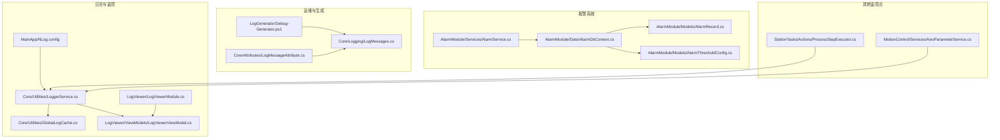
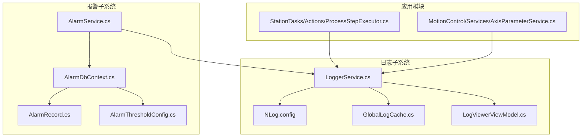
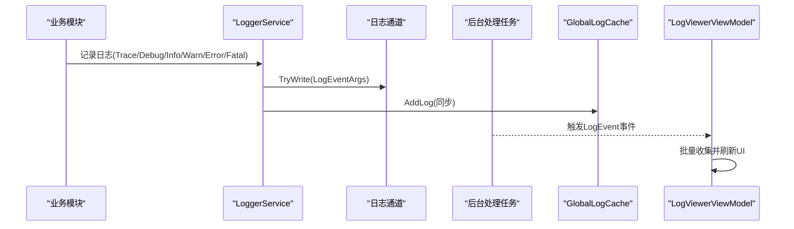
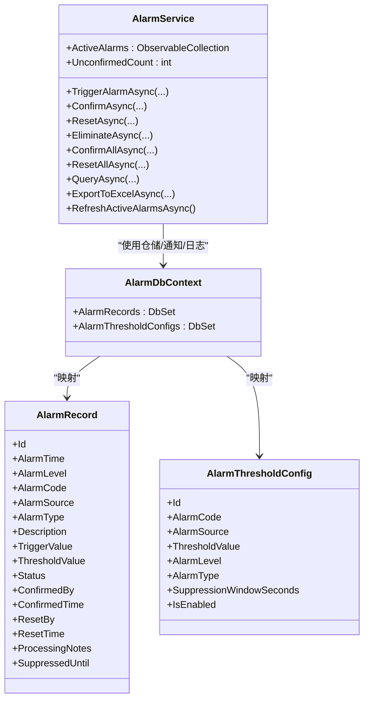
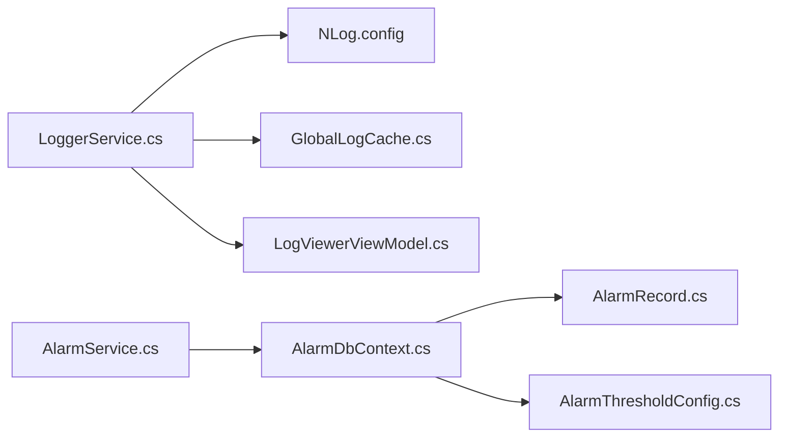

# 监控与维护

<cite>
**本文引用的文件**
- [MainApp/NLog.config](file://MainApp/NLog.config)
- [Core/Utilities/LoggerService.cs](file://Core/Utilities/LoggerService.cs)
- [Core/Utilities/GlobalLogCache.cs](file://Core/Utilities/GlobalLogCache.cs)
- [LogViewer/ViewModels/LogViewerViewModel.cs](file://LogViewer/ViewModels/LogViewerViewModel.cs)
- [LogViewer/LogViewerModule.cs](file://LogViewer/LogViewerModule.cs)
- [AlarmModule/Services/AlarmService.cs](file://AlarmModule/Services/AlarmService.cs)
- [AlarmModule/Data/AlarmDbContext.cs](file://AlarmModule/Data/AlarmDbContext.cs)
- [AlarmModule/Models/AlarmRecord.cs](file://AlarmModule/Models/AlarmRecord.cs)
- [AlarmModule/Models/AlarmThresholdConfig.cs](file://AlarmModule/Models/AlarmThresholdConfig.cs)
- [LogGenerator/Debug-Generator.ps1](file://LogGenerator/Debug-Generator.ps1)
- [Core/Attributes/LogMessageAttribute.cs](file://Core/Attributes/LogMessageAttribute.cs)
- [Core/Logging/LogMessages.cs](file://Core/Logging/LogMessages.cs)
- [StationTasks/Actions/ProcessStepExecutor.cs](file://StationTasks/Actions/ProcessStepExecutor.cs)
- [MotionControl/Services/AxisParameterService.cs](file://MotionControl/Services/AxisParameterService.cs)
</cite>

## 目录
1. [简介](#简介)
2. [项目结构](#项目结构)
3. [核心组件](#核心组件)
4. [架构总览](#架构总览)
5. [详细组件分析](#详细组件分析)
6. [依赖关系分析](#依赖关系分析)
7. [性能考量](#性能考量)
8. [故障排查指南](#故障排查指南)
9. [结论](#结论)
10. [附录](#附录)

## 简介
本指南面向系统监控与维护场景，围绕日志体系、报警与健康检查、日志查看与分析、异常检测、性能指标与资源跟踪、定期维护与备份策略、自动化监控与告警、容量规划与优化建议进行系统化说明。文档以仓库现有实现为基础，结合可扩展实践，帮助读者快速建立稳定高效的运行时监控与运维体系。

## 项目结构
本项目采用模块化分层组织，监控与维护相关能力主要分布在以下模块：
- 日志系统：NLog配置、日志服务封装、全局日志缓存、日志查看器
- 报警系统：报警服务、阈值配置、数据库模型与索引
- 运维工具：日志生成器脚本、Roslyn源生成调试辅助
- 其他监控点：各业务模块对日志服务的使用示例

图表来源
- [MainApp/NLog.config:1-88](file://MainApp/NLog.config#L1-L88)
- [Core/Utilities/LoggerService.cs:1-120](file://Core/Utilities/LoggerService.cs#L1-L120)
- [Core/Utilities/GlobalLogCache.cs:1-38](file://Core/Utilities/GlobalLogCache.cs#L1-L38)
- [LogViewer/ViewModels/LogViewerViewModel.cs:1-160](file://LogViewer/ViewModels/LogViewerViewModel.cs#L1-L160)
- [LogViewer/LogViewerModule.cs:1-31](file://LogViewer/LogViewerModule.cs#L1-L31)
- [AlarmModule/Services/AlarmService.cs:1-308](file://AlarmModule/Services/AlarmService.cs#L1-L308)
- [AlarmModule/Data/AlarmDbContext.cs:1-46](file://AlarmModule/Data/AlarmDbContext.cs#L1-L46)
- [AlarmModule/Models/AlarmRecord.cs:1-62](file://AlarmModule/Models/AlarmRecord.cs#L1-L62)
- [AlarmModule/Models/AlarmThresholdConfig.cs:1-37](file://AlarmModule/Models/AlarmThresholdConfig.cs#L1-L37)
- [LogGenerator/Debug-Generator.ps1:1-211](file://LogGenerator/Debug-Generator.ps1#L1-L211)
- [Core/Attributes/LogMessageAttribute.cs:1-18](file://Core/Attributes/LogMessageAttribute.cs#L1-L18)
- [Core/Logging/LogMessages.cs:1-37](file://Core/Logging/LogMessages.cs#L1-L37)
- [StationTasks/Actions/ProcessStepExecutor.cs:477-502](file://StationTasks/Actions/ProcessStepExecutor.cs#L477-L502)
- [MotionControl/Services/AxisParameterService.cs:301-334](file://MotionControl/Services/AxisParameterService.cs#L301-L334)

章节来源
- [MainApp/NLog.config:1-88](file://MainApp/NLog.config#L1-L88)
- [Core/Utilities/LoggerService.cs:1-120](file://Core/Utilities/LoggerService.cs#L1-L120)
- [Core/Utilities/GlobalLogCache.cs:1-38](file://Core/Utilities/GlobalLogCache.cs#L1-L38)
- [LogViewer/ViewModels/LogViewerViewModel.cs:1-160](file://LogViewer/ViewModels/LogViewerViewModel.cs#L1-L160)
- [LogViewer/LogViewerModule.cs:1-31](file://LogViewer/LogViewerModule.cs#L1-L31)
- [AlarmModule/Services/AlarmService.cs:1-308](file://AlarmModule/Services/AlarmService.cs#L1-L308)
- [AlarmModule/Data/AlarmDbContext.cs:1-46](file://AlarmModule/Data/AlarmDbContext.cs#L1-L46)
- [AlarmModule/Models/AlarmRecord.cs:1-62](file://AlarmModule/Models/AlarmRecord.cs#L1-L62)
- [AlarmModule/Models/AlarmThresholdConfig.cs:1-37](file://AlarmModule/Models/AlarmThresholdConfig.cs#L1-L37)
- [LogGenerator/Debug-Generator.ps1:1-211](file://LogGenerator/Debug-Generator.ps1#L1-L211)
- [Core/Attributes/LogMessageAttribute.cs:1-18](file://Core/Attributes/LogMessageAttribute.cs#L1-L18)
- [Core/Logging/LogMessages.cs:1-37](file://Core/Logging/LogMessages.cs#L1-L37)
- [StationTasks/Actions/ProcessStepExecutor.cs:477-502](file://StationTasks/Actions/ProcessStepExecutor.cs#L477-L502)
- [MotionControl/Services/AxisParameterService.cs:301-334](file://MotionControl/Services/AxisParameterService.cs#L301-L334)

## 核心组件
- 日志系统
  - NLog配置：按级别拆分文件目标，统一归档策略，屏蔽第三方噪音日志
  - 日志服务：封装NLog，提供异步事件发布、全局缓存同步、背压控制
  - 全局日志缓存：线程安全滑动窗口，限制内存占用
  - 日志查看器：批量刷新UI、高亮最新日志、历史日志回放
- 报警系统
  - 报警服务：触发、确认、复位、消除、批量处理、导出、活跃报警刷新
  - 阈值配置：支持按报警码+来源的抑制窗口与阈值
  - 数据库上下文：SQLite本地数据库，索引优化与枚举转换
- 运维工具
  - 日志生成器脚本：Roslyn源生成调试辅助，简化开发与验证
  - 日志消息初始化：确保日志消息本地化服务可用

章节来源
- [MainApp/NLog.config:9-86](file://MainApp/NLog.config#L9-L86)
- [Core/Utilities/LoggerService.cs:5-120](file://Core/Utilities/LoggerService.cs#L5-L120)
- [Core/Utilities/GlobalLogCache.cs:11-38](file://Core/Utilities/GlobalLogCache.cs#L11-L38)
- [LogViewer/ViewModels/LogViewerViewModel.cs:11-160](file://LogViewer/ViewModels/LogViewerViewModel.cs#L11-L160)
- [AlarmModule/Services/AlarmService.cs:16-308](file://AlarmModule/Services/AlarmService.cs#L16-L308)
- [AlarmModule/Data/AlarmDbContext.cs:10-46](file://AlarmModule/Data/AlarmDbContext.cs#L10-L46)
- [AlarmModule/Models/AlarmRecord.cs:12-62](file://AlarmModule/Models/AlarmRecord.cs#L12-L62)
- [AlarmModule/Models/AlarmThresholdConfig.cs:10-37](file://AlarmModule/Models/AlarmThresholdConfig.cs#L10-L37)
- [LogGenerator/Debug-Generator.ps1:1-211](file://LogGenerator/Debug-Generator.ps1#L1-L211)
- [Core/Attributes/LogMessageAttribute.cs:5-18](file://Core/Attributes/LogMessageAttribute.cs#L5-L18)
- [Core/Logging/LogMessages.cs:7-37](file://Core/Logging/LogMessages.cs#L7-L37)

## 架构总览
下图展示日志与报警两大监控子系统的整体交互，以及与业务模块的集成方式。

图表来源
- [StationTasks/Actions/ProcessStepExecutor.cs:477-502](file://StationTasks/Actions/ProcessStepExecutor.cs#L477-L502)
- [MotionControl/Services/AxisParameterService.cs:301-334](file://MotionControl/Services/AxisParameterService.cs#L301-L334)
- [MainApp/NLog.config:1-88](file://MainApp/NLog.config#L1-L88)
- [Core/Utilities/LoggerService.cs:1-120](file://Core/Utilities/LoggerService.cs#L1-L120)
- [Core/Utilities/GlobalLogCache.cs:1-38](file://Core/Utilities/GlobalLogCache.cs#L1-L38)
- [LogViewer/ViewModels/LogViewerViewModel.cs:1-160](file://LogViewer/ViewModels/LogViewerViewModel.cs#L1-L160)
- [AlarmModule/Services/AlarmService.cs:1-308](file://AlarmModule/Services/AlarmService.cs#L1-L308)
- [AlarmModule/Data/AlarmDbContext.cs:1-46](file://AlarmModule/Data/AlarmDbContext.cs#L1-L46)
- [AlarmModule/Models/AlarmRecord.cs:1-62](file://AlarmModule/Models/AlarmRecord.cs#L1-L62)
- [AlarmModule/Models/AlarmThresholdConfig.cs:1-37](file://AlarmModule/Models/AlarmThresholdConfig.cs#L1-L37)

## 详细组件分析

### 日志系统
- NLog配置要点
  - 目标：按级别拆分为独立文件，便于筛选与轮转
  - 轮转：单文件上限20MB，序列编号归档，保留最近30份
  - 规则：屏蔽Microsoft/System噪音，按级别路由至对应目标
- 日志服务
  - 异步事件：基于通道与后台任务，避免阻塞调用线程
  - 背压策略：有界通道+丢弃最旧消息，保护内存
  - 全局缓存：同步写入滑动窗口，供查看器回放
- 全局日志缓存
  - 线程安全队列，固定容量上限，超出即丢弃最早条目
- 日志查看器
  - 批量刷新：定时器聚合新增日志，降低UI刷新频率
  - UI高亮：最新日志高亮，提升可观测性
  - 历史回放：启动时加载全局缓存中的历史日志

图表来源
- [Core/Utilities/LoggerService.cs:78-111](file://Core/Utilities/LoggerService.cs#L78-L111)
- [Core/Utilities/GlobalLogCache.cs:16-25](file://Core/Utilities/GlobalLogCache.cs#L16-L25)
- [LogViewer/ViewModels/LogViewerViewModel.cs:83-130](file://LogViewer/ViewModels/LogViewerViewModel.cs#L83-L130)

章节来源
- [MainApp/NLog.config:9-86](file://MainApp/NLog.config#L9-L86)
- [Core/Utilities/LoggerService.cs:5-120](file://Core/Utilities/LoggerService.cs#L5-L120)
- [Core/Utilities/GlobalLogCache.cs:11-38](file://Core/Utilities/GlobalLogCache.cs#L11-L38)
- [LogViewer/ViewModels/LogViewerViewModel.cs:11-160](file://LogViewer/ViewModels/LogViewerViewModel.cs#L11-L160)

### 报警系统
- 报警服务
  - 防抖抑制：相同报警码+来源在配置窗口内不重复触发
  - 生命周期：未确认→已确认→复位→消除，支持批量操作
  - 导出：支持导出为Excel，便于离线分析
  - 活跃报警：从数据库加载并保持在内存集合中
- 阈值配置
  - 支持按报警码+来源设置阈值、等级、类型、抑制窗口
- 数据库上下文
  - SQLite本地数据库，针对枚举字段使用整型存储，避免索引异常
  - 为常用查询字段建立复合索引，提升查询效率

图表来源
- [AlarmModule/Services/AlarmService.cs:16-308](file://AlarmModule/Services/AlarmService.cs#L16-L308)
- [AlarmModule/Data/AlarmDbContext.cs:10-46](file://AlarmModule/Data/AlarmDbContext.cs#L10-L46)
- [AlarmModule/Models/AlarmRecord.cs:12-62](file://AlarmModule/Models/AlarmRecord.cs#L12-L62)
- [AlarmModule/Models/AlarmThresholdConfig.cs:10-37](file://AlarmModule/Models/AlarmThresholdConfig.cs#L10-L37)

章节来源
- [AlarmModule/Services/AlarmService.cs:16-308](file://AlarmModule/Services/AlarmService.cs#L16-L308)
- [AlarmModule/Data/AlarmDbContext.cs:18-46](file://AlarmModule/Data/AlarmDbContext.cs#L18-L46)
- [AlarmModule/Models/AlarmRecord.cs:12-62](file://AlarmModule/Models/AlarmRecord.cs#L12-L62)
- [AlarmModule/Models/AlarmThresholdConfig.cs:10-37](file://AlarmModule/Models/AlarmThresholdConfig.cs#L10-L37)

### 日志查看器与日志分析
- 使用方法
  - 通过导航注册进入日志查看界面
  - 启动后自动加载全局缓存中的历史日志
  - 实时日志以批量方式刷新，避免UI卡顿
- 分析技巧
  - 利用级别过滤与关键字搜索定位异常
  - 结合报警记录与日志时间戳交叉验证
  - 对高频日志采用批量刷新策略，减少UI压力
- 故障定位策略
  - 关注最新日志高亮行，优先排查最近异常
  - 使用全局缓存回放近1000条日志，复现问题上下文

章节来源
- [LogViewer/LogViewerModule.cs:17-28](file://LogViewer/LogViewerModule.cs#L17-L28)
- [LogViewer/ViewModels/LogViewerViewModel.cs:29-130](file://LogViewer/ViewModels/LogViewerViewModel.cs#L29-L130)

### 异常检测机制
- 日志级别驱动
  - Error/Fatal：严重异常，立即告警与记录
  - Warn：潜在风险或边界条件，纳入异常检测关注
- 报警联动
  - 报警服务在触发/确认/复位时写入日志，形成闭环
  - 阈值配置可作为异常阈值的动态参数来源

章节来源
- [Core/Utilities/LoggerService.cs:55-77](file://Core/Utilities/LoggerService.cs#L55-L77)
- [AlarmModule/Services/AlarmService.cs:48-91](file://AlarmModule/Services/AlarmService.cs#L48-L91)

### 性能监控指标与资源跟踪
- 日志吞吐与延迟
  - 通道容量与丢弃策略决定背压表现
  - 批量刷新定时器控制UI更新频率
- 内存占用
  - 全局缓存固定容量，避免无限增长
  - 日志文件轮转与归档控制磁盘占用
- 查询性能
  - 报警数据库建立多字段索引，提升查询效率

章节来源
- [Core/Utilities/LoggerService.cs:18-30](file://Core/Utilities/LoggerService.cs#L18-L30)
- [Core/Utilities/GlobalLogCache.cs:14-25](file://Core/Utilities/GlobalLogCache.cs#L14-L25)
- [AlarmModule/Data/AlarmDbContext.cs:22-42](file://AlarmModule/Data/AlarmDbContext.cs#L22-L42)

### 健康检查与定期维护
- 健康检查建议
  - 定期检查日志目录配额与归档完整性
  - 核对报警数据库文件大小与索引状态
  - 验证日志查看器历史回放功能正常
- 定期维护任务
  - 清理过期归档文件，保留必要天数
  - 备份报警数据库，确保可恢复
  - 评估日志级别分布，调整阈值与规则

章节来源
- [MainApp/NLog.config:10-63](file://MainApp/NLog.config#L10-L63)
- [AlarmModule/Data/AlarmDbContext.cs:8-16](file://AlarmModule/Data/AlarmDbContext.cs#L8-L16)

### 数据备份策略
- 报警数据库
  - SQLite文件可直接复制备份；建议在应用空闲时段执行
- 日志文件
  - 归档文件按日期分层，定期迁移至长期存储
- 备份验证
  - 定期抽样恢复测试，确保备份可用

章节来源
- [AlarmModule/Data/AlarmDbContext.cs:8-16](file://AlarmModule/Data/AlarmDbContext.cs#L8-L16)
- [MainApp/NLog.config:10-63](file://MainApp/NLog.config#L10-L63)

### 自动化监控脚本与告警配置
- 日志生成器脚本
  - 提供Roslyn源生成调试流程，便于验证日志消息生成
- 告警配置
  - 通过阈值配置表动态调整报警行为，无需重新部署
- 维护计划模板
  - 建议制定“日志轮转检查—报警数据备份—数据库维护”的周/月例行清单

章节来源
- [LogGenerator/Debug-Generator.ps1:1-211](file://LogGenerator/Debug-Generator.ps1#L1-L211)
- [AlarmModule/Models/AlarmThresholdConfig.cs:32-35](file://AlarmModule/Models/AlarmThresholdConfig.cs#L32-L35)

## 依赖关系分析
- 组件耦合
  - 日志服务与NLog解耦，便于替换或扩展
  - 报警服务依赖仓储与通知服务，职责清晰
- 外部依赖
  - NLog用于文件目标与归档
  - SQLite用于报警数据持久化
- 潜在循环依赖
  - 未发现直接循环依赖；日志查看器仅订阅事件，无反向依赖

图表来源
- [Core/Utilities/LoggerService.cs:1-120](file://Core/Utilities/LoggerService.cs#L1-L120)
- [MainApp/NLog.config:1-88](file://MainApp/NLog.config#L1-L88)
- [Core/Utilities/GlobalLogCache.cs:1-38](file://Core/Utilities/GlobalLogCache.cs#L1-L38)
- [LogViewer/ViewModels/LogViewerViewModel.cs:1-160](file://LogViewer/ViewModels/LogViewerViewModel.cs#L1-L160)
- [AlarmModule/Services/AlarmService.cs:1-308](file://AlarmModule/Services/AlarmService.cs#L1-L308)
- [AlarmModule/Data/AlarmDbContext.cs:1-46](file://AlarmModule/Data/AlarmDbContext.cs#L1-L46)
- [AlarmModule/Models/AlarmRecord.cs:1-62](file://AlarmModule/Models/AlarmRecord.cs#L1-L62)
- [AlarmModule/Models/AlarmThresholdConfig.cs:1-37](file://AlarmModule/Models/AlarmThresholdConfig.cs#L1-L37)

章节来源
- [Core/Utilities/LoggerService.cs:1-120](file://Core/Utilities/LoggerService.cs#L1-L120)
- [AlarmModule/Services/AlarmService.cs:1-308](file://AlarmModule/Services/AlarmService.cs#L1-L308)

## 性能考量
- 日志写入
  - 采用通道+后台任务，避免调用线程阻塞
  - 有界通道+丢弃策略，防止内存膨胀
- UI渲染
  - 批量刷新与定时器合并更新，降低DataGrid重绘频率
- 数据库
  - 为常用查询字段建立索引，减少扫描成本
  - 枚举整型存储，避免索引异常

章节来源
- [Core/Utilities/LoggerService.cs:18-30](file://Core/Utilities/LoggerService.cs#L18-L30)
- [LogViewer/ViewModels/LogViewerViewModel.cs:36-43](file://LogViewer/ViewModels/LogViewerViewModel.cs#L36-L43)
- [AlarmModule/Data/AlarmDbContext.cs:22-42](file://AlarmModule/Data/AlarmDbContext.cs#L22-L42)

## 故障排查指南
- 日志无法显示
  - 检查日志查看器是否正确订阅事件
  - 确认批量刷新定时器是否运行
- 日志丢失
  - 检查通道是否满载导致丢弃
  - 核对全局缓存容量与日志级别分布
- 报警未触发或重复触发
  - 检查阈值配置的抑制窗口设置
  - 核对报警状态流转逻辑
- 数据库异常
  - 检查SQLite文件是否存在且可读写
  - 确认索引与枚举转换是否生效

章节来源
- [LogViewer/ViewModels/LogViewerViewModel.cs:36-43](file://LogViewer/ViewModels/LogViewerViewModel.cs#L36-L43)
- [Core/Utilities/LoggerService.cs:18-30](file://Core/Utilities/LoggerService.cs#L18-L30)
- [AlarmModule/Services/AlarmService.cs:56-66](file://AlarmModule/Services/AlarmService.cs#L56-L66)
- [AlarmModule/Data/AlarmDbContext.cs:22-42](file://AlarmModule/Data/AlarmDbContext.cs#L22-L42)

## 结论
本项目提供了完善的日志与报警监控基础：清晰的日志分级与轮转策略、高性能的日志服务与查看器、可配置的报警与阈值管理、以及可扩展的数据库模型。结合本文提供的分析与最佳实践，可在保证系统稳定性的同时，持续优化监控与运维效率。

## 附录
- 常见问题诊断流程
  - 日志类问题：核对NLog配置、检查通道与缓存、验证查看器刷新
  - 报警类问题：核对阈值配置、检查状态机流转、验证数据库索引
- 性能优化建议
  - 调整通道容量与丢弃策略，平衡吞吐与丢失
  - 优化批量刷新间隔，兼顾实时性与UI性能
  - 定期重建索引与压缩数据库，维持查询性能
- 容量规划指导
  - 依据峰值日志量估算磁盘与内存需求
  - 设定合理的归档保留周期与清理策略
  - 为报警数据库预留增长空间，定期归档与压缩