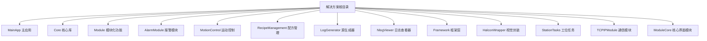
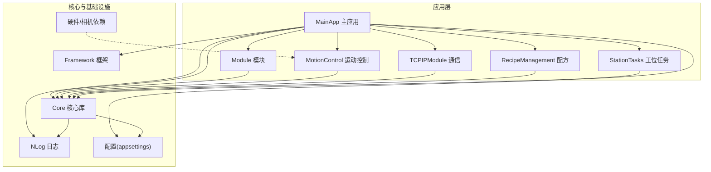
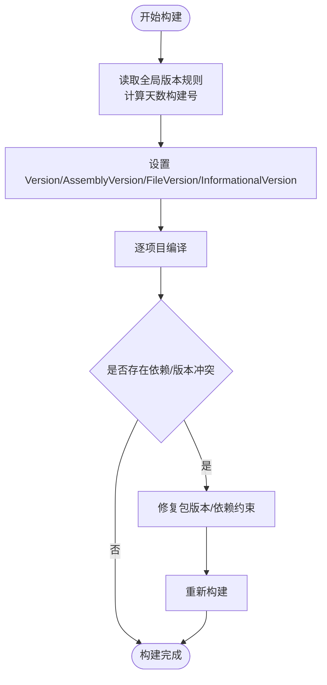
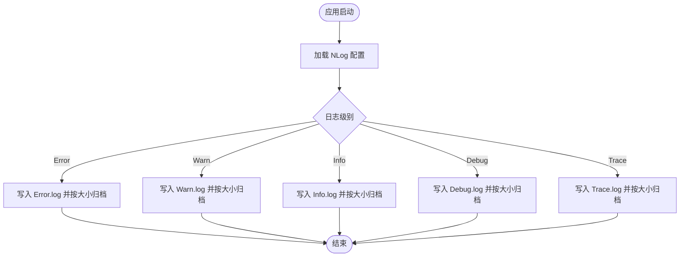
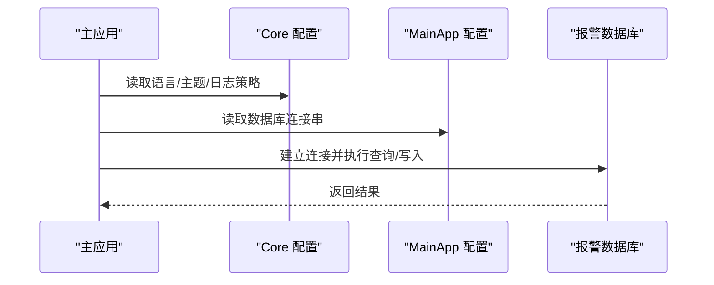
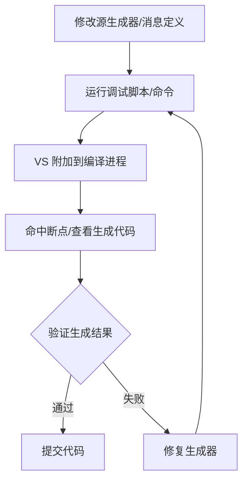
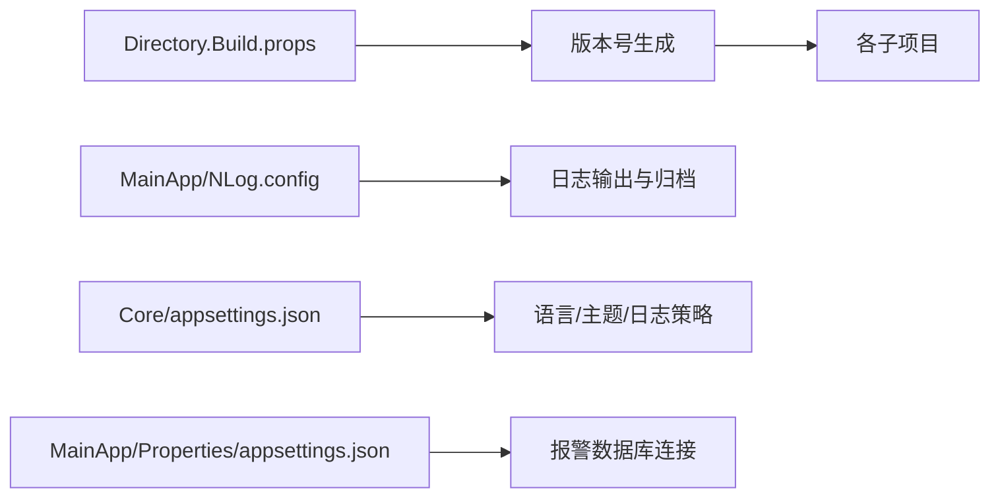
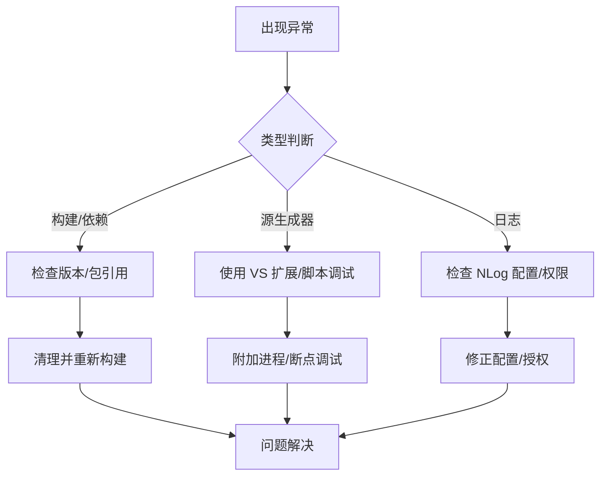

# 部署与运维

<cite>
**本文引用的文件**
- [README.md](file://README.md)
- [Directory.Build.props](file://Directory.Build.props)
- [build_result.txt](file://build_result.txt)
- [Core/appsettings.json](file://Core/appsettings.json)
- [MainApp/Properties/appsettings.json](file://MainApp/Properties/appsettings.json)
- [MainApp/NLog.config](file://MainApp/NLog.config)
- [LogGenerator/DEBUG-GUIDE.md](file://LogGenerator/DEBUG-GUIDE.md)
- [LogGenerator/NO-ADMIN-GUIDE.md](file://LogGenerator/NO-ADMIN-GUIDE.md)
- [LogGenerator/Debug-Generator.ps1](file://LogGenerator/Debug-Generator.ps1)
- [LogGenerator/debug.cmd](file://LogGenerator/debug.cmd)
</cite>

## 目录
1. [简介](#简介)
2. [项目结构](#项目结构)
3. [核心组件](#核心组件)
4. [架构总览](#架构总览)
5. [详细组件分析](#详细组件分析)
6. [依赖关系分析](#依赖关系分析)
7. [性能考虑](#性能考虑)
8. [故障排查指南](#故障排查指南)
9. [结论](#结论)
10. [附录](#附录)

## 简介
本指南面向部署与运维工程师，围绕该 WPF/.NET 应用的构建配置、发布流程、环境部署、生产配置、性能优化、资源管理、系统监控与日志、故障诊断、备份恢复、版本升级与安全加固、运维工具与自动化脚本、监控告警配置等方面进行系统化说明。文档结合仓库中的实际配置文件与脚本，提供可落地的操作步骤与可视化图示。

## 项目结构
该项目采用多项目解决方案组织，包含主应用、模块化子系统、核心库、日志与生成器等组件。关键特性包括：
- 版本自动生成机制（基于构建日期）
- NLog 日志配置（按级别分文件归档）
- 多平台相机与硬件依赖（需按说明准备运行时）
- Roslyn Source Generator 调试与生成辅助工具

**章节来源**
- [README.md: 1-66:1-66](file://README.md#L1-L66)

## 核心组件
- 版本管理与构建
  - 通过全局属性文件计算版本号，基于自 2026-01-01 的天数生成构建号，确保每次构建版本唯一。
- 日志与监控
  - NLog 配置按 Error/Warn/Info/Debug/Trace 分级输出至独立文件，支持单文件大小归档与保留数量上限。
- 配置中心
  - Core 层 appsettings.json 提供语言、主题、日志保留策略与硬件配置路径等基础设置；MainApp 层 appsettings.json 提供报警数据库连接串。
- 源生成器调试工具
  - 提供无需管理员权限的调试方案与脚本，支持 VS 扩展、PowerShell、CMD 三种方式。

**章节来源**
- [Directory.Build.props: 1-18:1-18](file://Directory.Build.props#L1-L18)
- [MainApp/NLog.config: 1-88:1-88](file://MainApp/NLog.config#L1-L88)
- [Core/appsettings.json: 1-13:1-13](file://Core/appsettings.json#L1-L13)
- [MainApp/Properties/appsettings.json: 1-6:1-6](file://MainApp/Properties/appsettings.json#L1-L6)
- [LogGenerator/DEBUG-GUIDE.md: 1-214:1-214](file://LogGenerator/DEBUG-GUIDE.md#L1-L214)
- [LogGenerator/NO-ADMIN-GUIDE.md: 1-247:1-247](file://LogGenerator/NO-ADMIN-GUIDE.md#L1-L247)

## 架构总览
下图展示主应用与各模块之间的关系，以及日志与配置的关键交互点。

**图表来源**
- [MainApp/NLog.config: 1-88:1-88](file://MainApp/NLog.config#L1-L88)
- [Core/appsettings.json: 1-13:1-13](file://Core/appsettings.json#L1-L13)
- [MainApp/Properties/appsettings.json: 1-6:1-6](file://MainApp/Properties/appsettings.json#L1-L6)

## 详细组件分析

### 版本与构建配置
- 自动版本生成
  - 通过全局属性文件在构建前计算版本号，使用“主版本.次版本.天数”的格式，保证每次构建唯一。
- 构建产物与警告
  - 构建结果文件展示了各子项目的输出路径与常见 NuGet/依赖冲突警告，需关注 Newtonsoft.Json 版本不一致问题。

**图表来源**
- [Directory.Build.props: 7-16:7-16](file://Directory.Build.props#L7-L16)
- [build_result.txt: 28-40:28-40](file://build_result.txt#L28-L40)

**章节来源**
- [Directory.Build.props: 1-18:1-18](file://Directory.Build.props#L1-L18)
- [build_result.txt: 1-176:1-176](file://build_result.txt#L1-L176)

### 日志与监控
- NLog 配置要点
  - 按级别输出到独立文件，单文件大小超过阈值后按序号归档，最多保留指定数量的历史文件。
  - 对 Microsoft/System 命名空间进行抑制，减少噪音。
- 日志分级与保留
  - 通过 Core 层 appsettings.json 控制日志最大文件数与保存天数，便于运维侧统一策略。

**图表来源**
- [MainApp/NLog.config: 9-86:9-86](file://MainApp/NLog.config#L9-L86)

**章节来源**
- [MainApp/NLog.config: 1-88:1-88](file://MainApp/NLog.config#L1-L88)
- [Core/appsettings.json: 6-8:6-8](file://Core/appsettings.json#L6-L8)

### 配置与数据库
- 应用配置
  - Core 层 appsettings.json 提供语言、主题、日志保留策略与硬件配置路径。
  - MainApp 层 appsettings.json 提供报警数据库连接串。
- 数据库与报警
  - 报警模块使用独立数据库连接，需确保凭据与网络可达性。

**图表来源**
- [Core/appsettings.json: 2-12:2-12](file://Core/appsettings.json#L2-L12)
- [MainApp/Properties/appsettings.json: 2-5:2-5](file://MainApp/Properties/appsettings.json#L2-L5)

**章节来源**
- [Core/appsettings.json: 1-13:1-13](file://Core/appsettings.json#L1-L13)
- [MainApp/Properties/appsettings.json: 1-6:1-6](file://MainApp/Properties/appsettings.json#L1-L6)

### 源生成器调试与运维脚本
- 无需管理员权限的调试方案
  - 提供 VS 扩展、PowerShell 脚本、CMD 脚本等多种方式，满足不同环境与团队协作需求。
- 调试流程
  - 通过命令行编译触发 Generator，再在 VS 中附加进程断点调试；或使用扩展直接查看生成代码。

**图表来源**
- [LogGenerator/DEBUG-GUIDE.md: 70-86:70-86](file://LogGenerator/DEBUG-GUIDE.md#L70-L86)
- [LogGenerator/NO-ADMIN-GUIDE.md: 19-54:19-54](file://LogGenerator/NO-ADMIN-GUIDE.md#L19-L54)

**章节来源**
- [LogGenerator/DEBUG-GUIDE.md: 1-214:1-214](file://LogGenerator/DEBUG-GUIDE.md#L1-L214)
- [LogGenerator/NO-ADMIN-GUIDE.md: 1-247:1-247](file://LogGenerator/NO-ADMIN-GUIDE.md#L1-L247)
- [LogGenerator/Debug-Generator.ps1](file://LogGenerator/Debug-Generator.ps1)
- [LogGenerator/debug.cmd](file://LogGenerator/debug.cmd)

## 依赖关系分析
- 版本生成依赖
  - 构建前执行版本计算任务，影响所有子项目版本号一致性。
- 日志依赖
  - 所有模块共享 NLog 配置，日志输出路径与归档策略由主应用集中管理。
- 配置依赖
  - Core 与 MainApp 的 appsettings.json 影响运行时行为（语言、主题、数据库连接）。

**图表来源**
- [Directory.Build.props: 7-16:7-16](file://Directory.Build.props#L7-L16)
- [MainApp/NLog.config: 9-86:9-86](file://MainApp/NLog.config#L9-L86)
- [Core/appsettings.json: 2-12:2-12](file://Core/appsettings.json#L2-L12)
- [MainApp/Properties/appsettings.json: 2-5:2-5](file://MainApp/Properties/appsettings.json#L2-L5)

**章节来源**
- [Directory.Build.props: 1-18:1-18](file://Directory.Build.props#L1-L18)
- [MainApp/NLog.config: 1-88:1-88](file://MainApp/NLog.config#L1-L88)
- [Core/appsettings.json: 1-13:1-13](file://Core/appsettings.json#L1-L13)
- [MainApp/Properties/appsettings.json: 1-6:1-6](file://MainApp/Properties/appsettings.json#L1-L6)

## 性能考虑
- 日志性能
  - 单文件大小阈值与归档策略直接影响磁盘占用与 I/O 压力，建议根据业务峰值调整阈值与保留数量。
- 构建性能
  - 依赖版本不一致可能导致重复解析与构建失败，应统一 Newtonsoft.Json 版本，减少构建时间与失败重试。
- 运行时相机与硬件
  - README 指出相机运行时需单独准备，建议在部署前完成 SDK/驱动安装与路径校验，避免运行期阻塞。

**章节来源**
- [MainApp/NLog.config: 10-18:10-18](file://MainApp/NLog.config#L10-L18)
- [build_result.txt: 28-40:28-40](file://build_result.txt#L28-L40)
- [README.md: 28-43:28-43](file://README.md#L28-L43)

## 故障排查指南
- 构建失败与依赖冲突
  - 现象：Newtonsoft.Json 版本冲突与 MSB3277 警告。
  - 处理：统一引用版本，清理 bin/obj 后重新构建；必要时使用“取消并行构建”参数定位问题。
- 源生成器调试问题
  - 现象：断点未命中、找不到进程、符号未加载。
  - 处理：使用 VS 扩展查看生成代码；或通过 PowerShell/CMD 脚本配合“附加进程”方式调试。
- 日志异常
  - 现象：日志文件过大、归档失败、路径不可写。
  - 处理：检查 NLog 配置与磁盘权限，确认归档阈值与保留数量合理。

**图表来源**
- [build_result.txt: 28-40:28-40](file://build_result.txt#L28-L40)
- [LogGenerator/DEBUG-GUIDE.md: 110-150:110-150](file://LogGenerator/DEBUG-GUIDE.md#L110-L150)
- [MainApp/NLog.config: 9-86:9-86](file://MainApp/NLog.config#L9-L86)

**章节来源**
- [build_result.txt: 1-176:1-176](file://build_result.txt#L1-L176)
- [LogGenerator/DEBUG-GUIDE.md: 110-214:110-214](file://LogGenerator/DEBUG-GUIDE.md#L110-L214)
- [MainApp/NLog.config: 1-88:1-88](file://MainApp/NLog.config#L1-L88)

## 结论
本指南基于仓库现有配置与脚本，给出了从版本生成、日志与配置管理到构建调试与故障排查的完整运维路径。建议在生产环境中统一版本策略、规范日志归档、完善数据库连接与权限，并建立标准化的自动化脚本与监控告警体系，以提升稳定性与可维护性。

## 附录

### A. 构建配置与发布流程
- 版本生成
  - 在构建前自动计算版本号，确保每次构建唯一。
- 发布准备
  - 统一依赖版本，清理输出目录，执行一次完整构建以捕获潜在问题。
- 部署清单
  - 主应用、模块、核心库、日志目录、配置文件与相机/硬件运行时。

**章节来源**
- [Directory.Build.props: 7-16:7-16](file://Directory.Build.props#L7-L16)
- [build_result.txt: 1-176:1-176](file://build_result.txt#L1-L176)

### B. 生产环境配置要点
- 日志策略
  - 使用 NLog 的分级输出与归档，结合 Core 层日志保留策略，控制磁盘占用。
- 数据库连接
  - 在 MainApp 层 appsettings.json 中配置报警数据库连接串，确保凭据与网络可达。
- 硬件与相机
  - 按 README 要求准备相机运行时与 SDK，提前验证路径与权限。

**章节来源**
- [MainApp/NLog.config: 9-86:9-86](file://MainApp/NLog.config#L9-L86)
- [Core/appsettings.json: 6-8:6-8](file://Core/appsettings.json#L6-L8)
- [MainApp/Properties/appsettings.json: 2-5:2-5](file://MainApp/Properties/appsettings.json#L2-L5)
- [README.md: 28-43:28-43](file://README.md#L28-L43)

### C. 运维工具与自动化脚本
- 源生成器调试脚本
  - 提供 PowerShell 与 CMD 两种方式，支持 VS 扩展查看生成代码。
- 日志查看
  - 使用 NLog 配置与日志查看器模块，结合归档策略进行离线分析。

**章节来源**
- [LogGenerator/DEBUG-GUIDE.md: 1-214:1-214](file://LogGenerator/DEBUG-GUIDE.md#L1-L214)
- [LogGenerator/NO-ADMIN-GUIDE.md: 1-247:1-247](file://LogGenerator/NO-ADMIN-GUIDE.md#L1-L247)
- [MainApp/NLog.config: 1-88:1-88](file://MainApp/NLog.config#L1-L88)