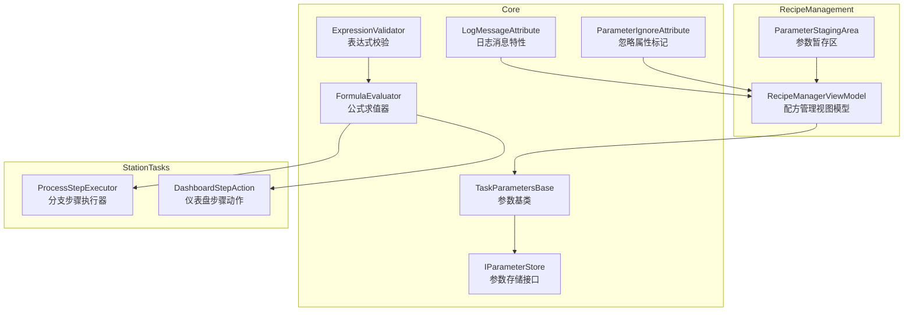
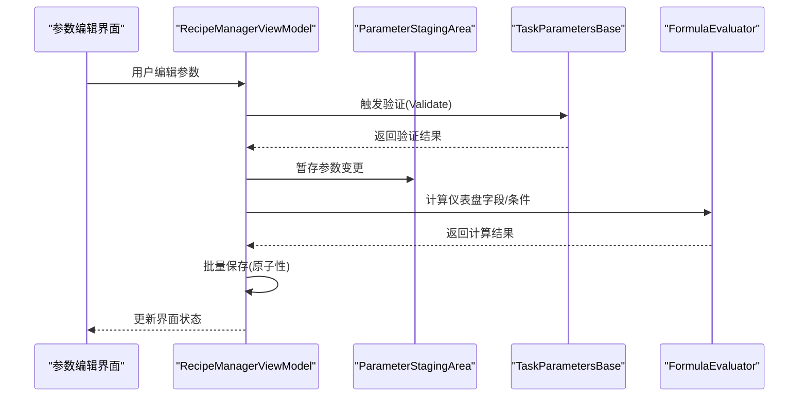
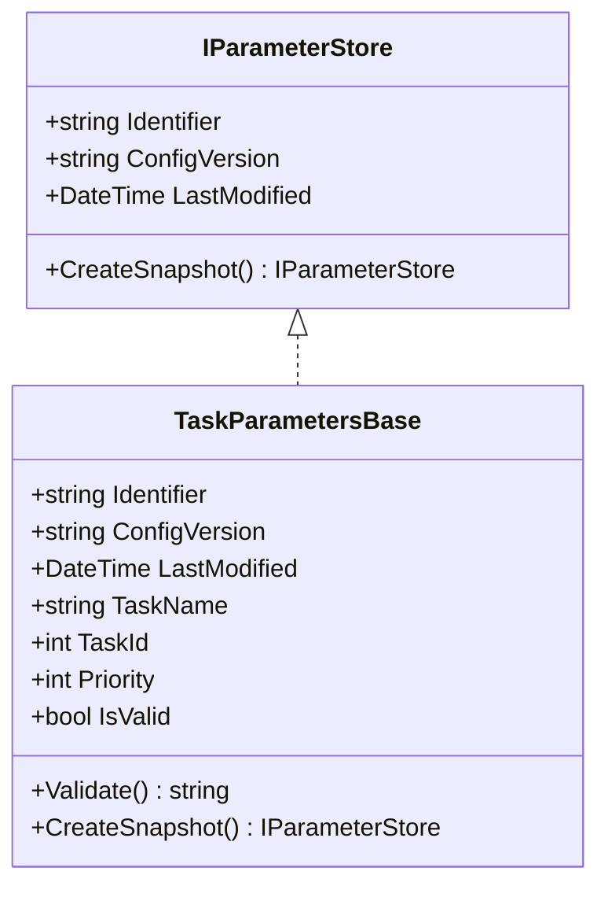
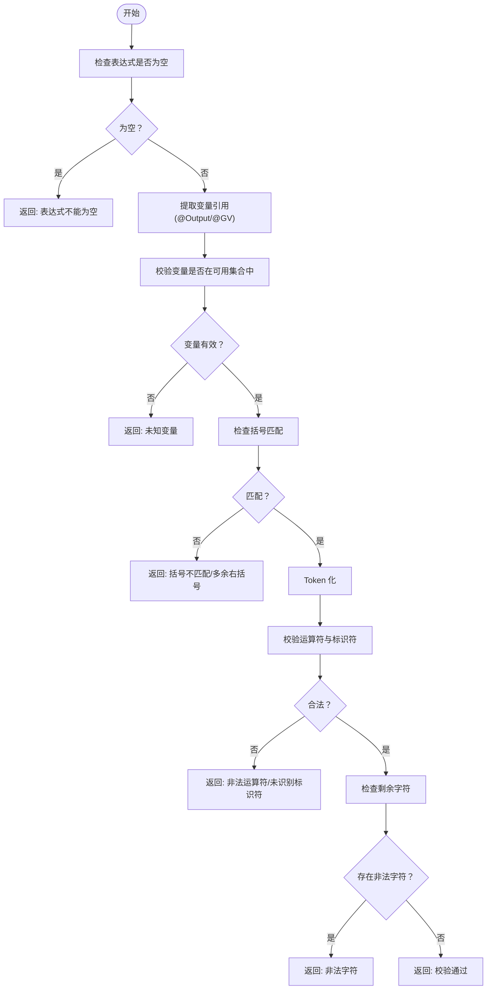
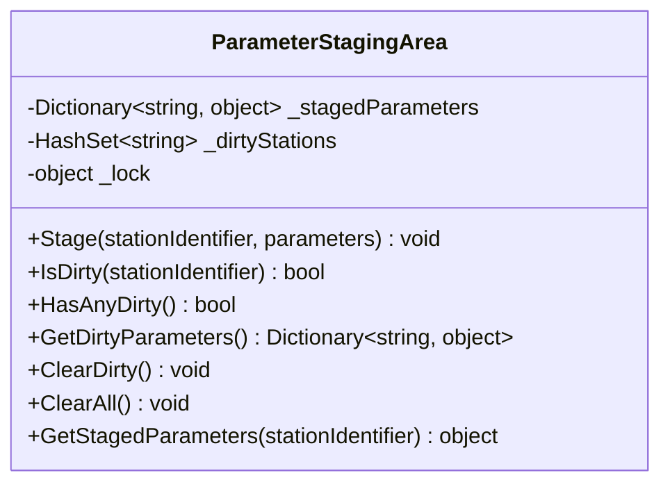
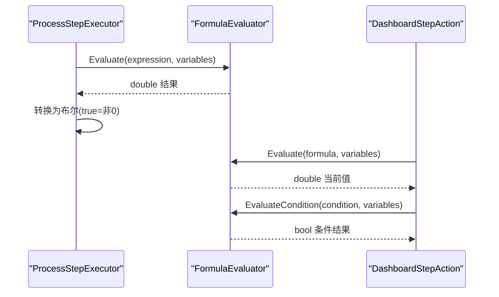
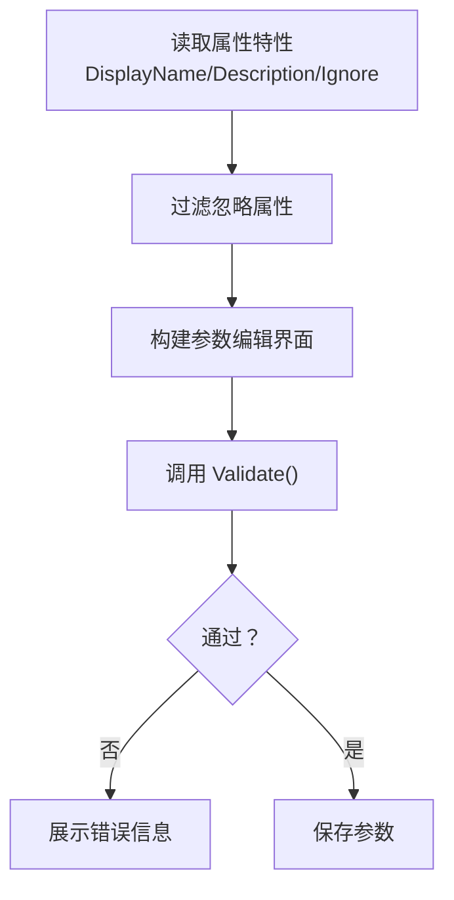
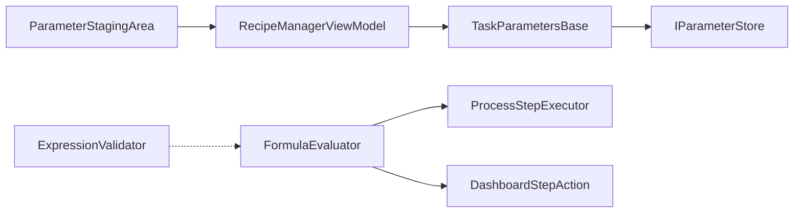

# 参数验证与约束规则

<cite>
**本文档引用的文件**
- [TaskParametersBase.cs](file://Core/Abstraction/Parameters/TaskParametersBase.cs)
- [ExpressionValidator.cs](file://Core/Utilities/ExpressionValidator.cs)
- [ParameterStagingArea.cs](file://RecipeManagement/Models/ParameterStagingArea.cs)
- [LogMessageAttribute.cs](file://Core/Attributes/LogMessageAttribute.cs)
- [FormulaEvaluator.cs](file://Core/Services/FormulaEvaluator.cs)
- [ProcessStepExecutor.cs](file://StationTasks/Actions/ProcessStepExecutor.cs)
- [DashboardStepAction.cs](file://StationTasks/Actions/DashboardStepAction.cs)
- [ParameterIgnoreAttribute.cs](file://Core/Abstraction/ParameterIgnoreAttribute.cs)
- [IParameterStore.cs](file://Core/Abstraction/IParameterStore.cs)
- [RecipeManagerViewModel.cs](file://RecipeManagement/ViewModels/RecipeManagerViewModel.cs)
</cite>

## 目录
1. [简介](#简介)
2. [项目结构](#项目结构)
3. [核心组件](#核心组件)
4. [架构总览](#架构总览)
5. [组件详解](#组件详解)
6. [依赖关系分析](#依赖关系分析)
7. [性能考量](#性能考量)
8. [故障排除指南](#故障排除指南)
9. [结论](#结论)
10. [附录](#附录)

## 简介
本文件聚焦于系统中的“参数验证与约束规则”，围绕以下主题展开：
- TaskParametersBase 基类的参数验证机制：类型检查、数值范围验证、表达式求值规则的扩展点。
- ExpressionValidator 的表达式验证功能：语法校验、变量集合约束、运算符与括号合法性。
- ParameterStagingArea 的参数暂存区设计：参数变更的临时存储、脏标记、批量应用的原子性保障。
- 参数约束的声明式验证：LogMessageAttribute 的应用、自定义验证规则实现、验证错误的国际化处理思路。
- 最佳实践：验证规则设计原则、性能优化策略、用户体验建议。
- 常见验证场景与故障排除。

## 项目结构
与参数验证直接相关的代码分布在 Core、RecipeManagement、StationTasks 与部分 Framework 层：
- Core/Abstraction：参数模型基类、接口与忽略属性标记。
- Core/Utilities：表达式校验工具。
- Core/Services：公式求值器，支持 @GV: 与 @Output: 变量替换与计算。
- RecipeManagement：参数暂存区、配方参数编辑与保存流程。
- StationTasks：表达式在分支与仪表盘步骤中的求值应用。
- Framework：参数编辑器与对话框服务（用于参数编辑与保存）。

图表来源
- [TaskParametersBase.cs:13-142](file://Core/Abstraction/Parameters/TaskParametersBase.cs#L13-L142)
- [IParameterStore.cs:6-27](file://Core/Abstraction/IParameterStore.cs#L6-L27)
- [ExpressionValidator.cs:13-96](file://Core/Utilities/ExpressionValidator.cs#L13-L96)
- [FormulaEvaluator.cs:13-335](file://Core/Services/FormulaEvaluator.cs#L13-L335)
- [ParameterStagingArea.cs:5-76](file://RecipeManagement/Models/ParameterStagingArea.cs#L5-L76)
- [ProcessStepExecutor.cs:728-743](file://StationTasks/Actions/ProcessStepExecutor.cs#L728-L743)
- [DashboardStepAction.cs:41-61](file://StationTasks/Actions/DashboardStepAction.cs#L41-L61)
- [RecipeManagerViewModel.cs:824-986](file://RecipeManagement/ViewModels/RecipeManagerViewModel.cs#L824-L986)
- [LogMessageAttribute.cs:5-16](file://Core/Attributes/LogMessageAttribute.cs#L5-L16)
- [ParameterIgnoreAttribute.cs:9-12](file://Core/Abstraction/ParameterIgnoreAttribute.cs#L9-L12)

章节来源
- [TaskParametersBase.cs:1-144](file://Core/Abstraction/Parameters/TaskParametersBase.cs#L1-L144)
- [ExpressionValidator.cs:1-99](file://Core/Utilities/ExpressionValidator.cs#L1-L99)
- [ParameterStagingArea.cs:1-78](file://RecipeManagement/Models/ParameterStagingArea.cs#L1-L78)
- [FormulaEvaluator.cs:1-336](file://Core/Services/FormulaEvaluator.cs#L1-L336)
- [ProcessStepExecutor.cs:715-743](file://StationTasks/Actions/ProcessStepExecutor.cs#L715-L743)
- [DashboardStepAction.cs:41-61](file://StationTasks/Actions/DashboardStepAction.cs#L41-L61)
- [RecipeManagerViewModel.cs:821-986](file://RecipeManagement/ViewModels/RecipeManagerViewModel.cs#L821-L986)
- [LogMessageAttribute.cs:1-18](file://Core/Attributes/LogMessageAttribute.cs#L1-L18)
- [ParameterIgnoreAttribute.cs:1-14](file://Core/Abstraction/ParameterIgnoreAttribute.cs#L1-L14)
- [IParameterStore.cs:1-31](file://Core/Abstraction/IParameterStore.cs#L1-L31)

## 核心组件
- TaskParametersBase：参数基类，提供参数快照、变更通知与基础验证入口。派生类可覆盖验证方法以实现业务规则。
- ExpressionValidator：对条件表达式进行语法与结构校验，确保变量引用、运算符与括号合法。
- FormulaEvaluator：在运行时对表达式进行变量替换与计算，支持 @GV: 与 @Output: 前缀变量、布尔字面量与四则运算。
- ParameterStagingArea：参数暂存区，提供线程安全的参数变更暂存、脏标记与批量清理能力。
- LogMessageAttribute：用于声明式日志消息，便于多语言资源绑定与统一日志输出。
- ParameterIgnoreAttribute：标记参数编辑器忽略的属性，避免显示、编辑与保存。
- IParameterStore：参数存储接口，定义快照创建等契约。

章节来源
- [TaskParametersBase.cs:13-142](file://Core/Abstraction/Parameters/TaskParametersBase.cs#L13-L142)
- [ExpressionValidator.cs:13-96](file://Core/Utilities/ExpressionValidator.cs#L13-L96)
- [FormulaEvaluator.cs:13-335](file://Core/Services/FormulaEvaluator.cs#L13-L335)
- [ParameterStagingArea.cs:5-76](file://RecipeManagement/Models/ParameterStagingArea.cs#L5-L76)
- [LogMessageAttribute.cs:5-16](file://Core/Attributes/LogMessageAttribute.cs#L5-L16)
- [ParameterIgnoreAttribute.cs:9-12](file://Core/Abstraction/ParameterIgnoreAttribute.cs#L9-L12)
- [IParameterStore.cs:6-27](file://Core/Abstraction/IParameterStore.cs#L6-L27)

## 架构总览
参数验证与约束贯穿“参数定义—编辑—保存—执行”的全链路：
- 定义阶段：TaskParametersBase 提供验证入口；ExpressionValidator 在配方编辑或脚本输入时进行语法校验。
- 编辑阶段：RecipeManagerViewModel 读取参数元数据（含忽略属性），构建参数编辑界面；FormulaEvaluator 支持仪表盘字段的实时求值。
- 保存阶段：ParameterStagingArea 暂存变更，配合 RecipeManagerViewModel 的保存流程实现批量原子性提交。
- 执行阶段：ProcessStepExecutor 与 DashboardStepAction 使用 FormulaEvaluator 对分支条件与仪表盘字段进行求值。

图表来源
- [RecipeManagerViewModel.cs:950-986](file://RecipeManagement/ViewModels/RecipeManagerViewModel.cs#L950-L986)
- [ParameterStagingArea.cs:11-58](file://RecipeManagement/Models/ParameterStagingArea.cs#L11-L58)
- [TaskParametersBase.cs:129-139](file://Core/Abstraction/Parameters/TaskParametersBase.cs#L129-L139)
- [FormulaEvaluator.cs:23-57](file://Core/Services/FormulaEvaluator.cs#L23-L57)

## 组件详解

### TaskParametersBase：参数验证机制
- 类型检查与默认规则
  - 基类提供 IsValid 属性，委托给 Validate 方法；默认实现检查任务名称是否为空。
  - 派生类可通过覆盖 Validate 实现业务规则，例如必填字段、互斥参数、组合规则等。
- 数值范围验证
  - 建议在派生类中对数值型属性增加范围检查，并在 Validate 中返回明确的错误信息。
- 表达式求值规则
  - 基类未内置表达式求值逻辑，但为后续扩展预留了 Validate 的语义空间（如对表达式字段进行求值与校验）。
- 快照与变更通知
  - 提供 CreateSnapshot 用于深拷贝参数对象，便于回滚与对比。
  - 通过 INotifyPropertyChanged 支持 UI 绑定与变更通知。

图表来源
- [IParameterStore.cs:6-27](file://Core/Abstraction/IParameterStore.cs#L6-L27)
- [TaskParametersBase.cs:13-142](file://Core/Abstraction/Parameters/TaskParametersBase.cs#L13-L142)

章节来源
- [TaskParametersBase.cs:13-142](file://Core/Abstraction/Parameters/TaskParametersBase.cs#L13-L142)
- [IParameterStore.cs:6-27](file://Core/Abstraction/IParameterStore.cs#L6-L27)

### ExpressionValidator：表达式验证
- 功能概述
  - 校验条件表达式语法，确保变量引用格式正确、运算符合法、括号匹配。
  - 支持变量引用模式：@Output:xxx、@GV:xxx。
- 校验流程
  - 空值检查 → 提取引用变量 → 校验变量是否在可用集合中 → 括号匹配检查 → Token 化并逐项校验 → 非法字符检测。
- 错误定位
  - 对括号不匹配提供位置信息；对未知变量、非法运算符、未识别标识符与非法字符给出明确提示。

图表来源
- [ExpressionValidator.cs:34-96](file://Core/Utilities/ExpressionValidator.cs#L34-L96)

章节来源
- [ExpressionValidator.cs:13-96](file://Core/Utilities/ExpressionValidator.cs#L13-L96)

### ParameterStagingArea：参数暂存区
- 设计要点
  - 使用字典暂存各工站参数对象，结合脏标记集合实现批量变更追踪。
  - 通过锁保证线程安全，提供获取脏参数、清空脏标记、清空全部等功能。
- 原子性保障
  - 在保存流程中，先将变更暂存，再统一提交；若失败可回滚至上次一致状态。
- 批量应用
  - 通过 GetDirtyParameters 获取待提交集合，减少重复写入与并发冲突。

图表来源
- [ParameterStagingArea.cs:5-76](file://RecipeManagement/Models/ParameterStagingArea.cs#L5-L76)

章节来源
- [ParameterStagingArea.cs:5-76](file://RecipeManagement/Models/ParameterStagingArea.cs#L5-L76)

### 表达式求值：FormulaEvaluator 与执行链路
- 变量替换与预处理
  - 将 @GV: 与 @Output: 变量替换为数值字符串；布尔字面量 true/false 规范化为 1/0；未识别变量替换为 0 并记录调试信息。
- 语法解析与计算
  - 采用递归下降解析器，支持四则运算、比较运算、逻辑运算与括号；条件表达式返回布尔值（非 0 为真）。
- 执行链路
  - ProcessStepExecutor 在分支步骤中对条件表达式求值；DashboardStepAction 在仪表盘步骤中对字段公式与条件公式求值。

图表来源
- [FormulaEvaluator.cs:23-57](file://Core/Services/FormulaEvaluator.cs#L23-L57)
- [ProcessStepExecutor.cs:728-743](file://StationTasks/Actions/ProcessStepExecutor.cs#L728-L743)
- [DashboardStepAction.cs:41-61](file://StationTasks/Actions/DashboardStepAction.cs#L41-L61)

章节来源
- [FormulaEvaluator.cs:13-335](file://Core/Services/FormulaEvaluator.cs#L13-L335)
- [ProcessStepExecutor.cs:715-743](file://StationTasks/Actions/ProcessStepExecutor.cs#L715-L743)
- [DashboardStepAction.cs:41-61](file://StationTasks/Actions/DashboardStepAction.cs#L41-L61)

### 参数约束的声明式验证与国际化
- 声明式约束
  - 使用 ParameterIgnoreAttribute 标记不应出现在编辑界面的属性，避免误编辑与保存。
  - 在参数编辑界面构建过程中，读取 DisplayName 与 Description 等特性，形成用户友好的参数元数据。
- 自定义验证规则
  - 在 TaskParametersBase.Validate 中实现业务规则；返回非空字符串表示验证失败，调用方可据此展示错误。
- 国际化处理
  - LogMessageAttribute 提供文化代码与消息体，可用于日志消息的多语言绑定；在需要时可结合本地化服务统一输出。

图表来源
- [RecipeManagerViewModel.cs:847-910](file://RecipeManagement/ViewModels/RecipeManagerViewModel.cs#L847-L910)
- [ParameterIgnoreAttribute.cs:9-12](file://Core/Abstraction/ParameterIgnoreAttribute.cs#L9-L12)
- [TaskParametersBase.cs:129-139](file://Core/Abstraction/Parameters/TaskParametersBase.cs#L129-L139)
- [LogMessageAttribute.cs:5-16](file://Core/Attributes/LogMessageAttribute.cs#L5-L16)

章节来源
- [RecipeManagerViewModel.cs:821-986](file://RecipeManagement/ViewModels/RecipeManagerViewModel.cs#L821-L986)
- [ParameterIgnoreAttribute.cs:1-14](file://Core/Abstraction/ParameterIgnoreAttribute.cs#L1-L14)
- [TaskParametersBase.cs:129-139](file://Core/Abstraction/Parameters/TaskParametersBase.cs#L129-L139)
- [LogMessageAttribute.cs:1-18](file://Core/Attributes/LogMessageAttribute.cs#L1-L18)

## 依赖关系分析
- TaskParametersBase 依赖 IParameterStore 接口，提供快照能力；派生类可覆盖 Validate 实现业务规则。
- ExpressionValidator 与 FormulaEvaluator 分别承担“语法校验”与“运行时求值”的职责，前者用于输入校验，后者用于执行期计算。
- ParameterStagingArea 与 RecipeManagerViewModel 协作，实现参数变更的暂存与批量保存。
- ProcessStepExecutor 与 DashboardStepAction 依赖 FormulaEvaluator 进行表达式求值。

图表来源
- [TaskParametersBase.cs:13-142](file://Core/Abstraction/Parameters/TaskParametersBase.cs#L13-L142)
- [IParameterStore.cs:6-27](file://Core/Abstraction/IParameterStore.cs#L6-L27)
- [ExpressionValidator.cs:13-96](file://Core/Utilities/ExpressionValidator.cs#L13-L96)
- [FormulaEvaluator.cs:13-335](file://Core/Services/FormulaEvaluator.cs#L13-L335)
- [ParameterStagingArea.cs:5-76](file://RecipeManagement/Models/ParameterStagingArea.cs#L5-L76)
- [ProcessStepExecutor.cs:728-743](file://StationTasks/Actions/ProcessStepExecutor.cs#L728-L743)
- [DashboardStepAction.cs:41-61](file://StationTasks/Actions/DashboardStepAction.cs#L41-L61)
- [RecipeManagerViewModel.cs:950-986](file://RecipeManagement/ViewModels/RecipeManagerViewModel.cs#L950-L986)

章节来源
- [TaskParametersBase.cs:13-142](file://Core/Abstraction/Parameters/TaskParametersBase.cs#L13-L142)
- [ExpressionValidator.cs:13-96](file://Core/Utilities/ExpressionValidator.cs#L13-L96)
- [FormulaEvaluator.cs:13-335](file://Core/Services/FormulaEvaluator.cs#L13-L335)
- [ParameterStagingArea.cs:5-76](file://RecipeManagement/Models/ParameterStagingArea.cs#L5-L76)
- [ProcessStepExecutor.cs:715-743](file://StationTasks/Actions/ProcessStepExecutor.cs#L715-L743)
- [DashboardStepAction.cs:41-61](file://StationTasks/Actions/DashboardStepAction.cs#L41-L61)
- [RecipeManagerViewModel.cs:821-986](file://RecipeManagement/ViewModels/RecipeManagerViewModel.cs#L821-L986)

## 性能考量
- 表达式校验
  - ExpressionValidator 使用编译正则与一次性扫描，复杂度近似 O(n)，适合在编辑阶段进行即时反馈。
- 公式求值
  - FormulaEvaluator 采用递归下降解析，词法分析与语法解析均为线性复杂度；建议：
    - 对重复变量进行预处理与排序替换，避免短键误替。
    - 对未识别变量统一替换为 0 并记录调试信息，减少异常开销。
- 参数暂存
  - ParameterStagingArea 使用哈希集合与字典，脏标记与查询操作均摊 O(1)；批量清理与获取需注意锁粒度与遍历范围。

[本节为通用性能讨论，无需列出具体文件来源]

## 故障排除指南
- 表达式校验失败
  - 症状：提示“未知变量/非法运算符/括号不匹配/非法字符”。
  - 排查：确认变量命名与可用集合一致；检查运算符与括号配对；去除多余空白或特殊字符。
  - 参考路径：[ExpressionValidator.cs:34-96](file://Core/Utilities/ExpressionValidator.cs#L34-L96)
- 公式求值异常
  - 症状：分支跳转不生效或仪表盘字段值异常。
  - 排查：检查变量是否缺失（未识别变量会被替换为 0）；确认表达式语法与比较运算符使用；关注除零异常。
  - 参考路径：[FormulaEvaluator.cs:331-335](file://Core/Services/FormulaEvaluator.cs#L331-L335)
- 参数保存失败
  - 症状：编辑后保存失败或部分参数未更新。
  - 排查：确认 ParameterStagingArea 的脏标记是否正确设置；检查 RecipeManagerViewModel 的保存流程是否捕获异常并回滚。
  - 参考路径：[ParameterStagingArea.cs:11-58](file://RecipeManagement/Models/ParameterStagingArea.cs#L11-L58)、[RecipeManagerViewModel.cs:950-986](file://RecipeManagement/ViewModels/RecipeManagerViewModel.cs#L950-L986)
- 参数编辑界面异常
  - 症状：某些参数未显示或被忽略。
  - 排查：检查 ParameterIgnoreAttribute 是否误标注；确认元数据构建过程是否正确读取 DisplayName/Description。
  - 参考路径：[ParameterIgnoreAttribute.cs:9-12](file://Core/Abstraction/ParameterIgnoreAttribute.cs#L9-L12)、[RecipeManagerViewModel.cs:847-910](file://RecipeManagement/ViewModels/RecipeManagerViewModel.cs#L847-L910)

章节来源
- [ExpressionValidator.cs:34-96](file://Core/Utilities/ExpressionValidator.cs#L34-L96)
- [FormulaEvaluator.cs:331-335](file://Core/Services/FormulaEvaluator.cs#L331-L335)
- [ParameterStagingArea.cs:11-58](file://RecipeManagement/Models/ParameterStagingArea.cs#L11-L58)
- [RecipeManagerViewModel.cs:847-910](file://RecipeManagement/ViewModels/RecipeManagerViewModel.cs#L847-L910)
- [ParameterIgnoreAttribute.cs:9-12](file://Core/Abstraction/ParameterIgnoreAttribute.cs#L9-L12)

## 结论
本系统通过 TaskParametersBase、ExpressionValidator、FormulaEvaluator、ParameterStagingArea 与声明式特性（ParameterIgnoreAttribute、LogMessageAttribute）构建了完整的参数验证与约束体系。其特点是：
- 验证入口清晰、可扩展性强；
- 表达式校验与求值分离，分别服务于编辑期与执行期；
- 参数变更采用暂存与脏标记，保障批量保存的原子性；
- 通过特性与元数据提升参数编辑体验与国际化支持。

[本节为总结性内容，无需列出具体文件来源]

## 附录
- 常见验证场景示例（路径指引）
  - 参数类型与必填校验：在派生类中覆盖 Validate，返回错误信息。
    - 参考路径：[TaskParametersBase.cs:129-139](file://Core/Abstraction/Parameters/TaskParametersBase.cs#L129-L139)
  - 表达式语法校验：在配方编辑或脚本输入时调用 ExpressionValidator。
    - 参考路径：[ExpressionValidator.cs:34-96](file://Core/Utilities/ExpressionValidator.cs#L34-L96)
  - 仪表盘字段求值：在 DashboardStepAction 中调用 FormulaEvaluator。
    - 参考路径：[DashboardStepAction.cs:41-61](file://StationTasks/Actions/DashboardStepAction.cs#L41-L61)
  - 分支条件求值：在 ProcessStepExecutor 中调用 FormulaEvaluator。
    - 参考路径：[ProcessStepExecutor.cs:728-743](file://StationTasks/Actions/ProcessStepExecutor.cs#L728-L743)
  - 参数暂存与批量保存：通过 ParameterStagingArea 与 RecipeManagerViewModel。
    - 参考路径：[ParameterStagingArea.cs:11-58](file://RecipeManagement/Models/ParameterStagingArea.cs#L11-L58)、[RecipeManagerViewModel.cs:950-986](file://RecipeManagement/ViewModels/RecipeManagerViewModel.cs#L950-L986)

[本节为补充说明，无需列出具体文件来源]