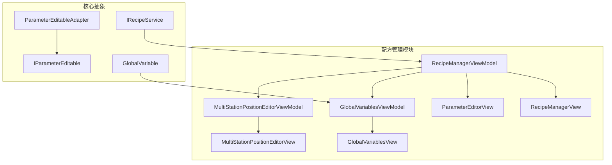
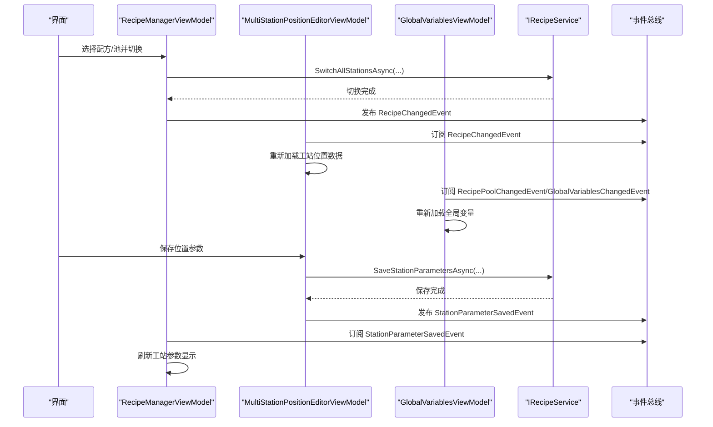
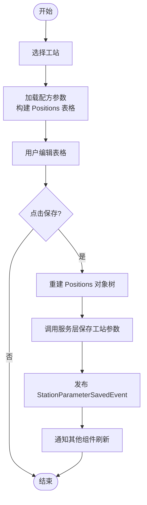
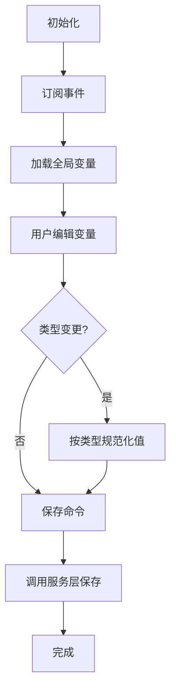
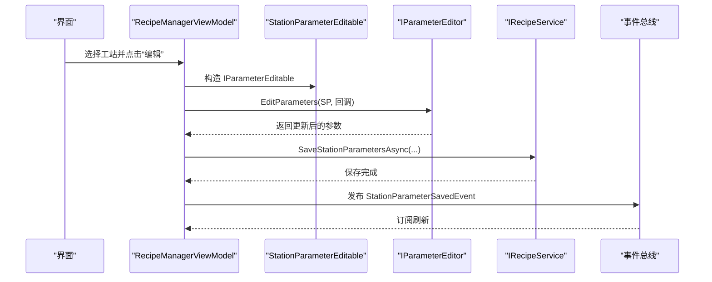
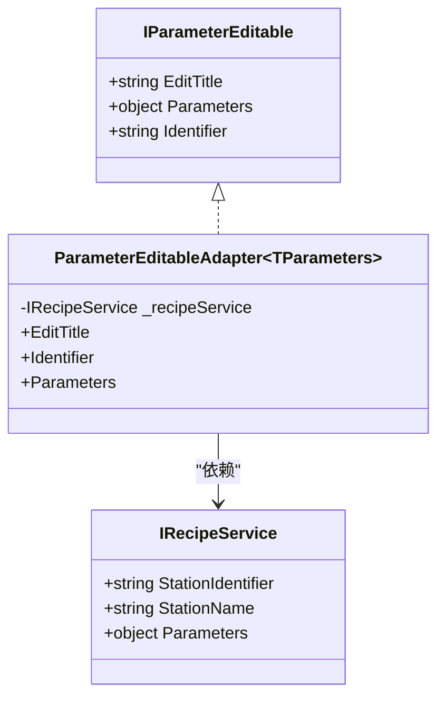
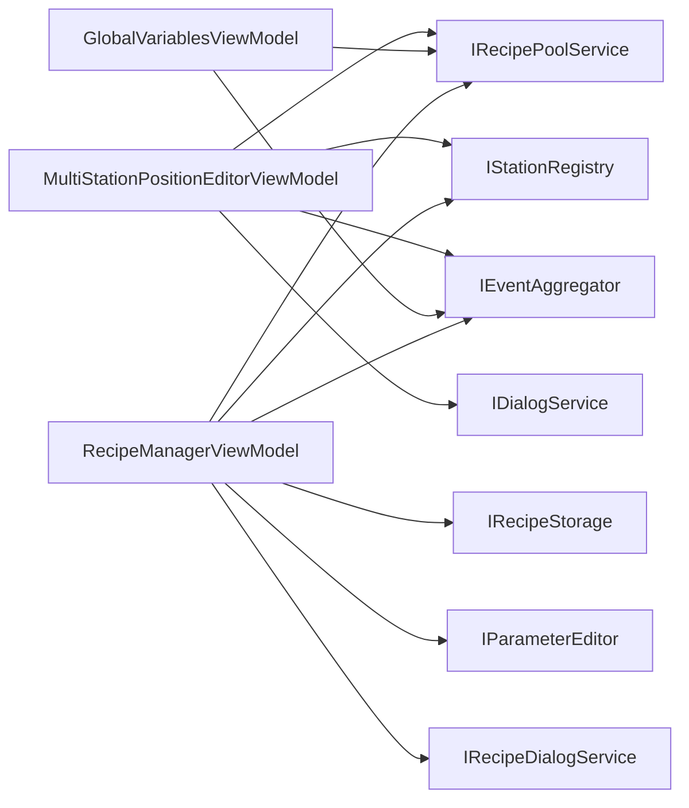

# 批量参数编辑功能

<cite>
**本文档引用的文件**
- [MultiStationPositionEditorViewModel.cs](file://RecipeManagement/ViewModels/MultiStationPositionEditorViewModel.cs)
- [GlobalVariablesViewModel.cs](file://RecipeManagement/ViewModels/GlobalVariablesViewModel.cs)
- [RecipeManagerViewModel.cs](file://RecipeManagement/ViewModels/RecipeManagerViewModel.cs)
- [ParameterEditableAdapter.cs](file://RecipeManagement/ParameterEditableAdapter.cs)
- [IParameterEditable.cs](file://Core/Abstraction/IParameterEditable.cs)
- [GlobalVariable.cs](file://Core/Models/GlobalVariable.cs)
- [IRecipeService.cs](file://RecipeManagement/Interfaces/IRecipeService.cs)
- [ParameterEditorView.xaml](file://Framework/Views/ParameterEditorView.xaml)
- [MultiStationPositionEditorView.xaml](file://RecipeManagement/Views/MultiStationPositionEditorView.xaml)
- [GlobalVariablesView.xaml](file://RecipeManagement/Views/GlobalVariablesView.xaml)
- [RecipeManagerView.xaml](file://RecipeManagement/Views/RecipeManagerView.xaml)
</cite>

## 目录
1. [简介](#简介)
2. [项目结构](#项目结构)
3. [核心组件](#核心组件)
4. [架构总览](#架构总览)
5. [详细组件分析](#详细组件分析)
6. [依赖关系分析](#依赖关系分析)
7. [性能考虑](#性能考虑)
8. [故障排除指南](#故障排除指南)
9. [结论](#结论)
10. [附录](#附录)

## 简介
本文件围绕批量参数编辑功能展开，系统性解析以下关键能力：
- 多工站参数同步编辑：通过配方池与配方的统一切换，实现多工站参数的一致性管理。
- 批量参数验证与冲突检测：在参数保存与应用过程中，结合事件总线与适配器模式，确保参数一致性与可追溯性。
- 全局变量管理：集中维护全局变量，支持类型化输入与跨模块联动更新。
- 配方管理界面：提供配方池/配方的树形导航、参数编辑器集成与批量操作体验。
- 参数编辑器适配器：通过 IParameterEditable 接口与适配器，解耦具体参数类型与编辑器实现。
- 最佳实践：参数验证规则、错误处理策略与用户反馈机制。
- 界面交互设计：响应式布局与 Material Design 风格的交互原则。

## 项目结构
批量参数编辑功能主要分布在 RecipeManagement 模块与 Framework 模块：
- 视图模型层：MultiStationPositionEditorViewModel、GlobalVariablesViewModel、RecipeManagerViewModel。
- 视图层：MultiStationPositionEditorView、GlobalVariablesView、RecipeManagerView、ParameterEditorView。
- 抽象与适配：IParameterEditable 接口、ParameterEditableAdapter 适配器。
- 核心模型：GlobalVariable 类型化变量模型。
- 服务接口：IRecipeService 通用配方服务接口。

**图表来源**
- [RecipeManagerViewModel.cs](file://RecipeManagement/ViewModels/RecipeManagerViewModel.cs)
- [MultiStationPositionEditorViewModel.cs](file://RecipeManagement/ViewModels/MultiStationPositionEditorViewModel.cs)
- [GlobalVariablesViewModel.cs](file://RecipeManagement/ViewModels/GlobalVariablesViewModel.cs)
- [ParameterEditorView.xaml](file://Framework/Views/ParameterEditorView.xaml)
- [MultiStationPositionEditorView.xaml](file://RecipeManagement/Views/MultiStationPositionEditorView.xaml)
- [GlobalVariablesView.xaml](file://RecipeManagement/Views/GlobalVariablesView.xaml)
- [RecipeManagerView.xaml](file://RecipeManagement/Views/RecipeManagerView.xaml)
- [IParameterEditable.cs](file://Core/Abstraction/IParameterEditable.cs)
- [ParameterEditableAdapter.cs](file://RecipeManagement/ParameterEditableAdapter.cs)
- [GlobalVariable.cs](file://Core/Models/GlobalVariable.cs)
- [IRecipeService.cs](file://RecipeManagement/Interfaces/IRecipeService.cs)

**章节来源**
- [RecipeManagerViewModel.cs](file://RecipeManagement/ViewModels/RecipeManagerViewModel.cs)
- [MultiStationPositionEditorViewModel.cs](file://RecipeManagement/ViewModels/MultiStationPositionEditorViewModel.cs)
- [GlobalVariablesViewModel.cs](file://RecipeManagement/ViewModels/GlobalVariablesViewModel.cs)
- [ParameterEditorView.xaml](file://Framework/Views/ParameterEditorView.xaml)
- [MultiStationPositionEditorView.xaml](file://RecipeManagement/Views/MultiStationPositionEditorView.xaml)
- [GlobalVariablesView.xaml](file://RecipeManagement/Views/GlobalVariablesView.xaml)
- [RecipeManagerView.xaml](file://RecipeManagement/Views/RecipeManagerView.xaml)

## 核心组件
- 多工站位置编辑器视图模型：负责加载/保存各工站位置参数、支持新增/删除/移动位置、速度选择与硬件操作命令。
- 全局变量视图模型：集中管理全局变量，支持增删改查、上下移动与保存。
- 配方管理器视图模型：提供配方池/配方树形导航、批量参数保存、工站参数分组展示与打开参数编辑器。
- 参数编辑器适配器：将具体参数对象适配为 IParameterEditable 接口，供通用参数编辑器使用。
- 参数编辑器视图：基于模板选择器渲染不同类型的参数编辑控件（字符串、布尔、数值、枚举、颜色等）。
- 全局变量模型：类型化变量模型，支持类型约束与默认值。

**章节来源**
- [MultiStationPositionEditorViewModel.cs](file://RecipeManagement/ViewModels/MultiStationPositionEditorViewModel.cs)
- [GlobalVariablesViewModel.cs](file://RecipeManagement/ViewModels/GlobalVariablesViewModel.cs)
- [RecipeManagerViewModel.cs](file://RecipeManagement/ViewModels/RecipeManagerViewModel.cs)
- [ParameterEditableAdapter.cs](file://RecipeManagement/ParameterEditableAdapter.cs)
- [IParameterEditable.cs](file://Core/Abstraction/IParameterEditable.cs)
- [GlobalVariable.cs](file://Core/Models/GlobalVariable.cs)
- [ParameterEditorView.xaml](file://Framework/Views/ParameterEditorView.xaml)

## 架构总览
批量参数编辑采用 MVVM + Prism 模式，配合事件总线与服务层实现松耦合：
- 视图模型通过服务层加载/保存配方与参数。
- 事件总线用于跨组件通知（如配方切换、参数保存）。
- 适配器模式将具体参数类型抽象为 IParameterEditable，统一进入参数编辑器。
- XAML 视图采用 Material Design 风格，提供响应式布局与一致的交互体验。

**图表来源**
- [RecipeManagerViewModel.cs](file://RecipeManagement/ViewModels/RecipeManagerViewModel.cs)
- [MultiStationPositionEditorViewModel.cs](file://RecipeManagement/ViewModels/MultiStationPositionEditorViewModel.cs)
- [GlobalVariablesViewModel.cs](file://RecipeManagement/ViewModels/GlobalVariablesViewModel.cs)
- [IRecipeService.cs](file://RecipeManagement/Interfaces/IRecipeService.cs)

## 详细组件分析

### 多工站位置编辑器（MultiStationPositionEditorViewModel）
- 设计要点
  - 动态工站列表：从 IStationRegistry 加载工站，订阅工站注册事件以动态更新。
  - 数据加载：按当前配方池与配方加载工站参数，兼容 Positions 节点与轴配置。
  - 位置管理：支持新增、删除（内置位姿不可删除）、上下移动、撤销、硬件操作（Teach/Goto/Stop）。
  - 保存策略：仅更新 Positions 子节点，避免覆盖其他工站参数；保存后发布 StationParameterSavedEvent。
  - 事件订阅：订阅配方/配方池切换与工站注册事件，实现热刷新。
- 关键流程
  - 选中工站 → 加载位置数据（含轴列、注释列、内置位姿只读）。
  - 用户编辑 DataTable → 保存时重建 Positions 对象树并调用服务层保存。
  - 保存成功后通知其他组件刷新显示。

**图表来源**
- [MultiStationPositionEditorViewModel.cs](file://RecipeManagement/ViewModels/MultiStationPositionEditorViewModel.cs)

**章节来源**
- [MultiStationPositionEditorViewModel.cs](file://RecipeManagement/ViewModels/MultiStationPositionEditorViewModel.cs)
- [MultiStationPositionEditorView.xaml](file://RecipeManagement/Views/MultiStationPositionEditorView.xaml)

### 全局变量管理（GlobalVariablesViewModel）
- 设计要点
  - 类型化变量：支持多种类型（整型、浮点、布尔、字符串及其数组），统一以字符串存储并在 UI 层进行类型约束。
  - 事件驱动：订阅 SaveGlobalVariablesEvent、RecipePoolChangedEvent、GlobalVariablesChangedEvent，实现联动保存与热刷新。
  - 操作命令：新增、删除、上下移动、保存；索引自动重排。
- 关键流程
  - 加载：从 IRecipePoolService 加载全局变量列表，构建 ObservableCollection。
  - 编辑：类型变更时自动规范化值；保存时调用服务层持久化。
  - 刷新：外部更新事件触发后重新加载最新数据。

**图表来源**
- [GlobalVariablesViewModel.cs](file://RecipeManagement/ViewModels/GlobalVariablesViewModel.cs)
- [GlobalVariable.cs](file://Core/Models/GlobalVariable.cs)

**章节来源**
- [GlobalVariablesViewModel.cs](file://RecipeManagement/ViewModels/GlobalVariablesViewModel.cs)
- [GlobalVariablesView.xaml](file://RecipeManagement/Views/GlobalVariablesView.xaml)
- [GlobalVariable.cs](file://Core/Models/GlobalVariable.cs)

### 配方管理界面（RecipeManagerViewModel）
- 设计要点
  - 树形导航：配方池与配方层级结构，支持右键菜单与当前状态高亮。
  - 工站参数展示：过滤 Positions 与 GlobalVariables，仅展示简单类型参数，支持打开参数编辑器。
  - 批量操作：支持批量保存配方参数、切换配方池、复制配方池、保存配方池等。
  - 参数编辑器集成：通过 IParameterEditor 打开通用参数编辑器，编辑完成后回写配方并发布事件。
- 关键流程
  - 选择配方 → 加载工站参数 → 构建参数分组 → 打开参数编辑器 → 保存并刷新。

**图表来源**
- [RecipeManagerViewModel.cs](file://RecipeManagement/ViewModels/RecipeManagerViewModel.cs)
- [IParameterEditable.cs](file://Core/Abstraction/IParameterEditable.cs)
- [IRecipeService.cs](file://RecipeManagement/Interfaces/IRecipeService.cs)

**章节来源**
- [RecipeManagerViewModel.cs](file://RecipeManagement/ViewModels/RecipeManagerViewModel.cs)
- [RecipeManagerView.xaml](file://RecipeManagement/Views/RecipeManagerView.xaml)

### 参数编辑器适配器模式（ParameterEditableAdapter）
- 设计要点
  - 适配器将具体参数对象（TaskParametersBase 派生类）适配为 IParameterEditable 接口，统一暴露 EditTitle、Identifier、Parameters。
  - 通过 IRecipeService 注入，实现对不同工站参数的通用编辑入口。
- 适用场景
  - 与通用参数编辑器（ParameterEditorView）配合，减少对具体参数类型的耦合。

**图表来源**
- [ParameterEditableAdapter.cs](file://RecipeManagement/ParameterEditableAdapter.cs)
- [IParameterEditable.cs](file://Core/Abstraction/IParameterEditable.cs)
- [IRecipeService.cs](file://RecipeManagement/Interfaces/IRecipeService.cs)

**章节来源**
- [ParameterEditableAdapter.cs](file://RecipeManagement/ParameterEditableAdapter.cs)
- [IParameterEditable.cs](file://Core/Abstraction/IParameterEditable.cs)
- [IRecipeService.cs](file://RecipeManagement/Interfaces/IRecipeService.cs)

### 参数编辑器视图（ParameterEditorView）
- 设计要点
  - 基于 ParameterTemplateSelector 渲染不同类型的参数编辑控件（字符串、布尔、数值、枚举、颜色）。
  - 支持搜索、重置、应用与取消等通用操作。
  - 使用 Material Design 主题，提供一致的视觉与交互体验。
- 与适配器配合
  - 通过 IParameterEditable 提供的 Parameters 对象，自动识别参数类型并选择合适的模板。

**章节来源**
- [ParameterEditorView.xaml](file://Framework/Views/ParameterEditorView.xaml)

## 依赖关系分析
- 组件内聚与耦合
  - MultiStationPositionEditorViewModel 与 IRecipePoolService、IStationRegistry、ILoggerService、IDialogService、IEventAggregator 耦合度较高，职责清晰：加载/保存位置参数、订阅事件、触发对话框。
  - GlobalVariablesViewModel 与 IRecipePoolService、IEventAggregator 耦合，负责全局变量的加载、保存与事件驱动刷新。
  - RecipeManagerViewModel 与 IRecipeStorage、IRecipePoolService、IStationRegistry、IParameterEditor、IRecipeDialogService、IEventAggregator 耦合，承担配方/池管理与参数编辑器集成。
- 外部依赖
  - Prism（MVVM、事件聚合、对话框服务）。
  - MaterialDesignThemes（UI 主题与控件样式）。
  - System.Text.Json（配方参数序列化/反序列化）。

**图表来源**
- [MultiStationPositionEditorViewModel.cs](file://RecipeManagement/ViewModels/MultiStationPositionEditorViewModel.cs)
- [GlobalVariablesViewModel.cs](file://RecipeManagement/ViewModels/GlobalVariablesViewModel.cs)
- [RecipeManagerViewModel.cs](file://RecipeManagement/ViewModels/RecipeManagerViewModel.cs)

**章节来源**
- [MultiStationPositionEditorViewModel.cs](file://RecipeManagement/ViewModels/MultiStationPositionEditorViewModel.cs)
- [GlobalVariablesViewModel.cs](file://RecipeManagement/ViewModels/GlobalVariablesViewModel.cs)
- [RecipeManagerViewModel.cs](file://RecipeManagement/ViewModels/RecipeManagerViewModel.cs)

## 性能考虑
- 数据加载优化
  - 仅在必要时重新加载：订阅事件后延迟或异步刷新，避免频繁 I/O。
  - 表格数据构建：按轴动态生成列，减少不必要的列与绑定。
- 保存策略
  - 仅更新受影响的子节点（如 Positions），降低写入范围与冲突概率。
- UI 响应
  - 使用 IsLoading 状态与进度条，避免长时间阻塞 UI 线程。
  - 使用 ScrollViewer 与 Expander 控制可视区域，提升滚动性能。

## 故障排除指南
- 保存失败
  - 现象：保存位置参数或全局变量时报错。
  - 排查：检查服务层返回值与日志输出；确认当前配方池/配方名称有效。
  - 处理：捕获异常并弹出通知对话框，提示用户重试。
- 参数未刷新
  - 现象：切换配方或保存后界面未更新。
  - 排查：确认事件总线订阅是否生效；检查 StationParameterSavedEvent 是否发布。
  - 处理：手动触发刷新命令或等待事件回调。
- 类型约束错误
  - 现象：全局变量输入非法值导致异常或显示异常。
  - 排查：检查类型规范化逻辑与默认值策略。
  - 处理：在 UI 层进行输入提示与格式化，避免非法值进入存储层。

**章节来源**
- [MultiStationPositionEditorViewModel.cs](file://RecipeManagement/ViewModels/MultiStationPositionEditorViewModel.cs)
- [GlobalVariablesViewModel.cs](file://RecipeManagement/ViewModels/GlobalVariablesViewModel.cs)
- [RecipeManagerViewModel.cs](file://RecipeManagement/ViewModels/RecipeManagerViewModel.cs)

## 结论
批量参数编辑功能通过清晰的 MVVM 分层、事件驱动与适配器模式，实现了多工站参数的统一管理与高效编辑。配合全局变量管理与配方管理界面，形成完整的参数生命周期闭环。建议在后续迭代中进一步增强参数冲突检测与版本控制能力，以提升系统的可靠性与可追溯性。

## 附录
- 最佳实践清单
  - 参数验证：在 UI 层进行基础校验（类型、范围），在服务层进行业务规则校验。
  - 错误处理：统一异常捕获与用户提示，避免应用崩溃。
  - 用户反馈：使用状态栏、进度条与通知对话框，及时反馈操作结果。
  - 响应式布局：遵循 Material Design 原则，保证在不同分辨率下的可读性与可用性。
  - 事件总线：合理使用事件发布/订阅，避免循环依赖与内存泄漏。