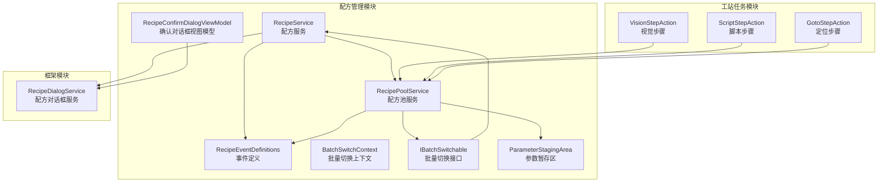
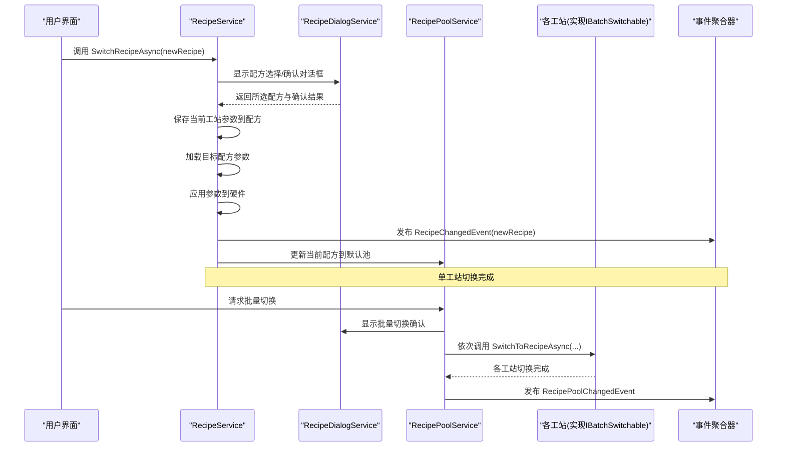
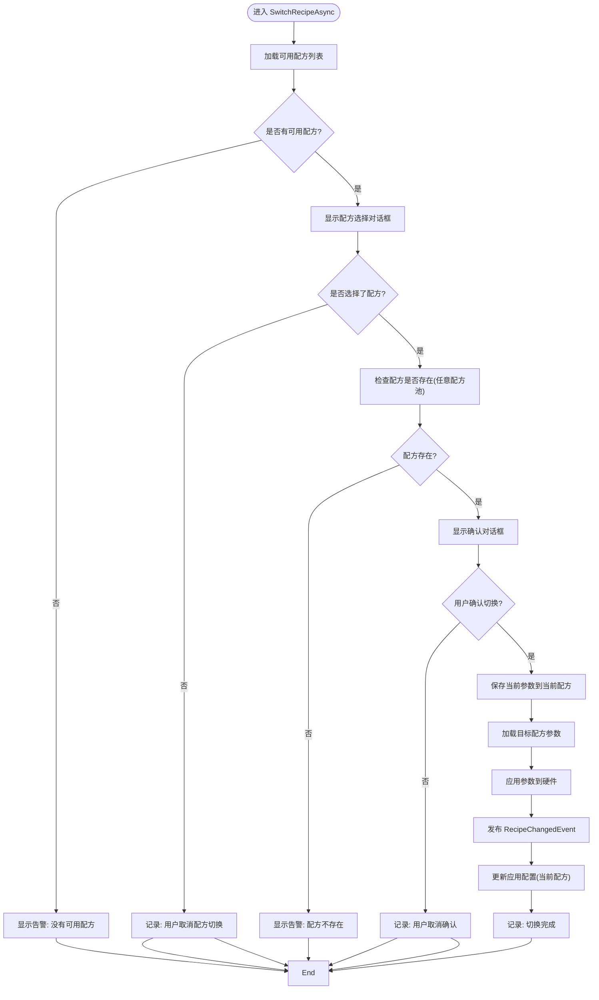
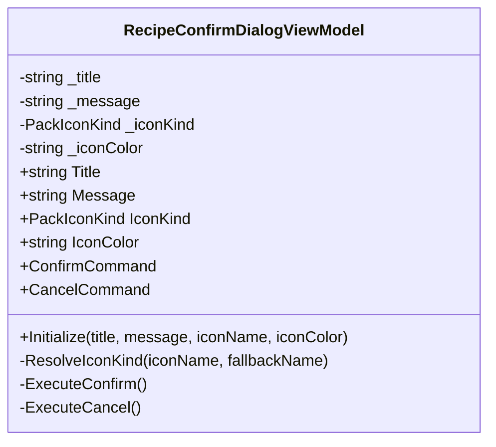
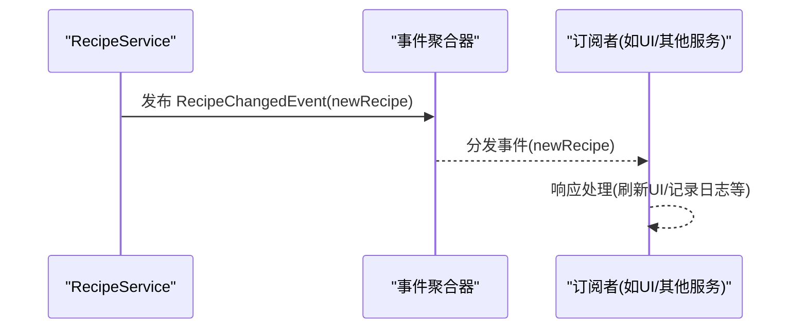
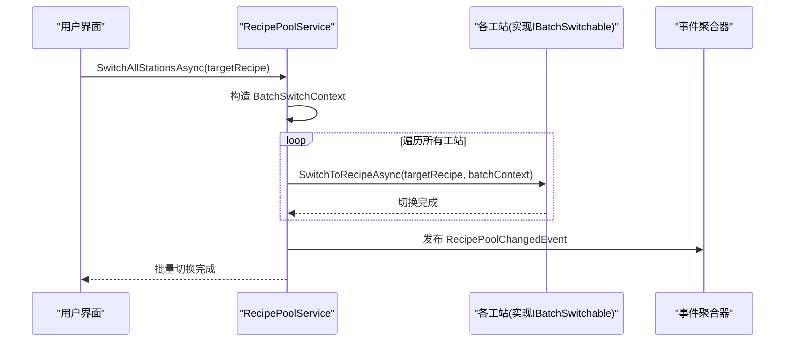
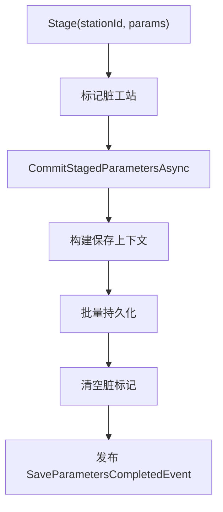
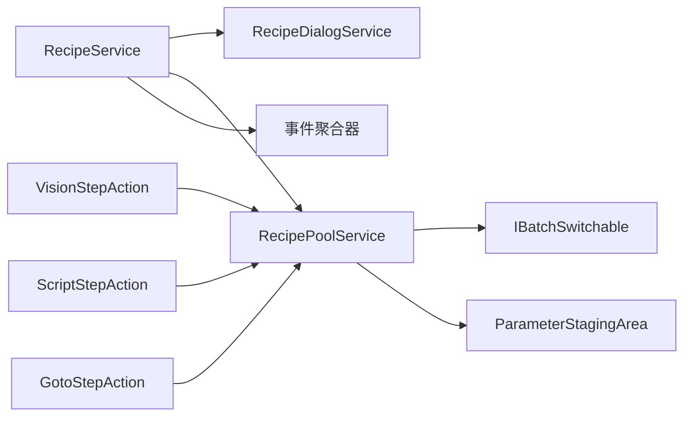

# 配方切换工作流程

<cite>
**本文档引用的文件**
- [RecipeService.cs](file://RecipeManagement/Services/RecipeService.cs)
- [RecipeConfirmDialogViewModel.cs](file://RecipeManagement/ViewModels/RecipeConfirmDialogViewModel.cs)
- [RecipeEventDefinitions.cs](file://RecipeManagement/Events/RecipeEventDefinitions.cs)
- [BatchSwitchContext.cs](file://RecipeManagement/Models/BatchSwitchContext.cs)
- [IBatchSwitchable.cs](file://RecipeManagement/Interfaces/IBatchSwitchable.cs)
- [RecipePoolService.cs](file://RecipeManagement/Services/RecipePoolService.cs)
- [RecipeDialogService.cs](file://Framework/Services/RecipeDialogService.cs)
- [ParameterStagingArea.cs](file://RecipeManagement/Models/ParameterStagingArea.cs)
- [VisionStepAction.cs](file://StationTasks/Actions/VisionStepAction.cs)
- [ScriptStepAction.cs](file://StationTasks/Actions/ScriptStepAction.cs)
- [GotoStepAction.cs](file://StationTasks/Actions/GotoStepAction.cs)
</cite>

## 目录
1. [简介](#简介)
2. [项目结构](#项目结构)
3. [核心组件](#核心组件)
4. [架构总览](#架构总览)
5. [详细组件分析](#详细组件分析)
6. [依赖关系分析](#依赖关系分析)
7. [性能考虑](#性能考虑)
8. [故障排查指南](#故障排查指南)
9. [结论](#结论)

## 简介
本文件系统性梳理配方切换工作流程，重点解析以下方面：
- SwitchRecipeAsync方法的实现逻辑：配方存在性检查、用户确认对话框、切换前参数保存等关键步骤
- RecipeConfirmDialogViewModel的设计：确认对话框交互流程、用户选择处理逻辑、异常情况处理机制
- 配方切换过程中的事件发布机制：RecipeChangedEvent的传播路径及订阅者响应
- 批量切换功能：多工站同步切换、参数继承规则、回滚机制
- 安全保障措施：参数备份、错误恢复、操作审计
- 性能优化与用户体验建议

## 项目结构
配方切换涉及RecipeManagement模块（服务、视图模型、事件、模型）、Framework模块（对话框服务）、StationTasks模块（与配方相关的步骤动作）等。

**图表来源**
- [RecipeService.cs:1-723](file://RecipeManagement/Services/RecipeService.cs#L1-L723)
- [RecipePoolService.cs:1-580](file://RecipeManagement/Services/RecipePoolService.cs#L1-L580)
- [RecipeConfirmDialogViewModel.cs:1-88](file://RecipeManagement/ViewModels/RecipeConfirmDialogViewModel.cs#L1-L88)
- [RecipeEventDefinitions.cs:1-25](file://RecipeManagement/Events/RecipeEventDefinitions.cs#L1-L25)
- [BatchSwitchContext.cs:1-18](file://RecipeManagement/Models/BatchSwitchContext.cs#L1-L18)
- [IBatchSwitchable.cs:1-11](file://RecipeManagement/Interfaces/IBatchSwitchable.cs#L1-L11)
- [ParameterStagingArea.cs:1-78](file://RecipeManagement/Models/ParameterStagingArea.cs#L1-L78)
- [RecipeDialogService.cs:1-106](file://Framework/Services/RecipeDialogService.cs#L1-L106)
- [VisionStepAction.cs:153-222](file://StationTasks/Actions/VisionStepAction.cs#L153-L222)
- [ScriptStepAction.cs:1-66](file://StationTasks/Actions/ScriptStepAction.cs#L1-L66)
- [GotoStepAction.cs:1-185](file://StationTasks/Actions/GotoStepAction.cs#L1-L185)

**章节来源**
- [RecipeService.cs:1-723](file://RecipeManagement/Services/RecipeService.cs#L1-L723)
- [RecipePoolService.cs:1-580](file://RecipeManagement/Services/RecipePoolService.cs#L1-L580)
- [RecipeConfirmDialogViewModel.cs:1-88](file://RecipeManagement/ViewModels/RecipeConfirmDialogViewModel.cs#L1-L88)
- [RecipeEventDefinitions.cs:1-25](file://RecipeManagement/Events/RecipeEventDefinitions.cs#L1-L25)
- [BatchSwitchContext.cs:1-18](file://RecipeManagement/Models/BatchSwitchContext.cs#L1-L18)
- [IBatchSwitchable.cs:1-11](file://RecipeManagement/Interfaces/IBatchSwitchable.cs#L1-L11)
- [ParameterStagingArea.cs:1-78](file://RecipeManagement/Models/ParameterStagingArea.cs#L1-L78)
- [RecipeDialogService.cs:1-106](file://Framework/Services/RecipeDialogService.cs#L1-L106)
- [VisionStepAction.cs:153-222](file://StationTasks/Actions/VisionStepAction.cs#L153-L222)
- [ScriptStepAction.cs:1-66](file://StationTasks/Actions/ScriptStepAction.cs#L1-L66)
- [GotoStepAction.cs:1-185](file://StationTasks/Actions/GotoStepAction.cs#L1-L185)

## 核心组件
- 配方服务（RecipeService）：封装单工站配方切换的完整流程，负责参数保存、加载、硬件应用、事件发布与配置更新
- 配方池服务（RecipePoolService）：提供批量切换能力，协调各工站切换，维护参数暂存区，处理全局变量
- 确认对话框视图模型（RecipeConfirmDialogViewModel）：承载确认对话框的标题、消息、图标、命令，处理用户选择
- 对话框服务（RecipeDialogService）：统一提供配方选择、确认、告警等对话框
- 事件定义（RecipeEventDefinitions）：定义RecipeChangedEvent等事件类型
- 批量切换上下文（BatchSwitchContext）：描述批量切换的目标配方、池ID与池名
- 批量切换接口（IBatchSwitchable）：约束支持批量切换的工站实现
- 参数暂存区（ParameterStagingArea）：在批量保存场景中暂存各工站参数，减少重复写入

**章节来源**
- [RecipeService.cs:22-109](file://RecipeManagement/Services/RecipeService.cs#L22-L109)
- [RecipePoolService.cs:19-92](file://RecipeManagement/Services/RecipePoolService.cs#L19-L92)
- [RecipeConfirmDialogViewModel.cs:12-87](file://RecipeManagement/ViewModels/RecipeConfirmDialogViewModel.cs#L12-L87)
- [RecipeDialogService.cs:11-106](file://Framework/Services/RecipeDialogService.cs#L11-L106)
- [RecipeEventDefinitions.cs:5-24](file://RecipeManagement/Events/RecipeEventDefinitions.cs#L5-L24)
- [BatchSwitchContext.cs:3-16](file://RecipeManagement/Models/BatchSwitchContext.cs#L3-L16)
- [IBatchSwitchable.cs:6-9](file://RecipeManagement/Interfaces/IBatchSwitchable.cs#L6-L9)
- [ParameterStagingArea.cs:5-77](file://RecipeManagement/Models/ParameterStagingArea.cs#L5-L77)

## 架构总览
配方切换采用“单工站切换+批量同步”的分层设计。单工站通过RecipeService完成参数保存、加载与事件发布；批量切换由RecipePoolService驱动，遍历所有工站并调用其IBatchSwitchable接口实现。

**图表来源**
- [RecipeService.cs:543-634](file://RecipeManagement/Services/RecipeService.cs#L543-L634)
- [RecipeDialogService.cs:20-103](file://Framework/Services/RecipeDialogService.cs#L20-L103)
- [RecipePoolService.cs:198-237](file://RecipeManagement/Services/RecipePoolService.cs#L198-L237)
- [RecipeEventDefinitions.cs:5-9](file://RecipeManagement/Events/RecipeEventDefinitions.cs#L5-L9)
- [IBatchSwitchable.cs:8](file://RecipeManagement/Interfaces/IBatchSwitchable.cs#L8)

## 详细组件分析

### SwitchRecipeAsync方法实现逻辑
- 配方存在性检查：通过RecipePoolService查询可用配方，并在RecipePoolService中进一步验证配方是否存在于任一配方池
- 用户确认对话框：使用RecipeDialogService展示确认对话框，用户选择“确认切换”或“取消”
- 切换前参数保存：先将当前工站参数保存到当前配方，再加载目标配方参数
- 参数应用与事件发布：将参数应用到硬件后，发布RecipeChangedEvent，同时更新应用配置
- 异常处理：捕获异常并统一通过RecipeDialogService显示告警

**图表来源**
- [RecipeService.cs:543-595](file://RecipeManagement/Services/RecipeService.cs#L543-L595)
- [RecipeService.cs:600-634](file://RecipeManagement/Services/RecipeService.cs#L600-L634)
- [RecipeDialogService.cs:20-82](file://Framework/Services/RecipeDialogService.cs#L20-L82)
- [RecipePoolService.cs:445-467](file://RecipeManagement/Services/RecipePoolService.cs#L445-L467)

**章节来源**
- [RecipeService.cs:543-634](file://RecipeManagement/Services/RecipeService.cs#L543-L634)
- [RecipeDialogService.cs:20-82](file://Framework/Services/RecipeDialogService.cs#L20-L82)
- [RecipePoolService.cs:445-467](file://RecipeManagement/Services/RecipePoolService.cs#L445-L467)

### RecipeConfirmDialogViewModel设计
- 属性与命令：Title、Message、IconKind、IconColor，以及ConfirmCommand、CancelCommand
- 初始化：Initialize方法动态解析图标名称，避免运行时枚举不一致导致的显示问题
- 用户选择处理：ExecuteConfirm与ExecuteCancel通过MaterialDesign DialogHost关闭对话框并返回布尔结果
- 异常处理：ResolveIconKind提供回退策略，确保即使图标名称无效也能显示默认图标

**图表来源**
- [RecipeConfirmDialogViewModel.cs:12-87](file://RecipeManagement/ViewModels/RecipeConfirmDialogViewModel.cs#L12-L87)

**章节来源**
- [RecipeConfirmDialogViewModel.cs:12-87](file://RecipeManagement/ViewModels/RecipeConfirmDialogViewModel.cs#L12-L87)

### 事件发布机制：RecipeChangedEvent传播路径
- 发布点：RecipeService在单工站切换完成后发布RecipeChangedEvent(newRecipe)
- 订阅点：RecipeService在构造函数中订阅该事件，便于后续联动处理
- 影响范围：事件可用于触发UI刷新、参数同步、日志记录等

**图表来源**
- [RecipeService.cs:120-127](file://RecipeManagement/Services/RecipeService.cs#L120-L127)
- [RecipeService.cs:615](file://RecipeManagement/Services/RecipeService.cs#L615)
- [RecipeEventDefinitions.cs:5](file://RecipeManagement/Events/RecipeEventDefinitions.cs#L5)

**章节来源**
- [RecipeService.cs:120-127](file://RecipeManagement/Services/RecipeService.cs#L120-L127)
- [RecipeService.cs:615](file://RecipeManagement/Services/RecipeService.cs#L615)
- [RecipeEventDefinitions.cs:5](file://RecipeManagement/Events/RecipeEventDefinitions.cs#L5)

### 批量切换功能实现原理
- 多工站同步切换：RecipePoolService遍历所有注册工站，对实现IBatchSwitchable的工站调用SwitchToRecipeAsync
- 参数继承规则：批量切换通过BatchSwitchContext传递目标配方、池ID与池名，确保各工站使用相同上下文
- 回滚机制：当前实现未提供自动回滚；若需回滚可在批量切换前保存当前状态，在失败时恢复
- 全局变量与步骤动作：视觉/脚本/定位等步骤在执行过程中可读取/写入全局变量，保证切换后参数一致性

**图表来源**
- [RecipePoolService.cs:198-237](file://RecipeManagement/Services/RecipePoolService.cs#L198-L237)
- [BatchSwitchContext.cs:10-16](file://RecipeManagement/Models/BatchSwitchContext.cs#L10-L16)
- [IBatchSwitchable.cs:8](file://RecipeManagement/Interfaces/IBatchSwitchable.cs#L8)
- [RecipeEventDefinitions.cs:9](file://RecipeManagement/Events/RecipeEventDefinitions.cs#L9)

**章节来源**
- [RecipePoolService.cs:198-237](file://RecipeManagement/Services/RecipePoolService.cs#L198-L237)
- [BatchSwitchContext.cs:10-16](file://RecipeManagement/Models/BatchSwitchContext.cs#L10-L16)
- [IBatchSwitchable.cs:8](file://RecipeManagement/Interfaces/IBatchSwitchable.cs#L8)

### 参数暂存与批量保存
- ParameterStagingArea：在批量保存场景中暂存各工站参数，仅提交脏变更，降低写入次数
- RecipePoolService：通过CommitStagedParametersAsync统一提交，发布SaveParametersCompletedEvent

**图表来源**
- [ParameterStagingArea.cs:11-58](file://RecipeManagement/Models/ParameterStagingArea.cs#L11-L58)
- [RecipePoolService.cs:143-177](file://RecipeManagement/Services/RecipePoolService.cs#L143-L177)
- [RecipeEventDefinitions.cs:7](file://RecipeManagement/Events/RecipeEventDefinitions.cs#L7)

**章节来源**
- [ParameterStagingArea.cs:11-58](file://RecipeManagement/Models/ParameterStagingArea.cs#L11-L58)
- [RecipePoolService.cs:143-177](file://RecipeManagement/Services/RecipePoolService.cs#L143-L177)
- [RecipeEventDefinitions.cs:7](file://RecipeManagement/Events/RecipeEventDefinitions.cs#L7)

### 全局变量与步骤动作的协同
- 视觉/脚本/定位等步骤在执行时读取配方池的全局变量，必要时写回并持久化
- 这保证了配方切换后，步骤执行所需的上下文变量得到正确继承

**章节来源**
- [VisionStepAction.cs:177-220](file://StationTasks/Actions/VisionStepAction.cs#L177-L220)
- [ScriptStepAction.cs:48-66](file://StationTasks/Actions/ScriptStepAction.cs#L48-L66)
- [GotoStepAction.cs:167-183](file://StationTasks/Actions/GotoStepAction.cs#L167-L183)

## 依赖关系分析
- RecipeService依赖RecipeDialogService进行用户交互，依赖RecipePoolService进行参数持久化与当前配方管理，依赖事件聚合器发布RecipeChangedEvent
- RecipePoolService依赖IStationRegistry获取所有工站，依赖IRecipeDialogService进行批量切换确认，依赖事件聚合器发布RecipePoolChangedEvent
- 各工站通过实现IBatchSwitchable参与批量切换
- ParameterStagingArea作为RecipePoolService内部组件，提供批量参数暂存与提交

**图表来源**
- [RecipeService.cs:31-106](file://RecipeManagement/Services/RecipeService.cs#L31-L106)
- [RecipePoolService.cs:24-92](file://RecipeManagement/Services/RecipePoolService.cs#L24-L92)
- [IBatchSwitchable.cs:6-9](file://RecipeManagement/Interfaces/IBatchSwitchable.cs#L6-L9)
- [ParameterStagingArea.cs:5-77](file://RecipeManagement/Models/ParameterStagingArea.cs#L5-L77)
- [VisionStepAction.cs:24-43](file://StationTasks/Actions/VisionStepAction.cs#L24-L43)
- [ScriptStepAction.cs:24-43](file://StationTasks/Actions/ScriptStepAction.cs#L24-L43)
- [GotoStepAction.cs:22-36](file://StationTasks/Actions/GotoStepAction.cs#L22-L36)

**章节来源**
- [RecipeService.cs:31-106](file://RecipeManagement/Services/RecipeService.cs#L31-L106)
- [RecipePoolService.cs:24-92](file://RecipeManagement/Services/RecipePoolService.cs#L24-L92)
- [IBatchSwitchable.cs:6-9](file://RecipeManagement/Interfaces/IBatchSwitchable.cs#L6-L9)
- [ParameterStagingArea.cs:5-77](file://RecipeManagement/Models/ParameterStagingArea.cs#L5-L77)
- [VisionStepAction.cs:24-43](file://StationTasks/Actions/VisionStepAction.cs#L24-L43)
- [ScriptStepAction.cs:24-43](file://StationTasks/Actions/ScriptStepAction.cs#L24-L43)
- [GotoStepAction.cs:22-36](file://StationTasks/Actions/GotoStepAction.cs#L22-L36)

## 性能考虑
- 批量切换的串行遍历：当前实现按顺序逐一调用各工站的SwitchToRecipeAsync，若工站数量较多且切换耗时较长，建议评估并行化或分批提交策略
- 参数暂存与批量提交：通过ParameterStagingArea减少重复写入，提升批量保存效率
- 事件发布频率：RecipeChangedEvent在单工站切换时发布，RecipePoolChangedEvent在批量切换完成时发布，避免频繁UI刷新
- I/O与磁盘写入：参数保存到本地文件时进行备份，建议在批量场景下合并写入以减少磁盘压力

[本节为通用性能建议，不直接分析具体文件]

## 故障排查指南
- 配方不存在：RecipePoolService提供RecipeExistsInAnyPoolAsync，若返回不存在，应提示用户并终止切换
- 用户取消：SwitchRecipeAsync在用户取消选择或确认时提前退出，记录日志并返回
- 参数保存失败：RecipeService在保存参数到配方系统或本地文件时捕获异常并抛出，RecipeDialogService显示告警
- 批量切换异常：RecipePoolService在遍历工站时未显式try/catch，建议在调用端增加异常捕获与回滚策略
- 全局变量读写：视觉/脚本/定位步骤在读取/写入全局变量时记录日志，便于定位问题

**章节来源**
- [RecipePoolService.cs:445-467](file://RecipeManagement/Services/RecipePoolService.cs#L445-L467)
- [RecipeService.cs:590-595](file://RecipeManagement/Services/RecipeService.cs#L590-L595)
- [VisionStepAction.cs:164-171](file://StationTasks/Actions/VisionStepAction.cs#L164-L171)
- [ScriptStepAction.cs:48-66](file://StationTasks/Actions/ScriptStepAction.cs#L48-L66)
- [GotoStepAction.cs:167-183](file://StationTasks/Actions/GotoStepAction.cs#L167-L183)

## 结论
配方切换工作流通过RecipeService与RecipePoolService实现了单工站与多工站的统一管理，配合RecipeDialogService与RecipeConfirmDialogViewModel提供了良好的用户交互体验。RecipeChangedEvent与RecipePoolChangedEvent确保了切换后的状态传播与订阅者响应。参数暂存区与批量提交机制提升了批量场景的性能与可靠性。为进一步增强安全性与可用性，建议在批量切换中引入回滚机制与更细粒度的异常处理策略。