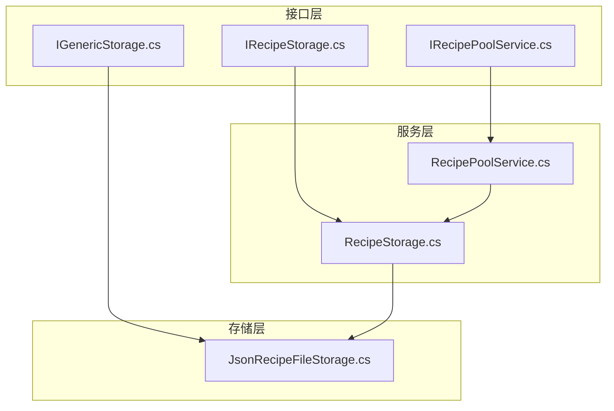
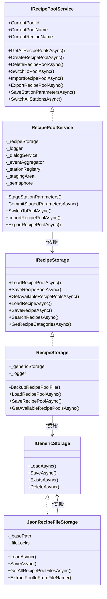
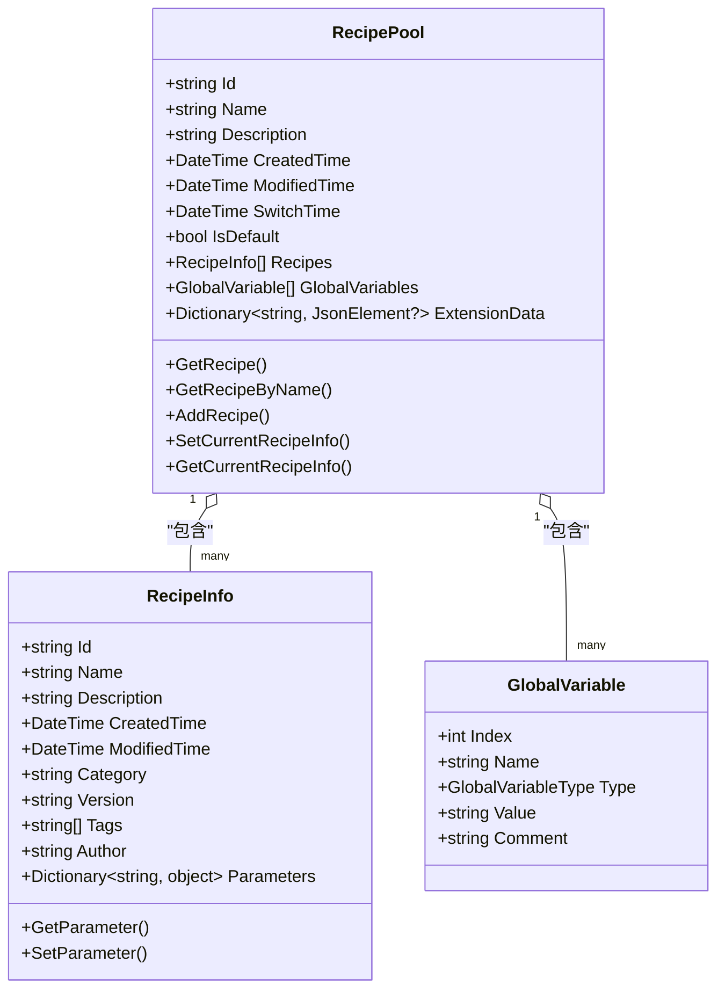
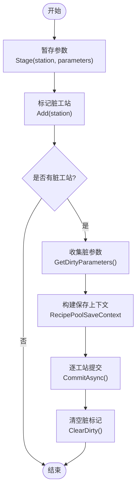
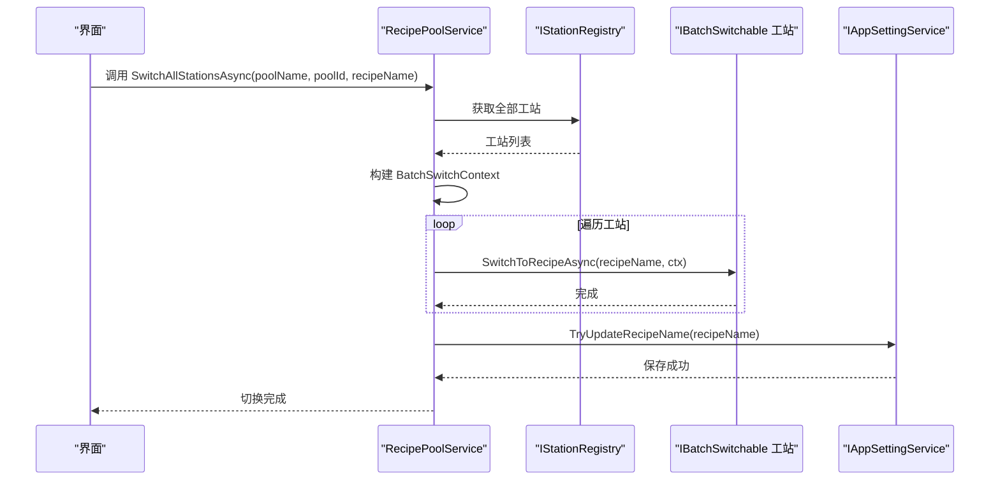
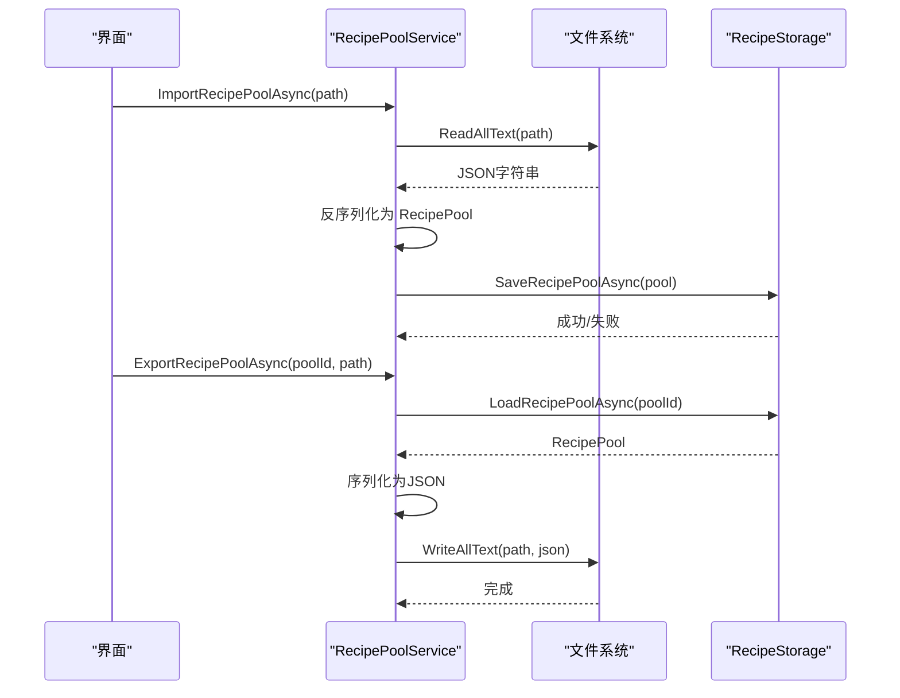
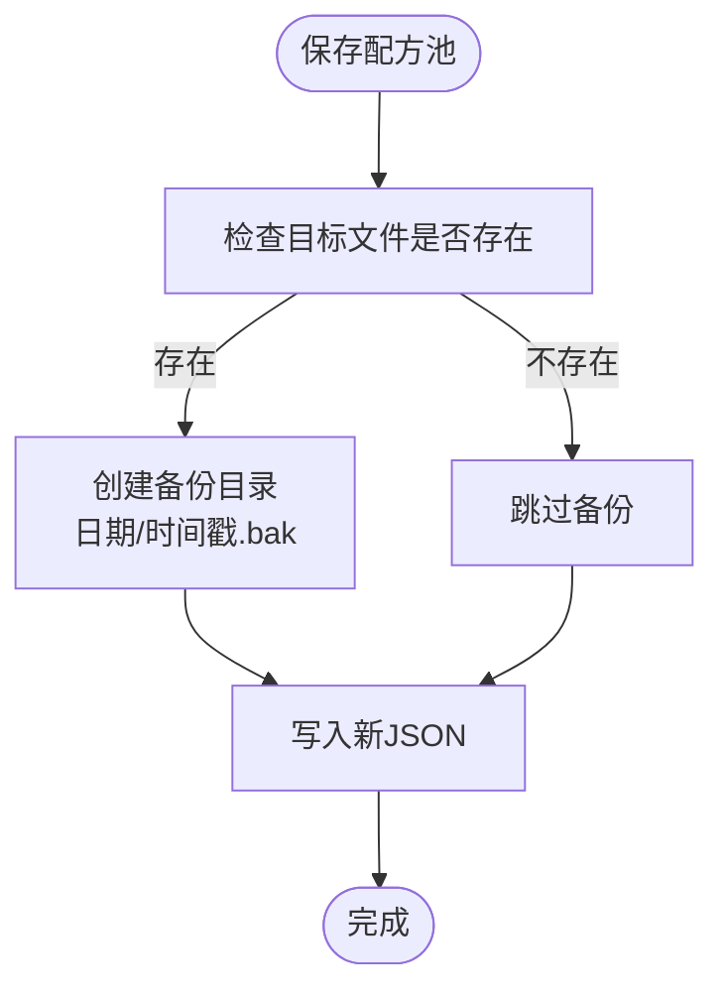
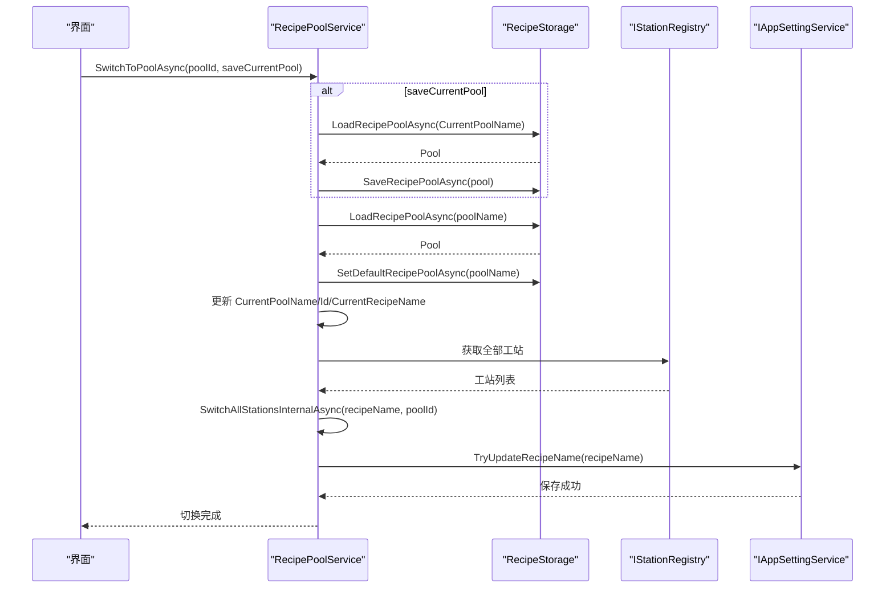

# 配方存储与持久化

<cite>
**本文引用的文件**
- [RecipePoolService.cs](file://RecipeManagement/Services/RecipePoolService.cs)
- [RecipeStorage.cs](file://RecipeManagement/Services/RecipeStorage.cs)
- [JsonRecipeFileStorage.cs](file://Core/Services/JsonRecipeFileStorage.cs)
- [RecipePool.cs](file://RecipeManagement/Models/RecipePool.cs)
- [RecipeInfo.cs](file://RecipeManagement/Models/RecipeInfo.cs)
- [IRecipePoolService.cs](file://RecipeManagement/Interfaces/IRecipePoolService.cs)
- [IRecipeStorage.cs](file://RecipeManagement/Interfaces/IRecipeStorage.cs)
- [IGenericStorage.cs](file://Core/Abstraction/Storages/IGenericStorage.cs)
- [GlobalVariable.cs](file://Core/Models/GlobalVariable.cs)
- [ParameterStagingArea.cs](file://RecipeManagement/Models/ParameterStagingArea.cs)
- [BatchSwitchContext.cs](file://RecipeManagement/Models/BatchSwitchContext.cs)
- [CurrentRecipeInfo.cs](file://RecipeManagement/Models/CurrentRecipeInfo.cs)
</cite>

## 目录
1. [简介](#简介)
2. [项目结构](#项目结构)
3. [核心组件](#核心组件)
4. [架构总览](#架构总览)
5. [详细组件分析](#详细组件分析)
6. [依赖关系分析](#依赖关系分析)
7. [性能考虑](#性能考虑)
8. [故障排除指南](#故障排除指南)
9. [结论](#结论)
10. [附录](#附录)

## 简介
本文件系统性阐述配方存储与持久化的完整技术方案，覆盖配方池(RecipePool)设计理念、配方文件组织结构、参数文件命名规范；解释本地文件存储与配方系统存储的双重机制；详述RecipePoolService的职责边界、配方池的创建/删除/切换流程；提供配方导入/导出的实现细节、JSON序列化配置、数据校验与错误恢复策略；并给出存储性能优化建议与故障排除指南。

## 项目结构
配方存储体系由三层组成：
- 接口层：定义RecipePoolService与RecipeStorage的契约，隔离上层调用与具体存储实现。
- 服务层：RecipePoolService负责业务编排（参数暂存、批量切换、导入导出等）；RecipeStorage负责配方池与配方的读写、索引与备份。
- 存储层：JsonRecipeFileStorage基于文件系统的JSON序列化存储，提供文件级并发锁保障。

**图表来源**
- [IRecipePoolService.cs:1-45](file://RecipeManagement/Interfaces/IRecipePoolService.cs#L1-L45)
- [IRecipeStorage.cs:1-34](file://RecipeManagement/Interfaces/IRecipeStorage.cs#L1-L34)
- [IGenericStorage.cs:1-12](file://Core/Abstraction/Storages/IGenericStorage.cs#L1-L12)
- [RecipePoolService.cs:1-580](file://RecipeManagement/Services/RecipePoolService.cs#L1-L580)
- [RecipeStorage.cs:1-190](file://RecipeManagement/Services/RecipeStorage.cs#L1-L190)
- [JsonRecipeFileStorage.cs:1-125](file://Core/Services/JsonRecipeFileStorage.cs#L1-L125)

**章节来源**
- [IRecipePoolService.cs:1-45](file://RecipeManagement/Interfaces/IRecipePoolService.cs#L1-L45)
- [IRecipeStorage.cs:1-34](file://RecipeManagement/Interfaces/IRecipeStorage.cs#L1-L34)
- [IGenericStorage.cs:1-12](file://Core/Abstraction/Storages/IGenericStorage.cs#L1-L12)
- [RecipePoolService.cs:1-580](file://RecipeManagement/Services/RecipePoolService.cs#L1-L580)
- [RecipeStorage.cs:1-190](file://RecipeManagement/Services/RecipeStorage.cs#L1-L190)
- [JsonRecipeFileStorage.cs:1-125](file://Core/Services/JsonRecipeFileStorage.cs#L1-L125)

## 核心组件
- RecipePool：配方池实体，包含Id/Name/Description/CreatedTime/ModifiedTime/IsDefault/Recipes/GlobalVariables/ExtensionData等字段，支持当前配方信息设置与查询。
- RecipeInfo：配方实体，包含Id/Name/Description/CreatedTime/ModifiedTime/Category/Version/Tags/Author/Parameters等，支持参数的序列化读取与设置。
- ParameterStagingArea：参数暂存区，按工站聚合参数变更，支持脏标记与批量提交。
- BatchSwitchContext：批量切换上下文，承载目标配方、池Id与池名，供各工站批量切换使用。
- IRecipePoolService/IRecipeStorage：接口契约，定义配方池与配方的CRUD、搜索、分类、导入导出等能力。
- RecipePoolService：业务编排核心，负责参数暂存/提交、批量切换、导入导出、池管理、扩展数据读写等。
- RecipeStorage：配方池与配方的持久化适配器，负责Key映射、文件备份、可用池枚举、配方搜索与分类。
- JsonRecipeFileStorage：文件系统JSON存储实现，提供文件级并发锁、路径构造、文件枚举与池Id提取。

**章节来源**
- [RecipePool.cs:1-180](file://RecipeManagement/Models/RecipePool.cs#L1-L180)
- [RecipeInfo.cs:1-73](file://RecipeManagement/Models/RecipeInfo.cs#L1-L73)
- [ParameterStagingArea.cs:1-78](file://RecipeManagement/Models/ParameterStagingArea.cs#L1-L78)
- [BatchSwitchContext.cs:1-18](file://RecipeManagement/Models/BatchSwitchContext.cs#L1-L18)
- [IRecipePoolService.cs:1-45](file://RecipeManagement/Interfaces/IRecipePoolService.cs#L1-L45)
- [IRecipeStorage.cs:1-34](file://RecipeManagement/Interfaces/IRecipeStorage.cs#L1-L34)
- [RecipePoolService.cs:1-580](file://RecipeManagement/Services/RecipePoolService.cs#L1-L580)
- [RecipeStorage.cs:1-190](file://RecipeManagement/Services/RecipeStorage.cs#L1-L190)
- [JsonRecipeFileStorage.cs:1-125](file://Core/Services/JsonRecipeFileStorage.cs#L1-L125)

## 架构总览
配方系统采用“接口隔离 + 服务编排 + 文件存储”的分层架构。上层通过IRecipePoolService发起业务请求，RecipePoolService协调参数暂存、事件发布与批量切换；RecipeStorage将RecipePool/Recipe映射为文件系统中的JSON文件；JsonRecipeFileStorage提供文件级并发控制与路径管理。

**图表来源**
- [IRecipePoolService.cs:1-45](file://RecipeManagement/Interfaces/IRecipePoolService.cs#L1-L45)
- [RecipePoolService.cs:1-580](file://RecipeManagement/Services/RecipePoolService.cs#L1-L580)
- [IRecipeStorage.cs:1-34](file://RecipeManagement/Interfaces/IRecipeStorage.cs#L1-L34)
- [RecipeStorage.cs:1-190](file://RecipeManagement/Services/RecipeStorage.cs#L1-L190)
- [IGenericStorage.cs:1-12](file://Core/Abstraction/Storages/IGenericStorage.cs#L1-L12)
- [JsonRecipeFileStorage.cs:1-125](file://Core/Services/JsonRecipeFileStorage.cs#L1-L125)

## 详细组件分析

### 配方池(RecipePool)设计与数据模型
- 数据模型
  - 基础字段：Id/Name/Description/CreatedTime/ModifiedTime/SwitchTime/IsDefault。
  - 关联集合：Recipes（配方列表）、GlobalVariables（全局变量列表）、ExtensionData（扩展键值对，以JsonElement存储）。
  - 方法：GetRecipe/GetRecipeByName/AddRecipe/SetCurrentRecipeInfo/GetCurrentRecipeInfo。
- 设计要点
  - 使用INotifyPropertyChanged支持UI绑定与变更通知。
  - ExtensionData通过JsonExtensionData特性与JsonElement存储，便于扩展业务数据。
  - CurrentRecipeInfo封装当前配方切换信息，含有效性判断。

**图表来源**
- [RecipePool.cs:1-180](file://RecipeManagement/Models/RecipePool.cs#L1-L180)
- [RecipeInfo.cs:1-73](file://RecipeManagement/Models/RecipeInfo.cs#L1-L73)
- [GlobalVariable.cs:1-148](file://Core/Models/GlobalVariable.cs#L1-L148)

**章节来源**
- [RecipePool.cs:1-180](file://RecipeManagement/Models/RecipePool.cs#L1-L180)
- [RecipeInfo.cs:1-73](file://RecipeManagement/Models/RecipeInfo.cs#L1-L73)
- [GlobalVariable.cs:1-148](file://Core/Models/GlobalVariable.cs#L1-L148)

### 参数暂存与批量提交(ParameterStagingArea)
- 功能
  - 按工站标识暂存参数对象，维护脏标记集合，支持批量获取与清空。
  - 与RecipePoolService配合，在提交阶段生成RecipePoolSaveContext，逐工站写入。
- 并发
  - 内部使用锁保护字典与脏标记集合，避免多线程竞态。

**图表来源**
- [ParameterStagingArea.cs:1-78](file://RecipeManagement/Models/ParameterStagingArea.cs#L1-L78)
- [RecipePoolService.cs:132-177](file://RecipeManagement/Services/RecipePoolService.cs#L132-L177)

**章节来源**
- [ParameterStagingArea.cs:1-78](file://RecipeManagement/Models/ParameterStagingArea.cs#L1-L78)
- [RecipePoolService.cs:132-177](file://RecipeManagement/Services/RecipePoolService.cs#L132-L177)

### 批量切换(BatchSwitchContext)与工站切换
- BatchSwitchContext提供批量切换所需的上下文信息（目标配方名、池Id、池名），RecipePoolService在遍历所有工站时传递给可批量切换的工站。
- 切换流程包含确认提示、批量调用、应用配置更新与事件发布。

**图表来源**
- [RecipePoolService.cs:198-237](file://RecipeManagement/Services/RecipePoolService.cs#L198-L237)
- [BatchSwitchContext.cs:1-18](file://RecipeManagement/Models/BatchSwitchContext.cs#L1-L18)

**章节来源**
- [RecipePoolService.cs:198-237](file://RecipeManagement/Services/RecipePoolService.cs#L198-L237)
- [BatchSwitchContext.cs:1-18](file://RecipeManagement/Models/BatchSwitchContext.cs#L1-L18)

### 导入/导出与JSON序列化配置
- 导入
  - 读取JSON文件，反序列化为RecipePool，加信号量保证并发安全后保存。
- 导出
  - 加载指定池，序列化为JSON并写入文件。
- 序列化选项
  - JsonRecipeFileStorage使用缩进、大小写不敏感、UnsafeRelaxedJsonEscaping。
  - RecipePoolService在深拷贝与导入导出时使用WriteIndented/PropertyNameCaseInsensitive等选项。

**图表来源**
- [RecipePoolService.cs:384-423](file://RecipeManagement/Services/RecipePoolService.cs#L384-L423)
- [RecipeStorage.cs:24-36](file://RecipeManagement/Services/RecipeStorage.cs#L24-L36)
- [JsonRecipeFileStorage.cs:19-24](file://Core/Services/JsonRecipeFileStorage.cs#L19-L24)

**章节来源**
- [RecipePoolService.cs:384-423](file://RecipeManagement/Services/RecipePoolService.cs#L384-L423)
- [RecipeStorage.cs:24-36](file://RecipeManagement/Services/RecipeStorage.cs#L24-L36)
- [JsonRecipeFileStorage.cs:19-24](file://Core/Services/JsonRecipeFileStorage.cs#L19-L24)

### 本地文件存储与备份策略
- 文件组织
  - 基于JsonRecipeFileStorage，默认路径为应用基目录下的Recipes目录；按类型子目录存放，文件名为identifier.json。
- 备份策略
  - 在保存配方池前，先对现有文件执行备份：目标池Id作为二级目录，日期作为三级目录，文件名追加时间戳.bak。
- 备份实现
  - 失败静默处理，不影响主流程；可通过日志服务增强可观测性。

**图表来源**
- [RecipeStorage.cs:163-188](file://RecipeManagement/Services/RecipeStorage.cs#L163-L188)
- [JsonRecipeFileStorage.cs:34-39](file://Core/Services/JsonRecipeFileStorage.cs#L34-L39)

**章节来源**
- [RecipeStorage.cs:163-188](file://RecipeManagement/Services/RecipeStorage.cs#L163-L188)
- [JsonRecipeFileStorage.cs:34-39](file://Core/Services/JsonRecipeFileStorage.cs#L34-L39)

### 配方池的创建/删除/切换逻辑
- 创建
  - 构造RecipePool并调用RecipeStorage.SaveRecipePoolAsync。
- 删除
  - 若为目标默认池，删除后自动选择首个池设为新的默认池；若正在使用则拒绝删除。
- 切换
  - 支持保存当前池状态、加载目标池、设置默认池、回填当前配方、批量切换工站、发布事件与更新应用配置。

**图表来源**
- [RecipePoolService.cs:261-310](file://RecipeManagement/Services/RecipePoolService.cs#L261-L310)
- [RecipePoolService.cs:311-338](file://RecipeManagement/Services/RecipePoolService.cs#L311-L338)
- [RecipePoolService.cs:339-349](file://RecipeManagement/Services/RecipePoolService.cs#L339-L349)

**章节来源**
- [RecipePoolService.cs:261-310](file://RecipeManagement/Services/RecipePoolService.cs#L261-L310)
- [RecipePoolService.cs:311-338](file://RecipeManagement/Services/RecipePoolService.cs#L311-L338)
- [RecipePoolService.cs:339-349](file://RecipeManagement/Services/RecipePoolService.cs#L339-L349)

### 配方文件命名规范与组织结构
- 文件命名
  - 配方池文件：recipe_pool_{poolId}.json，位于Recipes/recipepool目录。
  - 配方文件：按类型名小写+identifier.json，位于Recipes/{typename}目录。
- 文件枚举
  - JsonRecipeFileStorage提供GetAllRecipePoolFilesAsync与ExtractPoolIdFromFileName，支持从文件名解析池Id。

**章节来源**
- [JsonRecipeFileStorage.cs:96-115](file://Core/Services/JsonRecipeFileStorage.cs#L96-L115)
- [RecipeStorage.cs:15-16](file://RecipeManagement/Services/RecipeStorage.cs#L15-L16)

## 依赖关系分析
- 松耦合
  - 上层仅依赖接口IRecipePoolService与IRecipeStorage，不直接依赖具体存储实现。
- 存储抽象
  - IGenericStorage屏蔽底层存储差异，RecipeStorage通过该接口与JsonRecipeFileStorage协作。
- 并发与一致性
  - 文件级SemaphoreSlim确保同一文件的并发读写安全；RecipePoolService使用信号量保护池级关键操作。

**图表来源**
- [IRecipePoolService.cs:1-45](file://RecipeManagement/Interfaces/IRecipePoolService.cs#L1-L45)
- [RecipePoolService.cs:1-580](file://RecipeManagement/Services/RecipePoolService.cs#L1-L580)
- [IRecipeStorage.cs:1-34](file://RecipeManagement/Interfaces/IRecipeStorage.cs#L1-L34)
- [IGenericStorage.cs:1-12](file://Core/Abstraction/Storages/IGenericStorage.cs#L1-L12)
- [JsonRecipeFileStorage.cs:1-125](file://Core/Services/JsonRecipeFileStorage.cs#L1-L125)

**章节来源**
- [IRecipePoolService.cs:1-45](file://RecipeManagement/Interfaces/IRecipePoolService.cs#L1-L45)
- [RecipePoolService.cs:1-580](file://RecipeManagement/Services/RecipePoolService.cs#L1-L580)
- [IRecipeStorage.cs:1-34](file://RecipeManagement/Interfaces/IRecipeStorage.cs#L1-L34)
- [IGenericStorage.cs:1-12](file://Core/Abstraction/Storages/IGenericStorage.cs#L1-L12)
- [JsonRecipeFileStorage.cs:1-125](file://Core/Services/JsonRecipeFileStorage.cs#L1-L125)

## 性能考虑
- 文件级并发锁
  - JsonRecipeFileStorage使用ConcurrentDictionary<string, SemaphoreSlim>为每个文件提供独立锁，降低争用。
- 序列化优化
  - 统一的JsonSerializerOptions减少重复配置开销；导入导出时按需启用WriteIndented。
- I/O批量化
  - 参数暂存与批量提交减少频繁磁盘写入；批量切换避免多次UI刷新。
- 目录与文件枚举
  - 优先使用JsonRecipeFileStorage的文件枚举能力，避免全盘扫描。

[本节为通用性能建议，不直接分析具体文件]

## 故障排除指南
- 导入失败
  - 现象：导入返回false或抛出异常。
  - 排查：检查JSON格式合法性、RecipePool字段完整性；查看日志输出；确认文件权限。
- 导出失败
  - 现象：导出返回false。
  - 排查：确认池Id存在、目标路径可写、磁盘空间充足。
- 备份失败
  - 现象：保存成功但备份未生成。
  - 排查：检查Recipes/BackUp目录权限、日期/时间戳命名冲突；备份逻辑为静默处理，必要时增强日志。
- 批量切换无效
  - 现象：工站未切换或提示取消。
  - 排查：确认IBatchSwitchable实现、工站注册状态、用户确认对话框交互。
- 默认池切换异常
  - 现象：删除默认池后无新默认池。
  - 排查：确认池列表非空、SetDefaultRecipePoolAsync执行成功。

**章节来源**
- [RecipePoolService.cs:384-423](file://RecipeManagement/Services/RecipePoolService.cs#L384-L423)
- [RecipeStorage.cs:163-188](file://RecipeManagement/Services/RecipeStorage.cs#L163-L188)
- [JsonRecipeFileStorage.cs:41-62](file://Core/Services/JsonRecipeFileStorage.cs#L41-L62)

## 结论
本方案通过清晰的接口分层、参数暂存与批量提交、文件级并发控制与备份策略，实现了配方池与配方的可靠持久化与高效管理。RecipePoolService承担业务编排职责，RecipeStorage提供稳定的存储适配，JsonRecipeFileStorage确保文件系统层面的一致性与性能。结合导入导出与扩展数据机制，满足多场景下的配方管理需求。

## 附录
- 关键流程图与类图请参考上述章节中的可视化内容。
- 如需进一步了解参数序列化与类型约束，请参阅GlobalVariable的类型规范化逻辑。