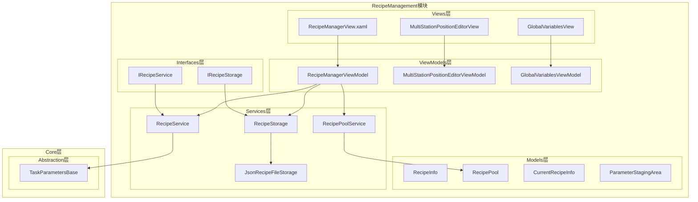
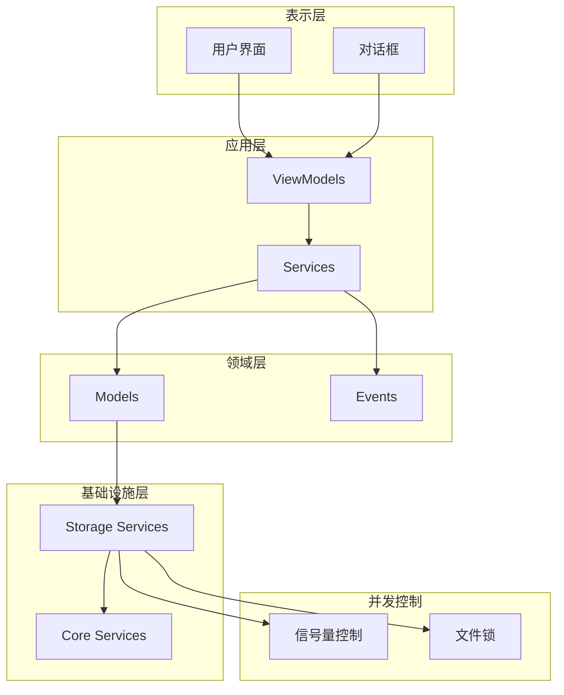
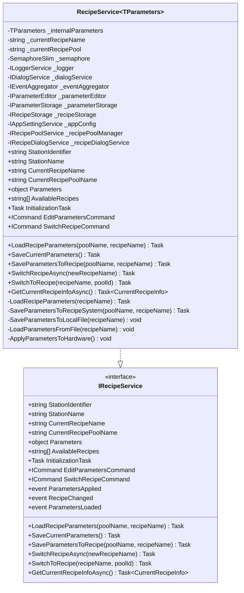
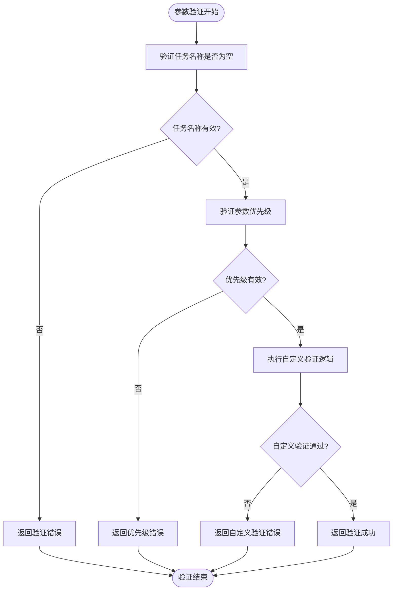
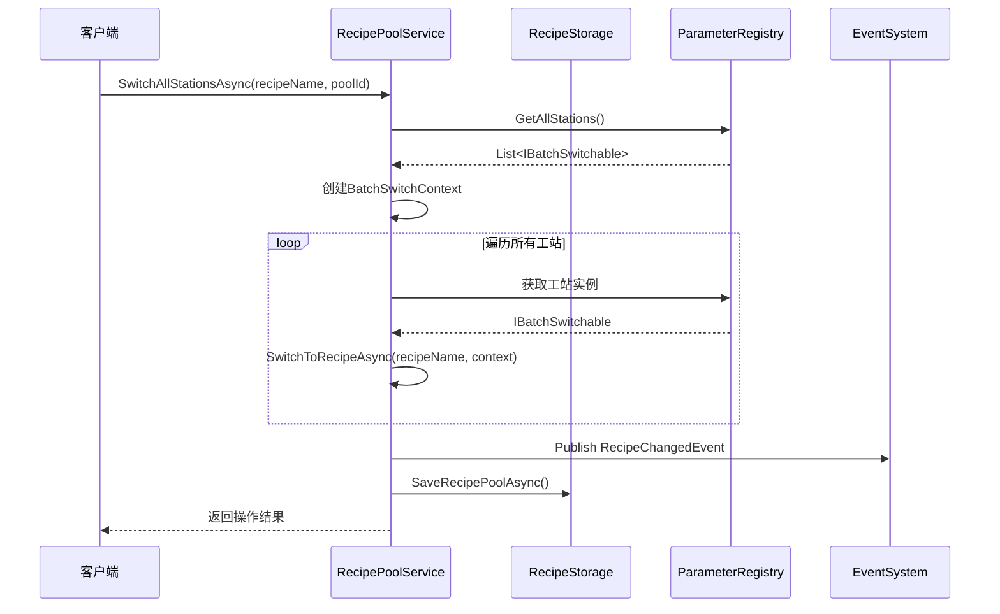
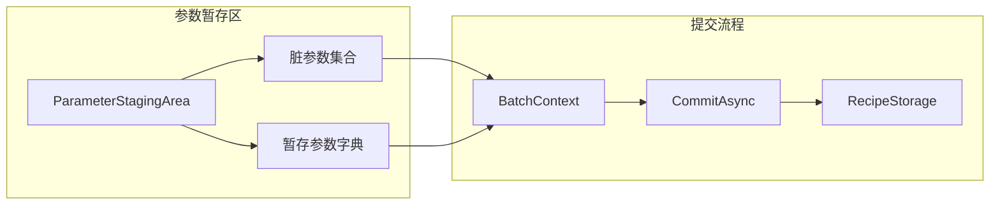
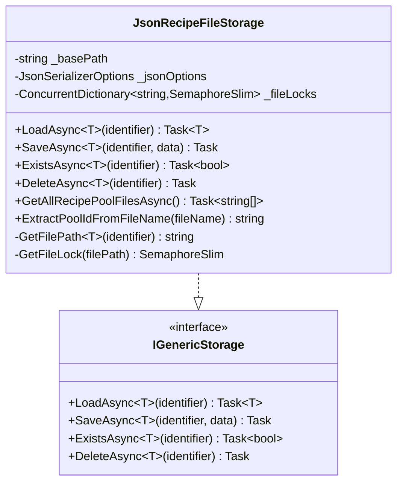
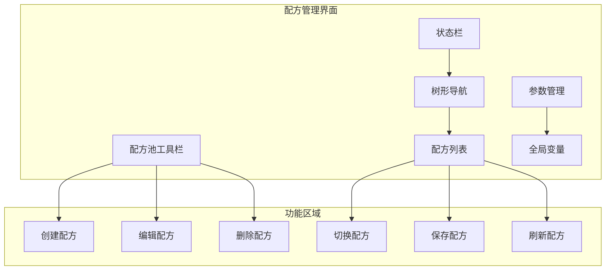
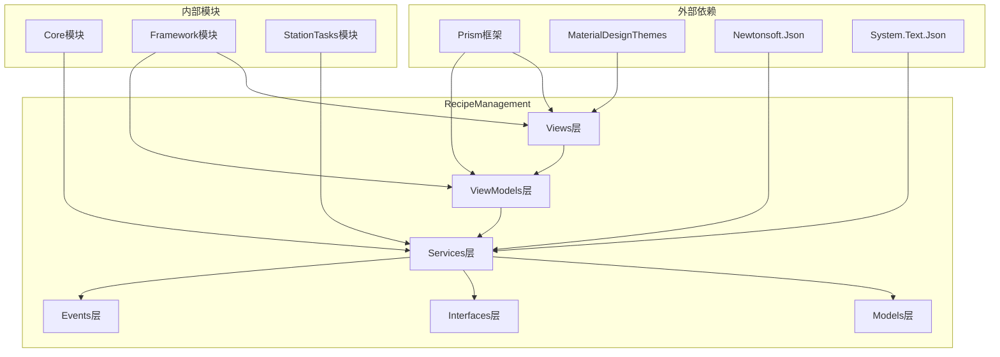

# 配方管理模块

<cite>
**本文档引用的文件**
- [RecipeModule.cs](file://RecipeManagement/RecipeModule.cs)
- [IRecipeService.cs](file://RecipeManagement/Interfaces/IRecipeService.cs)
- [IRecipeStorage.cs](file://RecipeManagement/Interfaces/IRecipeStorage.cs)
- [RecipeService.cs](file://RecipeManagement/Services/RecipeService.cs)
- [RecipeStorage.cs](file://RecipeManagement/Services/RecipeStorage.cs)
- [RecipeInfo.cs](file://RecipeManagement/Models/RecipeInfo.cs)
- [RecipePool.cs](file://RecipeManagement/Models/RecipePool.cs)
- [RecipePoolService.cs](file://RecipeManagement/Services/RecipePoolService.cs)
- [TaskParametersBase.cs](file://Core/Abstraction/Parameters/TaskParametersBase.cs)
- [RecipeManagerViewModel.cs](file://RecipeManagement/ViewModels/RecipeManagerViewModel.cs)
- [CurrentRecipeInfo.cs](file://RecipeManagement/Models/CurrentRecipeInfo.cs)
- [ParameterStagingArea.cs](file://RecipeManagement/Models/ParameterStagingArea.cs)
- [RecipeEventDefinitions.cs](file://RecipeManagement/Events/RecipeEventDefinitions.cs)
- [JsonRecipeFileStorage.cs](file://Core/Services/JsonRecipeFileStorage.cs)
- [RecipeManagerView.xaml](file://RecipeManagement/Views/RecipeManagerView.xaml)
</cite>

## 目录
1. [简介](#简介)
2. [项目结构](#项目结构)
3. [核心组件](#核心组件)
4. [架构概览](#架构概览)
5. [详细组件分析](#详细组件分析)
6. [依赖关系分析](#依赖关系分析)
7. [性能考虑](#性能考虑)
8. [故障排除指南](#故障排除指南)
9. [结论](#结论)
10. [附录](#附录)

## 简介

配方管理模块是GZQL_MACHINE自动化控制系统中的核心功能模块，负责管理设备运行所需的各类工艺参数和配置数据。该模块采用现代化的MVVM架构设计，基于Prism框架实现模块化开发，支持多工站参数管理、配方版本控制、批量参数编辑等功能。

模块的主要目标包括：
- 提供统一的配方数据模型和存储机制
- 支持配方的创建、编辑、删除和版本管理
- 实现参数的批量编辑和应用
- 提供并发安全的数据访问控制
- 支持配方的导入导出和池化管理

## 项目结构

配方管理模块采用清晰的分层架构，按照职责分离的原则组织代码结构：

**图表来源**
- [RecipeModule.cs:24-43](file://RecipeManagement/RecipeModule.cs#L24-L43)
- [RecipeManagerView.xaml:1-697](file://RecipeManagement/Views/RecipeManagerView.xaml#L1-L697)

**章节来源**
- [RecipeModule.cs:1-50](file://RecipeManagement/RecipeModule.cs#L1-L50)
- [RecipeManagerView.xaml:1-697](file://RecipeManagement/Views/RecipeManagerView.xaml#L1-L697)

## 核心组件

### 配方数据模型

配方系统的核心数据模型围绕三个关键实体构建：

#### RecipeInfo - 配方信息模型
配方信息模型是配方系统的基础数据结构，支持：
- 唯一标识符生成和管理
- 创建和修改时间跟踪
- 参数字典存储机制
- 版本控制支持
- 标签和分类管理

#### RecipePool - 配方池模型
配方池模型提供配方的容器化管理：
- 多配方集合管理
- 当前配方状态跟踪
- 全局变量存储
- 扩展数据支持
- 默认池标记

#### CurrentRecipeInfo - 当前配方信息
当前配方信息模型用于跟踪实时状态：
- 工站标识符关联
- 切换时间记录
- 有效性验证
- 默认状态标记

**章节来源**
- [RecipeInfo.cs:1-73](file://RecipeManagement/Models/RecipeInfo.cs#L1-L73)
- [RecipePool.cs:1-180](file://RecipeManagement/Models/RecipePool.cs#L1-L180)
- [CurrentRecipeInfo.cs:1-23](file://RecipeManagement/Models/CurrentRecipeInfo.cs#L1-L23)

### 服务层架构

#### RecipeService - 配方服务
RecipeService是核心业务逻辑服务，提供以下功能：
- 泛型参数管理（支持不同工站类型的参数）
- 配方加载和保存
- 参数编辑和应用
- 事件发布和订阅
- 并发控制和线程安全

#### RecipePoolService - 配方池服务
RecipePoolService管理配方池级别的操作：
- 批量参数编辑
- 配方池切换
- 参数暂存区管理
- 批量操作协调
- 并发访问控制

#### RecipeStorage - 配方存储
RecipeStorage提供数据持久化功能：
- JSON文件存储
- 文件级并发控制
- 配方池文件管理
- 数据备份机制

**章节来源**
- [RecipeService.cs:22-723](file://RecipeManagement/Services/RecipeService.cs#L22-L723)
- [RecipePoolService.cs:19-580](file://RecipeManagement/Services/RecipePoolService.cs#L19-L580)
- [RecipeStorage.cs:11-190](file://RecipeManagement/Services/RecipeStorage.cs#L11-L190)

## 架构概览

配方管理系统采用分层架构设计，确保各层职责明确、耦合度低：

**图表来源**
- [RecipeService.cs:41-41](file://RecipeManagement/Services/RecipeService.cs#L41-L41)
- [JsonRecipeFileStorage.cs:29-32](file://Core/Services/JsonRecipeFileStorage.cs#L29-L32)

系统的关键设计原则：
- **单一职责原则**：每个组件专注于特定功能
- **依赖倒置原则**：高层模块不依赖低层模块
- **接口隔离原则**：细粒度的接口设计
- **开闭原则**：对扩展开放，对修改封闭

## 详细组件分析

### 配方服务组件

#### RecipeService类分析

RecipeService是配方管理的核心服务，采用泛型设计支持不同工站类型的参数管理：

**图表来源**
- [RecipeService.cs:22-723](file://RecipeManagement/Services/RecipeService.cs#L22-L723)
- [IRecipeService.cs:13-68](file://RecipeManagement/Interfaces/IRecipeService.cs#L13-L68)

#### 参数验证和约束机制

TaskParametersBase基类提供了统一的参数验证框架：

**图表来源**
- [TaskParametersBase.cs:135-141](file://Core/Abstraction/Parameters/TaskParametersBase.cs#L135-L141)

**章节来源**
- [RecipeService.cs:22-723](file://RecipeManagement/Services/RecipeService.cs#L22-L723)
- [TaskParametersBase.cs:1-144](file://Core/Abstraction/Parameters/TaskParametersBase.cs#L1-L144)

### 配方池管理组件

#### RecipePoolService类分析

RecipePoolService提供了配方池级别的管理功能：

**图表来源**
- [RecipePoolService.cs:198-237](file://RecipeManagement/Services/RecipePoolService.cs#L198-L237)

#### 批量参数编辑机制

ParameterStagingArea提供了参数暂存和批量提交功能：

**图表来源**
- [ParameterStagingArea.cs:5-78](file://RecipeManagement/Models/ParameterStagingArea.cs#L5-L78)
- [RecipePoolService.cs:143-177](file://RecipeManagement/Services/RecipePoolService.cs#L143-L177)

**章节来源**
- [RecipePoolService.cs:19-580](file://RecipeManagement/Services/RecipePoolService.cs#L19-L580)
- [ParameterStagingArea.cs:1-78](file://RecipeManagement/Models/ParameterStagingArea.cs#L1-L78)

### 数据存储和持久化

#### JsonRecipeFileStorage分析

JsonRecipeFileStorage实现了线程安全的文件存储：

**图表来源**
- [JsonRecipeFileStorage.cs:15-125](file://Core/Services/JsonRecipeFileStorage.cs#L15-L125)

**章节来源**
- [JsonRecipeFileStorage.cs:1-125](file://Core/Services/JsonRecipeFileStorage.cs#L1-L125)
- [RecipeStorage.cs:11-190](file://RecipeManagement/Services/RecipeStorage.cs#L11-L190)

### 用户界面组件

#### RecipeManagerView分析

RecipeManagerView提供了完整的配方管理界面：

**图表来源**
- [RecipeManagerView.xaml:175-395](file://RecipeManagement/Views/RecipeManagerView.xaml#L175-L395)

**章节来源**
- [RecipeManagerView.xaml:1-697](file://RecipeManagement/Views/RecipeManagerView.xaml#L1-L697)

## 依赖关系分析

配方管理模块的依赖关系体现了清晰的分层架构：

**图表来源**
- [RecipeModule.cs:1-50](file://RecipeManagement/RecipeModule.cs#L1-L50)

### 关键依赖关系

1. **Prism框架集成**：提供模块化和MVVM支持
2. **MaterialDesignThemes**：提供现代化UI组件
3. **Core模块依赖**：利用核心抽象和服务
4. **Framework模块集成**：共享对话框和通用服务

**章节来源**
- [RecipeModule.cs:24-43](file://RecipeManagement/RecipeModule.cs#L24-L43)

## 性能考虑

### 并发控制机制

配方管理系统采用了多层次的并发控制策略：

#### 文件级并发控制
- 使用`ConcurrentDictionary<string, SemaphoreSlim>`实现文件级互斥
- 每个文件拥有独立的信号量锁
- 避免文件竞争条件和数据损坏

#### 服务级并发控制
- RecipePoolService使用`SemaphoreSlim`保护关键操作
- 支持异步操作和非阻塞等待
- 提供超时机制防止死锁

#### 内存级缓存策略
- 配方池数据在内存中缓存
- 减少重复的文件I/O操作
- 支持增量更新和批量提交

### 性能优化建议

1. **批量操作优化**：使用ParameterStagingArea减少频繁的磁盘写入
2. **异步I/O**：所有文件操作都采用异步模式
3. **连接池管理**：合理管理数据库连接（如有使用）
4. **内存使用监控**：定期清理不再使用的缓存数据

## 故障排除指南

### 常见问题和解决方案

#### 配方加载失败
**症状**：配方无法加载或显示默认配方
**原因分析**：
- 配方文件损坏或格式错误
- 权限不足导致文件访问失败
- 配方池配置错误

**解决步骤**：
1. 检查配方文件完整性
2. 验证文件权限设置
3. 查看日志文件获取详细错误信息
4. 重建配方池或恢复备份

#### 参数保存失败
**症状**：参数修改后无法保存
**原因分析**：
- 文件锁定冲突
- 磁盘空间不足
- JSON序列化异常

**解决步骤**：
1. 关闭其他可能使用配方文件的应用
2. 检查磁盘空间和权限
3. 清理临时文件和缓存
4. 重启应用程序

#### 并发访问冲突
**症状**：多个用户同时操作出现数据不一致
**原因分析**：
- 缺少适当的并发控制
- 文件锁机制失效
- 网络文件系统兼容性问题

**解决步骤**：
1. 确认文件级锁机制正常工作
2. 检查网络文件系统的事务支持
3. 实施重试机制和超时处理
4. 考虑使用数据库替代文件存储

**章节来源**
- [RecipeService.cs:152-157](file://RecipeManagement/Services/RecipeService.cs#L152-L157)
- [JsonRecipeFileStorage.cs:46-61](file://Core/Services/JsonRecipeFileStorage.cs#L46-L61)

## 结论

配方管理模块是一个设计精良、功能完整的工业控制系统组件。其主要优势包括：

### 技术优势
- **模块化设计**：清晰的分层架构便于维护和扩展
- **并发安全**：多层次的并发控制确保数据一致性
- **用户友好**：直观的界面设计和丰富的功能
- **可扩展性**：插件化的架构支持功能扩展

### 架构特点
- 采用MVVM模式实现关注点分离
- 基于Prism框架实现模块化开发
- 支持多种数据存储后端
- 提供完整的错误处理和日志记录

### 应用价值
- 提高生产效率和产品质量
- 降低人工操作错误率
- 支持快速配方切换和参数调整
- 提供完整的数据追溯能力

该模块为整个GZQL_MACHINE系统提供了坚实的配方管理基础，为后续的功能扩展和系统集成奠定了良好的技术基础。

## 附录

### 配置选项

#### 配方存储配置
- 存储路径：`Recipes/`目录
- 文件格式：JSON格式
- 编码方式：UTF-8
- 备份策略：自动备份机制

#### 并发控制配置
- 文件锁超时：30秒
- 重试次数：3次
- 超时重试间隔：1秒
- 最大并发数：100

### API参考

#### 核心接口
- `IRecipeService`：配方服务接口
- `IRecipeStorage`：配方存储接口
- `IRecipePoolService`：配方池服务接口

#### 事件定义
- `RecipeChangedEvent`：配方切换事件
- `SaveParametersEvent`：参数保存事件
- `SaveParametersCompletedEvent`：参数保存完成事件

### 最佳实践

1. **参数验证**：始终在保存前进行参数验证
2. **错误处理**：实现完善的异常处理和回滚机制
3. **性能监控**：定期监控系统性能指标
4. **数据备份**：建立定期的数据备份策略
5. **用户培训**：提供充分的用户培训和技术支持