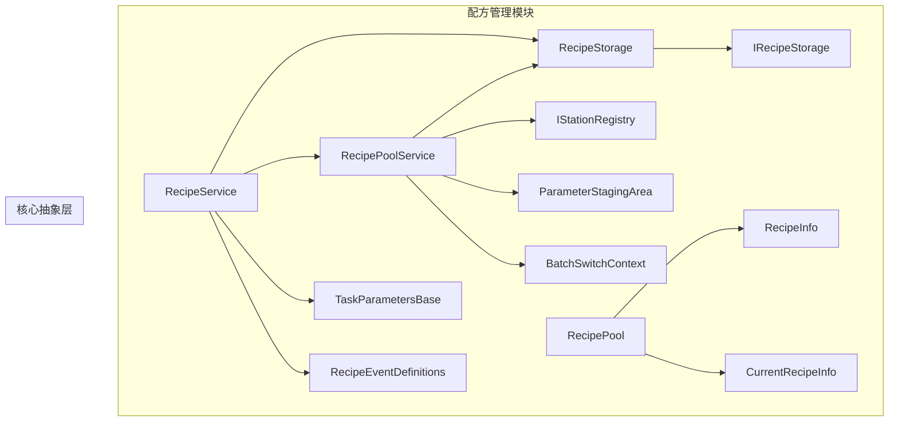
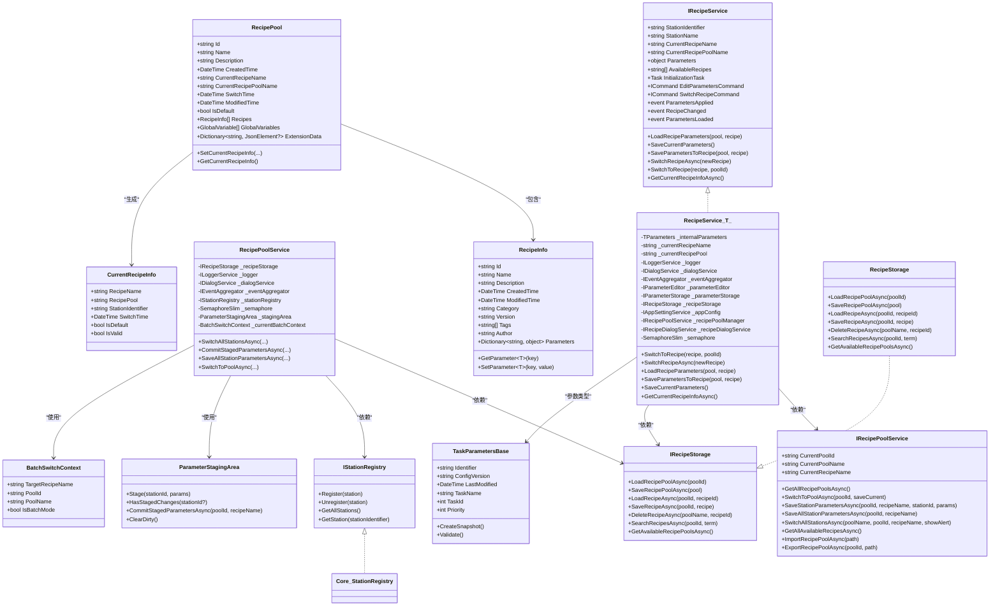
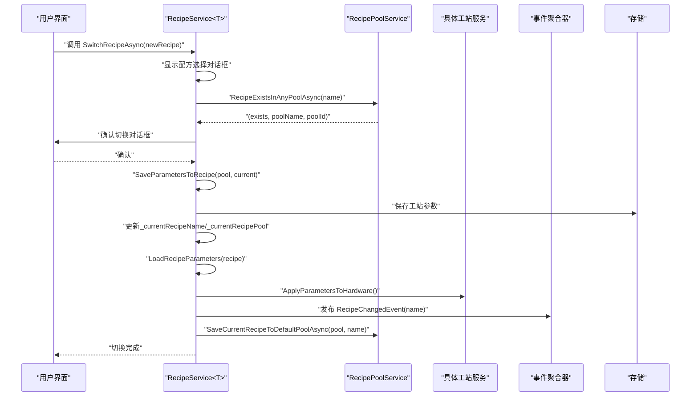
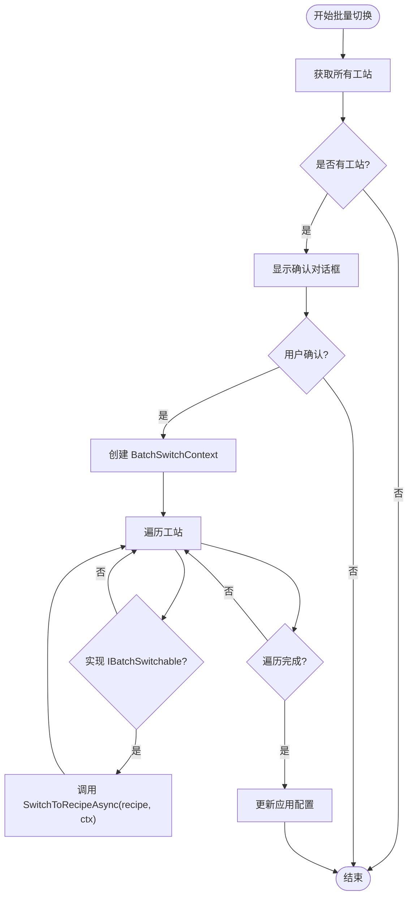
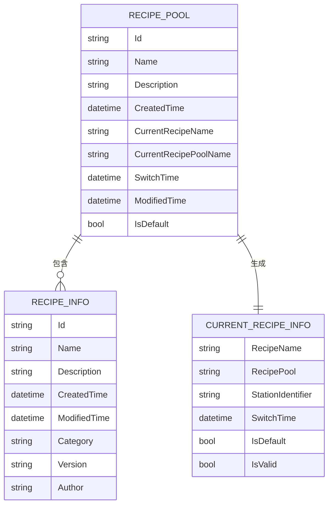
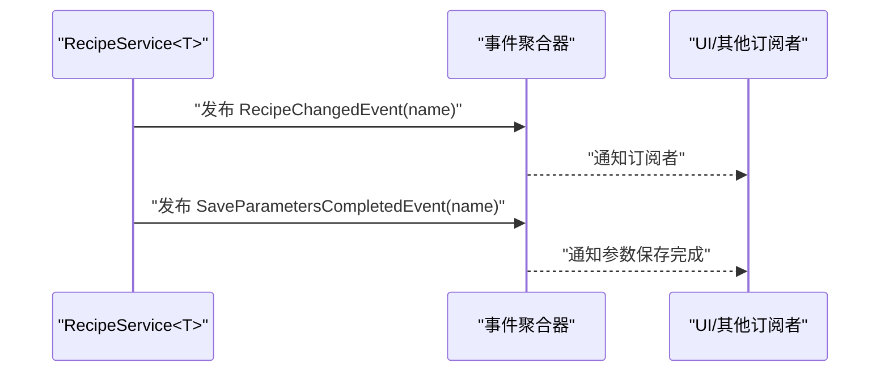
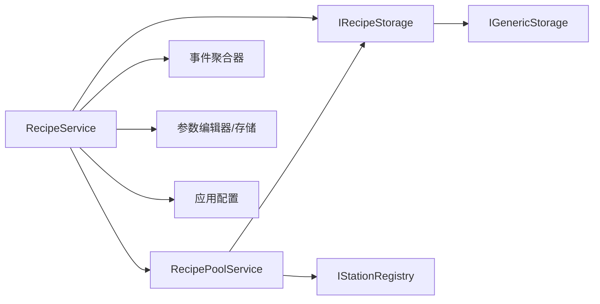

# 配方系统架构设计

<cite>
**本文引用的文件**
- [RecipeService.cs](file://RecipeManagement/Services/RecipeService.cs)
- [IRecipeService.cs](file://RecipeManagement/Interfaces/IRecipeService.cs)
- [RecipePoolService.cs](file://RecipeManagement/Services/RecipePoolService.cs)
- [IRecipePoolService.cs](file://RecipeManagement/Interfaces/IRecipePoolService.cs)
- [RecipeInfo.cs](file://RecipeManagement/Models/RecipeInfo.cs)
- [CurrentRecipeInfo.cs](file://RecipeManagement/Models/CurrentRecipeInfo.cs)
- [RecipePool.cs](file://RecipeManagement/Models/RecipePool.cs)
- [ParameterStagingArea.cs](file://RecipeManagement/Models/ParameterStagingArea.cs)
- [BatchSwitchContext.cs](file://RecipeManagement/Models/BatchSwitchContext.cs)
- [IRecipeStorage.cs](file://RecipeManagement/Interfaces/IRecipeStorage.cs)
- [RecipeStorage.cs](file://RecipeManagement/Services/RecipeStorage.cs)
- [TaskParametersBase.cs](file://Core/Abstraction/Parameters/TaskParametersBase.cs)
- [IStationRegistry.cs](file://Core/Abstraction/IStationRegistry.cs)
- [RecipeEventDefinitions.cs](file://RecipeManagement/Events/RecipeEventDefinitions.cs)
- [RecipeManagementPlugin.cs](file://RecipeManagement/Plugin/RecipeManagementPlugin.cs)
</cite>

## 目录
1. [引言](#引言)
2. [项目结构](#项目结构)
3. [核心组件](#核心组件)
4. [架构总览](#架构总览)
5. [详细组件分析](#详细组件分析)
6. [依赖关系分析](#依赖关系分析)
7. [性能考虑](#性能考虑)
8. [故障排查指南](#故障排查指南)
9. [结论](#结论)
10. [附录](#附录)

## 引言
本文件面向配方系统的架构设计与实现，重点解析 RecipeService 的泛型参数系统、工站标识符管理、配方池机制与事件驱动的配方切换流程。文档同时阐述 RecipeInfo、CurrentRecipeInfo 等数据模型的设计思路，配方系统与工站注册表的集成方式，参数存储的分层架构，以及多工站协同作业、参数继承与覆盖规则、并发访问控制策略，并提供架构图与组件交互流程，帮助开发者快速理解并扩展配方系统。

## 项目结构
配方系统位于 RecipeManagement 模块，围绕“配方池-配方-参数”三层结构组织，结合 Core 抽象层提供的参数基类、存储抽象与工站注册表，形成可扩展、可并发、可事件驱动的配方管理能力。

**图表来源**
- [RecipeService.cs:1-723](file://RecipeManagement/Services/RecipeService.cs#L1-L723)
- [RecipePoolService.cs:1-580](file://RecipeManagement/Services/RecipePoolService.cs#L1-L580)
- [RecipeInfo.cs:1-73](file://RecipeManagement/Models/RecipeInfo.cs#L1-L73)
- [CurrentRecipeInfo.cs:1-23](file://RecipeManagement/Models/CurrentRecipeInfo.cs#L1-L23)
- [RecipePool.cs:1-180](file://RecipeManagement/Models/RecipePool.cs#L1-L180)
- [ParameterStagingArea.cs:1-78](file://RecipeManagement/Models/ParameterStagingArea.cs#L1-L78)
- [BatchSwitchContext.cs:1-18](file://RecipeManagement/Models/BatchSwitchContext.cs#L1-L18)
- [IRecipeStorage.cs:1-34](file://RecipeManagement/Interfaces/IRecipeStorage.cs#L1-L34)
- [RecipeStorage.cs:1-190](file://RecipeManagement/Services/RecipeStorage.cs#L1-L190)
- [TaskParametersBase.cs:1-144](file://Core/Abstraction/Parameters/TaskParametersBase.cs#L1-L144)
- [IStationRegistry.cs:1-21](file://Core/Abstraction/IStationRegistry.cs#L1-L21)
- [RecipeEventDefinitions.cs:1-25](file://RecipeManagement/Events/RecipeEventDefinitions.cs#L1-L25)

**章节来源**
- [RecipeService.cs:1-723](file://RecipeManagement/Services/RecipeService.cs#L1-L723)
- [RecipePoolService.cs:1-580](file://RecipeManagement/Services/RecipePoolService.cs#L1-L580)
- [RecipeInfo.cs:1-73](file://RecipeManagement/Models/RecipeInfo.cs#L1-L73)
- [CurrentRecipeInfo.cs:1-23](file://RecipeManagement/Models/CurrentRecipeInfo.cs#L1-L23)
- [RecipePool.cs:1-180](file://RecipeManagement/Models/RecipePool.cs#L1-L180)
- [ParameterStagingArea.cs:1-78](file://RecipeManagement/Models/ParameterStagingArea.cs#L1-L78)
- [BatchSwitchContext.cs:1-18](file://RecipeManagement/Models/BatchSwitchContext.cs#L1-L18)
- [IRecipeStorage.cs:1-34](file://RecipeManagement/Interfaces/IRecipeStorage.cs#L1-L34)
- [RecipeStorage.cs:1-190](file://RecipeManagement/Services/RecipeStorage.cs#L1-L190)
- [TaskParametersBase.cs:1-144](file://Core/Abstraction/Parameters/TaskParametersBase.cs#L1-L144)
- [IStationRegistry.cs:1-21](file://Core/Abstraction/IStationRegistry.cs#L1-L21)
- [RecipeEventDefinitions.cs:1-25](file://RecipeManagement/Events/RecipeEventDefinitions.cs#L1-L25)

## 核心组件
- 泛型参数系统：RecipeService<TParameters> 通过泛型约束 TaskParametersBase，确保参数具备统一的标识、版本、修改时间、快照与验证能力，便于跨工站一致化管理。
- 工站标识符管理：每个工站通过 StationIdentifier 唯一标识，参数按工站键值存储于 RecipeInfo 的 Parameters 字典中，实现“池-配方-工站参数”的层级映射。
- 配方池机制：RecipePool 维护当前配方、切换时间、是否默认等元数据；RecipePoolService 提供池级 CRUD、批量切换、参数暂存与提交、导入导出等能力。
- 事件驱动切换：通过 RecipeChangedEvent、SaveParametersCompletedEvent 等事件实现解耦，RecipeService 在切换完成后发布事件，订阅者可同步自身状态。
- 并发控制：RecipePoolService 使用 SemaphoreSlim 控制池级并发；RecipeService 内部使用 SemaphoreSlim 保证参数保存与切换的互斥。
- 存储分层：IRecipeStorage 抽象 + RecipeStorage 实现 + IGenericStorage 文件存储，支持配方池与配方的持久化与备份。

**章节来源**
- [IRecipeService.cs:1-69](file://RecipeManagement/Interfaces/IRecipeService.cs#L1-L69)
- [TaskParametersBase.cs:1-144](file://Core/Abstraction/Parameters/TaskParametersBase.cs#L1-L144)
- [RecipeInfo.cs:1-73](file://RecipeManagement/Models/RecipeInfo.cs#L1-L73)
- [RecipePool.cs:1-180](file://RecipeManagement/Models/RecipePool.cs#L1-L180)
- [RecipePoolService.cs:1-580](file://RecipeManagement/Services/RecipePoolService.cs#L1-L580)
- [RecipeEventDefinitions.cs:1-25](file://RecipeManagement/Events/RecipeEventDefinitions.cs#L1-L25)

## 架构总览
配方系统采用“服务-模型-存储-事件”的分层架构，RecipeService 负责单工站参数加载/保存/切换，RecipePoolService 负责多工站批量切换与参数暂存提交，RecipeStorage 负责持久化，IStationRegistry 提供工站发现与批量调度。

**图表来源**
- [IRecipeService.cs:1-69](file://RecipeManagement/Interfaces/IRecipeService.cs#L1-L69)
- [RecipeService.cs:1-723](file://RecipeManagement/Services/RecipeService.cs#L1-L723)
- [IRecipePoolService.cs:1-45](file://RecipeManagement/Interfaces/IRecipePoolService.cs#L1-L45)
- [RecipePoolService.cs:1-580](file://RecipeManagement/Services/RecipePoolService.cs#L1-L580)
- [RecipePool.cs:1-180](file://RecipeManagement/Models/RecipePool.cs#L1-L180)
- [RecipeInfo.cs:1-73](file://RecipeManagement/Models/RecipeInfo.cs#L1-L73)
- [CurrentRecipeInfo.cs:1-23](file://RecipeManagement/Models/CurrentRecipeInfo.cs#L1-L23)
- [ParameterStagingArea.cs:1-78](file://RecipeManagement/Models/ParameterStagingArea.cs#L1-L78)
- [BatchSwitchContext.cs:1-18](file://RecipeManagement/Models/BatchSwitchContext.cs#L1-L18)
- [IRecipeStorage.cs:1-34](file://RecipeManagement/Interfaces/IRecipeStorage.cs#L1-L34)
- [RecipeStorage.cs:1-190](file://RecipeManagement/Services/RecipeStorage.cs#L1-L190)
- [IStationRegistry.cs:1-21](file://Core/Abstraction/IStationRegistry.cs#L1-L21)
- [TaskParametersBase.cs:1-144](file://Core/Abstraction/Parameters/TaskParametersBase.cs#L1-L144)

## 详细组件分析

### RecipeService<TParameters>：泛型参数系统与工站标识符管理
- 泛型约束：通过 where TParameters : TaskParametersBase, new()，确保参数具备统一的标识、版本、修改时间、快照与验证能力，便于跨工站一致化管理。
- 工站标识符：通过 StationIdentifier 与 Parameters 字典键关联，实现“池-配方-工站参数”的层级映射；加载参数时优先从 RecipeInfo 中按工站键提取，失败则回退到本地文件。
- 参数生命周期：编辑参数 -> 保存到配方系统与本地 -> 触发 ParametersApplied 事件 -> 更新当前配方池记录 -> 发布 RecipeChangedEvent。
- 并发控制：内部使用 SemaphoreSlim 保证 SaveParametersToRecipe 与 SwitchToRecipe 的互斥执行，避免竞态条件。

**图表来源**
- [RecipeService.cs:543-634](file://RecipeManagement/Services/RecipeService.cs#L543-L634)
- [RecipePoolService.cs:292-304](file://RecipeManagement/Services/RecipePoolService.cs#L292-L304)
- [RecipeEventDefinitions.cs:5-10](file://RecipeManagement/Events/RecipeEventDefinitions.cs#L5-L10)

**章节来源**
- [RecipeService.cs:22-109](file://RecipeManagement/Services/RecipeService.cs#L22-L109)
- [RecipeService.cs:160-256](file://RecipeManagement/Services/RecipeService.cs#L160-L256)
- [RecipeService.cs:396-445](file://RecipeManagement/Services/RecipeService.cs#L396-L445)
- [RecipeService.cs:543-634](file://RecipeManagement/Services/RecipeService.cs#L543-L634)

### RecipePoolService：配方池机制与多工站协同
- 参数暂存与提交：ParameterStagingArea 支持按工站暂存参数，批量提交时通过 RecipePoolSaveContext 将脏参数一次性写入配方池，降低频繁 I/O。
- 批量切换：SwitchAllStationsAsync 遍历 IStationRegistry 注册的所有工站，若实现 IBatchSwitchable，则逐个调用其 SwitchToRecipeAsync，实现多工站协同作业。
- 并发与一致性：使用 SemaphoreSlim 保护池级操作；提交阶段通过上下文封装，确保原子性。
- 导入导出：支持配方池的导入导出，便于迁移与备份。

**图表来源**
- [RecipePoolService.cs:198-237](file://RecipeManagement/Services/RecipePoolService.cs#L198-L237)
- [IStationRegistry.cs:15-20](file://Core/Abstraction/IStationRegistry.cs#L15-L20)
- [BatchSwitchContext.cs:1-18](file://RecipeManagement/Models/BatchSwitchContext.cs#L1-L18)

**章节来源**
- [RecipePoolService.cs:132-182](file://RecipeManagement/Services/RecipePoolService.cs#L132-L182)
- [RecipePoolService.cs:198-237](file://RecipeManagement/Services/RecipePoolService.cs#L198-L237)
- [ParameterStagingArea.cs:1-78](file://RecipeManagement/Models/ParameterStagingArea.cs#L1-L78)

### 数据模型：RecipeInfo、CurrentRecipeInfo、RecipePool
- RecipeInfo：包含配方元数据与 Parameters 字典，支持按工站键序列化/反序列化参数；提供 GetParameter/SetParameter 方法。
- CurrentRecipeInfo：描述当前工站的配方状态（名称、池、时间、有效性等），用于 UI 展示与默认池记录。
- RecipePool：维护当前配方、是否默认、扩展数据与全局变量，提供 SetCurrentRecipeInfo/GetCurrentRecipeInfo 辅助方法。

**图表来源**
- [RecipePool.cs:12-179](file://RecipeManagement/Models/RecipePool.cs#L12-L179)
- [RecipeInfo.cs:8-71](file://RecipeManagement/Models/RecipeInfo.cs#L8-L71)
- [CurrentRecipeInfo.cs:9-22](file://RecipeManagement/Models/CurrentRecipeInfo.cs#L9-L22)

**章节来源**
- [RecipeInfo.cs:1-73](file://RecipeManagement/Models/RecipeInfo.cs#L1-L73)
- [CurrentRecipeInfo.cs:1-23](file://RecipeManagement/Models/CurrentRecipeInfo.cs#L1-L23)
- [RecipePool.cs:1-180](file://RecipeManagement/Models/RecipePool.cs#L1-L180)

### 参数存储分层与事件驱动
- 存储接口：IRecipeStorage 定义配方池与配方的 CRUD、搜索、分类与批量操作。
- 存储实现：RecipeStorage 基于 IGenericStorage，提供文件备份、池列表枚举、配方搜索与分类统计。
- 事件驱动：RecipeChangedEvent、SaveParametersCompletedEvent 等事件用于解耦 UI 与业务逻辑，订阅者可在事件发生后刷新状态或持久化。

**图表来源**
- [RecipeEventDefinitions.cs:5-10](file://RecipeManagement/Events/RecipeEventDefinitions.cs#L5-L10)
- [RecipeService.cs:615-619](file://RecipeManagement/Services/RecipeService.cs#L615-L619)

**章节来源**
- [IRecipeStorage.cs:1-34](file://RecipeManagement/Interfaces/IRecipeStorage.cs#L1-L34)
- [RecipeStorage.cs:1-190](file://RecipeManagement/Services/RecipeStorage.cs#L1-L190)
- [RecipeEventDefinitions.cs:1-25](file://RecipeManagement/Events/RecipeEventDefinitions.cs#L1-L25)

## 依赖关系分析
- RecipeService 依赖 RecipePoolService、IRecipeStorage、IEventAggregator、IParameterEditor、IParameterStorage、IAppSettingService、IRecipeDialogService。
- RecipePoolService 依赖 IRecipeStorage、IStationRegistry、IEventAggregator、IAppSettingService、IRecipeDialogService。
- RecipeStorage 实现 IRecipeStorage，基于 IGenericStorage 进行文件持久化。
- TaskParametersBase 为所有参数类型的基类，提供快照与验证能力。

**图表来源**
- [RecipeService.cs:81-109](file://RecipeManagement/Services/RecipeService.cs#L81-L109)
- [RecipePoolService.cs:76-92](file://RecipeManagement/Services/RecipePoolService.cs#L76-L92)
- [RecipeStorage.cs:11-36](file://RecipeManagement/Services/RecipeStorage.cs#L11-L36)

**章节来源**
- [RecipeService.cs:81-109](file://RecipeManagement/Services/RecipeService.cs#L81-L109)
- [RecipePoolService.cs:76-92](file://RecipeManagement/Services/RecipePoolService.cs#L76-L92)
- [RecipeStorage.cs:11-36](file://RecipeManagement/Services/RecipeStorage.cs#L11-L36)

## 性能考虑
- 并发控制：RecipePoolService 与 RecipeService 内部均使用 SemaphoreSlim，避免高并发场景下的竞态与重复 I/O。
- 参数暂存：ParameterStagingArea 将多次参数变更合并为一次提交，减少存储写入次数。
- 异步加载：大量 I/O 操作采用 async/await，避免阻塞 UI 线程。
- 备份策略：保存配方池与参数文件前进行备份，降低数据丢失风险。

[本节为通用指导，不直接分析具体文件]

## 故障排查指南
- 参数加载失败：检查 RecipeService.LoadRecipeParameters 是否命中 RecipeInfo 中的工站参数；若未命中，回退到本地文件加载，确认文件路径与命名规范。
- 切换失败：查看 RecipeService.SwitchToRecipe 的异常日志，确认当前配方保存、参数应用、事件发布与默认池记录是否成功。
- 批量切换无效：确认 IStationRegistry 是否正确注册所有工站，且各工站实现了 IBatchSwitchable 接口。
- 存储异常：检查 RecipeStorage 的文件备份与枚举逻辑，确认 IGenericStorage 的可用性与权限。

**章节来源**
- [RecipeService.cs:218-256](file://RecipeManagement/Services/RecipeService.cs#L218-L256)
- [RecipeService.cs:596-634](file://RecipeManagement/Services/RecipeService.cs#L596-L634)
- [RecipePoolService.cs:198-237](file://RecipeManagement/Services/RecipePoolService.cs#L198-L237)
- [RecipeStorage.cs:163-188](file://RecipeManagement/Services/RecipeStorage.cs#L163-L188)

## 结论
配方系统通过泛型参数基类、工站标识符映射、配方池与参数暂存提交机制，实现了参数的统一管理与多工站协同切换。结合事件驱动与并发控制，系统在保证一致性的同时提升了可扩展性与可维护性。建议在扩展新工站时遵循 TaskParametersBase 的快照与验证机制，并通过 IStationRegistry 注册，以获得批量切换与参数暂存能力。

[本节为总结性内容，不直接分析具体文件]

## 附录
- 插件注册：RecipeManagementPlugin 将存储、领域与应用服务注册到 DI 容器，便于模块化加载与测试。
- 参数继承与覆盖：RecipeInfo 的 Parameters 字典按工站键存储，加载时优先取工站参数，未命中再回退到默认参数，实现“工站覆盖全局”的继承规则。
- 并发访问控制：RecipePoolService 与 RecipeService 内部使用 SemaphoreSlim，确保 SaveParametersToRecipe 与 SwitchToRecipe 的互斥执行。

**章节来源**
- [RecipeManagementPlugin.cs:17-36](file://RecipeManagement/Plugin/RecipeManagementPlugin.cs#L17-L36)
- [RecipeService.cs:321-337](file://RecipeManagement/Services/RecipeService.cs#L321-L337)
- [RecipePoolService.cs:150-177](file://RecipeManagement/Services/RecipePoolService.cs#L150-L177)