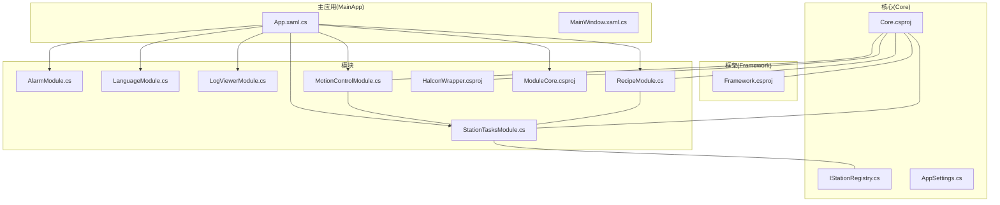
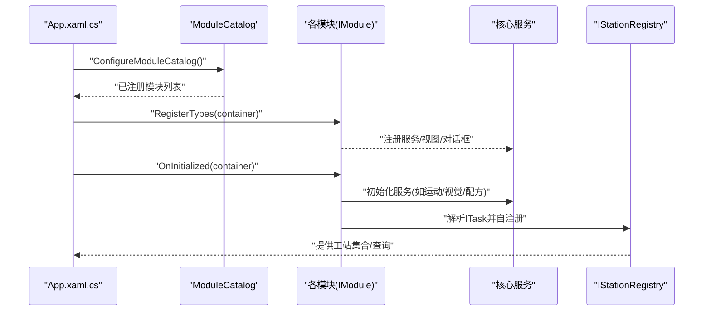
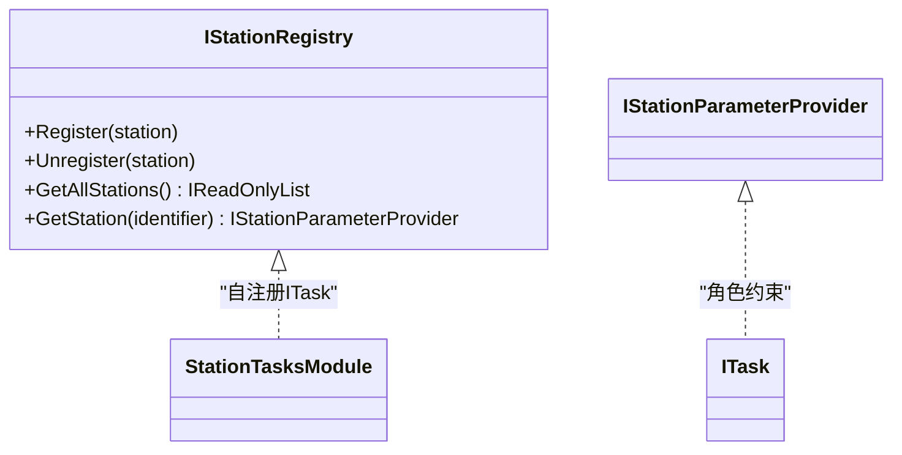
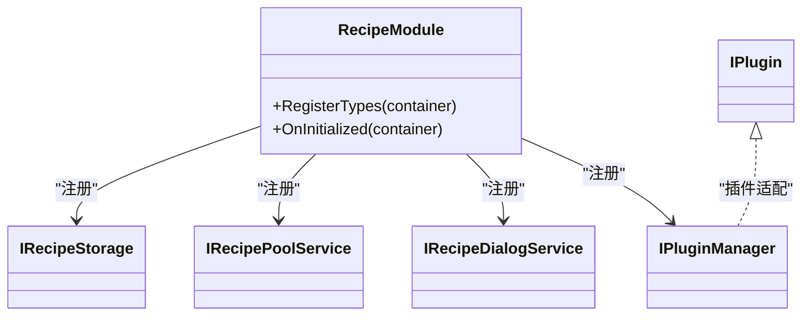
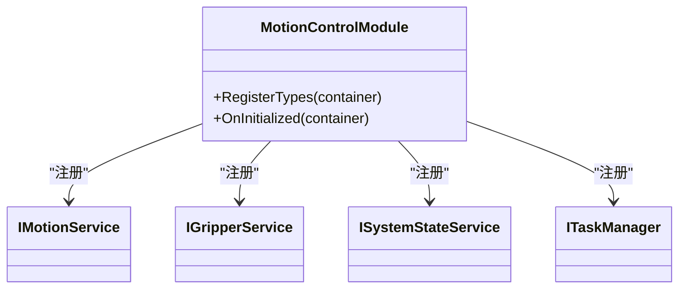
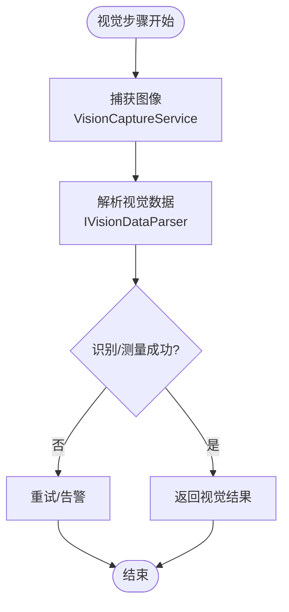
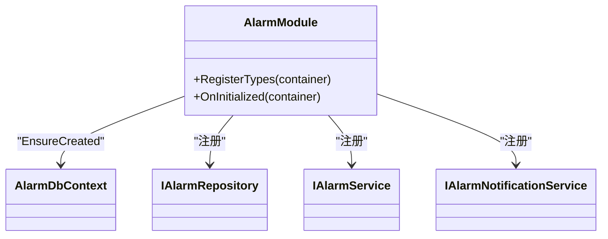
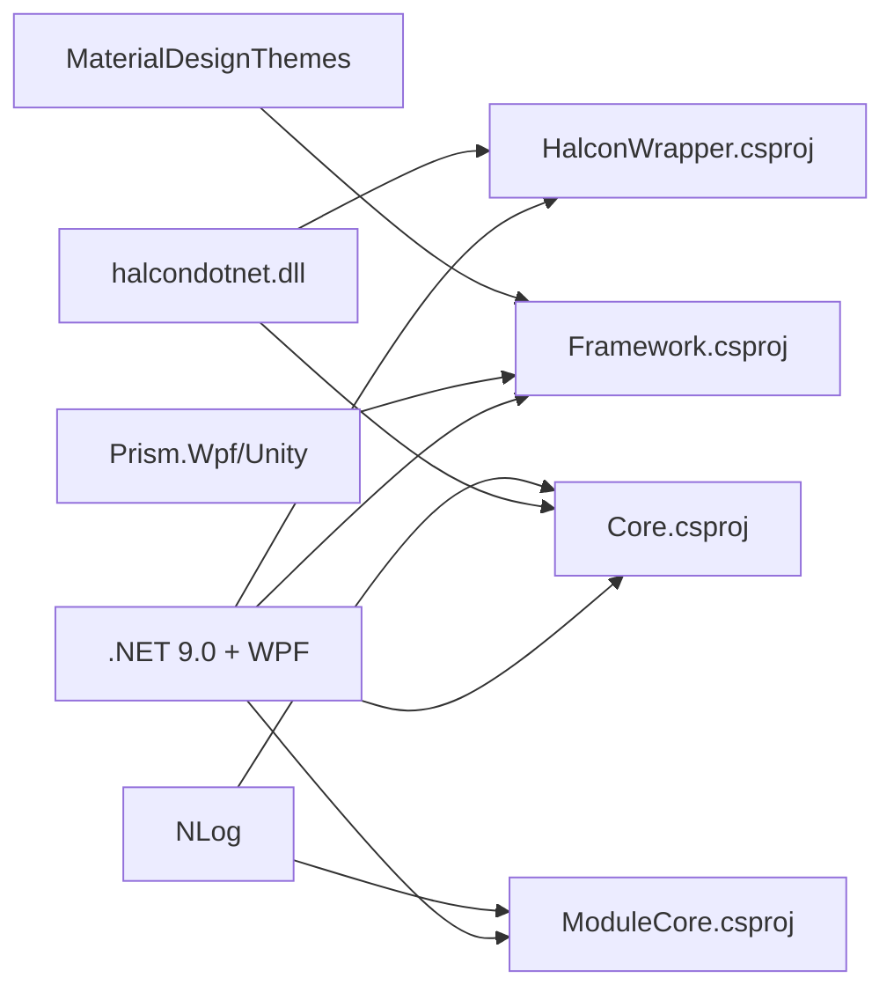

# 项目概述

<cite>
**本文引用的文件**
- [README.md](file://README.md)
- [MainApp/App.xaml.cs](file://MainApp/App.xaml.cs)
- [MainApp/Views/MainWindow.xaml.cs](file://MainApp/Views/MainWindow.xaml.cs)
- [Core/Core.csproj](file://Core/Core.csproj)
- [Framework/Framework.csproj](file://Framework/Framework.csproj)
- [Core/Abstraction/IStationRegistry.cs](file://Core/Abstraction/IStationRegistry.cs)
- [MotionControl/MotionControlModule.cs](file://MotionControl/MotionControlModule.cs)
- [RecipeManagement/RecipeModule.cs](file://RecipeManagement/RecipeModule.cs)
- [StationTasks/StationTasksModule.cs](file://StationTasks/StationTasksModule.cs)
- [HalconWrapper/HalconWrapper.csproj](file://HalconWrapper/HalconWrapper.csproj)
- [Core/Configuration/AppSettings.cs](file://Core/Configuration/AppSettings.cs)
- [ModuleCore/ModuleCore.csproj](file://ModuleCore/ModuleCore.csproj)
- [AlarmModule/AlarmModule.cs](file://AlarmModule/AlarmModule.cs)
- [LogViewer/LogViewerModule.cs](file://LogViewer/LogViewerModule.cs)
- [LanguageModule/LanguageModule.cs](file://LanguageModule/LanguageModule.cs)
</cite>

## 目录
1. [简介](#简介)
2. [项目结构](#项目结构)
3. [核心组件](#核心组件)
4. [架构总览](#架构总览)
5. [详细组件分析](#详细组件分析)
6. [依赖关系分析](#依赖关系分析)
7. [性能考虑](#性能考虑)
8. [故障排查指南](#故障排查指南)
9. [结论](#结论)
10. [附录](#附录)

## 简介
GZQL_MACHINE 是一个面向工业自动化控制的模块化桌面应用系统，采用 WPF + .NET 9.0 技术栈，结合 Prism 框架实现松耦合模块化设计，并通过 Material Design 提升用户界面体验。系统围绕“多工站协同作业”、“配方管理”、“视觉检测”等核心能力构建，支持运动控制、报警管理、日志与语言国际化等基础设施模块，满足从参数配置、路径规划、视觉识别到执行控制的完整闭环。

项目目标与定位：
- 构建模块化工业自动化控制系统，支持多工站协同与流程编排；
- 提供配方驱动的参数化执行体系，便于不同产品族切换；
- 集成视觉检测能力，支撑定位、识别与质量判定；
- 通过 Prism 模块化与事件总线实现高内聚低耦合的系统扩展；
- 以 Material Design 与多语言支持提升人机交互体验。

技术选型背景（.NET 9.0 + WPF + Prism + Material Design + Halcon）：
- .NET 9.0：提供稳定的跨平台桌面开发能力与高性能运行时；
- WPF：成熟的桌面 UI 框架，适合复杂工业界面与实时数据展示；
- Prism：模块化、MVVM、事件聚合与依赖注入，降低模块间耦合；
- Material Design：统一的视觉语言与交互规范，提升可用性；
- Halcon：工业视觉算法库，提供稳健的图像处理与测量能力。

章节来源
- [README.md:1-66](file://README.md#L1-L66)

## 项目结构
项目采用“核心层 + 模块层”的分层组织方式：
- 核心层（Core）：抽象接口、通用模型、服务与工具，为上层模块提供基础能力；
- 模块层（各功能域模块）：Alarm、Language、LogViewer、MotionControl、RecipeManagement、StationTasks、HalconWrapper 等；
- 框架层（Framework）：通用 UI 组件、对话框、转换器、主题与 MVVM 基座；
- 主应用（MainApp）：应用入口、模块装配与全局异常处理；
- 模块核心（ModuleCore）：导航、主窗口与部分通用控件。

图表来源
- [MainApp/App.xaml.cs:179-191](file://MainApp/App.xaml.cs#L179-L191)
- [Core/Core.csproj:11-41](file://Core/Core.csproj#L11-L41)
- [Framework/Framework.csproj:12-29](file://Framework/Framework.csproj#L12-L29)
- [AlarmModule/AlarmModule.cs:16-58](file://AlarmModule/AlarmModule.cs#L16-L58)
- [LanguageModule/LanguageModule.cs:12-25](file://LanguageModule/LanguageModule.cs#L12-L25)
- [LogViewer/LogViewerModule.cs:8-30](file://LogViewer/LogViewerModule.cs#L8-L30)
- [MotionControl/MotionControlModule.cs:15-77](file://MotionControl/MotionControlModule.cs#L15-L77)
- [RecipeManagement/RecipeModule.cs:22-49](file://RecipeManagement/RecipeModule.cs#L22-L49)
- [StationTasks/StationTasksModule.cs:16-64](file://StationTasks/StationTasksModule.cs#L16-L64)
- [HalconWrapper/HalconWrapper.csproj:1-28](file://HalconWrapper/HalconWrapper.csproj#L1-L28)
- [ModuleCore/ModuleCore.csproj:1-83](file://ModuleCore/ModuleCore.csproj#L1-L83)

章节来源
- [MainApp/App.xaml.cs:179-191](file://MainApp/App.xaml.cs#L179-L191)
- [Core/Core.csproj:11-41](file://Core/Core.csproj#L11-L41)
- [Framework/Framework.csproj:12-29](file://Framework/Framework.csproj#L12-L29)
- [ModuleCore/ModuleCore.csproj:1-83](file://ModuleCore/ModuleCore.csproj#L1-L83)

## 核心组件
- 工站注册中心（IStationRegistry）：统一登记与发现各工站，解决模块加载顺序导致的空集合注入问题，支撑多工站协同与参数提供。
- 配方管理模块（RecipeModule）：提供配方存储、池化、对话框与插件化扩展，支持多工站位置编辑与批量切换。
- 运动控制模块（MotionControlModule）：封装运动卡、轴控制、夹爪、系统状态与速度控制，提供轮询与故障恢复机制。
- 视觉处理模块（HalconWrapper + StationTasks 视觉解析）：集成 Halcon 图像处理与 ROI/标定工具，配合 StationTasks 的视觉步骤执行。
- 报警模块（AlarmModule）：基于 SQLite 的本地报警数据库，覆盖报警全生命周期管理。
- 日志与语言模块（LogViewer、LanguageModule）：提供日志浏览与多语言切换能力。
- 框架与主应用（Framework、MainApp）：统一 UI 主题与对话框、全局异常处理、模块装配与配置加载。

章节来源
- [Core/Abstraction/IStationRegistry.cs:1-21](file://Core/Abstraction/IStationRegistry.cs#L1-L21)
- [RecipeManagement/RecipeModule.cs:22-49](file://RecipeManagement/RecipeModule.cs#L22-L49)
- [MotionControl/MotionControlModule.cs:15-77](file://MotionControl/MotionControlModule.cs#L15-L77)
- [HalconWrapper/HalconWrapper.csproj:1-28](file://HalconWrapper/HalconWrapper.csproj#L1-L28)
- [AlarmModule/AlarmModule.cs:16-58](file://AlarmModule/AlarmModule.cs#L16-L58)
- [LogViewer/LogViewerModule.cs:8-30](file://LogViewer/LogViewerModule.cs#L8-L30)
- [LanguageModule/LanguageModule.cs:12-25](file://LanguageModule/LanguageModule.cs#L12-L25)

## 架构总览
系统采用 Prism 模块化架构，主应用负责模块装配与全局服务注册；核心层提供抽象与通用能力；各功能模块通过 Prism 的 IModule 接口进行注册与初始化；StationTasks 模块在初始化阶段强制解析工站任务，触发自注册到 IStationRegistry，从而实现多工站协同与参数提供。

图表来源
- [MainApp/App.xaml.cs:179-191](file://MainApp/App.xaml.cs#L179-L191)
- [StationTasks/StationTasksModule.cs:56-62](file://StationTasks/StationTasksModule.cs#L56-L62)
- [Core/Abstraction/IStationRegistry.cs:7-20](file://Core/Abstraction/IStationRegistry.cs#L7-L20)

章节来源
- [MainApp/App.xaml.cs:179-191](file://MainApp/App.xaml.cs#L179-L191)
- [StationTasks/StationTasksModule.cs:56-62](file://StationTasks/StationTasksModule.cs#L56-L62)
- [Core/Abstraction/IStationRegistry.cs:7-20](file://Core/Abstraction/IStationRegistry.cs#L7-L20)

## 详细组件分析

### 工站注册中心（IStationRegistry）
- 职责：统一注册/注销工站，提供按标识查询与全量枚举；
- 设计要点：避免模块加载时序导致的注入空集合问题，保障消费者按需查询；
- 与 StationTasks 协同：StationTasksModule 在初始化时解析 ITask 并触发自注册，形成多工站协同执行的基础。

图表来源
- [Core/Abstraction/IStationRegistry.cs:7-20](file://Core/Abstraction/IStationRegistry.cs#L7-L20)
- [StationTasks/StationTasksModule.cs:56-62](file://StationTasks/StationTasksModule.cs#L56-L62)

章节来源
- [Core/Abstraction/IStationRegistry.cs:1-21](file://Core/Abstraction/IStationRegistry.cs#L1-L21)
- [StationTasks/StationTasksModule.cs:56-62](file://StationTasks/StationTasksModule.cs#L56-L62)

### 配方管理模块（RecipeModule）
- 能力：配方存储、配方池、对话框、插件化扩展；
- 关键点：注册 IRecipeStorage、IRecipePoolService、IRecipeDialogService，提供配方编辑与多工站位置编辑视图；
- 与 StationTasks 协同：通过 IRecipeServiceFactory 与 RecipePositionProvider 提供配方参数与位置数据。

图表来源
- [RecipeManagement/RecipeModule.cs:22-49](file://RecipeManagement/RecipeModule.cs#L22-L49)

章节来源
- [RecipeManagement/RecipeModule.cs:22-49](file://RecipeManagement/RecipeModule.cs#L22-L49)

### 运动控制模块（MotionControlModule）
- 能力：运动服务初始化与轮询、夹爪服务、系统状态监控、速度控制、IO 显示与轴设置；
- 关键点：IMotionService、IGripperService、ISystemStateService、ITaskManager 等服务注册与导航视图注册；
- 容错：初始化失败仅记录错误，不影响整体运行。

图表来源
- [MotionControl/MotionControlModule.cs:15-77](file://MotionControl/MotionControlModule.cs#L15-L77)

章节来源
- [MotionControl/MotionControlModule.cs:15-77](file://MotionControl/MotionControlModule.cs#L15-L77)

### 视觉处理与检测（HalconWrapper + StationTasks 视觉解析）
- 能力：Halcon 封装库提供 ROI、图形绘制与图像显示；StationTasks 提供视觉数据解析器与捕获服务；
- 关键点：IVisionDataParser、DefaultVisionDataParser、VisionCaptureService、RecipeServiceFactory；
- 场景：视觉定位、特征匹配、尺寸测量与结果回传。

图表来源
- [StationTasks/StationTasksModule.cs:40-49](file://StationTasks/StationTasksModule.cs#L40-L49)

章节来源
- [HalconWrapper/HalconWrapper.csproj:1-28](file://HalconWrapper/HalconWrapper.csproj#L1-L28)
- [StationTasks/StationTasksModule.cs:40-49](file://StationTasks/StationTasksModule.cs#L40-L49)

### 报警管理模块（AlarmModule）
- 能力：SQLite 本地数据库持久化报警记录，支持报警触发、确认、复位、统计与阈值配置；
- 关键点：AlarmDbContextOptions 注册为单例，AlarmRepository 为单例但每次操作创建新 DbContext 实例，避免并发与释放问题。

图表来源
- [AlarmModule/AlarmModule.cs:21-58](file://AlarmModule/AlarmModule.cs#L21-L58)

章节来源
- [AlarmModule/AlarmModule.cs:21-58](file://AlarmModule/AlarmModule.cs#L21-L58)

### 日志与语言模块
- 日志查看器：注册日志浏览视图，便于运行时诊断；
- 语言模块：注册语言选择器视图，支持多语言资源切换。

章节来源
- [LogViewer/LogViewerModule.cs:8-30](file://LogViewer/LogViewerModule.cs#L8-L30)
- [LanguageModule/LanguageModule.cs:12-25](file://LanguageModule/LanguageModule.cs#L12-L25)

## 依赖关系分析
- TargetFramework 与 WPF：Core、Framework、ModuleCore、HalconWrapper 均设置为 net9.0-windows7.0，并启用 UseWPF；
- Prism 与 Material Design：Framework 引入 Prism.Wpf、Prism.Unity 与 MaterialDesignThemes，统一 DI 与 UI 主题；
- Halcon 依赖：Core 与 HalconWrapper 引用 halcondotnet.dll，确保图像处理能力；
- NLog：Core 与 ModuleCore 引入 NLog，统一日志基础设施；
- 项目引用：Core 与 Framework 作为模块的基础依赖，ModuleCore 继承引用多个模块。

图表来源
- [Core/Core.csproj:4,12-41](file://Core/Core.csproj#L4,L12-L41)
- [Framework/Framework.csproj:5,13-21](file://Framework/Framework.csproj#L5,L13-L21)
- [HalconWrapper/HalconWrapper.csproj:5,20-23](file://HalconWrapper/HalconWrapper.csproj#L5,L20-L23)
- [ModuleCore/ModuleCore.csproj:3,26,33](file://ModuleCore/ModuleCore.csproj#L3,L26,L33)

章节来源
- [Core/Core.csproj:4,12-41](file://Core/Core.csproj#L4,L12-L41)
- [Framework/Framework.csproj:5,13-21](file://Framework/Framework.csproj#L5,L13-L21)
- [HalconWrapper/HalconWrapper.csproj:5,20-23](file://HalconWrapper/HalconWrapper.csproj#L5,L20-L23)
- [ModuleCore/ModuleCore.csproj:3,26,33](file://ModuleCore/ModuleCore.csproj#L3,L26,L33)

## 性能考虑
- 模块初始化策略：各模块在 OnInitialized 中进行轻量初始化，失败不阻断主流程，保证系统可用性；
- 运动轮询频率：运动模块以固定周期轮询，兼顾实时性与 CPU 开销；
- 视觉解析：通过 IVisionDataParser 与 VisionCaptureService 解耦图像采集与处理，减少主线程压力；
- 配置与日志：AppSettings 提供日志保留策略与硬件配置路径，建议按生产环境调整以平衡磁盘占用与诊断需求；
- UI 响应：Material Design 与 Prism 的 MVVM 分离有助于保持 UI 流畅。

## 故障排查指南
- 全局异常处理：App.xaml.cs 中注册 Dispatcher、AppDomain、TaskScheduler 三类异常捕获，生成崩溃转储与错误报告，便于定位问题；
- 运动模块初始化失败：检查硬件配置与驱动，确认 IMotionService 初始化是否抛出异常；
- 视觉模块初始化失败：确认 Halcon 运行时与 halcondotnet.dll 是否正确部署；
- 配方加载失败：检查 IRecipeStorage 与文件路径权限，确认配方文件格式与扩展；
- 报警数据库：确认 SQLite 文件路径与权限，必要时重建数据库或迁移数据。

章节来源
- [MainApp/App.xaml.cs:210-455](file://MainApp/App.xaml.cs#L210-L455)
- [MotionControl/MotionControlModule.cs:23-46](file://MotionControl/MotionControlModule.cs#L23-L46)
- [HalconWrapper/HalconWrapper.csproj:20-23](file://HalconWrapper/HalconWrapper.csproj#L20-L23)
- [RecipeManagement/RecipeModule.cs:32-35](file://RecipeManagement/RecipeModule.cs#L32-L35)
- [AlarmModule/AlarmModule.cs:51-56](file://AlarmModule/AlarmModule.cs#L51-L56)

## 结论
GZQL_MACHINE 以 Prism 模块化为核心，结合 .NET 9.0 与 WPF，构建了具备多工站协同、配方驱动与视觉检测能力的工业自动化控制平台。通过 IStationRegistry 实现工站注册与发现，借助 RecipeModule 与 StationTasks 形成参数化执行闭环，配合 MotionControl、HalconWrapper、AlarmModule 等模块，形成稳定、可扩展且易于维护的系统架构。对初学者而言，可从 MainApp 的模块装配与 Core 的抽象接口入手；对有经验的开发者，可深入模块间的事件与服务契约，进一步优化性能与可靠性。

## 附录
- 配置示例：AppSettings 提供语言、主题、日志保留、硬件配置路径等关键参数，建议在部署前按实际环境调整；
- 模块装配：MainApp 中的 ConfigureModuleCatalog 列表定义了系统加载的模块顺序与范围；
- UI 主题：Framework 引入 Material Design，统一风格与交互体验。

章节来源
- [Core/Configuration/AppSettings.cs:10-39](file://Core/Configuration/AppSettings.cs#L10-L39)
- [MainApp/App.xaml.cs:179-191](file://MainApp/App.xaml.cs#L179-L191)
- [Framework/Framework.csproj:14,16](file://Framework/Framework.csproj#L14,L16)