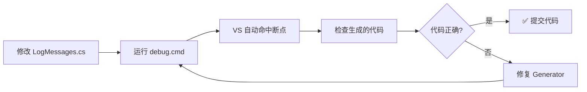

# Roslyn Source Generator 调试指南（无管理员权限）

## 📋 前提条件
- 已安装 Visual Studio 2022 (无需管理员权限安装的版本)
- .NET 9.0 SDK 已安装

## 🚀 方法 1：命令行编译 + VS 附加进程（推荐）

### Step 1: 创建调试启动配置

在 LogGenerator 项目中创建 `debug.cmd`:

```batch
@echo off
echo ============================================
echo   Roslyn Source Generator Debug Mode
echo ============================================
echo.

:: 清理旧的构建输出
dotnet clean ..\GZQL_MACHINE.sln --configuration Debug

:: 使用 verbose 输出编译（可以看到 Generator 执行详情）
dotnet build ..\GZQL_MACHINE.sln ^
    --configuration Debug ^
    --verbosity diagnostic ^
    /p:SuppressBuildInParallelization=true ^
    2>&1 | findstr /I:"LogMessagesGenerator" "error" "warning"

echo.
echo ============================================
echo   编译完成！请在 VS 中附加到 MSBuild.exe 进程
echo ============================================
pause
```

### Step 2: 在 Visual Studio 中设置断点

1. 打开 `LogMessagesGenerator.cs`
2. 在 `Execute()` 方法或 `GenerateMethodImplementation()` 中设置**断点**

### Step 3: 启动调试

#### 方法 A: 手动附加进程（推荐用于首次使用）

1. **运行 debug.cmd**（会启动编译并暂停）
2. 打开 Visual Studio → **调试** → **附加到进程** (Ctrl+Alt+P)
3. 查找进程：
   - 选择 **`MSBuild.exe`** （可能会有多个，选择最近启动的）
   - 或选择 **`dotnet.exe`** （如果使用 dotnet build）
4. 点击 **附加**
5. 当编译触发 Generator 时，断点会被命中！

#### 方法 B: 使用 VS 的"启动外部程序"（自动化）

1. 右键点击 `LogGenerator` 项目 → **属性** → **调试**
2. 配置以下设置：

```
启动操作: 启动外部程序
外部程序: C:\Program Files\dotnet\dotnet.exe
工作目录: $(ProjectDir)
命令行参数: build "..\..\GZQL_MACHINE.sln" --configuration Debug --no-dependencies
```

3. 按 F5 启动调试 → 会自动编译并在断点处停止

---

## 🚀 方法 2: 使用 Generators Debugger 扩展（最简单）

### 安装扩展（无需管理员权限）

1. 打开 Visual Studio
2. **扩展** → **管理扩展** → **联机**
3. 搜索：**"Roslyn Tools"** 或 **"Source Generator Debugger"**
4. 安装以下任一扩展（VS 扩展不需要管理员权限）：
   - **[Roslyn Source Generator Debugger](https://marketplace.visualstudio.com/items?itemName=OlegShilov.RoslynSourceGeneratorDebugger)** ⭐ 推荐
   - **[C# Source Generators Visualizer](https://marketplace.visualstudio.com/items?itemName=devlooped.CSharpSourceGeneratorsVisualizer)**

### 使用方法

安装后重启 VS，然后在：
- **视图** → **其他窗口** → **Source Generator Debugger**
- 可以实时查看 Generator 生成的代码，无需手动附加进程！

---

## 🚀 方法 3: 修改项目避免依赖 SDK（临时方案）

如果暂时不想调试 Generator，只想让项目正常编译通过：

### 修改 MainApp.csproj

```xml
<!-- 注释掉或删除 Generator 引用 -->
<!-- 
<ItemGroup>
  <ProjectReference Include="..\LogGenerator\LogGenerator.csproj"
                    OutputItemType="Analyzer"
                    ReferenceOutputAssembly="false" />
</ItemGroup>
-->
```

然后手动将生成的代码复制到项目中（不推荐长期使用）。

---

## 🛠️ 故障排除

### 问题 1: 找不到 MSBuild.exe 进程

**解决方案**:
```batch
:: 在 debug.cmd 中添加 PID 输出
echo 当前 MSBuild PID: %TIME%
timeout /t 5 >nul
```

或者使用 PowerShell 查找：
```powershell
Get-Process | Where-Object { $_.ProcessName -match "msbuild|dotnet" } | Select-Object Id, ProcessName, StartTime
```

### 问题 2: 断点未命中

**可能原因及解决方案**:

1. **Generator 未执行**
   - 检查 `LogMessages.cs` 是否有 `[LogMessage]` Attribute
   - 确认 `MainApp.csproj` 正确引用了 Generator 项目

2. **符号未加载**
   - 在"附加进程"对话框中：
     - ✅ 勾选 **"选择代码类型"** → **"Managed (.NET Core, .NET 5+)"**
     - ✅ 确保 **"断点"窗口** 显示断点已加载

3. **优化导致跳过**
   - 在 `LogMessagesGenerator.cs` 中添加：
   ```csharp
   [DebuggerNonUserCode] // 删除此行（如果存在）
   public void Execute(GeneratorExecutionContext context)
   {
       System.Diagnostics.Debugger.Launch(); // 强制弹出调试器选择
       // ... 其余代码
   }
   ```

### 问题 3: 编译错误 "找不到类型或命名空间"

**解决方案**: 确认 NuGet 包已还原：
```batch
dotnet restore ..\GZQL_MACHINE.sln
```

---

## 💡 最佳实践建议

### 1. 开发流程



### 2. 调试技巧

- **查看生成结果**: 在 `Execute()` 方法末尾添加：
  ```csharp
  // 将生成的代码写入临时文件便于查看
  File.WriteAllText(@"C:\temp\LogMessages.g.cs", sourceBuilder.ToString());
  ```

- **条件中断**: 只在特定方法时中断：
  ```csharp
  if (methodName == "AxisMovedToTarget")
  {
      System.Diagnostics.Debugger.Break(); // 或设置断点
  }
  ```

- **性能分析**: 记录 Generator 执行时间：
  ```csharp
  var sw = Stopwatch.StartNew();
  // ... 生成代码 ...
  sw.Stop();
  context.ReportDiagnostic(Diagnostic.Create(
      "GEN001", 
      $"Generator executed in {sw.ElapsedMilliseconds}ms",
      DiagnosticSeverity.Info,
      DiagnosticLocation.None));
  ```

---

## 📚 相关资源

- [Roslyn Source Generator 官方文档](https://learn.microsoft.com/en-us/dotnet/csharp/roslyn-sdk/source-generators-overview)
- [调试 Source Generators（官方指南）](https://devblogs.microsoft.com/dotnet/debugging-source-generators-in-visual-studio/)
- [Source Generator 最佳实践](https://khalidabuhakmeh.com/rosemary-a-source-generator-debugger)

---

**最后更新**: 2026-05-20  
**适用版本**: Visual Studio 2022 17.12+, .NET 9.0
